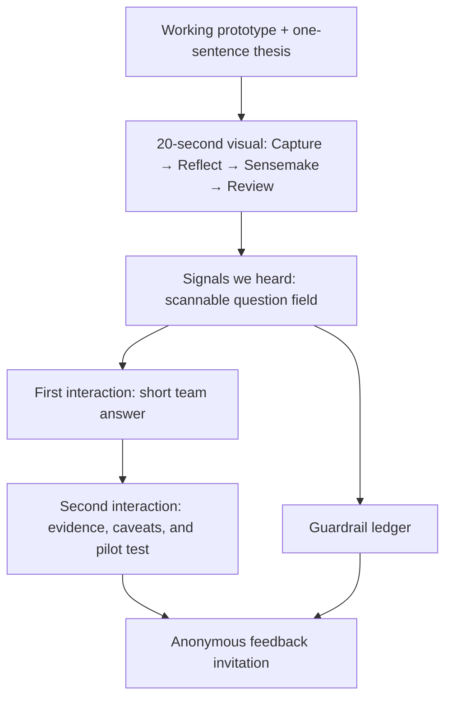

# My World “Signals → Sensemaking” FAQ

## Problem Frame

My World is a working prototype testing whether multimodal capture plus
evidence-grounded sensemaking can help Singapore secondary students reflect
more independently on their lived experiences. After a short demonstration,
MOE/DXD colleagues raised substantive concerns: the companion might displace
family conversation, increase screen time, cultivate dependency, trivialise
reflection through gamification, overstate student needs, or collect sensitive
data without sufficiently visible safeguards.

Those reactions are useful signals, not objections to dismiss. The first
audience for this page is MOE/DXD colleagues and decision-makers, many of whom
will also read it through a parent's lens. The page must help them understand
My World and trust the team to test it carefully, while inviting harder
questions and evidence before leadership decides whether to proceed to a
structured pilot.

The page must not claim that My World is already proven safe, effective, or
“non-addictive.” The team currently has promising but unquantified field
signals—strong student engagement and broad teacher support across schools
where the concept was explored—but no formal outcome evidence. Those signals
must be visibly marked for team verification and must not be presented as
causal validation.

The selected experience direction is **Signals → Sensemaking**: readers first
see the questions the team heard, then progressively open the team's concise
answer, the underlying product facts and research, the remaining uncertainty,
and the test the team proposes. The page itself should demonstrate the same
posture as the product: capture a signal, inspect the evidence, hold uncertainty,
and make the next decision deliberately.

---

## Experience Model

The prose requirements below are authoritative if this diagram and the prose
ever diverge.

---

## Actors

- A1. **MOE/DXD colleague:** The primary reader; wants to understand the
  prototype, its educational rationale, current safeguards, and unresolved
  risks without reading a long product paper.
- A2. **Leadership reviewer:** Uses the page as context for deciding whether
  My World should move from working prototype to a structured pilot.
- A3. **Parent-minded reader:** Often the same person as A1 or A2, but evaluates
  screen use, family displacement, privacy, safety, and dependency through a
  caregiver's lens.
- A4. **Student:** The affected stakeholder whose agency, privacy, development,
  and human relationships must remain more important than product engagement.
- A5. **My World team:** Owns every substantive answer, verifies product and
  field claims, maintains the guardrail ledger, and responds to new signals.
- A6. **Kira, the companion:** Appears as a visual guide and is shown inside
  real product flows. Kira does not narrate policy, evidence, safety, or
  institutional claims on the FAQ.

---

## Key Flows

- F1. **Understand My World in about 20 seconds**
  - **Trigger:** A1, A2, or A3 opens the unlisted URL.
  - **Actors:** A1/A2/A3, A4, A5, A6
  - **Steps:** The reader sees (1) the visible stage label “Working prototype —
    testing a hypothesis”; (2) the one-sentence thesis that carefully bounded
    AI may lower the effort of reflection without replacing human support; and
    (3) a visual Capture → Reflect → Sensemake → Review explanation using real
    product imagery.
  - **Outcome:** The reader can distinguish My World from an open-ended AI
    friend, a therapist, a social network, and a game before encountering the
    contested questions.
  - **Escape path:** A direct “See the concerns” action skips the explainer
    without hiding it.
  - **Covered by:** R1, R2, R3, R5

- F2. **Scan a concern, then inspect the answer**
  - **Trigger:** The reader reaches “Signals we heard” or follows a deep link to
    a question.
  - **Actors:** A1/A2/A3, A5
  - **Steps:** (1) The reader scans short questions grouped by concern. (2) The
    first interaction opens a concise team answer. (3) The second interaction
    opens “How we know,” showing product facts, external evidence, limitations,
    the pilot test, citations, and any team-verification tag. (4) Closing the
    answer returns to the same question-field position and filters.
  - **Outcome:** A sceptical reader gets both a useful short answer and an
    auditable deeper answer without facing a wall of text.
  - **Escape path:** The reader can move directly to the previous or next
    question without closing the focused view.
  - **Covered by:** R4, R6, R7, R8, R9, R10, R11, R12

- F3. **Audit what exists versus what is still required**
  - **Trigger:** The reader opens the Guardrail Ledger directly or follows a
    guardrail link from an answer.
  - **Actors:** A1/A2/A3, A4, A5
  - **Steps:** The reader compares three visibly distinct states: “Built
    today,” “Required before any pilot,” and “Still researching.” Each entry
    states what it protects, its evidence/status, and where it is reflected in
    the FAQ.
  - **Outcome:** Design intent is not mistaken for shipped protection, and an
    unresolved research question is not mistaken for an engineering task.
  - **Covered by:** R13, R14, R15

- F4. **Offer an anonymous concern or source**
  - **Trigger:** The reader selects “Ask us a harder question” from an answer or
    from the page ending.
  - **Actors:** A1/A2/A3, A5
  - **Steps:** The form is anonymous by default, carries the current FAQ topic
    as non-identifying context, accepts a concern and optional source link, and
    offers an optional contact field for follow-up. It sends the submission to
    a team-owned destination without requiring an account and displays success
    only after the backend confirms delivery.
  - **Outcome:** The invitation to listen is concrete and contextual, while the
    prototype remains truthful about whether feedback is actually delivered.
  - **Failure path:** Validation or future delivery errors preserve the draft
    and explain what happened without requesting identity.
  - **Covered by:** R16, R17

- F5. **Maintain claims as evidence changes**
  - **Trigger:** The team receives new pilot evidence, resolves a team-check
    item, changes a product guardrail, or finds a stronger source.
  - **Actors:** A5
  - **Steps:** The team updates the affected answer, evidence label, guardrail
    status, source, and visible “last reviewed” date without rewriting the
    entire page.
  - **Outcome:** The FAQ behaves as a living understanding-and-feedback
    resource that can also inform decisions, rather than a one-time defence of
    the prototype.
  - **Covered by:** R8, R9, R12, R14

---

## FAQ Content Architecture

Questions below are the committed content inventory, not final display copy.
Planning and implementation may tighten wording, but may not silently drop a
concern. Pigeonhole comments and forum conversations inform question language;
they do not establish prevalence or prove harm.

| Concern cluster | Questions visible or searchable at a glance | Answer commitment |
|---|---|---|
| **What is My World?** | What problem is it solving? Is it just another chatbot? Why not a paper journal? How does Capture become VIPS and a timeline? What does Kira do, and what does Kira not do? | Explain the short Capture → Reflect → Sensemake → Review loop. Kira asks brief, grounded questions; longer interpretations emerge later as reviewable evidence, not instant truths declared by the companion. |
| **Human connection** | Are we replacing the dinner table? What if a student prefers Kira to a parent, teacher, or friend? Is Kira designed to feel like a friend? What about students without a safe place to talk at home? Could My World become a student's only support? | State that human displacement is a real design and pilot risk, not something the team can rule out by intention. Position My World as one optional touchpoint and require role clarity, human escalation, help-seeking and displacement measures before pilot. A lower-friction private outlet may help some students, but must not become a substitute relationship. |
| **Attention, screen time, and motivation** | Is it addictive? Will it add to already-high PLD screen time? Why use an island? Is this superficial gamification? Does more capturing grow the world faster than better reflection? Are there streaks, scores, rewards, rankings, or competition? What stops endless conversation? | Never promise “not addictive.” Explain the deliberate absence of XP, streaks, rankings, social comparison, infinite feeds, and engagement-maximising claims. Distinguish calm visual feedback from competitive reward systems, while admitting that actual usage and displacement must be measured. Treat screen purpose and context as relevant without using them to dismiss total screen burden. |
| **AI safety and student agency** | Is Kira a counsellor or therapist? Can it give harmful advice? Will it simply agree with students? What happens if a student mentions harm? Can one emotional moment become a fixed identity label? Can students challenge, correct, or forget an interpretation? How are bias, language, Singlish, disability, and cultural fit handled? | Describe current role and prompt constraints accurately, including their limits. Show the separation between short reflection, later evidence linking, deterministic verification, and review/forget controls. Mark crisis handling, visible role disclosure, red-teaming, subgroup evaluation, and human oversight as required before pilot where not yet implemented. |
| **Privacy and governance** | Who can see a reflection? Does MOE “hold all this data”? Are voice recordings or photos retained? Are transcripts retained? Do model providers train on student data? Where is data stored, for how long, and who can delete it? Can parents or teachers inspect private entries? Is participation optional? | Publish only claims verified against the actual deployment and agreements. Distinguish raw audio from transcripts and source media. Mark access roles, consent, retention, deletion, provider use, residency, incident response, and optional participation for explicit team/legal verification before any public claim or pilot. |
| **Evidence and the next decision** | What student need has been validated? What evidence exists today? Do students and teachers actually want this? What research supports reflection? What research warns about AI companionship? What would a pilot measure? What would make the team stop or change direction? How will feedback affect the design? | Say plainly that My World has no formal efficacy or long-term safety evidence today. Separate external research from product evidence and early field signals. Define the proposed pilot as a test of reflection quality, agency, human connection, safety, equitable usefulness, and actual usage—not a search for engagement alone. |

The long-form evidence layer should also answer these cross-cutting questions
where relevant:

- Why use AI at all rather than a deterministic prompt sequence?
- Which parts of My World are agent-generated and which are deterministic or
  human-governed?
- How does the MOE AI-in-Education framing of agency, inclusivity, fairness,
  safety, developmental appropriateness, and pedagogical purpose apply?
- How does My World relate to SDCD, CCE, ECG, and the closed VIPS vocabulary
  without claiming formal policy endorsement?
- Which current behaviours are product facts, which are design intentions, and
  which are proposed pre-pilot safeguards?
- Which students might benefit less, opt out, or be harmed?
- How will the team detect polished engagement that masks shallow reflection?
- How will the team avoid turning private reflection into surveillance?

---

## Evidence and Answer Model

Every deep answer uses only the blocks that add information, in this order:

1. **Short answer:** The team's plain-language position, normally 40–80 words.
2. **How My World works today:** A verified product fact, often paired with a
   real screenshot or a compact visual.
3. **What research suggests:** Directly relevant external evidence with
   population, method, and limitation visible.
4. **What we do not know:** Product-specific uncertainty stated without
   euphemism.
5. **What we would test:** A pilot measure, safeguard, or stop/change signal.
6. **Sources and last reviewed:** Linked sources and a visible review date.

Evidence labels:

- **Product fact:** Verified against the live repository or a confirmed
  deployment contract.
- **Research-backed:** Supported by an official framework, systematic review,
  meta-analysis, controlled study, or directly relevant primary study.
- **Early field signal · team verify:** Reported student engagement, teacher
  support, school field-research learning, or internal observation that has not
  yet been documented with sample, method, and caveats.
- **Open question · pilot:** A hypothesis or risk the team intends to test.
- **Team check:** A factual, legal, operational, or product claim that must not
  publish as settled until an accountable team member verifies it.

Research standards:

- Prefer original research, systematic reviews, and official Singapore
  guidance. Use university explainers only when they accurately point to
  underlying evidence and add relevant interpretation.
- Stanford, MIT, Harvard, or another institution's name is never a substitute
  for fit or study quality. Show age range, context, study design, and limits.
- Evidence from adults or clinical/therapy contexts may identify a risk or
  design principle but must not be generalised to Singapore secondary students.
- Reddit, HardwareZone, parenting forums, and the provided Pigeonhole comments
  are sources of authentic questions and language—not representative survey
  evidence.
- Do not cite reflection or expressive-writing research as proof that My World
  works. It supports the educational hypothesis only.
- Do not cite the absence of points or streaks as proof that dependency is
  impossible. It is a design choice whose effects still require observation.
- Prefer calibrated language: “suggests,” “is associated with,” “we designed
  against,” and “we need to test” over “proves,” “prevents,” or “ensures.”

---

## Research Baseline

The first authored version should draw from at least the following research
families. Final claims require source-level review during content production.

**Singapore policy and context**

- [MOE: Artificial intelligence in education](https://www.moe.gov.sg/education-in-sg/educational-technology-journey/edtech-masterplan/artificial-intelligence-in-education)
  — age- and development-appropriate use; Agency, Inclusivity, Fairness, Safety.
- [MOE: Digital devices and purposeful, healthy screen use](https://www.moe.gov.sg/news/edtalks/what-you-need-to-know-about-moes-views-on-digital-devices-and-purposeful-and-healthy-screen-use)
  — calibrated, purposeful use rather than technology for its own sake.
- [MOE: Schools take an age- and development-appropriate approach to AI](https://www.moe.gov.sg/news/forum-letter-replies/20251112-schools-take-an-age-and-development-appropriate-approach-to-ai-use)
  — developmental fit, teacher supervision, critical evaluation, and avoiding
  overreliance.
- [MOH: Guidance on screen use in children](https://www.moh.gov.sg/others/resources-and-statistics/guidance-on-screen-use/)
  — cumulative screen-use concerns and family involvement. Age-specific
  guidance must not be misapplied to older adolescents.
- [PDPC: Children's personal data in the digital environment](https://www.pdpc.gov.sg/guidelines-and-consultation/2024/03/advisory-guidelines-on-the-pdpa-for-childrens-personal-data-in-the-digital-environment)
  and [PDPC education-sector guidance](https://www.pdpc.gov.sg/guidelines-and-consultation/2018/09/advisory-guidelines-for-the-education-sector)
  — children's data, EdTech, accountability, and education-sector obligations.
- Singapore community discussions, including
  [SGExams on AI use in education](https://www.reddit.com/r/SGExams/comments/1q0hbwf/ai_use_in_education/),
  [SGExams on the AI push](https://www.reddit.com/r/SGExams/comments/1tvm5g6/im_so_done_with_singapore_pushing_ai_to_our/),
  and
  [HardwareZone on school-issued devices](https://forums.hardwarezone.com.sg/threads/are-school-issued-ipads-and-chromebooks-becoming-a-distraction-in-spore-classrooms.7073986/)
  — question language around purpose, overreliance, distraction, and trust.

**Reflection, metacognition, and motivation**

- [Meta-analysis of expressive writing for adolescents](https://pubmed.ncbi.nlm.nih.gov/25656314/)
  — small, promising, but not decisive effects; not product-specific evidence.
- [Review of self-regulated journal writing](https://link.springer.com/article/10.1007/s10648-020-09541-1)
  and [MIT Teaching + Learning Lab on metacognition](https://tll.mit.edu/teaching-resources/how-people-learn/metacognition/)
  — reflection can support metacognition when it is instructionally supported.
- [Harvard on intrinsic motivation and reflection](https://www.gse.harvard.edu/ideas/usable-knowledge/19/10/tapping-power-intrinsic-motivation)
  — autonomy, competence, meaning, and student-led reflection.
- [Systematic review of gamified learning and motivation](https://www.sciencedirect.com/science/article/pii/S2405844023062412)
  — effects vary by design; points, competition, rankings, and prolonged
  exposure can create different motivational outcomes. It does not prove that
  all gameful visual feedback is harmful or beneficial.

**AI, relationships, and youth safety**

- [UNICEF Guidance on AI and Children](https://www.unicef.org/innocenti/reports/policy-guidance-ai-children)
  — child-centred safety, privacy, transparency, agency, and no intentional
  emotional-dependency design.
- [Harvard: The impact of AI on children's development](https://www.gse.harvard.edu/ideas/edcast/24/10/impact-ai-childrens-development)
  — conversational AI can support learning when designed around learning
  principles, but cannot reproduce the full value of human conversation.
- [MIT Media Lab / Stanford SCALE longitudinal randomised study](https://scale.stanford.edu/ai/repository/how-ai-and-human-behaviors-shape-psychosocial-effects-chatbot-use-longitudinal)
  — adult evidence that usage intensity, trust, modality, and conversation type
  interact with loneliness, dependence, problematic use, and socialisation.
  Treat as a design-risk signal, not adolescent outcome evidence.
- [Stanford K–12 AI evidence-base review](https://scale.stanford.edu/sites/default/files/The%20Evidence%20Base%20on%20AI%20in%20K-12%20Report.pdf)
  — limited causal evidence for cognitive, emotional, and social outcomes;
  design and human mediation matter.
- [Adolescent AI-chatbot effectiveness meta-analysis](https://pubmed.ncbi.nlm.nih.gov/41313175/)
  — potential small-to-moderate benefits in specific health contexts, with
  inconclusive evidence for generative systems and a need for safety protocols
  and long-term evaluation.
- [Study of AI therapy bots setting limits with distressed adolescents](https://pubmed.ncbi.nlm.nih.gov/40825182/)
  and [youth conversational-AI risk survey](https://pubmed.ncbi.nlm.nih.gov/42076960/)
  — risk signals around unsafe endorsement, personal disclosure, manipulation,
  misinformation, and harmful content. My World is not a therapy bot, but its
  emotional context makes the failure modes relevant to pre-pilot testing.
- [Stanford working paper on sycophantic AI](https://ai4pb.stanford.edu/projects/sycophantic-ai-makes-human-interaction-feel-more-effortful-and-less-satisfying-over-time)
  — emerging evidence that highly agreeable AI may affect advice-seeking and
  satisfaction with human interaction. Label as a working paper and do not
  overstate.
- [WHO policy brief on digital determinants of youth mental health](https://www.who.int/europe/publications/i/item/WHO-EURO-2025-12187-51959-79685)
  — mixed and bidirectional effects, subgroup vulnerability, and the need to
  consider content and context as well as duration.

---

## Requirements

**Positioning and access**

- R1. The first version is available to anyone with the exact link but is
  intentionally unlisted: it is not linked from the main product navigation,
  promoted as a public launch, or presented for search discovery.
- R2. The opening visibly states “Working prototype — testing a hypothesis”
  and notes that leadership is considering whether to proceed to a structured
  pilot. It must not imply formal MOE endorsement, approval, or deployment.
- R3. The primary thesis is constructive but bounded: carefully designed AI may
  lower the effort of capturing and reflecting on experience, while human
  relationships, student agency, and developmental safety remain the governing
  constraints.

**Product explanation and imagery**

- R4. Before the FAQ field, a visual explainer communicates Capture → Reflect
  → Sensemake → Review in about 20 seconds. It shows multimodal capture, Kira's
  brief prompting role, the timeline/VIPS evidence layer, and student review or
  forget control without exposing unnecessary internal architecture.
- R5. The page uses real, current My World screenshots rather than illustrative
  mock products. It also uses the six user-provided Pigeonhole Live screenshots
  as a “Signals we heard” source wall. Pigeonhole comments remain visibly
  contextualised as anonymous event feedback; crops or annotations must not
  change their meaning or imply representativeness.
- R6. Kira may guide attention through illustration, microcopy, or transitions,
  but all substantive claims use “we, the My World team.” Kira never answers
  questions about Kira's own safety, evidence, privacy, or institutional role.

**Progressive FAQ interaction**

- R7. The default question field remains glanceable and non-text-heavy. It
  exposes all committed concern clusters, supports direct deep links, and
  allows a reader to locate a relevant question without opening unrelated
  answers.
- R8. The first question interaction reveals a concise team answer. A clearly
  named second interaction reveals the evidence model: product facts, research,
  limitations, team checks, pilot tests, sources, and last-reviewed date.
- R9. The focused answer supports previous/next traversal, keyboard operation,
  escape/close, and return to the prior scan position. Only one answer is
  foregrounded at a time so the page does not become a stack of open essays.

**Evidence integrity and content coverage**

- R10. Every committed question in `FAQ Content Architecture` is represented
  directly or as an explicit synonym/search alias. Final copy must preserve the
  answer commitments even if question wording changes.
- R11. Every factual claim receives an evidence label. Unsupported field
  signals use “Early field signal · team verify”; uncertain product, policy,
  legal, or operational claims use “Team check”; hypotheses use “Open question
  · pilot.”
- R12. External sources follow the `Evidence and Answer Model`. Research
  limitations and population fit are visible in the answer, not buried in a
  bibliography. Prestigious institutions are not used as authority shortcuts,
  and community discussions are never presented as prevalence evidence.

**Guardrail ledger**

- R13. A prominent ledger compares “Built today,” “Required before any pilot,”
  and “Still researching.” These states remain visually and semantically
  distinct in both the overview and individual answers.
- R14. “Built today” includes only repo- or deployment-verified protections,
  initially including:
  - no generic XP, streaks, rankings, leaderboards, or student comparison;
  - short, one-question-at-a-time companion prompting rather than an infinite
    content feed;
  - prompt-level prohibitions on diagnosis, advice, therapy framing,
    moralising, and fixed identity claims;
  - student review/log/forget controls for captured reflections;
  - separation of immediate reflection from later VIPS linking and trajectory;
  - deterministic evidence verification before proposed VIPS links become
    canonical;
  - raw-audio non-retention only if re-verified against the current end-to-end
    path and deployment;
  - self-critique described accurately as best-effort, never as a blocking
    safety guarantee.
- R15. The initial “Required before any pilot” ledger includes visible AI-role
  disclosure, age/developmental fit, consent and opt-out, distress detection and
  human escalation, interaction/time boundaries, usage and displacement
  monitoring, red-team and subgroup testing, access/retention/deletion/vendor
  data mapping, privacy and incident review, and accountable human oversight.
  “Still researching” includes long-term dependency, family or peer
  displacement, reflection quality, unequal effects, and whether multimodal
  capture plus sensemaking improves self-directed reflection.

**Anonymous feedback**

- R16. “Ask us a harder question” is available globally and from each focused
  answer. The form collects a concern, a concern category, an optional evidence
  or source link, and non-identifying context for the current question.
- R17. Feedback is anonymous by default and does not require an account, name,
  or email. An optional contact field is clearly separate and opt-in. The first
  version must actually deliver submissions to a team-owned destination,
  minimise collected metadata, publish a clear retention and access posture,
  and show a delivered state only after backend confirmation. Abuse controls
  must not quietly turn the form into identity tracking.

**Inclusive visual quality**

- R18. The complete experience works on phone and desktop; preserves readable
  focus, text scaling, reduced-motion preferences, keyboard navigation, and
  non-colour status cues; and supplies concise alt text or transcriptions for
  every product and Pigeonhole screenshot. Visual delight must not depend on a
  running 3D scene, autoplay audio, or high-end hardware.

---

## Acceptance Examples

- AE1. **Covers R1, R2, R3.** Given an MOE/DXD colleague opens the exact URL,
  when the first screen settles, they see that this is a working prototype
  testing a hypothesis and that pilot approval is still under discussion; they
  do not see language implying launch or endorsement.
- AE2. **Covers R4, R5, R6.** Given a reader knows only that My World “has an AI
  chatbot,” when they spend about 20 seconds on the explainer, they can say that
  students capture experiences, Kira briefly prompts and reflects, patterns
  appear later in a reviewable timeline/VIPS layer, and the student retains
  review/forget agency.
- AE3. **Covers R7, R8, R9.** Given a reader is worried about family
  displacement, when they select “Are we replacing the dinner table?”, the
  first interaction provides a concise answer and the second reveals research,
  what the current design does, what it cannot guarantee, and how a pilot would
  measure displacement.
- AE4. **Covers R11, R12.** Given an answer cites an adult chatbot study, when
  the reader opens its evidence, the source is labelled as an adult risk signal
  rather than proof of effects on Singapore secondary students.
- AE5. **Covers R11, R14.** Given the team reports strong student engagement and
  teacher support, when that claim appears, it is labelled “Early field signal
  · team verify” until the schools, participants, method, and caveats have been
  documented.
- AE6. **Covers R13, R14, R15.** Given a reader opens the guardrail ledger, when
  they inspect crisis escalation, they see it under “Required before any pilot”
  unless the current product path has been verified to implement and test it;
  prompt intent alone does not move it to “Built today.”
- AE7. **Covers R10, R12, R13.** Given a reader asks “How do you know this is not
  addictive?”, the answer does not promise that outcome. It identifies the
  omitted engagement mechanics, relevant external risk evidence, current
  unknowns, and proposed usage/dependency/displacement measures.
- AE8. **Covers R10, R11, R15.** Given a reader asks who can see student
  reflections or whether model providers train on them, the page publishes
  only deployment-verified facts. Unknown retention, access, residency,
  contractual, or training terms remain visibly tagged “Team check.”
- AE9. **Covers R16, R17.** Given a reader submits a valid anonymous question,
  when the backend confirms delivery, the page preserves no required identity
  and shows a truthful delivered state. If delivery fails or rate limiting
  applies, the draft remains available and the page explains the failure
  without claiming receipt.
- AE10. **Covers R18.** Given a keyboard-only reader on a narrow viewport opens
  a question and then its evidence, focus remains inside the active view,
  previous/next/close controls are reachable, closing returns focus to the
  originating question, and every screenshot has an equivalent text
  description.

---

## Success Criteria

- In a lightweight comprehension check, an unfamiliar MOE/DXD colleague can
  describe what My World does, its working-prototype status, and its intended
  relationship to human support after approximately 20 seconds.
- A reader can locate a personally relevant concern within 10 seconds and
  reach its full evidence layer in no more than two primary interactions.
- The default page is visually led: unanswered question labels, product flow,
  screenshots, and status summaries dominate; long evidence is progressively
  disclosed.
- Every committed concern is covered, every factual claim is either sourced or
  visibly tagged, and no early field signal is represented as formal evidence.
- The guardrail ledger makes it impossible to mistake “required before pilot”
  for “already built.”
- Leadership can use the page to discuss whether and how to pilot, including
  proposed benefits, risks, safeguards, success measures, and stop/change
  signals—not merely whether the prototype generated enthusiasm.
- The anonymous feedback interaction delivers valid submissions to a
  team-owned destination, remains anonymous by default, and preserves the
  reader's draft across validation, delivery, or rate-limit failures.
- Planning can identify page surfaces, content modules, assets, verification
  work, and test scenarios without inventing product positioning or answer
  behavior.

---

## Scope Boundaries

- The first implementation covers the complete frontend experience, content
  population, and anonymous feedback delivery. A richer moderation dashboard
  or feedback analytics are deferred; v1 still requires an accountable
  team-owned review destination and an explicit retention/access posture.
- The URL is unlisted, not a formal public launch or a canonical MOE policy
  page.
- The page does not claim formal MOE, school, parent, teacher, or student
  endorsement.
- The page does not claim My World is clinically therapeutic, clinically safe,
  effective, non-addictive, or appropriate for every student.
- This work explains and audits existing/proposed safeguards; it does not
  implement missing companion, privacy, safeguarding, or pilot-governance
  controls in the My World product.
- The FAQ does not expose private student content, internal logs, secrets, or
  identifiable field-research participants.
- Kira is not used as the accountable voice for evidence, safety, privacy,
  governance, or policy answers.
- Community posts and event screenshots are not used to estimate sentiment or
  prevalence.
- No engagement analytics, identity tracking, or behavioural advertising is
  added to the unlisted page.
- The visual concept is not an infinite feed, debate scoreboard, voting system,
  or competitive “concern resolution” game.

---

## Key Decisions

- **Primary audience:** MOE/DXD colleagues and decision-makers, with an
  intentional parent lens.
- **Primary outcome:** “I understand My World and trust the team to test it
  carefully”; the secondary outcome is contribution of questions or evidence.
- **Stage language:** “Working prototype — testing a hypothesis.” Leadership is
  considering, not yet committed to, a pilot.
- **Access:** Anyone with the exact link can open it, but it remains unlisted
  and unpromoted.
- **Voice:** The My World team owns answers. Kira is a visual/product guide.
- **Experience direction:** Signals → Sensemaking, using progressive disclosure
  rather than a conventional accordion wall.
- **Evidence posture:** Product facts, research, early field signals, open
  questions, and team checks remain distinct.
- **Safety posture:** Acknowledge credible AI risks while making a positive,
  bounded case for carefully designed reflective AI; avoid both alarmism and
  technological inevitability.
- **Feedback:** First-party, anonymous by default, optional contact, and
  delivered through a real backend in the first version.
- **Scope:** Populate the comprehensive question set now rather than reducing
  to a minimal FAQ.

---

## Dependencies / Assumptions

- The six Pigeonhole Live screenshots supplied in the conversation are approved
  for use on an unlisted internal-facing page. Asset provenance and any required
  internal approval remain a team check.
- Current product screenshots will be captured from the live local app during
  implementation; older audit screenshots may guide composition but must not
  silently represent stale behavior as current.
- The reported student engagement, teacher support, and school field research
  are useful early signals. Exact wording, participating scope, and permission
  to describe them remain team checks.
- `README.md`, `src/agents/mirror.prompt.md`,
  `src/agents/openai-realtime/mirror-realtime-live.prompt.md`, and
  `docs/brainstorms/2026-05-18-island-object-progression-requirements.md`
  provide the initial product-fact baseline. Live behavior and deployment
  contracts govern if documentation conflicts.
- The existing application can host a separate unauthenticated, unlisted page
  without requiring the signed-in Student Space engine. Planning must verify
  this against the route/layout structure rather than assume it.
- Planning must select a team-owned feedback destination using existing
  infrastructure where practical, define who can review submissions, and
  specify retention, failure handling, and abuse protection without requiring
  reader identity.

---

## Outstanding Questions

### Deferred to Planning

- [Affects R1, R4, R18][Technical] Which route and layout boundary can serve an
  unlisted, unauthenticated FAQ without booting the Student Space engine or
  inheriting signed-in navigation?
- [Affects R5][Technical] Where should the supplied Pigeonhole assets and new
  current-product screenshots live, and what responsive image formats preserve
  legibility without excessive page weight?
- [Affects R7, R8, R9][Technical] Which existing drawer, sheet, focus, deep-link,
  and motion patterns best express the two-step interaction across desktop and
  mobile?
- [Affects R10, R11, R12][Needs research] Which final subset of sources best
  supports each answer without citation overload, and which claims require an
  education, child-safety, privacy, or legal reviewer before publication?
- [Affects R14, R15][Needs verification] Which ledger entries are demonstrably
  live end-to-end versus prompt-level or planned, especially raw-audio
  retention, crisis escalation, provider data use, access roles, and
  deletion/retention behavior?
- [Affects R17][Technical] Which team-owned destination and submission contract
  should v1 use, and how should it provide rate limiting, retention, reviewer
  access, and truthful delivery status without identity tracking?

---

## Next Steps

-> `ce-plan` for structured implementation planning from this requirements
document.
