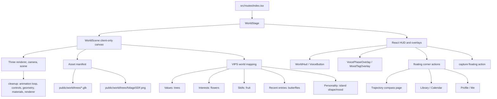

# feat: Add Student Space-inspired Three.js world stage

## Summary

Replace the current placeholder `WorldStage` with a quiet full-screen Three.js island scene inspired by the private `student-space` repo, while preserving this app's React-owned capture flow and audio-only reflection policy. The island becomes a minimal evidence map: Personality shapes the island, Values become distinct tree species, Interests become flowers, Skills become simple fruit on the trees, recent Mirror entries become butterflies, and Trajectory moves to a separate compass page reached through floating corner navigation.

---

## Problem Frame

The home surface is already shaped as a world-stage shell, but `src/components/WorldStage.tsx` still renders a flat placeholder labeled "world". The product requirements call for an ambient, low-pressure reflection surface with subtle recording feedback, and the private `student-space` repo provides a stronger 3D visual language without needing to bring over its separate app model.

---

## Assumptions

*This plan was authored without synchronous confirmation after repo research. The items below are agent inferences that should be reviewed before implementation proceeds.*

- The target surface is this repo's existing home route world stage, not a wholesale port of the `student-space` app.
- "Only use the threejs assets from it" means copy and adapt the Three.js visual asset files under `student-space-v1/public/trees/` and use source scene files as visual reference only, while excluding `student-space` UI, data seeds, state machines, sheets, and product copy.
- The first implementation should use direct Three.js rather than React Three Fiber because `student-space` is direct Three.js and this repo does not already depend on a React 3D renderer.
- The scene should stay ambient and supportive of reflection rather than becoming a game-like interactive island with separate navigation surfaces.
- The user-provided mobile mockups are layout, page, and navigation references only; the implementation should not copy the Pip visual language, card styling, typography, gradients, or bottom navigation look one-to-one.
- Trajectory should become a compass page, reachable from a minimal compass affordance, not another object placed on the island.
- The latest wireframe is the core experience reference: the island is the primary screen, top/corner floating buttons open secondary pages, and capture is a floating action/menu rather than a bottom button bar.

---

## Requirements

- R1. Replace the flat placeholder in `WorldStage` with a client-only Three.js scene that reads as an ambient island/world surface.
- R2. Use only the Three.js visual assets from the private `student-space` repo, specifically the tree GLBs and foliage texture under `student-space-v1/public/trees/`; do not copy that repo's UI overlays, seed data, app state, navigation, calendar, profile, letters, Kira, or product flows.
- R3. Preserve the current home route behavior through React-owned overlays above the world stage, but replace the bottom button-bar/rail pattern with sparse floating top/corner actions and a capture floating action.
- R4. Preserve the v0.1/v0.2 reflection privacy boundary: no webcam/video capture is added, no visual frame is sent to AI, and the existing audio-only Mirror pipeline remains unchanged.
- R5. Keep the scene safe for TanStack Start rendering: no server-side access to `window`, `document`, WebGL, or browser-only Three.js APIs.
- R6. Provide deterministic tests and graceful fallback behavior for non-WebGL test/browser environments.
- R7. Maintain the quiet product tone from the origin docs: ambient, non-demanding, no streaks, no scores, no daily-habit pressure, no "game task" affordances.
- R8. Map confirmed VIPS evidence into island objects: Personality = island terrain/atmosphere; Values = distinct tree species with different shape/color; Interests = flowers; Skills = one simple fruit type on relevant value trees; recent Mirror entries = butterflies.
- R9. Make Trajectory a separate compass page, reachable from a minimal compass icon or equivalent small affordance and from the Library/Trajectory surface.
- R10. Recent Mirror entries render as butterflies for a bounded recency window. Pending/unreviewed entries are visually tentative; confirmed entries become vivid; forgotten entries do not render.
- R11. Use the supplied mockups and wireframe as references for page set and navigation structure (home/listening/reflection, library calendar, library trajectory, profile/settings, capture menu), while keeping this app's interface minimal and visually distinct.
- R12. The home screen should not use a persistent bottom navigation bar. Secondary destinations should appear as floating corner buttons over the island; capture should be a floating action that can open a small capture menu when multiple capture modes are available.
- R13. Generate the visual world from a plain scene-model descriptor derived from existing loader/query data. Three.js code should render descriptors only; it should not fetch, mutate, confirm, forget, or infer VIPS evidence.
- R14. Floating actions, capture controls, compass navigation, and fallback states must remain keyboard accessible, screen-reader named, reduced-motion aware, and usable when WebGL fails.

**Origin actors:** A1 Student, A2 Mirror agent, A3 Connector agent, A4 Cartographer agent
**Origin flows:** `docs/brainstorms/2026-05-08-quiet-mirror-pivot-requirements.md` F1 quiet reflection capture; `docs/brainstorms/2026-05-11-vips-wiki-pivot-requirements.md` F1 reflection plus post-session review
**Origin acceptance examples:** Quiet Mirror AE1, AE2; VIPS Pivot AE1, AE4, AE8

### Acceptance Trace

| Origin behavior | Plan requirements | Implementation units |
|-----------------|-------------------|----------------------|
| Quiet Mirror F1 / AE1-AE2: student can record without visual capture pressure | R3, R4, R7, R12, R14 | U2, U4, U5, U6 |
| VIPS Pivot F1 / AE1: post-session proposed diffs become reviewable evidence before commit | R8, R10, R13 | U3, U4, U6 |
| VIPS Pivot AE8: pending review remains pending and must not silently commit | R10, R13 | U3, U6 |
| Trajectory page R15-R18: manual Cartographer output remains a separate lead-sheet pathway surface | R9, R11, R12 | U5, U6 |

---

## Scope Boundaries

- No backend, agent, database, tenancy, ablation, or prompt changes.
- No webcam mirror revival; the current audio-only `MirrorSession` direction stays intact.
- No port of `student-space` app UI: `TopNav`, `ProfileSheet`, `CalendarSheet`, `LettersSheet`, `CaptureFab`, `MoodHud`, `ZoomHud`, and related overlay controllers stay out.
- No port of `student-space` product data: `calendarSeed`, `lettersSeed`, `profileSeed`, and the `student-space` `vipsTaxonomy` file stay out. This repo may add its own visual metadata to `src/data/vips-taxonomy.ts`.
- No Kira/companion character, mailbox, narration, game loop objectives, streaks, scores, or daily tasks.
- No exact recreation of the supplied Pip mockups: no one-to-one gradients, speech cards, bird companion UI, bottom-nav styling, or copy.
- No heavy decorative navigation chrome and no persistent bottom tab bar. Navigation should be sparse enough that the island remains the first read.
- No new teacher-letters product surface in this plan. The wireframe's "letters from teacher" panel is a navigation/layout reference only unless a real local product surface already exists or is separately specified.

### Deferred to Follow-Up Work

- Deep scene interactivity mapped to VIPS pages: defer until the product defines what clicking a tree, path, or artifact should mean.
- Teacher/counsellor inbox or letters page: defer until its data model and product role are defined.
- Time-of-day, weather, aurora, rain, and fireflies: defer unless the initial world stage feels empty after the core island, flowers, fruit, and butterflies land.
- A standalone visual restyling pass for every Library/Me page: this plan only reshapes the navigation/layout enough to support the island and compass model.

---

## Context & Research

### Relevant Code and Patterns

- `src/components/WorldStage.tsx` is an intentional placeholder with `data-testid="world-stage"` and a forwarded root ref for future canvas mounting.
- `src/routes/index.tsx` composes `WorldStage`, `WorldHud`, `VoicePhaseOverlay`, `MoodTagOverlay`, `SheetEntryRail`, and `BottomSheet`; this route is the main integration point.
- `src/components/WorldHud.tsx`, `src/components/VoiceButton.tsx`, and `src/components/SheetEntryRail.tsx` already encode the bottom-center voice affordance, library/sheet access, and voice-mode disabling behavior. The new design should preserve the behavior while retiring the persistent bottom rail shape.
- `test/components/WorldStage.test.tsx`, `test/components/WorldHud.test.tsx`, `test/components/VoiceButton.test.tsx`, and `test/components/SheetEntryRail.test.tsx` are the existing component tests to extend rather than replace.
- `package.json` currently has no `three` dependency and no GLSL plugin; the plan should not inherit the old `student-space` Vite stack by default.
- Private source repo `student-space` is nested under `student-space-v1/` and uses direct Three.js 0.149 with Vite 4. Its portable visual assets are `student-space-v1/public/trees/oakTreesVisual.glb`, `student-space-v1/public/trees/cherryTreesVisual.glb`, and `student-space-v1/public/trees/foliageSDF.png`.
- `student-space-v1/sources/Game/View/Tree.js` shows how the tree GLBs and foliage SDF texture were intended to render: GLB trunk/reference meshes plus billboard-style foliage. Treat this as reference, not a module to import.
- `student-space-v1/sources/Game/View/View.js`, `Island.js`, `Sky.js`, and `Camera.js` show the intended miniature-island framing, transparent canvas, sky backdrop, and camera defaults. Reuse the visual vocabulary, not the singleton game architecture.
- `student-space-v1/sources/Game/Data/vipsTaxonomy.js` maps Values to trees, Interests to flowers, Personality to wind stone / reflecting pool, and Skills to fruits. Use that as concept precedent, while adapting Personality to shape the whole island and simplifying Skills to one fruit type.
- `student-space-v1/sources/Game/View/Flowers.js`, `Fruits.js`, and `Butterflies.js` provide reference implementations for flower, fruit, and recent-entry motion vocabulary.
- User-provided mobile mockups show useful page/navigation references: home idle/listening/reflecting states, library calendar/trajectory tabs, a compass trajectory page, and a profile/settings page. Use these references for information architecture only, not visual styling.
- User-provided wireframe shows the core experience hierarchy: the island is the primary screen; top/corner floating actions open Profile, Calendar/Library, and other secondary pages; capture is a floating action that can open a small capture-mode menu. Use this as the stronger navigation reference.

### Deepening Confidence Pass

This plan was deepened against the CE Plan confidence checklist. The selected strengthening targets were:

- **Key Technical Decisions:** the metaphor was correct but needed a concrete object grammar and rationale for how the limited `student-space` asset set still supports distinct value trees.
- **Implementation Units:** U3/U4/U5 needed stronger contracts between product data, scene descriptors, Three rendering, and floating navigation so an implementer does not invent behavior while coding.
- **System-Wide Impact / Risks:** the plan needed clearer treatment of accessibility, reduced motion, canvas failure, private asset provenance, and evidence overstatement.

The plan remains planning-only. It intentionally does not add implementation code, exact method signatures, shell choreography, or new product surfaces beyond the user-approved island, compass, floating navigation, and capture menu direction.

### Institutional Learnings

- No `docs/solutions/` directory exists in this repo.
- `docs/brainstorms/2026-05-08-quiet-mirror-pivot-requirements.md` requires a silent, self-directed reflection ritual with ambient feedback and no pressure mechanics.
- `docs/brainstorms/2026-05-11-vips-wiki-pivot-requirements.md` carries the silent ritual forward while making VIPS pages and post-session review the main product flow.

### External References

- Official Three.js docs/examples for `WebGLRenderer`, resize handling, `GLTFLoader`, `DRACOLoader`, and render-loop cleanup were checked through Context7 against `/mrdoob/three.js`.

---

## Key Technical Decisions

- Direct Three.js integration: use a React component to own a Three scene lifecycle rather than adding React Three Fiber for one canvas.
- Asset-only import boundary: copy only the tree GLBs and foliage SDF texture from `student-space`; do not import the private repo's JavaScript modules into this app.
- React owns product UI: Three renders the ambient world only; HUD buttons, overlays, sheets, navigation, and all student actions remain DOM/React for accessibility and testability.
- SSR-safe client lifecycle: instantiate Three only inside browser effects after a host element exists, and render a non-WebGL fallback when the canvas cannot initialize.
- Local decoder dependency if needed: if the GLBs require Draco, serve decoder assets from the installed Three.js package or another local app-owned source, not from an external CDN.
- Quiet default camera: start with a fixed or gently animated camera rather than free OrbitControls, so the reflection surface does not compete with the voice and sheet controls.
- Evidence-to-world grammar: render only confirmed or explicitly pending local evidence. Confirmed claims become stable objects; pending claims are tentative; forgotten claims are omitted from the visual world.
- Values tree grammar: one visible value label should create or strengthen one distinct tree species. Tree shape/color carries the value identity; tree size/fullness carries evidence strength and count.
- Skills fruit grammar: use a single fruit visual family rather than a different fruit per skill. Fruit count, size, and ripeness carry strength/evidence, and placement on a value tree says which value the skill is growing through.
- Interests flower grammar: use flowers for RIASEC interests, following `student-space` concept precedent. Flower species/color can distinguish interest labels, but layout should stay quiet and sparse.
- Recent-entry butterfly grammar: butterflies represent recent Mirror entries, not permanent traits. Their movement should show which part of the island the entry touched.
- Compass separation: Trajectory is directional and future-facing, so it belongs on a separate compass page rather than as another island prop.
- Floating navigation: add only the navigation needed to move between Home, Library/Calendar, Me/Profile, and Compass/Trajectory. Use small floating top/corner buttons over the island rather than a persistent bottom bar.
- Floating capture action: capture should be a single floating action near a screen corner. If multiple capture modes are available, the action opens a small menu; otherwise it can directly start the existing voice reflection flow.
- Data boundary: `src/routes/index.tsx` may load and pass VIPS page/timeline data into the world mapping layer, but Three helpers should receive plain descriptors and never call server functions directly.
- Asset realism boundary: `student-space` only provides two GLB tree sets plus the foliage SDF. Distinct value trees should therefore use those approved assets where available and app-owned procedural/billboard variations for the remaining species, not additional third-party models.

---

## VIPS World Object Grammar

### Scene Model Contract

The mapper should output a serializable, testable scene model before any Three.js objects are created. The model should be small enough for unit tests to assert directly:

- `terrain`: island scale, openness, shelter, water/shoreline emphasis, and atmospheric softness from Personality evidence.
- `trees`: one descriptor per confirmed or pending Value label, with species/shape/color, evidence state, strength, stable placement seed, and linked timeline entries.
- `flowers`: Interest descriptors grouped near the trees or clearings touched by the same evidence.
- `fruit`: same-family fruit descriptors attached to value-tree descriptors where Skills have evidence.
- `butterflies`: bounded recent-entry descriptors with entry status, touched dimensions, route path, and recency weight.
- `summary`: counts and warnings for fallback UI and tests, not visible in the Three canvas.

This contract is the line between product state and rendering. It lets `test/world/vipsWorldMapping.test.ts` validate evidence behavior without a canvas and lets `test/components/WorldScene.test.tsx` mock rendering without inventing domain state.

### Mapping Table

| VIPS element | Island object | Visual rule | Evidence rule |
|--------------|---------------|-------------|---------------|
| Personality overall | Island terrain and atmosphere | Extraversion changes openness, spacing, and path breadth; neuroticism/emotional reactivity changes shelter, water softness, and protected edges. Avoid diagnostic trait labels in visible UI. | Use only confirmed personality evidence for stable terrain. Pending personality evidence can subtly tint atmosphere but must not reshape the island until confirmed. |
| Values | Distinct tree species | Each confirmed value creates or strengthens a tree. Use `student-space` oak/cherry assets where they fit, then app-owned procedural/billboard variants for mangrove, pine, palm, maple, willow, and banyan-style silhouettes. | One label can create one tree; repeated evidence increases scale/fullness. Pending values appear smaller or translucent. Forgotten values disappear. |
| Interests | Flowers | RIASEC interests become flowers: Realistic=daisy, Investigative=pansy, Artistic=rose, Social=lily, Enterprising=tulip, Conventional=hyacinth. Keep flowers sparse and low to avoid competing with trees. | Confirmed interests flower near related trees or clearings. Low-strength evidence creates fewer blooms. Pending interests use muted petals. |
| Skills | One fruit family | Use one simple fruit type across all skills. Do not create six different fruit species. Fruit count, size, and ripeness carry evidence strength; branch placement shows which value the skill is growing through. | Confirmed skill evidence attaches fruit to the most related value tree when available, or to a neutral shared tree/branch when no value link exists. Pending skills are unripe/small. |
| Recent Mirror entries | Butterflies | Butterflies are transient motion, not permanent identity. Their path should pass near the tree/flower/fruit touched by the entry's proposed or confirmed diff. | Cap visible butterflies, for example 3-7. Confirmed entries are vivid, pending review entries are pale/tentative, old entries fade out of the butterfly layer, forgotten entries never render. |
| Trajectory | Compass page | Trajectory is not an island prop. It is a separate compass surface with bearings/pathways and evidence chips. | Cartographer output and pathway evidence stay in `TrajectoryPageView` / `library.trajectory.tsx`; the island may link to it through a floating compass action only. |

### Value Tree Visual Vocabulary

Use this as the initial mapping, adapting the `student-space` concept precedent while respecting the available asset boundary:

| Value ID | Tree concept | Implementation note |
|----------|--------------|---------------------|
| `values.contribution` | Mangrove-like tree | Branching, rooted, community/shoreline placement; procedural silhouette if no GLB exists. |
| `values.achievement` | Oak | Use `oakTreesVisual.glb` as the strongest direct asset fit. |
| `values.tradition` | Cherry | Use `cherryTreesVisual.glb` as the strongest direct asset fit. |
| `values.security` | Pine | Stable conic silhouette, deeper green, placed near protected edges. |
| `values.independence` | Palm | Open canopy, slightly apart from dense clusters. |
| `values.relationships` | Maple | Multi-branch canopy, clustered placement near other objects. |
| `values.wellbeing` | Willow | Softer drooping canopy, near water or shaded areas. |
| `values.learning` | Banyan | Visible root/branch complexity, placed where paths converge. |

The first implementation does not need perfect botanical fidelity. The important contract is that students and tests can distinguish tree species/shape IDs, and the scene does not import unapproved external tree assets.

### Navigation And Capture States

| State | Island | Floating actions | Capture action | Notes |
|-------|--------|------------------|----------------|-------|
| Idle home | Full island visible, subtle motion allowed | Small top/corner actions for Library/Calendar, Compass/Trajectory, and Me/Profile | Visible as the primary action; starts voice or opens available-mode menu | No persistent bottom nav or sheet rail. |
| Capture menu open | Island remains visible behind a small DOM menu | Secondary navigation remains available unless the menu intentionally traps focus | Menu lists only existing modes, initially voice reflection and any already-backed mood/context affordance | Do not expose camera/chat unless product flows exist. |
| Recording | Island motion reduced or focused around voice feedback | Navigation disabled or visually muted, matching current `WorldHud` lock behavior | Stop/recording control remains primary | Prevent route changes that would interrupt recording. |
| Processing / persisting | Calm disabled state, no new capture | Navigation remains disabled until the session commits or errors | Shows working state through existing voice phase UI | Avoid adding game-like progress objectives. |
| Error | Island/fallback still present | Navigation may remain available if recording is no longer active | Retry/reset surface stays DOM-owned | Three failures and Mirror failures should not collapse each other. |
| WebGL unavailable | Static fallback island/summary | Same DOM navigation | Same DOM capture | Fallback must be accessible and testable. |

### Compass Page Grammar

The compass page should reuse the existing Trajectory data contract rather than inventing new agent output. A pathway becomes a bearing; its trait-combination chips become supporting markers around or below the compass; risks/tradeoffs and exploration prompt stay in concise pathway cards. This keeps R15-R18 from the origin document intact while giving the UI a clearer future-facing form.

---

## Open Questions

### Resolved During Planning

- Which repo supplies design material: the private `student-space` repo is the visual source; this repo remains the implementation target.
- Which source content is allowed: only Three.js visual assets from `student-space`, with scene files used as reference but not copied wholesale.
- Whether to run external research: yes, because this repo has no existing Three.js pattern and needs a safe lifecycle plan.

### Deferred to Implementation

- Exact `three` package version: choose the current compatible package during implementation, then verify loader import paths and lockfile output.
- Exact tree rendering strategy: validate whether the GLBs can render acceptably with simple materials or need a small custom foliage-billboard adaptation using `foliageSDF.png`.
- Final camera framing, scene scale, and palette: tune in-browser against desktop and mobile viewports.
- Whether a small amount of weather or particles is necessary: defer until the core world scene is visible and tested.
- Exact compass access placement: decide in implementation whether the primary affordance belongs in the top corner of Home, within Library's Trajectory tab, or both, based on overlap with voice-mode controls and mobile ergonomics.
- Exact VIPS claim-to-object placement: start with deterministic placement from claim IDs, then tune visually in browser so objects do not overlap.
- Exact floating action cluster: decide in implementation whether Profile, Library/Calendar, Compass, and Capture live in the top corners, split corners, or one top cluster plus one capture FAB, based on mobile thumb reach and visual overlap with the scene.
- Exact capture menu contents: start from existing product surfaces (voice reflection and optional mood tag); do not add chat or camera capture as functional modes unless their product/data flows already exist or are separately planned.

---

## Output Structure

    public/
      world/
        trees/
          oakTreesVisual.glb
          cherryTreesVisual.glb
          foliageSDF.png
    src/
      components/
        WorldStage.tsx
        world/
          WorldScene.tsx
          assets.ts
          butterflies.ts
          createWorldScene.ts
          disposeThree.ts
          flowers.ts
          fruits.ts
          island.ts
          vipsWorldMapping.ts
          trees.ts
          sky.ts
        FloatingWorldActions.tsx
        CaptureActionMenu.tsx
      routes/
        library.trajectory.tsx
    test/
      components/
        CaptureActionMenu.test.tsx
        FloatingWorldActions.test.tsx
        TrajectoryPageView.test.tsx
        TrajectorySheetView.test.tsx
        WorldScene.test.tsx
        WorldStage.test.tsx
      world/
        vipsWorldMapping.test.ts

The tree is a scope declaration, not a rigid file contract. The implementing agent may merge or split helper files if the final Three lifecycle stays clear and tested.

---

## High-Level Technical Design

> *This illustrates the intended approach and is directional guidance for review, not implementation specification. The implementing agent should treat it as context, not code to reproduce.*

---

## Implementation Units

### U1. Establish the Three.js asset boundary

**Goal:** Add the minimal dependency and asset manifest needed for a Three-powered world stage while enforcing the "asset-only" boundary from `student-space`.

**Requirements:** R1, R2, R5, R6, R13

**Dependencies:** None

**Files:**
- Modify: `package.json`
- Modify: `pnpm-lock.yaml`
- Create: `public/world/trees/oakTreesVisual.glb`
- Create: `public/world/trees/cherryTreesVisual.glb`
- Create: `public/world/trees/foliageSDF.png`
- Create: `src/components/world/assets.ts`
- Test: `test/components/WorldScene.test.tsx`

**Approach:**
- Add `three` as the only new runtime 3D dependency unless implementation proves a tiny helper is necessary.
- Copy only the three tree asset files from `student-space-v1/public/trees/`.
- Define a small asset manifest in `src/components/world/assets.ts` using public URL paths so tests can assert provenance without bundling GLBs through TypeScript.
- Do not copy `student-space` source modules, CSS, seed data, or app navigation files.
- If Draco decoding is required, add decoder hosting from the installed Three.js package as app infrastructure, not as a `student-space` import.
- Keep asset metadata declarative: source paths, public URLs, and allowed usage notes should be inspectable without loading Three.js.

**Patterns to follow:**
- Current repo dependency style in `package.json`.
- Public static asset serving conventions already supported by Vite/TanStack Start.
- Source reference: `student-space-v1/public/trees/`.

**Test scenarios:**
- Happy path: asset manifest exposes stable URL strings for oak, cherry, and foliage assets under `/world/trees/`.
- Edge case: tests do not import binary GLB files directly, avoiding Node/Vitest asset-loader failures.
- Integration: component tests can mock scene creation using the manifest without touching the private source repo.
- Regression: no asset manifest entry points to a temporary clone path, a local machine path, or `student-space-v1/sources`.

**Verification:**
- The current repo contains only the approved tree assets from `student-space`.
- No import path in `src/` references temporary clone locations, `student-space-v1/sources`, or `student-space` application modules.

---

### U2. Replace the placeholder with a client-owned Three scene lifecycle

**Goal:** Turn `WorldStage` into a stable host for a browser-only Three canvas with fallback behavior, while keeping its public React API intact.

**Requirements:** R1, R3, R5, R6, R14

**Dependencies:** U1

**Files:**
- Modify: `src/components/WorldStage.tsx`
- Create: `src/components/world/WorldScene.tsx`
- Create: `src/components/world/createWorldScene.ts`
- Create: `src/components/world/disposeThree.ts`
- Test: `test/components/WorldStage.test.tsx`
- Test: `test/components/WorldScene.test.tsx`

**Approach:**
- Preserve `WorldStage`'s children slot and forwarded ref behavior so `src/routes/index.tsx` does not need a major rewrite.
- Remove the permanent placeholder label after the scene is active, but keep a fallback visual state for environments without WebGL.
- Mount Three only from a browser effect and guard all `window`, `document`, `ResizeObserver`, and WebGL usage.
- Use `ResizeObserver` or equivalent host-size tracking so the renderer follows the stage container rather than global viewport assumptions.
- Clamp pixel ratio to protect mobile performance.
- Return an explicit cleanup handle from scene creation that stops animation, removes listeners, disposes controls if used, disposes geometries/materials/textures that this component owns, and disposes the renderer.
- Keep the Three canvas underneath DOM controls, with pointer behavior explicit. The v1 scene should be presentation-first; interactive hit-testing inside the canvas is deferred.
- Give fallback content an accessible name/description so the home surface is still understandable when WebGL is absent.

**Execution note:** Add characterization tests for current `WorldStage` children/ref behavior before changing the placeholder assertions.

**Patterns to follow:**
- Existing `WorldStage` child composition in `src/routes/index.tsx`.
- Existing component test style under `test/components/`.
- Official Three.js examples for renderer setup, resize handling, and animation loops.

**Test scenarios:**
- Happy path: rendering `WorldStage` still exposes `data-testid="world-stage"` and renders children above the scene.
- Happy path: `WorldScene` initializes once when a host element is available and calls its cleanup on unmount.
- Edge case: when WebGL initialization fails, `WorldStage` renders an accessible static fallback and does not throw.
- Edge case: during server-like tests with no real canvas context, component rendering does not access browser-only APIs during render.
- Integration: re-rendering `WorldStage` with new children does not recreate the Three scene unless the host lifecycle changes.
- Accessibility: fallback state is discoverable by screen readers while decorative canvas content is not announced as actionable UI.

**Verification:**
- The placeholder no longer appears in normal browser rendering, but tests can still target the world-stage root.
- Unmounting the home route does not leave requestAnimationFrame loops or resize listeners alive.

---

### U3. Define the VIPS-to-world mapping layer

**Goal:** Create a deterministic mapping layer that converts VIPS pages and recent Mirror entries into island object descriptors without coupling product data directly to Three.js meshes.

**Requirements:** R1, R2, R4, R7, R8, R10, R13

**Dependencies:** U1, U2

**Files:**
- Create: `src/components/world/vipsWorldMapping.ts`
- Modify: `src/data/vips-taxonomy.ts`
- Modify: `src/routes/index.tsx`
- Test: `test/components/WorldScene.test.tsx`
- Test: `test/world/vipsWorldMapping.test.ts`

**Approach:**
- Produce object descriptors rather than meshes: value trees, interest flowers, skill fruit, recent-entry butterflies, and personality terrain parameters.
- Map Values to distinct tree species/colors/shapes. Start from the user-confirmed concept: different tree species, different colors, different shapes.
- Map Interests to flowers, following `student-space` precedent: Realistic = daisy, Investigative = pansy, Artistic = rose, Social = lily, Enterprising = tulip, Conventional = hyacinth.
- Map Skills to one shared fruit family. Skill strength/evidence affects count, size, ripeness, and whether fruit appears on one or more relevant value trees.
- Map recent Mirror entries to butterflies for a bounded window, such as the latest 3-7 entries or a time-based recency window. Pending entries are pale/tentative; confirmed entries are vivid; forgotten entries do not render.
- Map Personality to terrain and atmosphere parameters rather than separate collectible objects: extraversion affects openness/spacing; neuroticism/emotional reactivity affects shelter, water, and softness.
- Keep placement deterministic from stable IDs so the island does not reshuffle between renders.
- Carry origin status through the scene model: confirmed, pending-review, low-strength/single-context, and forgotten evidence must have distinct outcomes. Forgotten evidence is omitted; low-strength or single-context evidence is visually subtle; pending review is tentative.
- Include stable semantic labels in descriptors for fallback summaries and tests, even though the canvas itself should not display labels.

**Technical design:** Directional only. The mapper should translate domain state into a small scene model, e.g. `terrain`, `trees`, `flowers`, `fruit`, and `butterflies`. Three.js code consumes that scene model; it should not query server data itself.

**Patterns to follow:**
- Existing VIPS taxonomy IDs in `src/data/vips-taxonomy.ts`.
- Existing loader data in `src/routes/index.tsx` for VIPS pages.
- `student-space-v1/sources/Game/Data/vipsTaxonomy.js` concept mapping.
- Origin flow `docs/brainstorms/2026-05-11-vips-wiki-pivot-requirements.md` F1 and AE1/AE8 for pending versus confirmed evidence behavior.

**Test scenarios:**
- Happy path: three confirmed Values produce three stable tree descriptors with distinct species/color/shape IDs.
- Happy path: confirmed Interests produce flower descriptors using the RIASEC flower mapping.
- Happy path: confirmed Skills produce same-family fruit descriptors on relevant value trees, with stronger evidence producing more/larger/riper fruit.
- Happy path: recent Mirror entries produce butterfly descriptors near the island areas touched by their pending or confirmed VIPS diffs.
- Happy path: pending-review diffs produce tentative descriptors without becoming stable trees/terrain until confirmed.
- Edge case: a student with no confirmed VIPS claims still gets an empty, calm island rather than placeholder text or errors.
- Edge case: forgotten entries and forgotten claims are omitted from tree, flower, fruit, and butterfly descriptors.
- Edge case: low-strength or single-context claims remain visually subtle rather than appearing as mature/high-confidence objects.
- Integration: mapper output is serializable/plain data so `WorldScene` can be unit-tested without WebGL.

**Verification:**
- The domain-to-world mapping can be tested without a browser canvas.
- The mapping expresses the agreed metaphor: Personality island, Values trees, Interests flowers, Skills fruit, recent entries butterflies.

---

### U4. Build the initial Student Space-inspired world composition

**Goal:** Create a focused ambient scene using the mapped VIPS objects and a small custom island/sky composition that fits Sensemaking Agents' quiet reflection tone.

**Requirements:** R1, R2, R4, R7, R8, R10, R13, R14

**Dependencies:** U1, U2, U3

**Files:**
- Create: `src/components/world/island.ts`
- Create: `src/components/world/trees.ts`
- Create: `src/components/world/flowers.ts`
- Create: `src/components/world/fruits.ts`
- Create: `src/components/world/butterflies.ts`
- Create: `src/components/world/sky.ts`
- Modify: `src/components/world/createWorldScene.ts`
- Modify: `src/styles.css`
- Test: `test/components/WorldScene.test.tsx`

**Approach:**
- Use `student-space-v1/sources/Game/View/Island.js`, `Sky.js`, `Camera.js`, `Tree.js`, `Flowers.js`, `Fruits.js`, and `Butterflies.js` as visual reference for a miniature island, transparent canvas, warm sky, and staged object placement.
- Implement a smaller app-owned composition rather than porting the singleton `Game`/`View` architecture.
- Start with a quiet island base, mapped value trees, mapped flowers, simple fruit, bounded butterflies, soft sky/background color, and subtle idle motion.
- Use the GLB tree assets for trunk/reference geometry and the foliage texture for a lightweight leaf treatment if direct GLB rendering is insufficient.
- Keep all scene labels, controls, and product actions out of the canvas.
- Honor reduced-motion signals by disabling non-essential animation or reducing amplitude.
- Keep canvas content decorative from an interaction standpoint in v1. DOM controls own navigation, capture, review, and focus handling.
- Use procedural geometry/material variation for value-tree species not represented by the two GLBs, while preserving the approved asset-only boundary.

**Technical design:** Directional only. The scene should have three layers: CSS/sky backdrop, island/ecology objects, and subtle environmental motion. It should not own user navigation.

**Patterns to follow:**
- `student-space-v1/sources/Game/View/Renderer.js` transparent-canvas approach.
- `student-space-v1/sources/Game/View/Camera.js` quiet angled island framing.
- `student-space-v1/sources/Game/View/Flowers.js`, `Fruits.js`, and `Butterflies.js` object vocabulary.
- `src/styles.css` design-token ownership for background/foreground/accent colors.

**Test scenarios:**
- Happy path: scene creation adds renderer canvas and calls asset-loading code with the manifest URLs.
- Happy path: reduced-motion mode initializes without starting decorative animation beyond necessary rendering.
- Edge case: GLB load failure leaves the island/sky fallback visible and reports a non-crashing scene error state for diagnostics.
- Error path: failed texture load does not break voice controls or navigation.
- Integration: while the scene is present, `VoiceButton`, `VoicePhaseOverlay`, and navigation affordances still render above it and remain clickable.
- Accessibility: reduced-motion preference removes butterfly/idle motion or drops it to a near-static pose without hiding the evidence map.

**Verification:**
- The world reads as an ambient VIPS island scene on the home route.
- No video/camera surface is added.
- No visible text or UI copied from `student-space` appears in the canvas.

---

### U5. Add floating navigation and the trajectory compass page

**Goal:** Introduce a minimal floating navigation structure inspired by the supplied mockups and wireframe while keeping this app visually distinct and making Trajectory a compass page.

**Requirements:** R3, R7, R9, R11, R12, R14

**Dependencies:** U2, U3

**Files:**
- Modify: `src/routes/__root.tsx`
- Modify: `src/routes/index.tsx`
- Modify: `src/routes/library.index.tsx`
- Modify: `src/routes/library.trajectory.tsx`
- Modify: `src/components/WorldHud.tsx`
- Modify: `src/components/SheetEntryRail.tsx`
- Create: `src/components/FloatingWorldActions.tsx`
- Create: `src/components/CaptureActionMenu.tsx`
- Modify: `src/styles.css`
- Test: `test/components/WorldHud.test.tsx`
- Test: `test/components/SheetEntryRail.test.tsx`
- Test: `test/components/WorldStage.test.tsx`
- Test: `test/components/FloatingWorldActions.test.tsx`
- Test: `test/components/CaptureActionMenu.test.tsx`
- Test: `test/components/TrajectoryPageView.test.tsx`
- Test: `test/components/TrajectorySheetView.test.tsx`

**Approach:**
- Use the supplied mockups for page set and navigation hierarchy: Home, Library, Trajectory/Compass, and Me/settings.
- Use the wireframe as the core home-screen hierarchy: island first, small top/corner floating actions, capture as a floating action, no persistent bottom button bar.
- Keep the interface minimal and native to this repo: no Pip companion, no speech-card look, no one-to-one bottom nav, no mockup typography/gradient recreation.
- Add small floating icon buttons for Profile/Me, Calendar/Library, and Compass/Trajectory in low-conflict top/corner positions over the island.
- Replace or retire `SheetEntryRail` as a persistent bottom rail on Home. If sheet entry behavior is still needed, expose it through floating actions or a lightweight overlay rather than a bottom bar.
- Add a capture floating action in a corner. It should either start the existing voice reflection flow or open `CaptureActionMenu` with only modes that actually exist in this repo.
- Redesign or adapt the existing Trajectory route/view around a compass metaphor: bearings/pathways as directions, evidence chips as supporting inputs, and concise pathway cards.
- Preserve existing Library calendar/review affordances unless implementation reveals a simpler route consolidation.
- During voice mode, suppress or disable navigation that could interrupt the recording flow.
- Prefer icon-only or icon-first controls with accessible names and hover/focus labels where helpful. Avoid visible explanatory copy over the island.
- Treat the capture menu as transient UI, not a new page. It should close predictably on Escape, outside click, route change, and successful capture start.

**Patterns to follow:**
- Existing TanStack Router route structure.
- Existing `WorldHud` voice-mode navigation lock.
- Existing `TrajectorySheetView` and `library.trajectory.tsx` data surface.

**Test scenarios:**
- Happy path: compass affordance navigates to the trajectory/compass surface.
- Happy path: profile and library/calendar floating actions navigate to their routes without opening a bottom tab bar.
- Happy path: capture floating action starts voice reflection or opens the capture menu with available modes.
- Happy path: Library trajectory still renders the student's current pathway data.
- Edge case: during recording, compass/library navigation is disabled or blocked consistently with the existing library button behavior.
- Edge case: capture menu closes on Escape/outside click and returns focus to the capture action.
- Edge case: route-level navigation remains keyboard accessible and does not depend on the Three canvas.
- Accessibility: every floating icon action has a stable accessible name, visible focus style, and disabled state that is announced when voice mode is active.
- Integration: pathway evidence chips map back to Values/Personality/Skills counts without requiring the island scene to be mounted.

**Verification:**
- Users can reach Home, Library, Me/settings, and Trajectory/Compass without visual clutter.
- Home has no persistent bottom button bar; navigation is floating and sparse.
- The compass page communicates future-facing pathways separately from the reflective island.
- The screenshots and wireframe have influenced layout/navigation only; the interface does not look like a one-to-one Pip clone.

---

### U6. Add verification and browser smoke coverage for the visual surface

**Goal:** Make the new design shippable by proving lifecycle, fallback, and visual integration without over-fitting tests to Three internals.

**Requirements:** R1, R3, R5, R6, R7, R8, R9, R10, R11, R12, R13, R14

**Dependencies:** U1, U2, U3, U4, U5

**Files:**
- Modify: `test/components/WorldStage.test.tsx`
- Modify: `test/components/WorldHud.test.tsx`
- Create: `test/components/WorldScene.test.tsx`
- Create: `test/components/FloatingWorldActions.test.tsx`
- Create: `test/components/CaptureActionMenu.test.tsx`
- Create: `test/world/vipsWorldMapping.test.ts`
- Modify: `test/components/TrajectorySheetView.test.tsx`
- Modify: `docs/smoke-tests/2026-05-11-vips-wiki-pivot-smoke.md`

**Approach:**
- Unit-test lifecycle boundaries by mocking scene creation and cleanup rather than snapshotting Three internals.
- Keep tests focused on user-observable contracts: scene host exists, controls remain accessible, fallback appears when initialization fails, and cleanup runs.
- Add a short smoke-test note or screenshot checklist for the home route and compass trajectory page at desktop and mobile sizes after implementation.
- During implementation verification, inspect the rendered route in a browser and confirm the canvas is nonblank, correctly framed, and not covering controls.

**Patterns to follow:**
- Existing Testing Library tests under `test/components/`.
- Existing smoke-test notes under `docs/smoke-tests/`.

**Test scenarios:**
- Happy path: `WorldStage` mounts the scene host and overlays children.
- Happy path: mocked scene cleanup runs exactly once on unmount.
- Edge case: scene initialization failure renders fallback UI without breaking children.
- Error path: asset-load rejection is contained inside the world scene and does not crash the route.
- Integration: home route can render with mocked world scene while React Query loader data resolves.
- Integration: trajectory/compass page renders without requiring WebGL and remains reachable from the minimal navigation.
- Integration: no bottom navigation or sheet-entry rail remains visible on Home in the default island experience unless explicitly opened through a floating action.
- Visual smoke: desktop and mobile checks confirm the canvas is nonblank, the island is framed, floating actions do not overlap important scene content, and text/buttons fit without clipping.
- Accessibility smoke: tab order reaches floating actions and capture before hidden or decorative content; reduced-motion mode has no distracting continuous animation.

**Verification:**
- Component tests cover the contracts above.
- Browser smoke confirms a visible island scene, working capture action, recent-entry butterflies when data exists, floating navigation, compass page access, and acceptable mobile framing.
- Build/typecheck pass after adding `three` and any asset-related types.

---

## System-Wide Impact

- **Interaction graph:** Home route composition changes visually, but product interactions remain in React-owned controls. Trajectory becomes a compass page reachable through floating navigation and existing Library surfaces.
- **Error propagation:** Three/WebGL/asset failures should degrade to a static fallback inside `WorldStage`; they must not crash recording, review navigation, or library loading.
- **State lifecycle risks:** Animation loops, resize observers, loaded textures, geometries, and renderer resources must be cleaned up on unmount to avoid leaks during route transitions or hot reload.
- **API surface parity:** No server API, agent, database, or auth contract changes are expected. Route-level presentation may change for Home/Library/Trajectory/Me.
- **Integration coverage:** Unit tests prove React contracts; browser smoke proves canvas rendering and control layering.
- **Unchanged invariants:** Audio remains the only captured medium, no video is introduced, no raw visual data leaves the browser, and per-student data flows are untouched.
- **Evidence lifecycle:** The visual world is a projection of existing VIPS evidence states. It must respect the same pending, confirmed, forgotten, and low-confidence distinctions as the wiki/review flow instead of creating a parallel truth source.
- **Accessibility parity:** Floating DOM controls, fallback summaries, focus management, and reduced-motion behavior carry the actionable interface. The canvas should not become the only way to understand or operate the app.
- **Performance envelope:** The home route becomes the heaviest visual surface in the app. Keep the first scene small, avoid always-on expensive effects, clamp pixel ratio, and prefer bounded object counts for trees, flowers, fruit, and butterflies.

---

## Risks & Dependencies

| Risk | Mitigation |
|------|------------|
| GLBs need Draco decoding and fail without decoder assets | Validate in implementation; if needed, host decoder files locally from the installed Three.js package and test the failure fallback |
| Canvas steals pointer events from the voice or sheet controls | Keep DOM overlays above the canvas and add integration tests around click behavior |
| Three lifecycle leaks render loops or GPU resources | Centralize scene cleanup and assert cleanup in tests |
| The scene feels too game-like for a quiet reflection app | Start with fixed/gentle camera, no objectives, no character, no copied game UI, and browser-review the tone |
| Visual mapping overstates weak or pending evidence | Make pending objects tentative, keep low-strength evidence small/subtle, and omit forgotten claims |
| Floating actions clutter the quiet home surface | Keep actions icon-only or icon-first, place them in corners, collapse secondary actions behind a small menu if needed, and disable during voice mode |
| Capture menu implies unavailable capture modes | Only show modes backed by current product/data flows; defer chat/camera capture until separately planned |
| Screenshots pull the UI toward a one-to-one Pip clone | Use them only for page/navigation structure and explicitly reject their look and feel in review |
| Bundle size or runtime cost increases too much | Use a small initial scene, clamp pixel ratio, avoid optional weather/particle systems in v1, and defer heavier effects |
| Private source repo path is not available to future implementers | Document exact source repo and source-relative asset paths; keep copied assets in this repo once implementation begins |
| Same fruit type makes Skills hard to distinguish | Let the fruit represent "skill evidence exists" while DOM/fallback summaries and tree placement carry the category; avoid encoding six categories through fruit species |
| Procedural variants for non-oak/cherry trees feel arbitrary | Keep species IDs stable in the mapper, use simple silhouettes first, and tune visual fidelity in browser without importing extra assets |
| Compass page becomes a decorative rewrite that drops Cartographer evidence | Reuse `TrajectoryPageView` data and tests; bearings are presentation over existing pathway objects, not a new schema |
| Floating icon controls become unclear without labels | Provide accessible names, focus labels/tooltips where helpful, and keep icon count low enough that recognition does not depend on explanatory text |
| Pending-review evidence looks too permanent on the island | Reserve mature scale/fullness for confirmed evidence; use muted/tentative visuals and tests for pending-review descriptors |

---

## Documentation / Operational Notes

- Update smoke-test documentation with a home-route visual check once the implementation is complete.
- Add smoke-test coverage for the compass trajectory page after the page/navigation update lands.
- Keep source attribution in PR/plan text clear: private `student-space` is the inspiration and asset source; this repo owns the implementation.
- Do not commit temporary clones or absolute local paths.

---

## Sources & References

- **Origin document:** [docs/brainstorms/2026-05-11-vips-wiki-pivot-requirements.md](../brainstorms/2026-05-11-vips-wiki-pivot-requirements.md)
- Related origin: [docs/brainstorms/2026-05-08-quiet-mirror-pivot-requirements.md](../brainstorms/2026-05-08-quiet-mirror-pivot-requirements.md)
- Related code: `src/components/WorldStage.tsx`, `src/routes/index.tsx`, `src/routes/library.trajectory.tsx`, `src/components/WorldHud.tsx`, `src/components/VoiceButton.tsx`, `src/components/SheetEntryRail.tsx`, `src/components/TrajectorySheetView.tsx`
- Source asset repo: `https://github.com/wondopamine/student-space`
- Source asset paths: `student-space-v1/public/trees/oakTreesVisual.glb`, `student-space-v1/public/trees/cherryTreesVisual.glb`, `student-space-v1/public/trees/foliageSDF.png`
- Source reference paths: `student-space-v1/sources/Game/Data/vipsTaxonomy.js`, `student-space-v1/sources/Game/View/Tree.js`, `student-space-v1/sources/Game/View/Flowers.js`, `student-space-v1/sources/Game/View/Fruits.js`, `student-space-v1/sources/Game/View/Butterflies.js`, `student-space-v1/sources/Game/View/Island.js`, `student-space-v1/sources/Game/View/Sky.js`, `student-space-v1/sources/Game/View/Camera.js`, `student-space-v1/sources/Game/View/Renderer.js`
- User-provided layout references: home/listening/reflecting, Me/settings, Library calendar, Library trajectory/compass, and core island wireframe mockups from this conversation; use for layout/pages/navigation only, not visual styling. The wireframe is the stronger source for the home interaction model: floating top/corner actions plus a capture floating action, not a bottom button bar.
- External docs: Three.js `GLTFLoader`, `DRACOLoader`, `WebGLRenderer`, and official example lifecycle patterns via Context7 `/mrdoob/three.js`
