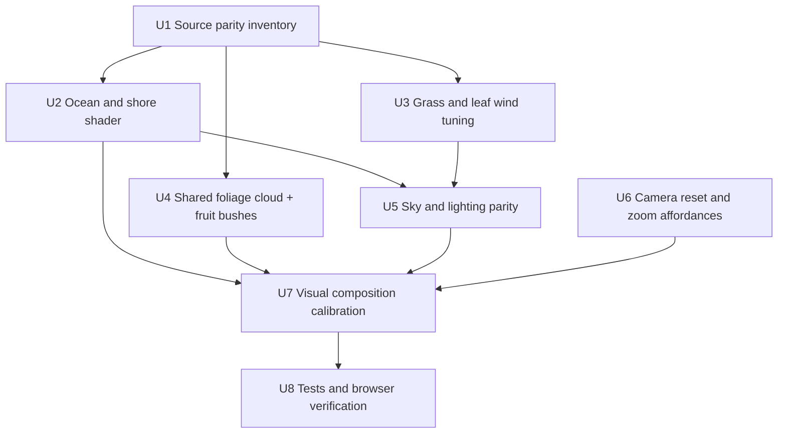

# Plan: Tighten Student Space World and Island Parity

## Goal

Bring the home world closer to the latest Student Space island scene while keeping this app's descriptor boundary, evidence hotspots, React-owned HUD, and no-runtime-imports-from-Student-Space rule intact.

The focus is visual and interaction parity for the world stage and island: composition, camera framing, ocean, shore, grass, tree leaf motion, fruit bushes, sky/lighting, environment HUD sizing, and camera controls. Product flows newly added in Student Space, such as ask/reframe, music track picking, schema changes, and sheet content, stay out of this plan.

## Current Delta Against Student Space

Latest Student Space was checked at commit `e8fc989 feat(debug): grass + leaf-flutter sway controls under view/`. The recent upstream delta since the earlier pulled snapshot includes world files in `sources/Game/View/Camera.js`, `Grass.js`, `Island.js`, `Tree.js`, `View.js`, `ZoomHud.js`, `Sound.js`, `TrackPicker.js`, and `style.css`, plus non-world ask/schema files.

| Surface | Current app state | Latest Student Space reference | Gap to close |
|---|---|---|---|
| Island ocean | `src/components/world/island.ts` has the older curved water shader with waves, shore foam, sky tint, and crest shading. | `sources/Game/View/Island.js` now adds TinySkies-style caustic blobs, sparkles, rain-aware wave amplitude, CPU-integrated ocean time, and animated foam pulses. | Port the newer ocean shader and rain-time integration. |
| Grass wind | `src/components/world/grass.ts` uses a deterministic terrain texture and inline wind constants `0.038` and `0.52`. | `sources/Game/View/Grass.js` keeps source shader constants `0.024` and `0.45`, then scales via `windSpeed` and `windAmp` debug controls defaulting to `1.0`. | Move wind speed/amplitude into app-owned tuning instead of hardcoded drift, with source defaults as parity baseline. |
| Tree leaf flutter | `src/components/world/trees.ts` has source billboard foliage but only `uWindGust`. | `sources/Game/View/Tree.js` adds `uWindRotation` and a separate `windSpeed` feed so leaf flutter can be tuned independently of global gust. | Add `uWindRotation` and split leaf time scale from grass time scale. |
| Fruit bushes | `src/components/world/fruits.ts` uses procedural sphere lobes plus berry clusters. | `sources/Game/View/Fruits.js` reuses Tree's billboard leaf-cloud geometry and oak leaf material for shrub bodies, then places berry clusters across those blobs. | Refactor foliage cloud reuse so bushes share the same Student Space visual language as trees. |
| Flowers | `src/components/world/flowers.ts` already carries the six-species 3D flower vocabulary. | `sources/Game/View/Flowers.js` is materially aligned. | Mainly verify scale, placement density, and lighting after ocean/grass changes. |
| Sky and lighting | CSS sky is React-owned in `src/routes/index.tsx`; Three sky placeholder is empty. `applyWeatherLighting` keeps a high baseline, so night still reads daylit. | `CssSky.js` owns the CSS gradient; `Island.js` drives ambient/directional intensity directly from `DayCycle` keys with a quiet night floor. Clouds were removed upstream. | Preserve CSS sky/no-clouds, but lower lighting baselines to source-like day/night intensity. |
| Camera controls | `createWorldScene.ts` has OrbitControls drag/pinch/wheel. | `Camera.js` adds reset-to-default, discrete zoom, and narrator zoom suppression. `ZoomHud.js` exposes zoom/reset controls. | Add reset and keyboard/button zoom affordances without importing Student Space UI chrome wholesale. |
| Rain/rainbow | Rain and rainbow effects are already adapted closely in `sceneEffects/rain.ts` and `sceneEffects/rainbow.ts`. | Source `Rain.js` and `Rainbow.js` match the same architecture. | Keep as-is unless ocean rain coupling reveals mismatch. |
| Lighting, materials, and textures | Some values are source-like, but lighting has app-specific high baselines and several materials have been reinterpreted while adapting. | Source uses exact day-cycle keys, `MeshLambertMaterial` settings, shader uniforms, texture filters, GLB body texture sampling, and generated terrain/noise texture parameters. | Lock parity to source constants and material/texture settings unless a Three 0.184 API adaptation is unavoidable, and document every intentional deviation. |

## Screenshot Design Audit

The latest app screenshots show that the remaining mismatch is mostly composition and scale, not just missing shaders:

| Visual issue in current screenshots | Student Space target | Plan response |
|---|---|---|
| The island reads too zoomed-in. The grass foreground, cliff, and beach can dominate or crop at the bottom of the viewport. | The island should read as a miniature planet/island with the full grass plateau, sand ring, and ocean halo visible in the default view. | U6 and U7 must reset default framing and responsive camera distance so the full island silhouette is visible on desktop and mobile. |
| Tree canopy forms a wall across the upper half of the scene, hiding sky and making the prompt bird/mailbox feel buried. | Trees are lush but still arranged as distinct clusters with breathable sky gaps and readable trunks. | U4 and U7 must calibrate placement, scale, and decorative tree count after foliage refactor, not just port assets blindly. |
| Cherry trees look highly saturated and oversized relative to the island, especially when they reach the panel side. | Cherry foliage is vivid but subordinate to the island composition; it frames the scene rather than becoming the scene. | U4/U7 should treat tree scale/color as parity tuning, with screenshot gates for canopy height and panel overlap. |
| The right-side environment panel is close but should match source dimensions exactly, not drift into a larger product-card feel. | `HourHud` is a compact dark-glass tool: 12px/14px padding, 14px radius, 11px type, 140px slider, 38x22 switches, no explanatory text. | U5 must include environment HUD CSS parity alongside sky CSS parity. |
| The sky background can look like broad vertical color bands or a darkened top wash. | Student Space uses a CSS three-stop sky, soft central haze, subtle ray shafts, and no cloud shapes. | U5 must port the source CSS sky/haze/ray values more literally and remove any extra atmospheric overlays that read as clouds or heavy bands. |
| The ocean edge reads as a dark moat with a strong cyan ring before the beach/ocean detail is ported. | Water has TinySkies caustics, sparkles, sky tint, and animated shore foam that soften the boundary. | U2 must port the latest water shader before final scale tuning. |

## Non-Goals

- Do not import from the local Student Space checkout at runtime.
- Do not bring over Student Space `State`, `View`, `Debug`, sheets, ask/reframe flows, audio track picker, top nav, or browser-local persistence.
- Do not add new product capture modes, camera capture, or AI chat surfaces.
- Do not replace this app's `VipsWorldSceneModel` descriptor boundary with Student Space singletons.
- Do not add external CDNs. Continue using local public assets and inline shader strings.

## Key Decisions

1. Treat Student Space files as source recipes, not dependencies.
   Code should be adapted into `src/components/world/*` modules, with provenance recorded in `src/components/world/assets.ts`.

2. Centralize scene tuning in `worldStyle.ts`.
   Grass wind speed, grass wind amplitude, leaf wind speed, leaf flutter, ocean speed, and night light floors should live in one app-owned style surface so future visual tuning does not require editing shader strings.

3. Extract shared foliage helpers before changing fruit bushes.
   `trees.ts` currently owns the billboard leaf-cloud geometry and leaf material recipe. Fruit bush parity needs that recipe too, so create a small shared helper rather than duplicating tree internals.

4. Camera affordances should use our React HUD conventions.
   Keep OrbitControls in `createWorldScene.ts`; expose `zoomBy` and `resetCamera` through `WorldSceneHandle`, then mount restrained controls from React instead of copying Student Space DOM/CSS chrome.

5. Visual parity should be screenshot-verified, not judged from code only.
   This work is about the scene reading correctly, so desktop and mobile browser checks are required after implementation.

6. Composition tuning is an implementation unit, not an afterthought.
   The screenshots show a real framing/design problem. After shader and asset parity lands, the implementer must tune camera defaults, tree scale, island occupancy, panel placement, and sky visibility together.

7. Lighting, materials, and textures should be source-parity by default.
   The implementing pass should copy Student Space numeric constants, shader formulas, material types, color values, and texture filtering/wrapping choices exactly where possible. If Three 0.184 or this app's architecture requires an adaptation, the deviation must be named in the implementation handoff and kept visually equivalent.

## Implementation Units

### U1. Refresh Source Parity Inventory

**Purpose:** Make the implementation target explicit before touching code.

**Files:**
- `src/components/world/assets.ts`
- `test/components/WorldScene.test.tsx`

**Changes:**
- Update recipe provenance for `Island.js`, `Grass.js`, `Tree.js`, `Fruits.js`, `Camera.js`, and `ZoomHud.js` to reference the latest parity targets.
- Add a source-parity checklist to the manifest or nearby comments covering lighting/material/texture inputs:
  - public binary assets: `oakTreesVisual.glb`, `cherryTreesVisual.glb`, `foliageSDF.png`
  - day-cycle keys from `sources/Game/State/DayCycle.js`
  - island colors/materials from `sources/Game/View/Island.js`
  - grass shader constants from `sources/Game/View/Materials/shaders/grass/vertex.glsl` plus `Grass.js` wind controls
  - tree foliage material, texture sampling, and GLB body texture sampling from `Tree.js`
  - fruit bush leaf-cloud reuse and berry materials from `Fruits.js`
- Add short notes in the asset manifest for which Student Space layers are intentionally excluded: ask/reframe, Sound, TrackPicker, sheets, and schema.
- Extend the provenance test to assert the new world/island recipe sources.

**Acceptance criteria:**
- The manifest distinguishes approved binary assets from adapted source recipes.
- Lighting/material/texture parity sources are named explicitly, so implementation does not substitute approximate colors or filters.
- Excluded Student Space product layers are named so later agents do not accidentally widen scope.

### U2. Port Latest Ocean, Caustics, and Shore Foam

**Purpose:** Replace the older ocean pass with the latest Student Space TinySkies water treatment.

**Files:**
- `src/components/world/island.ts`
- `src/components/world/createWorldScene.ts`
- `src/components/world/worldStyle.ts`

**Changes:**
- Add ocean tuning values to `WORLD_STYLE`, using the exact source defaults unless explicitly documented:
  - sea colors: `SEA = 0x2A8CA0`, `SEA_DEEP = 0x1560A0`, `FOAM = 0xB3FFFF`
  - plateau color: `0x4A8F3F`
  - sand material color: `0xf2eca8`
  - cliff material color: `0x8a6a30`
  - water radius `60`, tessellation `160 x 160`, y offset `-0.15`
  - wave amplitude `0.32`, rain amplitude scale `0.85 + rain * 0.75`
  - ocean clock speed `0.45 + rain * 0.55`
  - caustic/sparkle formula and the source's subdued intensity comments
- Port the `Island.js` water shader additions:
  - `uRain`
  - CPU-integrated ocean time
  - seven-wave caustic blob pattern
  - sparkle mask
  - crisp edge foam plus two animated outward foam pulses
  - rain-aware amplitude scaling
- Update the animation loop so water materials receive integrated ocean time and current `weather.rain` instead of raw elapsed time only.
- Keep generated terrain texture parameters aligned with source: RGBA float data texture, `LinearFilter` min/mag, `ClampToEdgeWrapping`, same 256 texture size and 16 chunk size.
- Keep current curved-earth constants and existing terrain/sand/cliff shape unless parity testing shows the new water exposes an edge mismatch.

**Acceptance criteria:**
- At hour `10.5`, the ocean shows the lacy caustic/sparkle pattern visible in Student Space, at approximately the subdued 30 percent intensity from the source comments.
- When rain is enabled, wave amplitude and ocean time respond without phase jumps.
- Shore foam appears as an animated waterline band rather than only static edge whitening.

### U3. Align Grass Wind and Tree Leaf Flutter

**Purpose:** Stop tuning grass by guesswork and match the latest source wind model.

**Files:**
- `src/components/world/grass.ts`
- `src/components/world/trees.ts`
- `src/components/world/createWorldScene.ts`
- `src/components/world/worldStyle.ts`

**Changes:**
- Replace inline grass wind constants with shader uniforms or compile-time values sourced from `WORLD_STYLE.motion`.
- Use Student Space defaults as the baseline:
  - grass texture scroll equivalent to source `0.024` at wind speed `1.0`
  - grass amplitude equivalent to source `0.45` at wind amplitude `1.0`
  - tree wind speed `1.0`
  - leaf flutter `1.0`
- Match the source grass material inputs rather than approximate them:
  - `uFresnelOffset = 0`
  - `uFresnelScale = 0.5`
  - `uFresnelPower = 2`
  - `uGrassDistance = 50`
  - `uCameraFadeNear = 18`
  - `uCameraFadeFar = 32`
  - grass default color `vec3(0.29, 0.56, 0.25)`
  - shaded color `default / 1.3`
- Add `uWindRotation` to the leaf material and multiply the UV rotation by it, matching `Tree.js`.
- Split the existing single `VEGETATION_WIND_TIME_SCALE` into named grass and tree time scales.
- Keep reduced-motion behavior by multiplying final movement/intensity through `worldMotionScale(reduceMotion)`, not by changing source-like defaults.

**Acceptance criteria:**
- Grass sway cadence matches Student Space at default controls before any local tuning.
- Leaf flutter can be dialed separately from grass movement by changing one value in `worldStyle.ts`.
- Reduced motion visibly calms grass, leaves, particles, and ambient effects together.

### U4. Refactor Foliage Cloud Reuse and Bring Fruit Bushes Closer

**Purpose:** Make shrubs use the same painterly leaf billboard system as trees, which is a major source of the Student Space look.

**Files:**
- `src/components/world/trees.ts`
- `src/components/world/fruits.ts`
- `src/components/world/worldStyle.ts`
- Optional new file: `src/components/world/foliage.ts`

**Changes:**
- Extract the shared leaf-cloud geometry builder, leaf material factory, and `LeafMaterial` type from `trees.ts` into a small helper module.
- Preserve exact source foliage inputs:
  - `LEAVES_PER_BLOB = 80`
  - `PLANE_SIZE = 0.50`
  - `ALPHA_THRESHOLD = 0.32`
  - `ICO_RADIUS = 1.40`
  - oak colors `0x3A7D2A` and `0x8AAA35`
  - cherry colors `0xFF66A3` and `0xFFCC66`
  - `foliageSDF.png` texture filters: `LinearFilter` min/mag, `generateMipmaps = false`, `RepeatWrapping` on S/T
  - GLB body texture sampling: `SRGBColorSpace`, `NearestFilter` min/mag, `generateMipmaps = false`
  - tree body material: `MeshLambertMaterial`, `flatShading: true`, `side: DoubleSide`
- Keep GLB hydration and value-tree hotspot logic in `trees.ts`.
- Update `fruits.ts` so each fruit bush builds one or two `InstancedMesh` leaf-cloud blobs, following `Fruits.js`, instead of using procedural sphere lobes.
- Place berry clusters across the shrub canopy using deterministic seeded positions, preserving descriptor-driven color, ripeness, pending opacity, and hotspots.
- Reuse source bush placements for decorative baseline bushes while preserving data-driven fallback placement for real skill descriptors.
- Revisit the decorative tree baseline once shared foliage is in place:
  - keep source placements as the first reference point
  - reduce any app-side multipliers that make canopies form a wall
  - keep readable gaps between green and cherry clusters
  - ensure the prompt bird, mailbox, flowers, and bushes stay visible from the default camera

**Acceptance criteria:**
- Bush silhouettes visually match the tree foliage style, not smooth green pillows.
- Tree clusters are lush but distinct; they do not merge into a single canopy wall across the top half of the default viewport.
- Cherry trees frame the island and remain vivid without overpowering the scene or overlapping the environment panel at desktop widths.
- Existing skill fruit hotspots still work.
- No fruit or tree module reads product data directly.

### U5. Match Sky, HourHud, No-Clouds, and Lighting Behavior

**Purpose:** Preserve the transparent CSS sky approach while making the scene lighting and environment HUD match Student Space's day/night feel and compact UI.

**Files:**
- `src/components/world/worldStyle.ts`
- `src/components/world/createWorldScene.ts`
- `src/routes/index.tsx`
- `src/components/EnvironmentPanel.tsx`
- `src/components/world/sceneEffects/stars.ts`
- `src/components/world/sceneEffects/fireflies.ts`
- `test/components/EnvironmentPanel.test.tsx`

**Changes:**
- Extend `DayKey` to include Student Space `ambColor`, `hemiTop`, and `hemiBot` values, not only intensity.
- Change `applyWeatherLighting` to derive lights from the exact interpolated Student Space day keys instead of app-specific high baselines:
  - ambient color from `ambColor`
  - ambient intensity from `ambInt`
  - directional color from `sunColor`
  - directional intensity `0.95 * sunInt`
  - hemisphere values from `hemiTop`, `hemiBot`, and `hemiInt` only where this app keeps the hemisphere light instead of source ambient/directional pair
  - no additive floor like `1.28 + ...` that keeps night daylit
- Copy the `DAY_KEYS` values from `DayCycle.js` exactly, including `skyTop`, `skyBottom`, `sunInt`, `sunColor`, `ambInt`, `ambColor`, `hemiInt`, `hemiTop`, `hemiBot`, and `seaShift`.
- Keep the CSS sky in `src/routes/index.tsx`, but make the values match `style.css` more literally:
  - body/background equivalent: three-stop vertical gradient using `skyTop`, `skyMid`, and `skyBottom`
  - central haze: radial ellipse `70% 55% at 50% 22%`
  - rays: subtle `92deg` repeating-linear-gradient with the same radial mask
  - night mode: fade haze/rays to zero
- Remove or reduce any app-specific sky overlays that create heavy top-darkening, broad vertical color pillars, or cloud-like shapes beyond source haze/rays.
- Match `HourHud` dimensions and spacing exactly unless responsive constraints require a narrower mobile variant:
  - right `16px`, vertically centered
  - `12px 14px` padding, `14px` radius, `8px` gap
  - `11px` system font
  - `30px` label, `140px` slider, `32px` value
  - `38px x 22px` switches
  - no instructional or explanatory text
- Ensure stars and fireflies become visible at night once the light floor is corrected.
- Keep rain desaturation centralized in `worldWeatherAtElapsed` so sky, rain, water, and lighting agree.

**Acceptance criteria:**
- Hour `10.5` remains bright and soft.
- Lighting, sky colors, material colors, and texture sampling are traceable to exact Student Space constants; no approximate replacement remains unless documented as an intentional adaptation.
- The environment panel looks like Student Space `HourHud`, not a larger card; it does not visually dominate the island.
- Hour `22` reads as night, with stars/fireflies visible, while the island remains inspectable.
- No cloud layer is present in CSS or Three.
- The sky has source-like haze and rays, without broad vertical color bands or an extra dark top wash.

### U6. Add Camera Reset and Zoom Affordances

**Purpose:** Bring over the source camera-control feel while staying inside this app's React architecture.

**Files:**
- `src/components/world/createWorldScene.ts`
- `src/components/world/WorldScene.tsx`
- `src/components/WorldStage.tsx`
- `src/routes/index.tsx`
- Optional new file: `src/components/WorldCameraControls.tsx`

**Changes:**
- Add `zoomBy(factor)` and `resetCamera(duration?)` to `WorldSceneHandle`, mirroring Student Space `Camera.js` behavior.
- Implement a small smootherstep camera reset from the current orbit to the default target `(0, 1.7, 0)` and distance `14`.
- Re-evaluate the default camera distance/target after world-scale tuning. Start from source defaults, but adjust responsive camera distance if needed so the full island, sand ring, and ocean halo fit inside the viewport.
- Clamp zoom so manual drag/wheel cannot leave the scene in an unusably close default when the user returns to the page; reset should always restore the source-like composition.
- Add keyboard shortcuts only when focus is not inside editable controls:
  - `+` or `=` zoom in
  - `-` or `_` zoom out
  - `0` reset
- Mount compact React controls near the existing world chrome. Use existing styling/lucide icons instead of copying Student Space `ZoomHud.js` DOM/CSS.

**Acceptance criteria:**
- Dragging/pinch/wheel remain handled by OrbitControls.
- Reset returns the island to a Student Space-like miniature framing: sky visible above trees, full grass plateau visible, sand ring visible, and ocean halo visible.
- Keyboard shortcuts do not fire while typing in inputs, textareas, or contenteditable surfaces.

### U7. Visual Composition Calibration

**Purpose:** Tune the assembled scene against the screenshots and source app after the shader/asset/control work lands.

**Dependencies:** U2, U4, U5, U6.

**Files:**
- `src/components/world/createWorldScene.ts`
- `src/components/world/trees.ts`
- `src/components/world/fruits.ts`
- `src/components/world/island.ts`
- `src/components/EnvironmentPanel.tsx`
- `src/routes/index.tsx`
- `test/components/WorldStage.test.tsx`

**Approach:**
- Treat the source repo screenshots as the visual target: full-screen transparent canvas, compact right-side panel, breathable sky, island visible as a whole miniature scene, and no visible frame around the world stage.
- Tune scene composition in this order:
  1. default camera framing and responsive distance
  2. island scale and vertical placement in frame
  3. tree/decorative canopy scale and count
  4. panel placement and size
  5. ocean halo and shore foam readability
- Avoid fixing composition by simply shrinking everything evenly. Student Space works because the island, trees, beach, and sky occupy balanced zones; tune those zones explicitly.
- Preserve functional overlays and hotspot affordances while tuning visuals.

**Test scenarios:**
- Desktop `1920x1080` at hour `10.5`: the full island silhouette, sand ring, and ocean halo are visible; trees do not crop against the top edge; panel does not overlap the main prompt bird cluster.
- Desktop `1440x900` at hour `10.5`: canopy remains lush but has visible sky gaps; the prompt bubble, mailbox, flowers, and fruit bushes remain readable.
- Mobile portrait at hour `10.5`: the island is not clipped into an abstract grass wall; environment panel stays within viewport without covering the whole scene.
- Desktop night/aurora: haze/rays fade correctly; stars/fireflies are visible; island remains inspectable.
- Rain and rainbow toggles: effects layer above the scene without washing out the sky or hiding the island edge.

**Verification:**
- Browser screenshots are captured or visually checked for the viewports above.
- The final implementation is compared against both the source Student Space app and the user's latest screenshots, with any intentional differences named in the handoff.

### U8. Tests and Browser Verification

**Purpose:** Prove the port works in code and in the actual scene.

**Dependencies:** U2, U3, U4, U5, U6, U7.

**Files:**
- `test/components/WorldScene.test.tsx`
- `test/components/WorldStage.test.tsx`
- `test/components/EnvironmentPanel.test.tsx`
- Any new unit tests near changed helper modules if needed.

**Changes:**
- Add unit coverage for:
  - camera handle methods exposed by `WorldScene`
  - provenance for new adapted recipe sources
  - environment/weather controls still updating an existing scene
  - fruit bush descriptors retaining `host: 'bush'` and hotspot metadata
- Run:
  - `pnpm check`
  - `pnpm test`
  - `pnpm build`
- Start the app and verify in Chrome or browser automation:
  - desktop wide viewport at hour `10.5`
  - mobile portrait at hour `10.5`
  - desktop composition after reset camera
  - mobile composition after reset camera
  - rain on
  - rainbow on
  - aurora/night hour around `22`
  - camera drag, zoom, and reset

**Acceptance criteria:**
- The browser scene is nonblank, full-screen, unframed, and responsive.
- Ocean, grass, trees, shrubs, flowers, rain, rainbow, and night effects render without incoherent overlap.
- The scene remains pointer-interactive for hotspots while camera drag does not accidentally trigger hotspot selection.
- Default and reset views match the Student Space composition closely enough that the island reads as a full miniature world, not a close-up wall of grass and leaves.

## Risks and Mitigations

| Risk | Mitigation |
|---|---|
| Ocean shader port becomes too busy or noisy. | Keep caustic/sparkle intensities centralized in `worldStyle.ts` and start from the source comments' subdued 30 percent pass. |
| Shared foliage refactor breaks async tree GLB hydration. | Extract only pure geometry/material helpers first, leave loader/cache/hotspot ownership in `trees.ts`, and test fallback behavior. |
| Night lighting becomes too dark for product readability. | Use the source day-key floors as the target, then browser-test hour `22` with panel and nav visible. |
| Tree/camera tuning overcorrects and makes the island feel sparse. | Tune against the source app after shared foliage lands; keep tree density but lower wall-like scale/crop. |
| HUD parity conflicts with this app's responsive layout. | Use source desktop dimensions as the default and add only minimal responsive constraints for mobile overflow. |
| Camera controls conflict with hotspot clicks. | Preserve the existing drag-distance click suppression and add tests/manual checks for drag versus click. |
| Planning scope drifts into Student Space product features. | Keep ask/reframe, audio, sheets, schema, and top-nav changes explicitly out of scope. |

## Verification Checklist

- `pnpm check`
- `pnpm test`
- `pnpm build`
- Browser verification with screenshots for:
  - desktop hour `10.5`, no rain, no rainbow
  - desktop hour `10.5`, immediately after reset camera
  - desktop rain on
  - desktop rainbow on
  - desktop hour `22`, aurora on
  - mobile portrait hour `10.5`
  - mobile portrait, immediately after reset camera
- Interaction verification:
  - drag orbit
  - wheel/pinch zoom
  - `+`, `-`, and `0` shortcuts
  - reset camera
  - click a tree/flower/fruit hotspot after a drag

## Open Questions

1. Should the camera zoom/reset buttons be visible by default, or hidden behind the existing world action chrome until hover/focus?
2. Should the source wind tuning values stay as internal constants only, or should we expose a temporary development-only tuning panel while matching parity?
3. Should mood pin color continue to affect only pins for now, or should a later plan wire mood bias into the CSS sky like Student Space `DayCycle.js`?
4. Should implementation prioritize exact source composition even if it reduces the amount of evidence-driven decorative content visible at once?

## Done Means

- The app visually matches the latest Student Space island more closely in the specific layers users have called out: full-world framing, ocean, sky, grass, trees, flowers/shrubs, wind, environment panel, and camera controls.
- The implementation remains descriptor-driven and does not depend on Student Space runtime files.
- Tests and browser verification pass, with screenshots or notes captured in the implementation handoff.
