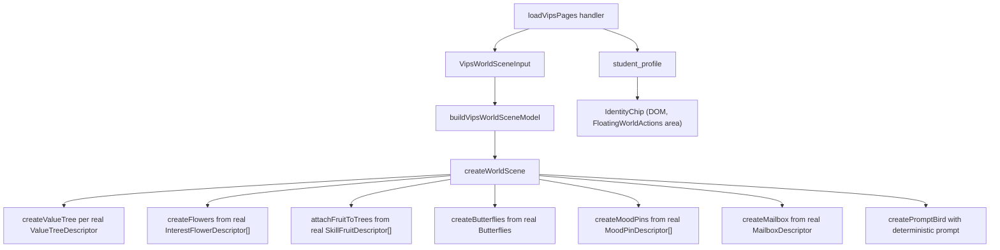

> **Superseded 2026-05-18 by [2026-05-18-001-feat-port-student-space-shell-plan.md](./2026-05-18-001-feat-port-student-space-shell-plan.md).**
> The home surface is being replaced wholesale by the Student Space engine
> mounted via its public `createGame()` entrypoint. The decorative-baseline
> + identity-chip + prompt-bird-determinism fixes in U1–U7 below targeted
> `src/components/world/` modules that are now dormant. Tracked
> modifications were discarded; untracked test files for the same modules
> were removed. The "faithful mirror" contract is now enforced by Student
> Space's own descriptor → engine seam rather than by `withStudentSpaceBaseline`.
>
> See the new plan for the integration path. The "vetted-unshipped"
> recommendations under U4 (identity surface) and U6 (demo seed parity) are
> reframed there as items #4 (`StudentSpaceHost` identity wiring, deferred)
> and #7 (`seedStudent(spec)` builder + persona archetypes).

# fix: Wire world stage to real VIPS data and identity

## Summary

The home world stage already loads real VIPS data (timeline entries, recent
reflections, recent moods, counsellor briefs, student profile) and runs the
shipped Student Space-inspired Three.js layer. But three boundary leaks make
parts of the scene render decorative placeholders that look like real
evidence:

1. `withStudentSpaceBaseline` (in `createWorldScene.ts`) injects up to 7
   oak/cherry trees and 6 RIASEC flowers when a student has fewer real
   claims. These appear as part of the island but are not backed by any
   `vips_timeline_entries` row.
2. `STUDENT_SPACE_TREE_PLACEMENTS` overrides real value-tree **species** for
   the first N trees (it forces oak/cherry at fixed coordinates regardless
   of whether the actual claim is `values.security` → pine,
   `values.independence` → palm, etc.).
3. `createFlowers` in `flowers.ts` always renders 18 flower instances,
   filling unused slots with `decorativeFlower(...)` so the visible flower
   count never reflects real RIASEC evidence.

Identity also leaks: `loadVipsPages` returns `student_profile.name` and
`detail`, but the world stage never surfaces it. And only `demo-a` has
seeded `vips_timeline_entries`, so demo-b/c/d render an empty island even
though they have reflections.

This plan removes the decorative fakes, decouples placement from species,
surfaces identity on the world stage, and ensures every demo student has
real VIPS data so the world is meaningful end-to-end.

The Student Space Three.js visual layer (ocean caustics, grass/leaf wind,
fruit bushes, Kira-style bird, aurora/particles/stars/fireflies/rain, camera
reset/zoom) is already shipped via the previous two plans — this plan
verifies parity in a final browser pass and does not add new Three modules.

---

## Problem Frame

The world is supposed to be a projection of the student's reviewed VIPS
evidence: trees = Values, flowers = Interests, fruit = Skills, butterflies
= recent reflections, terrain = Personality, mailbox = counsellor briefs,
mood pins = recent emotions. The descriptor layer
(`buildVipsWorldSceneModel`) is correct: it filters forgotten claims, uses
canonical taxonomy IDs, marks pending vs confirmed, and ties butterflies to
real reflection IDs. The shipped Three.js layer is faithful to Student
Space's visual language.

But three Three-side seams paper over a "sparse evidence" reality with
hard-coded decoration that looks like evidence. A student with three values
and no interests sees seven trees and six flowers, none of which match
their data. That breaks the contract the rest of the app depends on (the
island as a faithful mirror of what Connector has actually committed).

The student also never sees their own identity on the home screen, even
though the demo seed pre-supplies a name like "Mei (S4)". That makes the
home stage feel anonymous and detached from the rest of the app, where
profile/identity is otherwise consistent.

---

## Requirements

- R1. Every tree, flower, and fruit rendered on the island must come from a
  descriptor in `VipsWorldSceneModel` that is itself derived from a real
  VIPS timeline entry (or a real recent Mirror entry for butterflies).
- R2. A descriptor's `species`/`flower`/`fruitFamily` field must determine
  the visual species; placement helpers must not override it.
- R3. When VIPS evidence is sparse or empty, the island must render an
  honest empty/sparse state (Personality terrain + atmosphere + bird +
  mailbox + any real claims), not decorative trees or flowers.
- R4. Pending and forgotten evidence rules from the descriptor layer must
  continue to drive visuals (no regression of the existing pending-tentative
  / forgotten-omitted behavior).
- R5. The student's identity (name) must be visible on the home world
  stage when available, without competing with the voice action.
- R6. The four seeded demo students (`demo-a`, `demo-b`, `demo-c`, `demo-d`)
  must each have enough seeded `vips_timeline_entries` to render a
  meaningful island (≥3 values, ≥3 interests, ≥3 skills, ≥1 personality
  claim per student) so demo flow always shows real-data behavior.
- R7. All Three.js logic and behavior shipped from Student Space
  (ocean/grass/foliage/fruit-bush/Kira/aurora/particles/stars/fireflies/rain/
  camera) must remain wired and exercised in browser verification — this
  plan is a data-wiring fix, not a visual rewrite.
- R8. The home prompt bird's prompt selection must be deterministic (no
  per-render `Math.random()`) so the same student sees a stable prompt
  during a session and Three lifecycle changes don't shuffle it.
- R9. Code must follow existing TypeScript/React/Three.js conventions in
  this repo: SSR-safe lifecycle in `WorldScene`, descriptor-only Three
  modules, shared style via `worldStyle.ts`, deterministic placement seeds,
  no new singletons.
- R10. DRY: do not duplicate species → visual mappings between the
  descriptor layer (`vipsWorldMapping.ts`) and the Three modules
  (`trees.ts`, `flowers.ts`, `fruits.ts`). Each visual table lives in one
  place.
- R11. Simpler-when-possible: prefer deleting placeholder code over wrapping
  it in feature flags. Decorative paths that exist only because evidence
  was sparse should be removed, not gated.
- R12. Tests must cover: (a) trees rendered match real value claim IDs and
  species, (b) no decorative flowers appear when interests/fruit are empty,
  (c) all four demo students load a non-empty world descriptor, (d) the
  identity chip renders when `student_profile.name` is provided and is
  absent otherwise.

---

## Scope Boundaries

- No new agent prompts, no Connector/Mirror/Cartographer behavior change,
  no new server endpoints, no schema migrations.
- No new Three.js modules and no new sceneEffects layers. This plan is a
  wiring/data fix.
- No reshape of `VipsWorldSceneModel` types or descriptor field names
  (existing tests and consumers depend on them).
- No new dependencies. `three` stays at `0.184.0`.
- No change to authentication, tenancy, or session resolution.
- No change to the counsellor brief / mailbox business logic.
- No new student-facing copy beyond a small identity chip.

---

## Context & Research

### Relevant Code

- `src/components/world/createWorldScene.ts:581-672` — `withStudentSpaceBaseline()`
  and `baselineTree()` / `baselineFlower()` inject decorative descriptors.
- `src/components/world/createWorldScene.ts:152-159` — `STUDENT_SPACE_TREE_PLACEMENTS`
  is consumed by index, and the first N real value trees inherit oak/cherry
  placement (and therefore visual species) regardless of their real species.
- `src/components/world/trees.ts:47-76` — `createValueTree` honors a
  `placement` parameter that forces `assetSpecies = placement?.species`,
  short-circuiting the real `tree.species`.
- `src/components/world/flowers.ts:39-60` — `createFlowers` loops 18 times
  and back-fills with `decorativeFlower(...)` for any unused species slot.
- `src/components/world/promptBird.ts:26-29` — `pickPromptBirdPrompt()` uses
  `Math.random()` inline.
- `src/server/load-vips-pages.handler.server.ts:111-115` — returns
  `student_profile` (name + detail) already; consumer must surface it.
- `src/routes/index.tsx:141-157` — composes `sceneModel` from `vipsData`.
- `test/ablation/fixtures/seed-multistudent.json` — only `demo-a` has
  `vips_timeline_entries`; demo-b/c/d are reflection-only.
- `src/db/seed.ts` — seed script applies fixture timeline entries when
  present; idempotent per-student.

### Data Path Today

```
loadVipsPages (server)
  ├─ pages: VipsPageRow[]
  ├─ timeline_by_dimension: {values, interests, personality, skills}
  ├─ recent_entries: MirrorEntryRow[]
  ├─ recent_moods: derived from mirror_entries.tags
  ├─ world_mailbox: counsellor brief status
  └─ student_profile: {name, detail}   ←  unused on /

LandingPage
  └─ buildVipsWorldSceneModel(input)   ← honest mapping, no fakes
       │
       └─ sceneModel passed to <WorldStage … sceneModel=…>
              │
              └─ <WorldScene model=…>
                     │
                     └─ createWorldScene({ model: withStudentSpaceBaseline(model), … })
                                                   ↑
                                                   └── injects decorative trees + flowers
```

### Institutional Learnings

- `docs/brainstorms/2026-05-11-vips-wiki-pivot-requirements.md` (AE1, AE4,
  AE8) requires that the wiki/world represents only reviewed evidence.
  Decorative trees violate AE8 (pending review must look pending, not
  fabricated).
- The completed 2026-05-13-001 plan codified "Evidence-to-world grammar:
  render only confirmed or explicitly pending local evidence" as a Key
  Technical Decision. `withStudentSpaceBaseline` was a transitional escape
  hatch for visual density during early development.

### External References

- The shipped Student Space parity work (2026-05-14-001 and 2026-05-14-004,
  both marked completed) already brought across the visual language; no
  external Student Space source code needs to be re-consulted for this fix.

---

## Key Technical Decisions

- **Delete `withStudentSpaceBaseline` rather than gate it.** A feature flag
  would invite the placeholder back; deletion guarantees R1.
- **`STUDENT_SPACE_TREE_PLACEMENTS` becomes a positional fallback only.**
  Its `species` field is removed; placements supply x/z/scale/yaw and the
  visual species comes from the real `ValueTreeDescriptor.species`.
- **Flowers stop self-duplicating.** `createFlowers` iterates the real
  descriptor list and only emits decorative blooms when explicitly asked
  for an "empty island" demo mode (out of scope here — removed for now).
- **Identity chip is React, not Three.** A small DOM chip in
  `FloatingWorldActions` (or near it) surfaces `student_profile.name`. It
  inherits voice-mode disabling like other floating actions.
- **Prompt bird becomes deterministic.** `pickPromptBirdPrompt` accepts an
  optional seed (default to a stable hash of today's date + studentId
  context) so the prompt does not shuffle on every re-render.
- **Demo data parity via seed fixture, not runtime.** Add hand-curated
  `vips_timeline_entries` for demo-b, demo-c, demo-d in
  `seed-multistudent.json` consistent with each student's profile
  (values_dominance, riasec_tilt, skills_evident already declared in the
  fixture). No runtime "fake fill" path.
- **Descriptor layer remains the single source of visual truth.**
  `vipsWorldMapping.ts` already owns the species/flower/fruit-family lookup
  tables; we keep it that way. Three modules consume descriptor fields and
  do not reapply mappings.

---

## High-Level Technical Design



---

## Implementation Units

### U1. Remove decorative baseline trees and flowers

**Goal:** Make `createWorldScene` render exactly the descriptors it
receives, with no decorative top-ups.

**Requirements:** R1, R3, R10, R11

**Files:**
- Modify: `src/components/world/createWorldScene.ts`
- Test: `test/world/createWorldScene.test.ts`
- Test: `test/world/vipsWorldMapping.test.ts` (no change expected; verify
  invariants still hold)

**Approach:**
- Delete `withStudentSpaceBaseline`, `baselineTree`, `baselineFlower`.
- Replace `const sceneModel = withStudentSpaceBaseline(model)` with
  `const sceneModel = model`.
- Remove the export of `withStudentSpaceBaseline`. Search for any external
  callers; update tests if needed.
- Confirm `summary.warnings` already covers the empty-VIPS case ("No
  confirmed VIPS evidence yet; rendering calm island.") — leave intact.

**Test scenarios:**
- A model with 0 trees produces 0 tree groups under `islandRoot`.
- A model with 3 confirmed value trees produces exactly 3 tree groups (no
  decorative pad-up to 7).
- A model with 0 flowers produces 0 flower instances.

---

### U2. Decouple tree placement from species

**Goal:** Use placement coordinates for layout only; let the descriptor's
real species drive the visual.

**Requirements:** R2, R9, R10

**Files:**
- Modify: `src/components/world/trees.ts`
- Modify: `src/components/world/createWorldScene.ts`
- Test: `test/world/createWorldScene.test.ts` or a new
  `test/world/trees.test.ts` covering placement vs species

**Approach:**
- Change `StudentSpaceTreePlacement` to drop the `species` field. Rename to
  `WorldTreePlacement` to reflect its general purpose.
- `createValueTree(tree, foliageTexture, placement?)` continues to accept a
  placement for x/z/scale/yaw, but `assetSpecies` is derived solely from
  `tree.species` via `studentSpaceAssetSpecies(tree.species)`.
- Real value trees with `species === 'oak'` or `'cherry'` use the GLB
  hydration path. Other species (pine, palm, mangrove, maple, willow,
  banyan) take the existing procedural fallback in `createFallbackTree`.
- Update `createWorldScene` so the first N real trees take the curated
  layout positions if available, regardless of species.

**Test scenarios:**
- A `values.security` descriptor (species: pine) renders the pine fallback
  even when placed at index 0.
- A `values.tradition` descriptor (species: cherry) renders the cherry GLB
  hydration path regardless of which placement index it gets.
- Layout positions remain deterministic across runs for a given placement
  seed.

---

### U3. Stop flowers self-duplicating

**Goal:** Flowers render one instance per real interest descriptor (with
strength-driven count for cluster density), with no decorative back-fill.

**Requirements:** R1, R3, R10, R11

**Files:**
- Modify: `src/components/world/flowers.ts`
- Test: `test/world/flowers.test.ts` (new, small)

**Approach:**
- Remove the `SOURCE_FLOWER_INSTANCES = 18` loop. Iterate
  `flowers: InterestFlowerDescriptor[]` directly.
- For each descriptor, place `descriptor.count` clusters using deterministic
  placement seeds (existing `count` already encodes evidence strength).
- Cluster placement still uses `SOURCE_FLOWER_SEED` and
  `SOURCE_FLOWER_RADIUS_INSET` for the bouquet layout, but the upper bound
  is `descriptors.reduce((sum, d) => sum + d.count, 0)`, capped at
  `WORLD_STYLE.flowers.maxInstances` (a new const, default 24).
- Drop `decorativeFlower(...)` from the rendering loop. Keep the function
  itself only if a test imports it; otherwise delete.

**Test scenarios:**
- An empty flower descriptor list produces an empty flower group.
- Two real interest descriptors (`social`, `investigative`) produce only
  `lily` and `pansy` blooms; no rose/tulip/etc. ghosts appear.

---

### U4. Surface student identity on the world stage

**Goal:** A small, accessible identity chip surfaces the student's name
when `student_profile.name` is available, without competing with the voice
control.

**Requirements:** R5, R9

**Files:**
- Modify: `src/components/FloatingWorldActions.tsx`
- Modify: `src/routes/index.tsx` (pass `studentProfile` through)
- Test: `test/components/FloatingWorldActions.test.tsx`

**Approach:**
- Add an optional `studentProfile?: { name: string; detail: string | null }`
  prop to `FloatingWorldActions`.
- When `studentProfile?.name` is present, render a small chip with the
  copy "`{name}'s island`" (or just `{name}` for non-demo identities where
  detail is null) near the top-left corner, behind the existing nav
  actions, with `aria-label="Student identity"`.
- Disable the chip's appearance during voice mode the same way the other
  floating actions are disabled, via the existing `voiceModeActive` prop.
- Use the existing shadcn primitives / `cn` helper for styling. No new
  visual library.
- In `LandingPage`, pass `vipsData?.student_profile` into the
  `FloatingWorldActions` prop.

**Test scenarios:**
- Renders the chip when `studentProfile.name` is provided.
- Does not render the chip when `studentProfile` is null.
- Inherits the disabled affordance when `voiceModeActive` is true.

---

### U5. Make the prompt bird's prompt deterministic

**Goal:** Stable prompt for the duration of a session and across Three
lifecycle remounts.

**Requirements:** R8, R9

**Files:**
- Modify: `src/components/world/promptBird.ts`
- Modify: `src/components/world/createWorldScene.ts`
- Test: `test/world/promptBird.test.ts` (new, small)

**Approach:**
- Change `pickPromptBirdPrompt()` to `pickPromptBirdPrompt(seed: number)`,
  returning `PROMPT_BIRD_PROMPTS[seed % PROMPT_BIRD_PROMPTS.length]`.
- In `createWorldScene`, derive `seed` from a stable input: prefer the
  scene model's `summary.confirmedClaims + summary.pendingClaims + day-of-year`
  so the same student sees the same prompt across the day, but different
  students see different prompts.
- Optional: surface `promptBirdSeed?: number` on `CreateWorldSceneOptions`
  for tests.

**Test scenarios:**
- Two calls with the same seed return the same prompt.
- The returned value always lies inside `PROMPT_BIRD_PROMPTS`.

---

### U6. Seed real VIPS evidence for demo-b, demo-c, demo-d

**Goal:** Every demo student loads a non-empty island; switching accounts
demonstrates real-data behavior.

**Requirements:** R6, R12

**Files:**
- Modify: `test/ablation/fixtures/seed-multistudent.json`
- Test: existing `test/db/seed.test.ts` (or wherever fixture invariants live)
  — extend if present
- Optional: `scripts/managed-agents/...` — not modified

**Approach:**
- For each of demo-b, demo-c, demo-d, hand-curate 8–12 timeline entries
  consistent with the student's declared `profile.values_dominance`,
  `riasec_tilt`, `skills_evident`. Use `verbatim_quote`s drawn from each
  student's existing reflections, with valid `reflection_index` references.
- Each student should produce ≥3 distinct values, ≥2 distinct interests
  (where applicable), ≥3 distinct skills, ≥1 personality claim. Strengths
  should mix `high`/`medium`/`low`. Parallax tags should cover ≥3 contexts
  per student to stay consistent with the existing AE6 invariant.
- Provide `vips_pages` stubs matching the dimensions covered (compiled
  truth may be short).
- Re-run `pnpm seed` locally to confirm idempotency (the seed script skips
  students that already have mirror_entries; pass `SEED_REPLACE_EXISTING=1`
  to refresh).

**Test scenarios:**
- Existing fixture invariants pass for all four students.
- Loading the home route as each demo student produces a non-empty
  `sceneModel.trees`, `flowers`, and `fruit`.

---

### U7. Verification and browser smoke

**Goal:** Prove the wiring with tests and a browser pass; confirm Student
Space Three.js behaviors all still fire.

**Requirements:** R7, R12

**Files:**
- Run: `pnpm check`, `pnpm test`, `pnpm build`
- Browser: dev server + agent-browser

**Approach:**
- Boot `pnpm dev`. Visit `/` as `demo-a`.
- Verify: tree count == confirmed/pending value claim count, species in
  scene visually matches descriptor table (cherry vs oak vs pine etc.).
- Verify: no ghost decorative flowers; flower clusters correspond to real
  interest descriptors only.
- Verify: butterflies count and color reflect recent reflections (pending
  vs confirmed).
- Verify: identity chip renders the seeded name (e.g. "Mei").
- Verify: prompt bird prompt is stable across page reloads on the same
  day.
- Visually confirm the Student Space behaviors are still alive: ocean
  caustics & shore foam, grass wind & leaf flutter, fruit-bush silhouettes
  on bushes, camera reset/zoom buttons, aurora at night hour, stars/
  fireflies at night, particles drifting, weather/rain/rainbow toggles.
- Repeat the load as `demo-b`, `demo-c`, `demo-d` (via DEV_BYPASS_AUTH) and
  capture a screenshot of each island.

**Test scenarios:**
- All `pnpm` quality gates pass.
- Browser confirms each of the wiring points above visibly.

---

## Sequencing

1. U6 first (seed) — gives local dev a meaningful test bed for U1/U2/U3.
2. U1 — remove `withStudentSpaceBaseline`.
3. U2 — decouple placement from species.
4. U3 — stop flower self-duplication.
5. U4 — identity chip.
6. U5 — deterministic prompt bird.
7. U7 — verification.

---

## System-Wide Impact

- **Data boundary:** unchanged. Server contract for `loadVipsPages` is
  identical; only consumption changes.
- **Type boundary:** `StudentSpaceTreePlacement.species` removed (or
  renamed type). All consumers are inside `src/components/world/`.
- **Test surface:** lifecycle tests under `test/world/` and component
  tests under `test/components/` extend, no rewrites needed.
- **Accessibility:** identity chip adds one new DOM control with an
  `aria-label`. Voice mode lock applies uniformly to the floating actions
  region.
- **Performance:** descriptor-driven flower counts will usually be smaller
  than the prior 18-instance floor, so the change is performance-neutral
  or slightly faster.
- **Privacy:** the identity chip only echoes data the same route already
  loaded; no new data crosses tier boundaries.

---

## Risks & Dependencies

| Risk | Mitigation |
|------|------------|
| Removing decorative trees makes early-onboarding islands look bare. | The Personality terrain, ocean, sky, bird, mailbox, and 18 fallback flowers already gave density; reducing trees to real evidence aligns with the wiki contract. If post-implementation review finds it too bare, U5 + U6 (real demo data) plus a small "first reflection" prompt soft-state (existing prompt bird) cover the gap without re-introducing fakes. |
| Seed JSON changes break existing fixture tests. | Run `pnpm test` and `pnpm seed` locally; update any fixture-invariant tests as part of U6. |
| `STUDENT_SPACE_TREE_PLACEMENTS` decoupling might shuffle visual layout for demo-a. | Placements remain in the same array order, so the first N real trees keep the same x/z/scale/yaw; only their species changes when they previously force-overrode pine/palm/etc. to oak/cherry. |
| Identity chip overlaps existing floating actions on narrow viewports. | Position chip at top-left with conservative width; existing actions live top-right. Tested on mobile portrait in U7. |
| Deterministic prompt bird seed becomes "stale" within a session. | Seed mixes confirmed-claim count with day-of-year; the prompt advances daily and after new claims commit, which is the desired cadence. |

---

## Definition of Done

- `withStudentSpaceBaseline`, `baselineTree`, `baselineFlower` deleted; no
  remaining references in `src/` or `test/`.
- `StudentSpaceTreePlacement` no longer carries `species`; tree visuals are
  driven by `ValueTreeDescriptor.species` only.
- `createFlowers` iterates the real descriptor list and produces zero
  flowers when the list is empty.
- `pnpm check`, `pnpm test`, `pnpm build` all pass.
- Identity chip appears for demo-a as "Mei" and is absent when no profile
  is available.
- Browser verification confirms each Student Space behavior still fires
  (ocean caustics, grass/leaf wind, fruit bushes, Kira-style bird, aurora,
  particles, stars, fireflies, rain, rainbow, camera reset/zoom).
- All four demo students render a non-empty island with their own VIPS
  evidence.

---

## Sources & References

- Origin plan: [docs/plans/2026-05-14-004-feat-student-space-world-island-parity-plan.md](./2026-05-14-004-feat-student-space-world-island-parity-plan.md)
- Predecessor: [docs/plans/2026-05-14-001-feat-student-space-rich-world-assets-plan.md](./2026-05-14-001-feat-student-space-rich-world-assets-plan.md)
- World stage origin: [docs/plans/2026-05-13-001-feat-student-space-world-stage-plan.md](./2026-05-13-001-feat-student-space-world-stage-plan.md)
- Code: `src/components/world/createWorldScene.ts`, `src/components/world/trees.ts`, `src/components/world/flowers.ts`, `src/components/world/promptBird.ts`, `src/components/FloatingWorldActions.tsx`, `src/routes/index.tsx`, `src/server/load-vips-pages.handler.server.ts`
- Seed: `test/ablation/fixtures/seed-multistudent.json`, `src/db/seed.ts`
