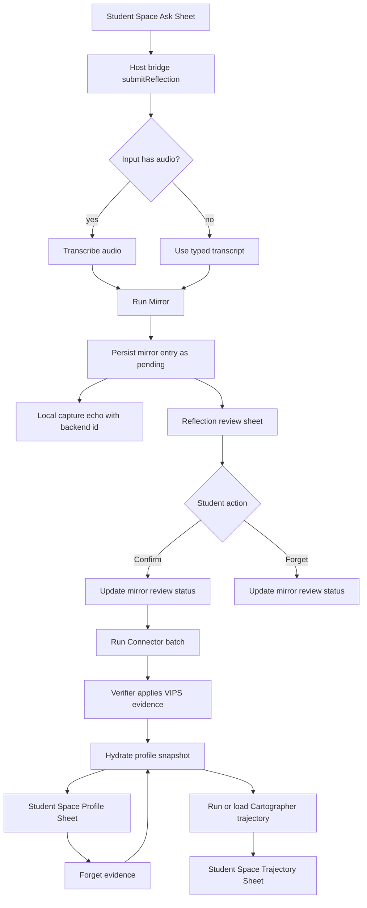
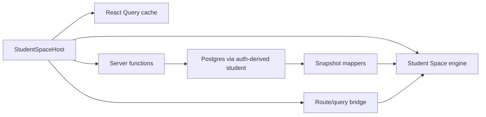

# feat: Wire Student Space shell to the VIPS backend flow

## Summary

The Student Space shell is now the home surface, but its captures, profile, calendar, and trajectory are still local engine state. This plan wires the shell into the existing Mirror -> reflection review -> Connector -> VIPS profile -> Cartographer backend flow through an explicit bridge contract, with Postgres remaining the source of truth for durable sense-making data.

The bridge should not make the engine's `StorageAdapter` the domain integration layer. The adapter stays a local UI cache; typed and voice reflection capture, review actions, profile evidence, and trajectory run/read operations move through intentional server functions and mappers.

Follow-up `docs/plans/2026-05-18-003-feat-student-space-demo-data-audio-plan.md` closed the remaining shell-data and audio gaps: Student Space voice capture now records audio for the existing OpenAI transcription path, and bridged identity/calendar/letters hydrate from one server-side demo/session snapshot instead of scattered engine seed fixtures.

---

## Problem Frame

The product loop described in the VIPS/wiki pivot is live on the backend, but the current home UI no longer reaches it. Students can talk to the Student Space shell and see local seeded profile/trajectory overlays, while the durable Mirror, Connector, VIPS, and Cartographer data lives behind older React routes and developer surfaces.

That split creates a false sense of product completion: the frontend feels alive, and the backend pipeline works, but the student's main flow does not produce or consume durable truth.

---

## Requirements

- R1. A Student Space "Ask" or reflection capture must create a durable mirror entry through the existing Mirror pipeline.
- R2. Voice capture must use the existing transcription path when audio is available; text-only capture may skip transcription and still run Mirror.
- R3. New mirror entries must remain pending raw-reflection review after persistence; Connector must only process confirmed entries.
- R4. The Student Space shell must display backend-backed reflection review, profile evidence, and trajectory data as the primary source of truth.
- R5. Profile forget actions from the shell must soft-delete or hide the corresponding backend evidence and then refresh dependent profile, reflection, and trajectory state.
- R6. The bridge must preserve server-side auth and tenancy: the client never sends or chooses the active student identity.
- R7. Deep links that already target `/?sheet=...` or `/library...` must land in the relevant Student Space surface instead of silently opening the home island only.
- R8. Photos, standalone mood pins, onboarding progress, decorative state, and local shell ceremony remain local for this pass unless attached to a reflection submission.
- R9. Failures must preserve the student's captured text locally and expose a retry path rather than losing the reflection.
- R10. The developer pipeline view remains available for inspecting the backend flow while the shell integration is built.
- R11. Shell-backed surfaces must cover loading, empty, error, success/retry, close, keyboard, and touch states for the backend operations they expose.
- R12. Reflection submission must validate input size/type, avoid logging raw audio, and persist only the transcript and Mirror outputs already covered by the backend data model.

**Origin actors:** Student, Counselor/teacher, Mirror agent, Connector agent, deterministic verifier, Cartographer agent.
**Origin flows:** Mirror reflection ritual, VIPS profile maintenance, student confirm/forget review, manual Cartographer sense-making.

---

## Scope Boundaries

- This plan wires the existing Student Space shell to the current backend contract; it does not replace the backend pipeline or rewrite the engine.
- This plan preserves the current review policy: students review raw mirror entries first, and Connector batch processing applies verified evidence after confirmation.
- This plan does not reintroduce a staged VIPS-diff review screen as the main flow. Existing staged-diff code can remain for audit or future reconsideration.
- This plan does not add photo analysis, image upload persistence, or video/frame processing.
- This plan does not introduce a backend table for standalone mood pins. Mood may be attached to a reflection through the existing mirror-entry tag path.
- This plan does not make the engine's localStorage namespace multi-user durable storage. Auth-scoped durability belongs to server functions and Postgres.
- This plan does not remove old React pages until the shell-backed flow is verified.

### Deferred to Follow-Up Work

- Backend persistence for standalone mood pins: define whether a mood pin is a private UI mark, a reflection tag, or its own timeline artifact.
- Photo capture persistence and review: requires a product/privacy rule before any backend storage.
- Retirement of dormant world and React sheet components: handle after the shell-backed surfaces cover the same workflows.
- Real-time agent run streaming inside the engine: the first pass can use request/response server functions and existing debug run status.

---

## Context & Research

### Relevant Code and Patterns

- `src/components/StudentSpaceHost.tsx` mounts `createGame()` dynamically and currently passes `localStorageAdapter()` only.
- `src/engine/student-space/Game/index.d.ts` exposes `createGame`, `Game`, and a sync `StorageAdapter`, but no backend service contract.
- `src/engine/student-space/Game/State/Persistence.js` debounces slice writes and flushes synchronously, which makes it a poor fit for domain writes to Postgres.
- `src/engine/student-space/Game/View/AskSheet.js` uses Web Speech and local heuristics, then writes local captures only.
- `src/engine/student-space/Game/View/ProfileSheet.js` and `src/engine/student-space/Game/View/TrajectorySheet.js` render local seeded profile and local heuristic trajectory data.
- `src/routes/index.tsx` renders only `StudentSpaceHost`, so `/?sheet=...` query links are currently ignored by the shell.
- `src/routes/library.index.tsx` redirects `/library` to `/?sheet=reflections`, but the current home route does not open that sheet.
- `src/components/MirrorSession.tsx` is the older React capture flow that already chains transcription, Mirror, and persistence.
- `src/server/transcribe-mirror.handler.server.ts`, `src/server/run-mirror.handler.server.ts`, and `src/server/persist-mirror.handler.server.ts` implement the durable Mirror pipeline.
- `src/server/persist-mirror.handler.server.ts` intentionally no longer invokes Connector during persistence.
- `src/server/run-connector.handler.server.ts` processes confirmed, unconnected mirror entries in manual or scheduled batches.
- `src/server/auto-connector.handler.server.ts` verifies Connector diffs and applies confirmed evidence to VIPS pages and timeline entries.
- `src/server/load-vips-pages.handler.server.ts` already returns the backend snapshot needed for a profile/world data adapter.
- `src/server/load-wiki.handler.server.ts` returns mirror entries for reflection review and calendar surfaces.
- `src/server/load-trajectory.handler.server.ts` and `src/server/run-cartographer.handler.server.ts` provide the trajectory read/run backend.
- `src/server/update-mirror-review.handler.server.ts` provides confirm/forget review actions for mirror entries.
- `src/db/schema.ts` and `src/db/queries.ts` already encode mirror entries, review status, VIPS pages, VIPS timeline entries, proposed diffs, and cartographer outputs.
- `test/engine/StudentSpaceHost.test.tsx`, `test/components/ReflectionsSheetView.test.tsx`, `test/server/persist-mirror.test.ts`, and `test/server/run-connector.test.ts` are the nearest test patterns.

### Institutional Learnings

- `plans/CURRENT_STATE.md` is useful context for the active managed-agent pipeline, but it is now partly stale because the Student Space shell has landed after it.
- The closed VIPS taxonomy lives in `src/data/vips-taxonomy.ts` and is injected into agent context through `src/agents/context/index.ts`.
- The deterministic Connector gate lives in `src/agents/verifier.ts`; the shell bridge should not bypass it.

### External References

- No external documentation was needed for this plan. The repo already contains the relevant TanStack Start server-function patterns, engine host contract, and backend flow.

---

## Key Technical Decisions

- **Use an explicit Student Space backend bridge instead of `StorageAdapter` for domain writes.** The engine persistence adapter is slice-level, sync-biased, and unload-sensitive. Reflection submission, review, profile forget, and Cartographer runs need named operations with typed inputs, typed outputs, retry semantics, and server-side auth.
- **Keep Postgres as durable truth and local engine state as cache/optimistic UI.** Backend snapshots hydrate profile, reflection review, and trajectory surfaces; local writes are allowed for immediate feedback but must reconcile back to server state.
- **Preserve current raw-reflection review.** The backend now persists mirror entries without running Connector, and Connector later processes confirmed entries. The shell should expose that flow instead of reviving post-Mirror staged VIPS diff review as the main interaction.
- **Create a single host-owned bridge boundary.** `StudentSpaceHost` should assemble server functions, mappers, query invalidation, and route/sheet synchronization, then pass a small service surface into the engine. Individual engine views should not import app server functions directly.
- **Expose a public shell surface API.** The host should open profile, reflections, trajectory, and dimension tabs through a documented engine method rather than reaching into private view internals.
- **Attach mood to reflections only in this pass.** The existing Mirror persistence path already accepts mood tags. Standalone mood pin persistence needs separate product semantics and should remain local until defined.
- **Treat older React sheets as implementation references, not the destination UI.** They contain useful query/mutation logic, but the end state should feel like one Student Space app rather than a shell that punts into unrelated React pages.

---

## Open Questions

### Resolved During Planning

- Should this plan use the older VIPS-diff review model? No. The live backend contract has moved to raw reflection review before Connector, and the user confirmed this bridge-first scope.
- Should the bridge write backend data by replacing the engine's storage adapter? No. The adapter remains cache/local state; domain operations get explicit server-function bridges.
- Should photos and standalone mood pins be included now? No. Photos are out for privacy/product reasons, and standalone mood pins do not yet have a durable backend model.

### Deferred to Implementation

- Exact shell rendering strategy for backend-backed sheets: implementation may adapt engine DOM sheets or mount React-backed sheet bodies inside a shell overlay, as long as the user experiences one coherent Student Space surface.
- Exact retry UI for failed reflection submissions: implementation should preserve the transcript and expose retry, but the interaction copy and visual state can be tuned while building.
- Whether old `/library/$dimension` pages remain reachable long-term: keep them until shell-backed deep links and test coverage prove parity.

---

## Output Structure

    src/components/StudentSpaceHost.tsx
    src/engine/student-space/Game/index.d.ts
    src/engine/student-space/Game/index.js
    src/engine/student-space/Game/State/
    src/engine/student-space/Game/View/
    src/lib/student-space/
      backend-bridge.ts
      backend-snapshot.ts
      capture-sync.ts
      route-sheets.ts
    src/server/submit-student-space-reflection.functions.ts
    src/server/submit-student-space-reflection.handler.server.ts
    test/engine/
    test/lib/student-space/
    test/server/

---

## High-Level Technical Design

> *This illustrates the intended approach and is directional guidance for review, not implementation specification. The implementing agent should treat it as context, not code to reproduce.*

---

## Implementation Units

### U1. Define the Student Space backend bridge contract

**Goal:** Give the engine a small typed service surface for backend-backed operations without importing application server functions into engine views.

**Requirements:** R1, R4, R6, R9

**Dependencies:** None

**Files:**
- Modify: `src/engine/student-space/Game/index.d.ts`
- Modify: `src/engine/student-space/Game/index.js`
- Modify: `src/components/StudentSpaceHost.tsx`
- Create: `src/lib/student-space/backend-bridge.ts`
- Test: `test/engine/StudentSpaceHost.test.tsx`

**Approach:**
- Add an optional `backend` or `services` option to `createGame()` with named operations for reflection submission, review actions, profile forget, trajectory load/run, snapshot refresh, and route surface opening.
- Keep the service contract narrow and domain-specific. It should accept reflection/profile/trajectory concepts, not storage keys or raw localStorage slices.
- Have `StudentSpaceHost` own the real bridge object. In tests, pass mocked bridge methods to prove the host forwards them and still disposes the engine correctly.
- Keep `localStorageAdapter()` in place for local shell state and optimistic capture echoes.

**Execution note:** Characterize the existing host lifecycle first so StrictMode and failed engine creation still behave after the new option is added.

**Patterns to follow:**
- `src/components/StudentSpaceHost.tsx`
- `test/engine/StudentSpaceHost.test.tsx`

**Test scenarios:**
- Happy path: host passes a backend bridge to `createGame()` and still mounts into the same container.
- Edge case: host unmount disposes the engine even when a bridge method exists or is in flight.
- Error path: engine creation failure still renders the existing failure panel.

**Verification:**
- Engine can boot with no bridge, with a mocked bridge, and with the real host bridge.

---

### U2. Add backend snapshot mappers and hydrate the shell

**Goal:** Convert existing backend loaders into the engine shapes needed for profile, reflections, recent moods, and trajectory without making seeded local profile data the durable source.

**Requirements:** R4, R5, R6, R8, R10

**Dependencies:** U1

**Files:**
- Create: `src/lib/student-space/backend-snapshot.ts`
- Modify: `src/components/StudentSpaceHost.tsx`
- Modify: `src/engine/student-space/Game/State/schema.js`
- Modify: `src/engine/student-space/Game/State/Profile.js`
- Modify: `src/engine/student-space/Game/State/Captures.js`
- Test: `test/lib/student-space/backend-snapshot.test.ts`
- Test: `test/engine/StudentSpaceHost.test.tsx`

**Approach:**
- Map `loadVipsPages` output into engine profile facets, including evidence quotes that point back to backend timeline entries and source reflections.
- Map `loadWiki` output into backend-backed ask captures or reflection calendar entries, preserving review status and mirror outputs.
- Map `loadTrajectory` output into the trajectory sheet's source data rather than using the local heuristic as durable truth.
- Keep unknown or local-only engine fields forward-compatible. Backend-origin data should be tagged as backend-backed so local forget/refine actions do not silently mutate only the cache.
- Use React Query invalidation in the host bridge so review, Connector, forget, and Cartographer actions refresh all dependent snapshots.

**Execution note:** Build the mappers as pure functions first. That keeps the boundary testable without booting WebGL or agent services.

**Patterns to follow:**
- `src/server/load-vips-pages.handler.server.ts`
- `src/server/load-wiki.handler.server.ts`
- `src/server/load-trajectory.handler.server.ts`
- `test/server/load-vips-pages-world.test.ts`

**Test scenarios:**
- Happy path: VIPS page/timeline data becomes engine profile facets with source ids.
- Happy path: mirror entries become reflection calendar/capture rows with review status.
- Edge case: empty pages and empty timeline still hydrate a usable shell without falling back to misleading seeded evidence.
- Edge case: forgotten evidence does not appear in profile quotes.

**Verification:**
- Refreshing the home shell after backend data exists displays backend-backed profile and reflection state.

---

### U3. Submit Student Space reflection captures through the Mirror pipeline

**Goal:** Make Ask Sheet submissions create durable pending mirror entries through a single bridge operation.

**Requirements:** R1, R2, R3, R6, R8, R9, R12

**Dependencies:** U1

**Files:**
- Create: `src/server/submit-student-space-reflection.functions.ts`
- Create: `src/server/submit-student-space-reflection.handler.server.ts`
- Modify: `src/server/transcribe-mirror.handler.server.ts`
- Modify: `src/server/run-mirror.handler.server.ts`
- Modify: `src/server/persist-mirror.handler.server.ts`
- Modify: `src/server/mirror-function-schemas.ts`
- Create: `src/lib/student-space/capture-sync.ts`
- Modify: `src/engine/student-space/Game/View/AskSheet.js`
- Modify: `src/engine/student-space/Game/State/Captures.js`
- Test: `test/server/submit-student-space-reflection.test.ts`
- Test: `test/engine/AskSheet.backend.test.ts`

**Approach:**
- Introduce one server function for Student Space reflection submission. It should authenticate once, optionally transcribe audio, run Mirror on the transcript, persist a pending mirror entry, and return the durable mirror row plus display-ready Mirror output.
- Extract reusable lower-level helpers from the existing transcribe/run/persist handlers where needed so the new function does not duplicate auth-sensitive logic.
- Let typed text submissions skip audio transcription and go straight to Mirror.
- Validate audio MIME type and payload size before transcription, and keep raw audio out of logs and durable storage.
- Preserve the current `persistMirror` behavior: persistence returns a mirror entry only and does not run Connector.
- Extend local capture records with sync status and backend mirror entry id. Failed submissions keep the local transcript and can be retried.
- Carry a local capture id or submission nonce through the bridge if implementation finds duplicate-submit risk during retry handling.
- Mood can travel with the reflection through the existing `mood:<value>` mirror tag path.

**Execution note:** Add server tests before engine view changes. The capture UI can then be a thin client of the proven submission contract.

**Patterns to follow:**
- `src/components/MirrorSession.tsx`
- `src/server/persist-mirror.handler.server.ts`
- `test/server/persist-mirror.test.ts`
- `test/components/MirrorSession.test.tsx`

**Test scenarios:**
- Happy path: typed text submission runs Mirror and persists a pending mirror entry.
- Happy path: audio submission transcribes, runs Mirror, and persists the transcript.
- Happy path: selected mood persists as a mirror-entry tag.
- Error path: transcription or Mirror failure returns a bridge error without inserting a partial mirror entry.
- Error path: persistence failure does not mark the local capture as synced.
- Error path: oversized or unsupported audio is rejected before it reaches transcription.
- Integration: a newly persisted Student Space reflection is not processed by Connector until confirmed.

**Verification:**
- A student can create a reflection from the shell, reload the app, and see the durable pending reflection in the review surface.

---

### U4. Wire reflection review and Connector control into the shell

**Goal:** Expose the current raw-reflection review flow inside the Student Space experience and keep Connector as an explicit batch over confirmed entries.

**Requirements:** R3, R4, R6, R7, R10, R11

**Dependencies:** U1, U2, U3

**Files:**
- Modify: `src/engine/student-space/Game/View/CalendarSheet.js`
- Modify: `src/engine/student-space/Game/View/DayDetailCard.js`
- Modify: `src/components/ReflectionsSheetView.tsx`
- Modify: `src/components/StudentSpaceHost.tsx`
- Modify: `src/routes/library.index.tsx`
- Modify: `src/routes/reflect.review.tsx`
- Create: `src/lib/student-space/route-sheets.ts`
- Test: `test/components/ReflectionsSheetView.test.tsx`
- Test: `test/engine/StudentSpaceHost.routes.test.tsx`
- Test: `test/routes/library-shell-redirect.test.tsx`

**Approach:**
- Keep confirm/forget review actions backed by `updateMirrorReview` and `bulkUpdateMirrorReview`.
- Keep Connector backed by `runConnector`, then invalidate/refetch profile, reflection, trajectory, and pipeline trace queries.
- Decide during implementation whether the calendar sheet directly renders backend entries or hosts the existing React reflection review body inside a shell overlay. The visible behavior should be a single Student Space sheet.
- Add a route/query bridge so `/?sheet=reflections`, `/?sheet=reflections&filter=need-review`, and redirected `/library` links open the reflection sheet with the intended filter.
- Continue to expose `/dev/pipeline` through `DevPalette` for backend inspection.

**Execution note:** Preserve the review semantics already covered by `ReflectionsSheetView` tests while moving the entry point into the shell.

**Patterns to follow:**
- `src/components/ReflectionsSheetView.tsx`
- `test/components/ReflectionsSheetView.test.tsx`
- `src/server/run-connector.handler.server.ts`
- `test/server/run-connector.test.ts`

**Test scenarios:**
- Happy path: pending reflection appears in shell review and can be confirmed.
- Happy path: forgotten reflection disappears from profile and trajectory-dependent data after invalidation.
- Happy path: Connector run processes confirmed entries and refreshes VIPS profile snapshot.
- Edge case: no pending reflections shows an empty review state rather than local sample data.
- Edge case: loading, failure, and retry states do not block closing or navigating away from the sheet.
- Deep link: `/library?filter=need-review` or `/?sheet=reflections&filter=need-review` opens the shell review surface.

**Verification:**
- The shell exposes the same review and Connector controls as the old route, with backend state changes visible after refresh.

---

### U5. Wire profile evidence and forget actions to backend truth

**Goal:** Make the profile sheet show VIPS timeline evidence and let students forget backend-backed evidence from the shell.

**Requirements:** R4, R5, R6, R7, R11

**Dependencies:** U2, U4

**Files:**
- Modify: `src/engine/student-space/Game/View/ProfileSheet.js`
- Modify: `src/engine/student-space/Game/State/Profile.js`
- Modify: `src/components/ProfileSheetView.tsx`
- Modify: `src/server/forget-timeline-entry.functions.ts`
- Modify: `src/server/forget-timeline-entry.handler.server.ts`
- Test: `test/lib/student-space/backend-snapshot.test.ts`
- Test: `test/components/ProfileSheetView.test.tsx`
- Test: `test/server/forget-timeline-entry.test.ts`

**Approach:**
- Represent backend evidence quote ids in a way that can round-trip to `vips_timeline_entries`.
- When a student forgets a quote, call the backend forget function, invalidate profile/reflections/trajectory data, and rehydrate the shell.
- Source links should open the corresponding reflection in the shell review surface when possible.
- Local-only seeded quotes may remain forgettable locally, but they should be visually and behaviorally distinct from backend-backed evidence until backend data exists.

**Execution note:** Treat backend forget as the behavior to test. Local profile mutation is only optimistic UI.

**Patterns to follow:**
- `src/db/queries.ts`
- `src/server/load-vips-pages.handler.server.ts`
- `src/components/ProfileSheetView.tsx`

**Test scenarios:**
- Happy path: backend VIPS timeline entries render as profile quotes.
- Happy path: forgetting a backend quote calls the server function and removes it after refresh.
- Edge case: forgetting a local-only quote does not call the backend.
- Edge case: backend forget failure keeps the quote visible with a retryable error state.
- Integration: source reflection link opens the shell reflection detail for the source mirror entry.

**Verification:**
- Backend-backed profile evidence survives reloads and forget actions affect the durable timeline, not only local state.

---

### U6. Replace local trajectory generation with Cartographer-backed trajectory

**Goal:** Use backend Cartographer outputs for the trajectory sheet and expose manual "run sense-making" from the shell.

**Requirements:** R4, R6, R7, R10, R11

**Dependencies:** U2, U4, U5

**Files:**
- Modify: `src/engine/student-space/Game/View/TrajectorySheet.js`
- Modify: `src/engine/student-space/Game/State/Captures.js`
- Modify: `src/components/TrajectorySheetView.tsx`
- Modify: `src/components/StudentSpaceHost.tsx`
- Test: `test/components/TrajectorySheetView.test.tsx`
- Test: `test/server/run-cartographer.test.ts`
- Test: `test/engine/TrajectorySheet.backend.test.ts`

**Approach:**
- Load latest Cartographer output through the host bridge and render it in the shell trajectory surface.
- Add a shell action for manual sense-making that calls `runCartographer`, then refreshes trajectory and profile state.
- Keep the local heuristic trajectory as an empty-state fallback or development fallback only; it must not pretend to be durable backend truth.
- Preserve existing backend validation that drops invalid claim ids and invalid ECG tags.

**Execution note:** Build against existing `TrajectorySheetView` and `run-cartographer` tests so backend semantics do not shift while the UI moves.

**Patterns to follow:**
- `src/server/run-cartographer.handler.server.ts`
- `src/server/load-trajectory.handler.server.ts`
- `test/server/run-cartographer.test.ts`
- `src/components/TrajectorySheetView.tsx`

**Test scenarios:**
- Happy path: existing Cartographer output renders in the shell trajectory sheet.
- Happy path: running sense-making from the shell persists a new output and refreshes the sheet.
- Edge case: not enough profile evidence shows a clear empty or not-ready state.
- Error path: Cartographer failure leaves the previous trajectory visible and reports the run failure.
- Interaction: manual run, close, and navigation controls remain keyboard and touch accessible.

**Verification:**
- The shell's trajectory surface reflects the same latest backend output as the old React route after refresh.

---

### U7. Keep route, auth, sign-out, and dev surfaces coherent

**Goal:** Make shell navigation and auth behavior feel like one application while preserving the dev pipeline escape hatch.

**Requirements:** R6, R7, R10, R11

**Dependencies:** U1, U2, U4

**Files:**
- Modify: `src/components/DevPalette.tsx`
- Modify: `src/lib/sign-out-engine.ts`
- Modify: `src/lib/clear-student-space-local-state.ts`
- Modify: `src/routes/__root.tsx`
- Modify: `src/routes/index.tsx`
- Modify: `src/routes/dev.pipeline.tsx`
- Modify: `src/server/load-pipeline-trace.handler.server.ts`
- Test: `test/components/DevPalette.test.tsx`
- Test: `test/routes/dev.pipeline.test.tsx`
- Test: `test/engine/StudentSpaceHost.routes.test.tsx`

**Approach:**
- Preserve sign-out cleanup for engine local state, but do not clear backend data.
- Keep `DevPalette` commands for UI mode, backend table mode, profile/library/reflect compatibility links, and sign-out.
- Make route query changes open and close shell surfaces without forcing full engine remounts.
- Keep `/dev/pipeline` aligned with the backend flow so developers can see mirror entries, review status, Connector attempts, verifier outcomes, and Cartographer output.

**Execution note:** Route behavior should be tested without requiring WebGL. Mock the engine public surface methods and assert they are called from query state.

**Patterns to follow:**
- `src/components/DevPalette.tsx`
- `src/lib/sign-out-engine.ts`
- `src/routes/dev.pipeline.tsx`
- `test/routes/dev.pipeline.test.tsx`

**Test scenarios:**
- Happy path: Cmd-K can route to UI mode and backend table mode.
- Happy path: sign-out disposes the engine and clears local Student Space state.
- Deep link: changing `sheet` query opens the matching shell surface without remounting the engine.
- Edge case: unknown `sheet` query leaves the island open and does not throw.
- Interaction: Cmd-K, escape/close, and sheet navigation remain keyboard accessible after bridge wiring.

**Verification:**
- A developer can switch between the shell and `/dev/pipeline`, inspect the same student's backend state, and return without stale local surfaces.

---

### U8. Update current-state documentation and plan handoff notes

**Goal:** Record the new frontend/backend architecture so future work starts from current reality instead of stale world-stage or old React-route assumptions.

**Requirements:** R10

**Dependencies:** U1-U7

**Files:**
- Modify: `plans/CURRENT_STATE.md`
- Modify: `docs/plans/2026-05-18-001-feat-port-student-space-shell-plan.md`
- Modify: `docs/plans/2026-05-18-002-feat-student-space-backend-bridge-plan.md`

**Approach:**
- Update `plans/CURRENT_STATE.md` once implementation lands to state that Student Space is the home shell and the backend bridge is active.
- Mark the shell-port plan's backend-wiring deferral as superseded by this bridge plan when implementation is complete.
- Add implementation notes to this plan only after the bridge work reveals meaningful deviations.

**Execution note:** Do this after implementation and verification, not during the first code pass.

**Patterns to follow:**
- `plans/CURRENT_STATE.md`
- Existing `docs/plans/` status notes.

**Test scenarios:**
- Test expectation: none. This is documentation alignment after behavioral verification.

**Verification:**
- Future repo-grounded reviews can identify the live shell/backend contract from current docs.

---

## System-Wide Impact

- **Interaction graph:** `StudentSpaceHost` becomes the integration owner for engine lifecycle, server functions, route-query sheet state, React Query cache invalidation, and local retry state. Engine views call bridge methods rather than app imports.
- **Error propagation:** Backend bridge errors should return display-safe failure states to the shell. Submission failures keep local capture content; review/Connector/Cartographer failures leave previous backend snapshots visible until retry.
- **Input safety:** Reflection submission must reject unsupported or oversized payloads before transcription and must not log or persist raw audio.
- **State lifecycle risks:** Reflection submission can create duplicate mirror entries if retry is not idempotent. The bridge should carry a local capture id or client nonce so retries can be recognized or safely guarded.
- **Cache lifecycle risks:** Review, Connector, profile forget, and Cartographer runs all affect multiple surfaces. Query invalidation must refresh reflections, VIPS pages, trajectory, and pipeline trace together.
- **API surface parity:** Old React routes and the Student Space shell must agree on review status, profile evidence, and trajectory output during migration.
- **Integration coverage:** Unit tests for mappers and handlers are not enough. The final verification needs at least one shell-level path: capture reflection, review it, run Connector, see profile evidence, run trajectory.
- **Unchanged invariants:** Auth-derived student context stays server-side; Connector verifier remains the only path that applies VIPS evidence; photo/video frames stay out of the backend.

---

## Risks & Dependencies

| Risk | Mitigation |
|------|------------|
| The shell captures a reflection twice during retry or refresh | Add a client capture id or submission nonce to the bridge and persist/recognize it server-side if implementation finds duplicate risk. |
| Engine local state and backend snapshots diverge | Treat backend snapshots as authoritative for durable surfaces and mark local-only echoes with sync status. |
| Making engine sheets backend-aware creates hard-to-test DOM code | Keep mappers and bridge methods pure/testable, and mock the engine public surface in host tests. |
| Old React routes and shell routes disagree during migration | Keep old routes available but route common deep links into the shell; add route tests for `/?sheet=...` behavior. |
| Connector semantics accidentally regress to auto-run-on-persist | Keep `persistMirror` tests asserting no Connector fields in persistence response, and add integration coverage that Connector ignores pending entries. |
| Backend failures lose student reflections | Save local transcript before submission and show retry state until durable persistence succeeds. |
| Voice capture reuses Web Speech instead of the existing Whisper path | The bridge submission path must support audio and route it through the existing transcription helper before Mirror. |
| Stale seeded profile data misleads users | Replace seeded evidence with backend snapshot when data is available, and render empty or onboarding states when backend has no claims. |

---

## Documentation / Operational Notes

- Use `pnpm check`, `pnpm test`, and `git diff --check` as the standard verification set after implementation. Add `pnpm build` if route artifacts or TanStack route types drift.
- Keep `/dev/pipeline` available throughout implementation; it is the fastest way to inspect whether shell actions reached durable backend state.
- Update `plans/CURRENT_STATE.md` after this plan is implemented so future agents do not use the stale pre-shell flow as source of truth.
- Do not clear backend data during sign-out. Sign-out cleanup should only dispose the engine and clear local browser state.

---

## Sources & References

- **Origin document:** [docs/brainstorms/2026-05-11-vips-wiki-pivot-requirements.md](../brainstorms/2026-05-11-vips-wiki-pivot-requirements.md)
- Related plan: [docs/plans/2026-05-18-001-feat-port-student-space-shell-plan.md](2026-05-18-001-feat-port-student-space-shell-plan.md)
- Current status context: [plans/CURRENT_STATE.md](../../plans/CURRENT_STATE.md)
- Shell host: [src/components/StudentSpaceHost.tsx](../../src/components/StudentSpaceHost.tsx)
- Engine contract: [src/engine/student-space/Game/index.d.ts](../../src/engine/student-space/Game/index.d.ts)
- Engine persistence: [src/engine/student-space/Game/State/Persistence.js](../../src/engine/student-space/Game/State/Persistence.js)
- Engine ask sheet: [src/engine/student-space/Game/View/AskSheet.js](../../src/engine/student-space/Game/View/AskSheet.js)
- Mirror capture reference: [src/components/MirrorSession.tsx](../../src/components/MirrorSession.tsx)
- Mirror persistence: [src/server/persist-mirror.handler.server.ts](../../src/server/persist-mirror.handler.server.ts)
- Connector batch runner: [src/server/run-connector.handler.server.ts](../../src/server/run-connector.handler.server.ts)
- VIPS page loader: [src/server/load-vips-pages.handler.server.ts](../../src/server/load-vips-pages.handler.server.ts)
- Reflection review loader: [src/server/load-wiki.handler.server.ts](../../src/server/load-wiki.handler.server.ts)
- Trajectory loader: [src/server/load-trajectory.handler.server.ts](../../src/server/load-trajectory.handler.server.ts)
- Cartographer runner: [src/server/run-cartographer.handler.server.ts](../../src/server/run-cartographer.handler.server.ts)
- VIPS schema and queries: [src/db/schema.ts](../../src/db/schema.ts), [src/db/queries.ts](../../src/db/queries.ts)
- Existing host tests: [test/engine/StudentSpaceHost.test.tsx](../../test/engine/StudentSpaceHost.test.tsx)
- Existing reflection review tests: [test/components/ReflectionsSheetView.test.tsx](../../test/components/ReflectionsSheetView.test.tsx)
- Existing backend tests: [test/server/persist-mirror.test.ts](../../test/server/persist-mirror.test.ts), [test/server/run-connector.test.ts](../../test/server/run-connector.test.ts)
