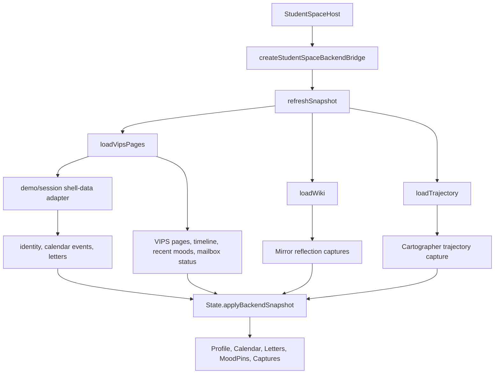
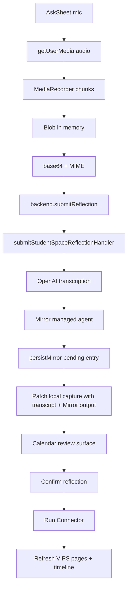

# feat: Complete Student Space demo-data and audio wiring

## Summary

The backend bridge is now the correct integration boundary for durable Mirror, Connector, VIPS, and Cartographer data. This follow-up closed the remaining gaps where the Student Space shell still behaved like a local demo app: browser-only speech recognition, random onboarding identity, seeded profile/calendar/letters, local Kira/reframe heuristics, and local trajectory fallbacks that could look more authoritative than they were.

The follow-up plan `docs/plans/2026-05-18-004-feat-mirror-result-log-forget-plan.md` further refines the capture contract: Student Space now prepares a real Mirror draft first, shows it on the Kira reading screen, and only persists when the student chooses `Log`.

---

## Problem Frame

The product currently has a split personality. VIPS pages, reflection rows, Connector runs, evidence forget, and Cartographer outputs are backend-backed, but several first-screen and shell flows still come from the vendored engine's local fixtures. That makes demos feel full while some visible information is not actually connected to the active demo student or the managed-agent pipeline.

The highest-risk gap is voice: `submitStudentSpaceReflection` already accepts `audioBase64` and calls `transcribeMirrorAudio`, which uses OpenAI speech-to-text, but `AskSheet` still uses `SpeechRecognition` and submits only the browser-produced transcript. The UI therefore does not exercise the real "recorded mirror session -> OpenAI transcript -> Mirror agent" path the product is meant to showcase.

---

## Assumptions

*This plan was authored as a follow-up because the existing backend-bridge plan is already marked completed. The blocking question tool was unavailable in this Codex mode, so the least-destructive choice is a new plan rather than rewriting the completed one.*

- The current manual Connector policy is authoritative: Connector processes confirmed mirror entries when triggered from the shell or scheduled pass. This plan does not revert to the older per-session auto-Connector requirement in the VIPS brainstorm.
- The centralized demo data source for this pass is the existing multi-student seed corpus plus a small typed shell-data adapter. This plan avoids new school-timetable or teacher-letter database tables until the product semantics are real.
- Raw audio should not be persisted to localStorage or Postgres. Retrying a failed post-transcription Mirror/persist chain can reuse the transcript; retrying a failed transcription can only reuse the audio while the current in-memory blob still exists.

---

## Requirements

- R1. Voice capture in the Student Space Ask sheet must record actual audio with `MediaRecorder` and submit `audioBase64` plus `mimeType` to the existing Student Space reflection server function.
- R2. The server-side audio path must use the existing OpenAI transcription helper before running Mirror and persisting the mirror entry. Raw audio remains transient and is not logged or persisted.
- R3. Typed captures continue to submit transcripts directly and skip transcription.
- R4. Failed submissions preserve the local authored content and expose retry where retry is meaningful. Audio blobs may be retried only while they remain in memory.
- R5. The shell's visible identity must come from the server-resolved active student or centralized demo profile, not random `DEMO_STUDENTS` onboarding data.
- R6. Profile/VIPS/trajectory surfaces must not show local seed evidence as if it were backend truth when the backend bridge is active.
- R7. Calendar school events and teacher letters must come from the centralized demo/session snapshot in bridged mode, not `CALENDAR_SEED` and `LETTERS_SEED`.
- R8. The reflections calendar and VIPS page timeline must prefer real backend data, including pending/confirmed/forgotten review status, source links, and evidence forget refresh.
- R9. "Run Connector" must remain visible in the Student Space UI, call the existing Connector agent batch through `runConnector`, and report real processed/succeeded/remaining state after refresh.
- R10. The trajectory sheet must prefer Cartographer output and show an honest empty/run state when no backend trajectory exists, rather than silently minting a local heuristic trajectory in bridged mode.
- R11. Existing developer inspection via `/dev/pipeline` must continue to show the same mirror, Connector, VIPS, and Cartographer data touched by shell actions.

**Origin actors:** Student, Mirror agent, Connector agent, deterministic verifier, Cartographer agent, demo operator.
**Origin flows:** Quiet reflection capture, manual sense-making, VIPS profile maintenance, soft-delete/forget.
**Origin acceptance examples:** Quiet Mirror audio transcription and transcripts-only policy; VIPS page timeline and Trajectory output remain evidence-backed.

---

## Scope Boundaries

- This plan wires existing backend capabilities into the Student Space shell. It does not redesign Mirror, Connector, Cartographer, verifier, tenancy, or managed-agent prompts.
- This plan does not add photo upload, video processing, or camera-frame persistence.
- This plan does not create durable backend storage for standalone mood pins. Existing backend mood pins derived from mirror-entry mood tags still hydrate the shell; standalone MoodSheet pins remain local unless attached to a reflection in a later pass.
- This plan does not create a real school timetable integration or real teacher-letter product. It only removes scattered local dummy sources by deriving demo shell data from one centralized demo/session adapter.
- This plan does not remove legacy React routes. They remain useful references and developer fallbacks until shell parity is fully verified.
- This plan does not add real-time streaming for managed-agent runs inside the engine. Connector and Cartographer can stay request/response with clear working and result states.

### Deferred to Follow-Up Work

- Backend persistence for standalone mood pins, including privacy and retention semantics.
- Product design for teacher/counsellor messages as real writable data, distinct from the current demo letter fiction.
- A richer multi-student demo picker inside the Student Space shell. This pass should align with existing demo auth/session selection rather than invent a picker.
- A capture-time Connector/verifier outcome surface. That is a larger product loop change and should be handled separately if selected from the 2026-05-18 ideation.

---

## Current Wiring Gaps

- **Voice recording:** `src/engine/student-space/Game/View/AskSheet.js` uses `SpeechRecognition` for the main mic and chat mic, then `backend.submitReflection({ transcript })`. It never sends recorded audio to `submitStudentSpaceReflection`, so OpenAI transcription is bypassed.
- **Previous working audio path:** `src/components/MirrorSession.tsx` already has the working pattern: `getUserMedia`, `MediaRecorder`, audio chunks, `blobToBase64`, OpenAI transcription, then Mirror/persist. Student Space should reuse that browser-audio pattern but collapse the server side into `submitStudentSpaceReflection`.
- **Backend audio support already exists:** `src/server/submit-student-space-reflection.handler.server.ts` transcribes with `transcribeMirrorAudio` when `transcript` is absent, and `src/server/transcribe-mirror.handler.server.ts` calls OpenAI `gpt-4o-mini-transcribe`.
- **Profile cold start:** `src/engine/student-space/Game/State/Profile.js` starts from `PROFILE_SEED` and identity `"Alice" / "Sec 3B"`. Backend hydration later replaces facets, but seeded evidence can flash or remain in local-only states.
- **Onboarding identity:** `src/engine/student-space/Game/View/Onboarding/EdupassLogin.js` randomly picks from `DEMO_STUDENTS` and writes local identity, independent of the server active student (`demo-a`, `demo-b`, etc.).
- **Calendar school events:** `src/engine/student-space/Game/State/CalendarEvents.js` loads `CALENDAR_SEED`, whose dates are anchored to the current week and not tied to the active demo student or backend timeline.
- **Teacher letters:** `src/engine/student-space/Game/State/TeacherLetters.js` loads `LETTERS_SEED`; `loadVipsPages` returns `world_mailbox`, but the backend snapshot does not hydrate the engine's letters/mailbox state.
- **Trajectory fallback:** `src/engine/student-space/Game/View/TrajectorySheet.js` prefers backend Cartographer captures when present, but can still create a local heuristic trajectory when none exists. In bridged mode that can read as generated truth.
- **Local Kira readings:** `AskSheet` can show heuristic "Kira's reading" before the Mirror agent runs. The saved capture is patched with Mirror output after backend submit, but the pre-submit reading is not backend agent output.

---

## Context & Research

### Relevant Code and Patterns

- `src/components/StudentSpaceHost.tsx` owns the engine lifecycle and passes `createStudentSpaceBackendBridge()` into the game.
- `src/lib/student-space/backend-bridge.ts` already exposes `refreshSnapshot`, `submitReflection`, `updateReflectionReview`, `runConnector`, `forgetEvidence`, `loadTrajectory`, and `runTrajectory`.
- `src/lib/student-space/backend-snapshot.ts` maps VIPS pages, wiki entries, recent moods, and Cartographer output into engine profile/capture/mood shapes.
- `src/server/submit-student-space-reflection.handler.server.ts` is the correct single backend entrypoint for Student Space captures because it authenticates, optionally transcribes audio, runs Mirror, and persists the mirror entry.
- `src/components/MirrorSession.tsx` is the previous frontend's working audio-capture reference.
- `src/server/transcribe-mirror.handler.server.ts` holds the OpenAI speech-to-text policy, size guard, MIME guard, and no-raw-audio persistence boundary.
- `src/server/run-connector.handler.server.ts` runs the managed Connector over confirmed, unconnected mirror entries.
- `src/server/load-vips-pages.handler.server.ts` returns backend profile, timeline, recent moods, and `world_mailbox`, but only `student_profile` and mood data are currently mapped into Student Space.
- `src/db/seed.ts` and `test/ablation/fixtures/seed-multistudent.json` are the existing centralized multi-student demo corpus.
- `src/engine/student-space/Game/State/CalendarEvents.js`, `TeacherLetters.js`, and `Profile.js` are the key local fixture stores still leaking into the bridged UI.
- `test/server/submit-student-space-reflection.test.ts`, `test/server/transcribe-mirror.test.ts`, `test/components/MirrorSession.test.tsx`, `test/lib/student-space/backend-snapshot.test.ts`, and the existing engine tests are the nearest coverage patterns.

### Institutional Learnings

- `plans/CURRENT_STATE.md` is the live routing source for the current product shape: Student Space is the home shell and durable operations go through named backend bridge methods.
- `docs/plans/2026-05-18-002-feat-student-space-backend-bridge-plan.md` is completed and should not be reworked wholesale.
- The closed VIPS taxonomy lives in `src/data/vips-taxonomy.ts`; this plan must not introduce free-text evidence labels.
- The deterministic verifier in `src/agents/verifier.ts` remains the only path by which Connector-applied evidence becomes VIPS timeline truth.

### External References

- No external research is needed for the OpenAI audio API shape because the repo already contains a working OpenAI transcription handler and browser recording reference.

---

## Key Technical Decisions

- **Extend the backend snapshot, not the engine storage adapter.** The bridge already separates durable domain operations from local UI/cache state. Calendar, letters, identity, profile, reflections, moods, and trajectory should hydrate through a host-owned snapshot rather than through `StorageAdapter`.
- **Use `MediaRecorder` as the voice source of truth.** `SpeechRecognition` can remain an optional live-caption aid, but it must not be the only transcript source for voice captures. The persisted transcript should be the OpenAI transcript returned by the server.
- **Use `submitStudentSpaceReflection` as the single capture submit call.** Student Space does not need to call `transcribeMirror`, `runMirror`, and `persistMirror` separately in the browser. The server handler already composes those steps with server-resolved tenancy.
- **Centralize demo shell data on the backend side.** Engine seed files become offline/no-bridge fallbacks only. In bridged mode, demo identity, calendar events, and letters should come from the same active-student snapshot path as VIPS and reflection data.
- **Prefer honest empty states over local heuristics in bridged mode.** If there is no backend VIPS evidence or no Cartographer output, the shell should say so through the existing sheet state instead of showing `PROFILE_SEED` or `trajectoryFor()` output as durable truth.
- **Keep Connector manual and visible.** The current manual Connector bridge matches `CURRENT_STATE.md` and the existing backend handlers. Improve discoverability and result feedback rather than moving Connector back into Mirror persistence.
- **Keep pre-submit Kira heuristics non-durable.** If the local "Kira's reading" remains, it should be treated as a draft UI aid. The saved capture's durable reading must be patched from the Mirror agent response.

---

## Open Questions

### Resolved During Planning

- Should this update the completed backend-bridge plan in place? No. This is a follow-up plan because the prior plan is marked completed and most of its implementation is already present.
- Should voice use Web Speech because it gives instant captions? No. Web Speech can assist live captions, but real voice capture must record audio and use the OpenAI-backed server transcription path.
- Should Connector run automatically after every new Student Space mirror entry? No. Current code and current-state documentation say persisted entries start pending, students confirm/forget, then Connector processes confirmed entries.
- Should raw audio be stored locally for robust retry after reload? No. That violates the transcripts-only policy. Keep audio in memory only during the active capture attempt.

### Deferred to Implementation

- Exact UI copy and timing for "recorded, transcribing, reflecting, synced" states in the Ask sheet.
- Whether the engine's chat mic should become full audio capture now or remain a dictation convenience until chat itself becomes a durable Mirror surface.
- Exact shape of demo teacher letters and calendar events. The implementation should keep them deterministic and active-student-specific, but the wording can be tuned while building.

---

## High-Level Technical Design

> *This illustrates the intended approach and is directional guidance for review, not implementation specification. The implementing agent should treat it as context, not code to reproduce.*

---

## Implementation Units

### U1. Add a centralized Student Space session snapshot

**Goal:** Give the engine one backend-backed snapshot for identity, VIPS, reflections, moods, trajectory, calendar events, and letters so local seed files stop being the visible source in bridged mode.

**Requirements:** R5, R6, R7, R8, R11

**Dependencies:** None

**Files:**
- Create: `src/lib/student-space/demo-shell-data.server.ts`
- Modify: `src/server/load-vips-pages.handler.server.ts`
- Modify: `src/lib/student-space/backend-snapshot.ts`
- Modify: `src/lib/student-space/backend-bridge.ts`
- Modify: `src/engine/student-space/Game/State/State.js`
- Modify: `src/engine/student-space/Game/State/CalendarEvents.js`
- Modify: `src/engine/student-space/Game/State/TeacherLetters.js`
- Modify: `src/engine/student-space/Game/State/schema.js`
- Test: `test/lib/student-space/backend-snapshot.test.ts`
- Test: `test/server/load-vips-pages-world.test.ts`

**Approach:**
- Create a server-only adapter that resolves the active demo student's shell-facing metadata from the centralized demo corpus and backend state. It should return deterministic identity, calendar events, and letters keyed by the active `studentId`.
- Keep that adapter server-only. Client-side snapshot mappers should consume serialized shell data from `loadVipsPages`; they should not read the seed fixture or import filesystem-backed helpers.
- Extend `LoadVipsPagesResult` with shell data rather than adding another client call. The snapshot already loads VIPS pages and world mailbox status; this keeps the first hydration coherent.
- Extend `StudentSpaceBackendSnapshot` to include `calendarEvents` and `teacherLetters`, plus any mailbox summary needed by the engine.
- Add backend hydration methods to `CalendarEvents` and `TeacherLetters` that replace the bridged data set, not union with the local seeds. Local `hydrate()` can keep its current seed-preserving behavior for offline/no-bridge mode.
- Update `State.applyBackendSnapshot` to hydrate calendar and letters in the same pass as profile, captures, and moods.
- Keep `CALENDAR_SEED` and `LETTERS_SEED` as no-backend fallbacks, but make bridged mode authoritative even when the backend returns an empty array.

**Execution note:** Build mapper tests first. They should prove that `demo-a` and at least one other demo student produce different identity/shell data without booting the Three.js engine.

**Patterns to follow:**
- `src/lib/student-space/backend-snapshot.ts`
- `src/server/load-vips-pages.handler.server.ts`
- `src/db/seed.ts`
- `test/ablation/fixtures/seed-multistudent.json`

**Test scenarios:**
- Happy path: active demo student profile maps into `snapshot.profile.identity` and the same name/class appears in shell data.
- Happy path: demo calendar events are deterministic for a given `studentId` and do not use current-week `CALENDAR_SEED` dates.
- Happy path: teacher letters are deterministic for a given `studentId` and replace `LETTERS_SEED` during backend hydration.
- Edge case: non-demo WorkOS/private student returns empty shell data without throwing and without showing demo-a content.
- Integration: `State.applyBackendSnapshot` updates profile, captures, mood pins, calendar events, and letters in one pass.

**Verification:**
- Opening the shell after backend hydration shows the active student's identity and demo/session data from the backend snapshot, not local engine seed rows.

---

### U2. Align onboarding and demo login with server identity

**Goal:** Stop the Student Space onboarding ceremony from randomly assigning a local student identity that disagrees with the server-resolved active student.

**Requirements:** R5, R11

**Dependencies:** U1

**Files:**
- Modify: `src/components/StudentSpaceHost.tsx`
- Modify: `src/lib/student-space/backend-bridge.ts`
- Modify: `src/engine/student-space/Game/View/Onboarding/EdupassLogin.js`
- Modify: `src/engine/student-space/Game/View/Onboarding/copy.js`
- Modify: `src/engine/student-space/Game/State/Profile.js`
- Test: `test/engine/StudentSpaceHost.test.tsx`
- Test: `test/engine/student-space-onboarding.test.ts`

**Approach:**
- Pass a small auth/session capability through the host-owned bridge, rather than importing app auth helpers inside engine view files.
- When the backend bridge is present, the Edupass demo button should route through the existing demo sign-in path or host callback instead of picking a random local `DEMO_STUDENTS` entry.
- After snapshot hydration, backend identity should update profile identity fields without overwriting local companion fields such as companion species/name.
- Remove or quarantine the random `DEMO_STUDENTS` list so it cannot silently diverge from `src/auth/demo.ts` and the seed corpus. If keeping it for no-backend mode, name it explicitly as offline fixture data.
- Make onboarding completion local-only, but identity server-backed.

**Execution note:** Characterize the current onboarding path before changing it, because engine onboarding state lives in localStorage and can be surprisingly sticky across reloads.

**Patterns to follow:**
- `src/auth/demo.ts`
- `src/components/ProfileSheetChrome.tsx`
- `src/lib/sign-out-engine.ts`

**Test scenarios:**
- Happy path: with backend bridge present, clicking demo login invokes the host/demo-auth path and does not randomly call `Profile.setIdentity`.
- Happy path: backend identity hydration sets profile name/class while preserving companion fields.
- Edge case: no backend bridge keeps a harmless offline/demo identity flow for local engine-only testing.
- Error path: demo sign-in callback failure leaves onboarding on the login step with a retryable state.

**Verification:**
- Demo login, profile sheet identity, VIPS page identity, and `/dev/pipeline` active student agree on the same demo student.

---

### U3. Replace Ask voice dictation with recorded audio submission

**Goal:** Make Student Space voice captures become recorded mirror sessions processed by OpenAI transcription and the Mirror managed agent.

**Requirements:** R1, R2, R3, R4, R8

**Dependencies:** None

**Files:**
- Create: `src/lib/student-space/audio-capture.ts`
- Modify: `src/engine/student-space/Game/View/AskSheet.js`
- Modify: `src/engine/student-space/Game/State/schema.js`
- Modify: `src/lib/student-space/backend-bridge.ts`
- Test: `test/engine/student-space-ask-audio.test.ts`
- Test: `test/lib/student-space/backend-bridge.test.ts`
- Test: `test/server/submit-student-space-reflection.test.ts`

**Approach:**
- Extract the browser-safe recording utilities from the previous React flow into a small reusable helper: MIME selection, `getUserMedia({audio:true})`, `MediaRecorder` chunk collection, stop cleanup, and blob-to-base64 conversion.
- In `AskSheet`, use `MediaRecorder` for the mic button. Keep `SpeechRecognition` only as optional live captions when available; do not trust its text as the durable transcript for voice captures.
- On Stop, hold the audio blob in `AskSheet` instance memory and render a review state that can show live-caption text if available. On Log, submit audio to `backend.submitReflection({ audioBase64, mimeType })`.
- For typed captures or edited transcript captures, continue submitting `transcript`.
- Create or update the local capture before the async backend submission starts so transcription/Mirror/persistence failures have a visible failed row to retry from.
- Patch the local capture with the server-returned transcript, backend mirror entry id, review status, and Mirror output. If local live captions differ from OpenAI output, the server transcript wins.
- Do not add audio fields to persisted capture schema. If an in-flight audio submission fails before transcription, retry can use the in-memory blob while the sheet remains mounted; after close/reload, the user should re-record or type.
- Preserve the existing sync states (`syncing`, `synced`, `failed`) and make failed voice captures visible in the day detail retry flow.

**Execution note:** Start from the current `MirrorSession` test pattern, but the Student Space path should call only `submitStudentSpaceReflection`, not the three older server functions separately.

**Patterns to follow:**
- `src/components/MirrorSession.tsx`
- `test/components/MirrorSession.test.tsx`
- `src/server/submit-student-space-reflection.handler.server.ts`
- `src/server/transcribe-mirror.handler.server.ts`

**Test scenarios:**
- Happy path: clicking mic requests `{ audio: true }`, starts `MediaRecorder`, and never requests video.
- Happy path: stopping and logging a voice capture calls `backend.submitReflection` with `audioBase64` and `mimeType`, not a browser transcript.
- Happy path: server transcript and Mirror output patch the local capture after success.
- Happy path: typed capture still submits `transcript` and skips `audioBase64`.
- Edge case: `MediaRecorder` unavailable hides or disables voice recording while typed capture still works.
- Error path: mic permission denied returns to compose with the typed fallback available.
- Error path: transcription failure marks the local capture failed without persisting raw audio.
- Integration: a voice capture submitted from the shell appears as a pending mirror entry in the reflections calendar after snapshot refresh.

**Verification:**
- A recorded voice capture creates a durable pending mirror entry whose transcript came from the OpenAI-backed server path.

---

### U4. Make Connector control statusful and tied to confirmed reflections

**Goal:** Keep "Run Connector" visible in the shell and make it clear that it runs the real Connector agents over confirmed reflections.

**Requirements:** R8, R9, R11

**Dependencies:** U1, U3

**Files:**
- Modify: `src/lib/student-space/backend-bridge.ts`
- Modify: `src/lib/student-space/backend-snapshot.ts`
- Modify: `src/engine/student-space/Game/View/CalendarSheet.js`
- Modify: `src/engine/student-space/Game/View/DayDetailCard.js`
- Modify: `src/server/load-wiki.handler.server.ts`
- Test: `test/engine/student-space-calendar.test.ts`
- Test: `test/lib/student-space/backend-bridge.test.ts`
- Test: `test/server/run-connector.test.ts`

**Approach:**
- Preserve the existing Calendar header button, but wire it to show real `runConnector` result fields: processed, succeeded, failed, remaining, and nothing-to-run.
- Disable or annotate the action when there are no confirmed unconnected entries. This can be computed from backend snapshot data or a lightweight summary from `loadWiki`.
- After `runConnector`, refresh the full backend snapshot and re-render the calendar/profile/trajectory surfaces.
- Keep pending raw reflections reviewable in `DayDetailCard`; Connector should only process entries after `updateReflectionReview({status:'confirmed'})`.
- Avoid adding a fake "Connector running" row to local state. Use button state for in-flight status and `/dev/pipeline` for inspection.

**Patterns to follow:**
- `src/server/run-connector.handler.server.ts`
- `test/server/run-connector.test.ts`
- `src/routes/dev.pipeline.tsx`

**Test scenarios:**
- Happy path: with a confirmed unconnected mirror entry, pressing Run Connector calls `backend.runConnector`, refreshes snapshot, and updates UI status with processed/succeeded counts.
- Happy path: with only pending reflections, Run Connector reports nothing to run and does not mutate VIPS pages.
- Edge case: partial Connector failure shows failed count and leaves previous profile data visible.
- Integration: confirming a pending reflection, then running Connector, yields committed VIPS timeline entries visible in profile after refresh.

**Verification:**
- The shell and `/dev/pipeline` agree on which mirror entries were processed and which VIPS timeline entries were committed.

---

### U5. Remove misleading backend-mode local fallbacks

**Goal:** Ensure VIPS pages, timelines, calendar, and trajectory surfaces show real backend data or honest empty states when the backend bridge is active.

**Requirements:** R6, R8, R10, R11

**Dependencies:** U1, U4

**Files:**
- Modify: `src/engine/student-space/Game/State/Profile.js`
- Modify: `src/engine/student-space/Game/State/Captures.js`
- Modify: `src/engine/student-space/Game/View/ProfileSheet.js`
- Modify: `src/engine/student-space/Game/View/CalendarSheet.js`
- Modify: `src/engine/student-space/Game/View/TrajectorySheet.js`
- Modify: `src/components/StudentSpaceHost.tsx`
- Test: `test/engine/student-space-profile.test.ts`
- Test: `test/engine/student-space-calendar.test.ts`
- Test: `test/engine/student-space-trajectory.test.ts`

**Approach:**
- Add an explicit backend-active marker to the engine state once `StudentSpaceHost` passes a bridge or applies a snapshot. Views can use that marker to prefer empty/loading states instead of local seed/heuristic fallbacks.
- Profile should not render `PROFILE_SEED` evidence after backend snapshot application. Empty backend facets should be empty, not repopulated by seeds.
- Calendar should default to the month with the latest backend reflection/event when useful, instead of always current month plus current-week dummy events. Keep Today navigation available.
- Trajectory should stop auto-creating a local `trajectoryFor()` capture in backend-active mode. If no `backendCartographerOutputId` exists, show an empty/run state and let "Run sense-making" call `backend.runTrajectory`.
- Source-reflection links from profile evidence should continue to open backend-mapped mirror captures when available.
- Local heuristic Kira/reframe data can stay on local draft captures, but profile and trajectory should not treat it as verified backend evidence.

**Execution note:** This unit should include before/after characterization for empty backend data. The highest regression risk is making a real empty student look broken rather than honestly empty.

**Patterns to follow:**
- `src/lib/student-space/backend-snapshot.ts`
- `src/engine/student-space/Game/View/ProfileSheet.js`
- `src/engine/student-space/Game/View/TrajectorySheet.js`

**Test scenarios:**
- Happy path: backend profile with timeline entries renders quotes and source reflection links.
- Edge case: backend profile with empty pages renders empty VIPS state without `PROFILE_SEED` quotes.
- Happy path: backend Cartographer output renders and is preferred over local heuristic captures.
- Edge case: no backend Cartographer output renders a run/empty state and does not add a local trajectory capture in backend-active mode.
- Edge case: calendar opens to the latest backend activity month when current month has no backend data.
- Error path: backend snapshot hydration failure leaves local fallback usable but does not mark the state backend-active.

**Verification:**
- In bridged mode, visible VIPS evidence and trajectory content can be traced to backend rows or explicit empty states.

---

### U6. Keep tests and current-state docs aligned with the completed wiring

**Goal:** Make the remaining bridge behavior hard to regress and update the current-state docs so future work starts from the new truth.

**Requirements:** R1-R11

**Dependencies:** U1-U5

**Files:**
- Modify: `plans/CURRENT_STATE.md`
- Modify: `docs/plans/2026-05-18-002-feat-student-space-backend-bridge-plan.md`
- Modify: `docs/followups.md`
- Test: `test/engine/StudentSpaceHost.test.tsx`
- Test: `test/server/submit-student-space-reflection.test.ts`
- Test: `test/server/transcribe-mirror.test.ts`
- Test: `test/routes/dev.pipeline.test.tsx`

**Approach:**
- Update `plans/CURRENT_STATE.md` after implementation to say voice recordings now use `MediaRecorder -> submitStudentSpaceReflection -> OpenAI transcription -> Mirror`.
- Add a note to the completed backend-bridge plan that this follow-up closed the remaining demo-data/audio gaps.
- Move any obsolete follow-up notes out of `docs/followups.md` if implementation resolves them; do not add broad future ideas unless they are concrete and actionable.
- Preserve coverage for the server audio path, the bridge audio payload path, the engine audio capture path, snapshot mapping, Connector button behavior, and `/dev/pipeline` visibility.

**Patterns to follow:**
- `plans/CURRENT_STATE.md`
- `test/components/MirrorSession.test.tsx`
- `test/server/submit-student-space-reflection.test.ts`
- `test/routes/dev.pipeline.test.tsx`

**Test scenarios:**
- Integration: recorded Ask capture persists a pending mirror entry and appears in `/dev/pipeline`.
- Integration: confirm reflection, run Connector from the shell, and see committed VIPS evidence after refresh.
- Integration: run Cartographer from the shell and see backend trajectory output after refresh.
- Regression: no engine seed profile/calendar/letters appear after a successful backend snapshot says the active student has empty data.
- Regression: `/dev/pipeline` still stays dev-only and renders active-student backend data.

**Verification:**
- The standard check/test/build set passes, and a browser walkthrough proves the three user expectations: voice recordings become Mirror sessions, Run Connector executes Connector agents, and VIPS pages/timeline show real data.

---

## System-Wide Impact

- **Interaction graph:** `StudentSpaceHost` remains the integration owner. It refreshes backend state, applies it to engine stores, and passes named operations to views.
- **Error propagation:** Voice transcription, Mirror, persistence, Connector, and Cartographer failures should stay display-safe in the shell. Existing backend rows should remain visible until a successful refresh replaces them.
- **State lifecycle risks:** Raw audio must live only in memory. Backend snapshots should replace bridged stores without writing backend data back into local authored persistence.
- **API surface parity:** Legacy React routes and the Student Space shell should agree on mirror review status, VIPS evidence, and latest trajectory output.
- **Integration coverage:** Unit tests need mappers and handlers, but final confidence requires the full UI-to-backend loop: record voice, persist Mirror, confirm, run Connector, inspect VIPS, run Cartographer.
- **Unchanged invariants:** Student identity remains server-resolved, not client-supplied. Connector verifier remains the only path applying VIPS evidence. Photo/video frames remain out of backend scope.

---

## Risks & Dependencies

| Risk | Mitigation |
|------|------------|
| Audio uploads are too large or unsupported | Reuse `transcribeMirrorAudio` MIME and size validation; surface failures in AskSheet without losing typed text. |
| Raw audio accidentally lands in localStorage | Do not add audio fields to capture schema; keep blobs in `AskSheet` instance memory only; add regression tests around persisted capture shape. |
| Browser support differs between Chrome and Safari | Use `MediaRecorder.isTypeSupported` negotiation from the previous `MirrorSession` path and typed fallback when recording is unavailable. |
| Central demo adapter imports test fixture into client bundles | Keep fixture reading server-only and expose only snapshot data through server functions. |
| Empty backend state feels broken after seed fallback removal | Design explicit empty states and test empty backend snapshots. |
| Connector button runs but gives no visible feedback | Surface the real `RunConnectorResult` summary and refresh dependent stores after completion. |
| Historical docs imply per-session auto-Connector | Anchor implementation to `plans/CURRENT_STATE.md` and current handlers; document the manual confirmed-entry policy. |

---

## Documentation / Operational Notes

- Keep `/dev/pipeline` as the verification companion during implementation. It is the clearest way to prove shell actions reached durable backend rows.
- Update `plans/CURRENT_STATE.md` only after behavior is implemented and verified.
- Avoid logging raw `audioBase64`, Blob sizes beyond coarse diagnostics, or transcript content in client console warnings.

---

## Sources & References

- **Origin document:** [docs/brainstorms/2026-05-08-quiet-mirror-pivot-requirements.md](../brainstorms/2026-05-08-quiet-mirror-pivot-requirements.md)
- Related requirements: [docs/brainstorms/2026-05-11-vips-wiki-pivot-requirements.md](../brainstorms/2026-05-11-vips-wiki-pivot-requirements.md)
- Completed bridge plan: [docs/plans/2026-05-18-002-feat-student-space-backend-bridge-plan.md](2026-05-18-002-feat-student-space-backend-bridge-plan.md)
- Current state: [plans/CURRENT_STATE.md](../../plans/CURRENT_STATE.md)
- Host bridge: [src/components/StudentSpaceHost.tsx](../../src/components/StudentSpaceHost.tsx)
- Backend bridge: [src/lib/student-space/backend-bridge.ts](../../src/lib/student-space/backend-bridge.ts)
- Backend snapshot mapper: [src/lib/student-space/backend-snapshot.ts](../../src/lib/student-space/backend-snapshot.ts)
- Ask sheet: [src/engine/student-space/Game/View/AskSheet.js](../../src/engine/student-space/Game/View/AskSheet.js)
- Previous audio capture path: [src/components/MirrorSession.tsx](../../src/components/MirrorSession.tsx)
- Student Space reflection submit handler: [src/server/submit-student-space-reflection.handler.server.ts](../../src/server/submit-student-space-reflection.handler.server.ts)
- OpenAI transcription helper: [src/server/transcribe-mirror.handler.server.ts](../../src/server/transcribe-mirror.handler.server.ts)
- Connector runner: [src/server/run-connector.handler.server.ts](../../src/server/run-connector.handler.server.ts)
- Demo seed corpus: [test/ablation/fixtures/seed-multistudent.json](../../test/ablation/fixtures/seed-multistudent.json)
