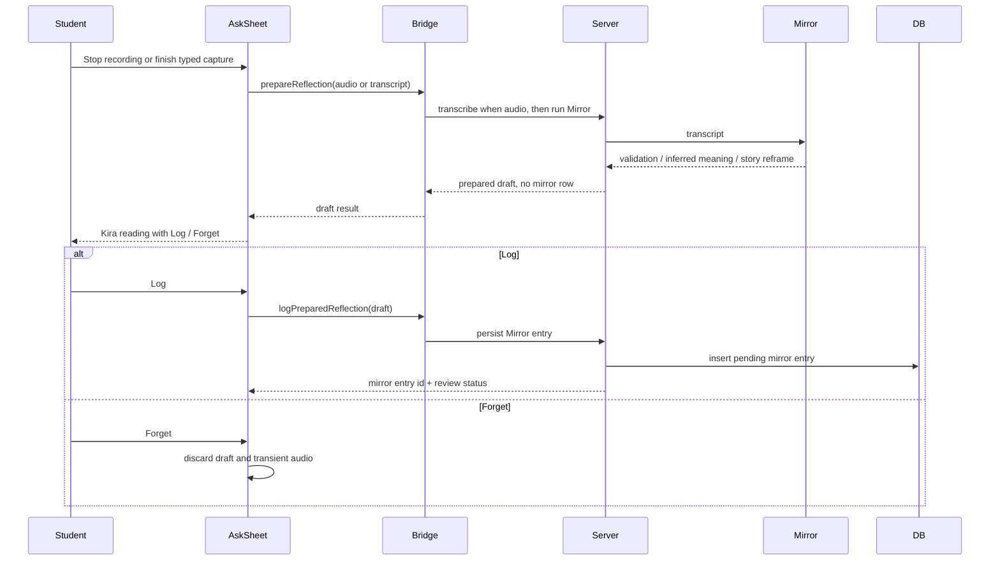
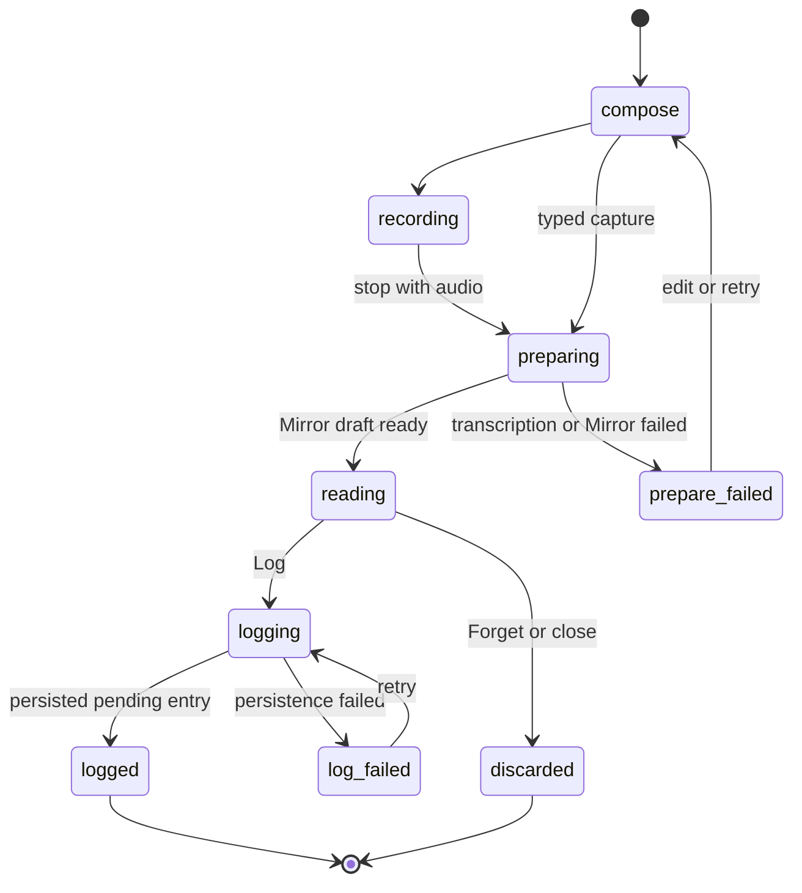

# feat: Make Kira reading a Mirror result decision

## Summary

The Student Space Ask flow should turn the Kira reading screen into the student's decision point over real Mirror output. After a voice or typed reflection is captured, the app should transcribe when needed, run the Mirror agent, render the returned `validation / inferred_meaning / story_reframe`, and offer only `Log` or `Forget` on that reading screen.

`Log` keeps and persists the Mirror result as a pending reflection. `Forget` discards the draft without adding it to the durable corpus.

---

## Problem Frame

The current Kira reading screen looks like a Mirror-agent result, but it is still generated by the local `reframeFor(...)` heuristic before the backend Mirror pipeline runs. The real backend submit path only happens after `Log`, which means the student is deciding based on a local approximation while the durable Mirror output appears later in saved state.

That is backwards for the quiet-mirror ritual. The student should read what Mirror actually produced, then decide whether to keep it.

---

## Requirements

- R1. The live Kira reading screen must render backend Mirror output, not the local `reframeFor(...)` heuristic, when the backend bridge is active.
- R2. Voice captures must continue to use `MediaRecorder` audio and the existing OpenAI transcription helper before Mirror runs.
- R3. Typed captures must skip transcription and run Mirror directly against the typed transcript.
- R4. The Kira reading screen must offer `Log` and `Forget` as the primary decision actions. `Edit` and `Talk more` are not part of the backend-backed reading decision screen.
- R5. `Log` must persist the reviewed Mirror draft as a pending mirror entry using the existing Mirror persistence path, then refresh or patch local shell state so the reflection appears in review/calendar surfaces.
- R6. `Forget` must not create a mirror entry, Connector work, VIPS timeline evidence, or local persisted capture when the draft has not been logged.
- R7. If persistence has already happened because of an execution-time fallback, `Forget` must mark the created mirror entry as `forgotten` immediately rather than leaving a pending row.
- R8. Failure states must be explicit: transcription/Mirror failures return the student to retry or edit without losing the local transcript; Log persistence failures preserve a retryable local capture.
- R9. Existing backend review policy remains unchanged: logged reflections start as pending, students confirm/forget them later, and Connector only processes confirmed entries.
- R10. Offline/no-bridge Student Space mode may keep using local heuristics, but bridged mode must clearly distinguish backend Mirror output from any local fallback.

**Origin actors:** Student, Mirror agent, Connector agent, demo operator.
**Origin flows:** Quiet reflection capture, manual sense-making.
**Origin acceptance examples:** Mirror sessions produce editable `validation / inferred_meaning / story_reframe`; audio is transcribed through the server; Connector stays manual and corpus-grounded.

---

## Scope Boundaries

- This plan changes the Student Space Ask/Kira reading decision flow. It does not redesign Mirror prompts, Connector, Cartographer, VIPS taxonomy, verifier behavior, or managed-agent configuration.
- This plan does not add chat/Talk-more persistence. The current `Talk more` surface is deferred because it is not the requested `Log` / `Forget` decision.
- This plan does not persist raw audio. Audio remains in memory only long enough to transcribe and prepare the Mirror draft.
- This plan does not auto-confirm logged reflections. They still enter the existing pending review flow.
- This plan does not change the legacy React `MirrorSession` route unless needed for shared helper extraction or tests.

### Deferred to Follow-Up Work

- A durable Kira conversation flow after Mirror reading, if the product decides `Talk more` should become a real logged surface.
- Editing Mirror fields on the Kira reading page before `Log`. The existing editable mirror-entry surfaces can still handle edits after persistence.
- Live step visualization for the transcription and Mirror preparation chain inside Student Space. This pass can use a clear working state without streaming agent steps.

---

## Context & Research

### Relevant Code and Patterns

- `src/engine/student-space/Game/View/AskSheet.js` currently creates the Kira reading with `reframeFor(text)` in `_goReframe()`, then persists through `_commitCapture()` and `backend.submitReflection()` only after `Log`.
- `src/lib/student-space/backend-bridge.ts` currently exposes `submitReflection`, which calls `submitStudentSpaceReflection` and receives the persisted mirror entry.
- `src/server/submit-student-space-reflection.handler.server.ts` already composes transcription, Mirror, and persistence in one call. That remains useful for compatibility but is too late for a pre-Log decision screen.
- `src/components/MirrorSession.tsx` demonstrates the splitable backend pattern: `transcribeMirror`, then `runMirror`, then `persistMirror`.
- `src/server/transcribe-mirror.handler.server.ts` owns the OpenAI transcription policy, MIME guard, and no-raw-audio boundary.
- `src/server/run-mirror.handler.server.ts` owns the managed Mirror call and self-critique review.
- `src/server/persist-mirror.handler.server.ts` owns diagnostic-language gating, mirror row insertion, mood tags, and student-voice memory append.
- `src/server/update-mirror-review.handler.server.ts` is the existing path for marking an already-persisted mirror row `confirmed` or `forgotten`.
- `test/engine/student-space-ask-audio.test.ts`, `test/lib/student-space/backend-bridge.test.ts`, `test/server/submit-student-space-reflection.test.ts`, `test/server/persist-mirror.test.ts`, and `test/server/transcribe-mirror.test.ts` are the nearest coverage patterns.

### Institutional Learnings

- `plans/CURRENT_STATE.md` says Student Space is now the home shell and durable operations go through named backend bridge methods.
- The completed backend-bridge and demo-data/audio plans established that the engine `StorageAdapter` is local UI/cache only; durable Mirror/VIPS/Cartographer behavior belongs behind server functions and bridge methods.
- Current product policy is manual Connector over confirmed reflections only. This plan preserves that policy.

### External References

- No external research is needed. The repo already contains working browser audio capture, OpenAI transcription, Mirror run, and Mirror persistence patterns.

---

## Key Technical Decisions

- **Split Mirror preparation from persistence for Student Space.** The reading screen needs real Mirror output before `Log`, so the bridge needs a prepare step that transcribes/runs Mirror without inserting a mirror row.
- **Keep `Log` as the first durable write.** Draft-first behavior makes `Forget` honest: nothing enters the corpus unless the student keeps it.
- **Use existing server primitives instead of duplicating agent logic.** The implementation should compose or wrap `transcribeMirror`, `runMirror`, and `persistMirror` so transcription policy, tenancy, safety review, persistence gates, and memory append stay in their current owners.
- **Treat the local heuristic as offline-only in bridged mode.** `reframeFor(...)` can remain a no-backend fallback, but it should not label itself as the backend Kira/Mirror reading when `backend.prepareReflection` is available.
- **Preserve pending-review semantics.** A logged Mirror result should create a pending mirror entry; later review and Connector behavior remain unchanged.
- **Make close behavior explicit.** Closing the Kira reading screen before `Log` should behave like discarding the draft, not silently persisting. If the UI keeps the `x`, it should not create durable data.

---

## Open Questions

### Resolved During Planning

- Should the reading screen show local Kira heuristics or real Mirror output? Real Mirror output in bridged mode.
- Should the options be `Edit`, `Talk more`, and `Log`? No. The requested backend-backed decision screen offers `Log` and `Forget`.
- Should Connector run after `Log`? No. Logged reflections remain pending; Connector processes confirmed entries through the existing manual path.
- Should raw audio be stored so `Forget` can be undone later? No. Raw audio remains transient.

### Deferred to Implementation

- Exact loading copy while transcription and Mirror preparation are in flight.
- Whether typed transcript editing remains available before Mirror preparation or only by restarting the capture.
- Whether to keep the local `x` close button visually distinct from `Forget` or route it to the same discard path.

---

## High-Level Technical Design

> *This illustrates the intended approach and is directional guidance for review, not implementation specification. The implementing agent should treat it as context, not code to reproduce.*

---

## Implementation Units

### U1. Add a prepare-before-persist backend bridge path

**Goal:** Let Student Space ask the backend for a Mirror draft without creating a durable mirror entry yet.

**Requirements:** R1, R2, R3, R5, R6, R8

**Dependencies:** None

**Files:**
- Create: `src/server/prepare-student-space-reflection.functions.ts`
- Create: `src/server/prepare-student-space-reflection.handler.server.ts`
- Modify: `src/server/mirror-function-schemas.ts`
- Modify: `src/lib/student-space/backend-bridge.ts`
- Test: `test/server/prepare-student-space-reflection.test.ts`
- Test: `test/lib/student-space/backend-bridge.test.ts`

**Approach:**
- Add a prepare handler that accepts the same capture inputs Student Space already has: `localCaptureId`, typed `transcript` or `audioBase64` plus `mimeType`, optional `context_type`, and optional mood.
- Reuse the existing transcription and Mirror-run server helpers. When `transcript` is absent, transcribe audio first; when `transcript` is present, skip transcription.
- Return a prepared draft shape containing the local capture id, transcript, Mirror output fields, eval review, context type, mood, and transcription metadata needed for UI/debugging. Do not call `persistMirrorForStudent` in this prepare handler.
- Extend the backend bridge with `prepareReflection` and `logPreparedReflection` methods. `logPreparedReflection` can use the existing `persistMirror` server function so persistence safety gates and memory append remain centralized.
- Keep the existing `submitReflection` bridge method for compatibility or fallback until all Student Space call sites are migrated.

**Execution note:** Implement the server handler test-first. The core contract is "Mirror result returned, no persistence call."

**Patterns to follow:**
- `src/server/submit-student-space-reflection.handler.server.ts`
- `src/server/transcribe-mirror.handler.server.ts`
- `src/server/run-mirror.handler.server.ts`
- `src/server/persist-mirror.handler.server.ts`
- `src/components/MirrorSession.tsx`

**Test scenarios:**
- Happy path: typed transcript calls Mirror, returns draft output, and does not call persistence.
- Happy path: audio payload calls transcription, then Mirror with the returned transcript, and does not call persistence.
- Edge case: empty transcription result returns a clear prepare error before Mirror runs.
- Error path: unsupported MIME is rejected by the existing transcription validation and no Mirror/persist work runs.
- Integration: `backendBridge.prepareReflection` forwards typed and audio payloads without adding a persisted mirror row.
- Integration: `backendBridge.logPreparedReflection` persists a prepared draft once and maps the returned row to `StudentSpaceMirrorEntrySummary`.

**Verification:**
- A prepared Mirror result can be rendered by the client without creating a mirror entry; a later Log call creates exactly one pending mirror entry.

---

### U2. Convert AskSheet into a Mirror-result decision screen

**Goal:** Replace the bridged-mode local Kira heuristic with a backend Mirror preparation state and a `Log` / `Forget` decision screen.

**Requirements:** R1, R2, R3, R4, R6, R8, R10

**Dependencies:** U1

**Files:**
- Modify: `src/engine/student-space/Game/View/AskSheet.js`
- Modify: `src/engine/student-space/style.css`
- Test: `test/engine/student-space-ask-audio.test.ts`

**Approach:**
- Change the bridged Ask flow so Stop/continue from review enters a preparing state that calls `backend.prepareReflection`.
- Render the Kira reading from the prepared draft: quote/transcript from the returned transcript, prose from `storyReframe`, and supporting meaning from `validation` and `inferredMeaning`.
- Replace `Edit`, `Talk more`, and the old `Log` row on the backend-backed reading screen with `Forget` and `Log`. The local/offline fallback may keep the old heuristic path if no backend bridge exists.
- Disable or guard duplicate actions while prepare/log operations are in flight.
- Route `Forget` and close-before-log through the same discard path: clear transient audio/draft state, do not call persistence, and close or return to compose without adding a capture.
- Make prepare failures visible and recoverable. The student should be able to retry preparation or return to edit/re-record without losing the current transcript while the sheet is open.

**Execution note:** Add characterization for the current audio path first, then update it so the test proves Mirror preparation happens before any persistence/log action.

**Patterns to follow:**
- `src/engine/student-space/Game/View/AskSheet.js`
- `src/lib/student-space/audio-capture.ts`
- `test/engine/student-space-ask-audio.test.ts`

**Test scenarios:**
- Happy path: voice recording stops, `prepareReflection` receives `audioBase64` and `mimeType`, and the Kira reading displays the returned Mirror story reframe.
- Happy path: typed reflection calls `prepareReflection` with `transcript` and skips audio fields.
- Happy path: after draft render, clicking `Log` calls `logPreparedReflection` and then creates or patches a local capture with backend mirror id and `reviewStatus: pending`.
- Happy path: after draft render, clicking `Forget` closes/discards without calling `logPreparedReflection` and without adding a capture.
- Edge case: double-clicking `Log` does not create duplicate mirror entries.
- Edge case: closing with the `x` before logging does not persist anything.
- Error path: prepare failure shows retry/edit affordance and keeps the draft transcript/audio blob available in memory when possible.
- Error path: log persistence failure creates or preserves a retryable failed local capture instead of losing the student text.

**Verification:**
- In bridged mode, the screenshot-equivalent Kira reading screen cannot be produced by `reframeFor(...)`; it is rendered from the prepared backend Mirror draft and has only `Log` / `Forget` decision actions.

---

### U3. Preserve capture, review, and Connector semantics after Log or Forget

**Goal:** Make the downstream shell behavior match the student's decision: logged drafts become pending reflections; forgotten drafts leave no corpus evidence.

**Requirements:** R5, R6, R7, R9

**Dependencies:** U1, U2

**Files:**
- Modify: `src/engine/student-space/Game/State/Captures.js`
- Modify: `src/engine/student-space/Game/View/CalendarSheet.js`
- Modify: `src/engine/student-space/Game/View/DayDetailCard.js`
- Modify: `src/lib/student-space/backend-snapshot.ts`
- Test: `test/engine/student-space-calendar.test.ts`
- Test: `test/lib/student-space/backend-snapshot.test.ts`

**Approach:**
- Ensure `Log` creates a local optimistic capture only at the moment the student chooses to keep the draft. Before that, the prepared Mirror result should live in AskSheet state, not in persisted captures.
- When `logPreparedReflection` succeeds, patch the capture with `backendMirrorEntryId`, server transcript, Mirror fields, review status, and context type.
- When `Forget` happens before Log, clear the prepared draft and audio state only. It should not appear in the calendar, review queue, backend snapshot, or Connector candidate set.
- If implementation discovers a path where a row was already persisted before the student hits `Forget`, call `updateReflectionReview({ status: 'forgotten' })` and refresh the backend snapshot. This is a fallback, not the preferred path.
- Keep pending-review UI behavior unchanged: logged entries are still pending until confirmed from calendar/day detail or existing review surfaces.

**Patterns to follow:**
- `src/engine/student-space/Game/State/Captures.js`
- `src/engine/student-space/Game/View/CalendarSheet.js`
- `src/engine/student-space/Game/View/DayDetailCard.js`
- `src/lib/student-space/backend-snapshot.ts`

**Test scenarios:**
- Happy path: logged draft appears in calendar/day detail as a pending backend-backed reflection.
- Happy path: forgotten draft does not appear in captures or calendar after the Ask sheet closes.
- Integration: confirmed logged reflection remains eligible for the existing manual Connector flow; unlogged forgotten draft is never included.
- Error path: if a persisted mirror id exists when Forget is invoked, `updateReflectionReview` is called with `forgotten` and local state reflects that status after refresh.
- Regression: existing confirm/forget review actions for already logged pending reflections still work from day detail.

**Verification:**
- The reflection corpus changes only after `Log`, and Connector counts remain based on confirmed persisted mirror entries only.

---

### U4. Update docs and regression coverage for the new decision contract

**Goal:** Make the new interaction contract discoverable and protect it against future regression back to local readings.

**Requirements:** R1, R4, R5, R6, R9, R10

**Dependencies:** U1, U2, U3

**Files:**
- Modify: `plans/CURRENT_STATE.md`
- Modify: `docs/plans/2026-05-18-003-feat-student-space-demo-data-audio-plan.md`
- Test: `test/engine/student-space-ask-audio.test.ts`
- Test: `test/lib/student-space/backend-bridge.test.ts`
- Test: `test/server/prepare-student-space-reflection.test.ts`

**Approach:**
- Update current-state documentation to say the Ask flow prepares a Mirror draft first, then lets the student `Log` or `Forget`.
- Mark the older audio plan as superseded or extended by this follow-up where it said backend submit happens on Log.
- Add tests that assert the bridged Kira reading does not call the local heuristic path before rendering backend Mirror output.
- Keep the test naming focused on user-visible behavior: "shows Mirror result before Log" and "Forget does not persist."

**Patterns to follow:**
- `plans/CURRENT_STATE.md`
- `docs/plans/2026-05-18-003-feat-student-space-demo-data-audio-plan.md`

**Test scenarios:**
- Regression: a bridged AskSheet render of the reading screen uses prepared backend output and not local `reframeFor(...)` copy.
- Regression: `Log` remains the only durable write on the happy path.
- Regression: `Forget` before Log makes no backend persist/update calls.
- Documentation: current-state doc matches the implemented flow.

**Verification:**
- Future readers can understand that the Kira reading screen is a real Mirror-result decision point, and tests fail if the screen drifts back to local dummy output.

---

## System-Wide Impact

- **Interaction graph:** AskSheet gains a prepare stage before the existing persistence/review/calendar chain. Backend bridge gets new draft-oriented methods while the old submit method can remain for compatibility.
- **Error propagation:** Transcription and Mirror failures are prepare failures; persistence and memory append failures are Log failures. The UI should distinguish those states because recovery differs.
- **State lifecycle risks:** Prepared drafts are intentionally ephemeral. They must not leak into `Captures`, localStorage, Connector candidates, or VIPS timelines until `Log`.
- **API surface parity:** Legacy MirrorSession can continue using its current split chain; Student Space should use the new bridge wrapper so engine views do not import server functions directly.
- **Integration coverage:** Unit tests must prove the no-persist-before-Log contract because that is not visible from server handler tests alone.
- **Unchanged invariants:** Raw audio is not persisted; logged mirror entries start pending; Connector remains manual over confirmed entries; server-side auth/tenancy continues to choose the active student.

---

## Risks & Dependencies

| Risk | Mitigation |
|------|------------|
| Mirror preparation latency makes the reading screen feel stuck. | Use an explicit preparing state and keep retry/edit available. Defer live agent step streaming unless the basic state feels insufficient. |
| Prepared draft is returned to the client and then persisted later. | Follow the existing MirrorSession pattern and keep server-side safety gates in `persistMirror`; treat post-Mirror field edits as a separate future feature if stronger integrity is needed. |
| Forget semantics become ambiguous if implementation persists too early. | Prefer draft-first implementation. If early persistence is unavoidable, immediately mark the row `forgotten` and refresh local state. |
| Local fallback copy still appears in bridged mode. | Gate `reframeFor(...)` to no-backend mode and add regression coverage for backend output rendering. |
| Duplicate Log clicks create duplicate mirror entries. | Add in-flight guards and tests around double-click behavior. |

---

## Documentation / Operational Notes

- Update the current-state doc after implementation because this changes the user-visible capture contract from "submit on Log" to "prepare Mirror result, then Log or Forget."
- No migration is required. Existing mirror entries remain valid pending/confirmed/forgotten rows.
- No environment variable change is expected; the plan uses existing transcription and managed-agent configuration.

---

## Sources & References

- **Origin document:** [docs/brainstorms/2026-05-08-quiet-mirror-pivot-requirements.md](docs/brainstorms/2026-05-08-quiet-mirror-pivot-requirements.md)
- Related plan: [docs/plans/2026-05-18-002-feat-student-space-backend-bridge-plan.md](docs/plans/2026-05-18-002-feat-student-space-backend-bridge-plan.md)
- Related plan: [docs/plans/2026-05-18-003-feat-student-space-demo-data-audio-plan.md](docs/plans/2026-05-18-003-feat-student-space-demo-data-audio-plan.md)
- Current state: [plans/CURRENT_STATE.md](plans/CURRENT_STATE.md)
- Related code: `src/engine/student-space/Game/View/AskSheet.js`
- Related code: `src/lib/student-space/backend-bridge.ts`
- Related code: `src/server/submit-student-space-reflection.handler.server.ts`
- Related code: `src/components/MirrorSession.tsx`
