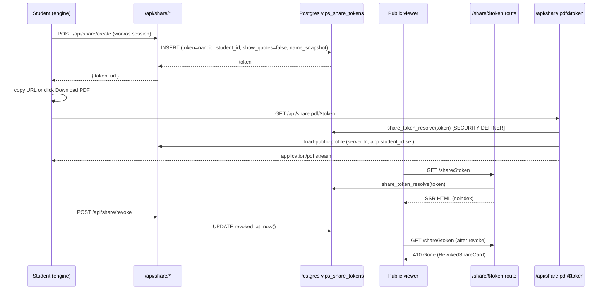

# feat: Heavy profile redesign + share/PDF export

## Overview

Heavily redesign the live profile sheet (the engine-rendered surface opened from the Profile chip in `TopNav`) so it carries the dreamy, atmospheric identity of the island instead of the current bento-tile-on-cream presentation. Then introduce a shareable read-only profile surface at `/share/$token` plus a "Download as PDF" affordance, so students can share their profile with parents, teachers, and friends without giving them access to the app.

The work spans three surfaces — the private engine sheet, the public React route, the printable PDF document — and a shared design-token layer that keeps all three visually coherent.

---

## Problem Frame

Today the live profile sheet is `src/engine/student-space/Game/View/ProfileSheet.js`. The React `ProfileSheetView.tsx` / `VipsPageView.tsx` files are dormant since the engine port (see [docs/solutions/2026-05-18-island-progression-engine-substrate.md](../solutions/2026-05-18-island-progression-engine-substrate.md)). The engine sheet works but the visual treatment lags the rest of the app — it reads as a forms-style settings panel rather than an extension of the island's atmosphere.

Beyond the redesign, there is no way for a student to show their profile to anyone. The whole product is gated behind sign-in. Parents and teachers asking "what does this app do for my child?" cannot see anything. A student who feels proud of a particular VIPS read has no canonical artefact to point at. There is no PDF, no public link, no preview image.

The cost of leaving this as-is: the most personal artefact the product creates lives behind auth, and the surface that should feel like the student's "home page" feels like a settings tab.

---

## Requirements Trace

- R1. The engine profile sheet (`src/engine/student-space/Game/View/ProfileSheet.js`) is heavily redesigned to match the dreamy atmosphere of the island — typography, generous whitespace, dimension-themed hero, ambient backdrop that responds to the engine's day/night cycle.
- R2. The redesigned sheet keeps the IA from the prior `2026-05-14-002` plan: identity header → four VIPS tabs (Values / Interests / Personality / Skills) → student-voice page title → compiled-truth read → claim collection (taxonomy-backed tiles using `ThumbnailRenderer` thumbnails) → recent timeline entries.
- R3. A Share button is added to the redesigned sheet header. For WorkOS-signed-in students it opens a share dialog; for demo / dev-bypass students it shows a sign-in prompt instead of generating a real token.
- R4. The share dialog exposes: a copyable public URL, a "Download as PDF" button, a "Revoke link" action (with two-tap confirm), and a redaction toggle for verbatim reflection quotes (off by default — quotes are redacted from the public surface unless the student opts in). Regenerate-as-one-click is deferred; in v1 students revoke then click Share again to mint a fresh token.
- R5. A new public route `/share/$token` renders a read-only profile view from Postgres data. No auth required. Returns a friendly state for revoked/expired/non-existent tokens.
- R6. The public route is `noindex, nofollow` by default (meta tag + `X-Robots-Tag` header). No Open Graph image containing student name or school is generated by default — a generic app-branded OG card is served instead.
- R7. The public route honors the redaction toggle: when verbatim quotes are redacted, the page shows compiled truths and claim collections only; when opted in, it shows quotes attributed by the student's `name_snapshot` (a sanitised display name frozen at token creation time).
- R8. The "Download as PDF" action returns a styled PDF via `@react-pdf/renderer` rendered by the existing Vercel Node serverless function (60s / 1024MB budget). Filename convention: `{ascii-slug}-profile-{YYYY-MM-DD}.pdf`.
- R9. The three surfaces (engine sheet, React share page, PDF document) consume a single shared design-token module so they cannot visually drift. Per-dimension theme tokens (accent, soft, ink, callout, border) live there.
- R10. A new Drizzle table `vips_share_tokens` stores share tokens with columns: `token text primary key`, `student_id text not null`, `show_quotes boolean not null default false`, `name_snapshot text not null`, `created_at timestamptz default now()`, `revoked_at timestamptz`. No FK to a `students` table — tenancy follows the existing `text`-based `app.student_id` GUC convention used by `vips_pages`, `mirror_entries`, etc. RLS policies match the pattern used by other student-scoped tables; the public share route reads via a `SECURITY DEFINER` resolver function (locked search_path, returns only `(student_id, show_quotes, name_snapshot)`) that the calling handler uses to set `app.student_id` for downstream queries. Audit fields (`view_count`, `last_viewed_at`, `expires_at`) are deferred to follow-up work.
- R11. Owner visits to `/share/$token` render the full public view with a sticky "This is what others see — back to your profile" banner. Do not silently redirect away.
- R12. `/me` redirects to `/?sheet=profile` and the engine opens the profile sheet on mount when that search param is present. Tab deep-linking (`?dim=…`) is deferred — Values is always the default tab on open.
- R13. All new motion respects `prefers-reduced-motion: reduce` — sheet slide-up reduces to fade, tab cross-fade collapses, atmospheric ambient animation pauses.
- R14. Verbatim reflection quotes never appear in the OG card, the PDF filename, any URL, or in any field besides the explicit timeline-entry `quote` slot. The server reads the `show_quotes` value exclusively from the `vips_share_tokens` row; no client query param, header, or body field may override the DB-sourced flag.

**Origin actors:**
- A1. Student — owns the profile, generates/revokes share tokens, downloads PDF
- A2. Public viewer — parent, teacher, friend; visits the share URL with no auth
- A3. Engine — renders the redesigned profile sheet; reads localStorage state
- A4. Server handlers — `create-share-token`, `revoke-share-token`, `load-public-profile`, `render-profile-pdf`

**Origin flows:**
- F1. Open redesigned profile sheet (via Profile chip / `/me` redirect / deep link with `?dim=`)
- F2. Generate share token + open dialog
- F3. Copy public link / toggle redaction / revoke
- F4. Public viewer loads `/share/$token`
- F5. Owner previews own share URL
- F6. Download profile PDF

---

## Scope Boundaries

- Not changing the VIPS taxonomy or the closed claim set (`src/data/vips-taxonomy.ts`).
- Not wiring the auto-connector from `persistMirror` into the engine — that is tracked by [docs/plans/2026-05-18-003-feat-mirror-connector-home-bridge-plan.md](2026-05-18-003-feat-mirror-connector-home-bridge-plan.md). The share page reads canonical Postgres truth as it exists; if a student's connector hasn't run, the share view will look sparser than the engine sheet. This is a known cross-plan dependency, not a bug of this plan.
- Not introducing email delivery of PDFs. PDF generation is synchronous from the browser request inside the 60s Vercel cap. If the budget is exceeded for a power user, fail with a friendly message and surface as an implementation-time concern.
- Not building QR codes, view-count analytics shown to the owner, or expiring tokens. Tokens never expire by default and can only be revoked (after which the student can mint a new one by clicking Share again).
- Not building a "share to specific person" ACL model. Share links are unlisted-public-URL only.
- Not generating per-share custom OG cards in v1. A single generic app OG card is reused for all share URLs.
- Not editing student display name or avatar from the new sheet — the existing engine avatar editor stays untouched. The share/PDF uses the student's canonical name from Postgres (`students` table or WorkOS profile fallback).

### Deferred to Follow-Up Work

- Counselor → student share token oversight (audit trail viewable by counselor): defer to a separate plan once counselor surfaces are expanded.
- Per-share custom OG cards using `@vercel/og`: defer; document the route shape (`/share/$token/og.png`) for the future.
- Expiry / scheduled revocation: defer. v1 omits the `expires_at` column entirely — a future plan adds it alongside the cron that operationalises it.
- Tab deep-linking (`?dim=values|interests|…`) and the "share specific tab" feature: defer to a follow-up plan. v1 always opens Values when the profile sheet opens.
- Regenerate-link as a one-click action: defer. v1 ships Revoke + Create as two steps (revoke, then click Share again to mint a fresh token). The sub-second unshared window is acceptable for v1.
- View-count audit (`view_count`, `last_viewed_at` columns) and an owner-facing "viewed N times" surface: defer until the owner UX for it is designed. Avoids exposing usage counters to public viewers by accident.
- `name_snapshot` regeneration on student display-name edit: defer; v1 has no display-name edit flow, so the snapshot frozen at creation is always current.

---

## Context & Research

### Relevant Code and Patterns

- `src/engine/student-space/Game/View/ProfileSheet.js` — the live sheet to redesign. ~1000+ LOC. document.createElement DOM, slide-up viewport, 4 VIPS facet tabs, bento tiles backed by `ThumbnailRenderer`.
- `src/engine/student-space/Game/View/TopNav.js` — renders the Letters / Calendar / Profile / Path Finder chips. Profile chip calls `OverlayController.getInstance().open(sheet)`.
- `src/engine/student-space/Game/View/OverlayController.js` — singleton that owns sheet open/close state, history-entry pushing, and body class flips.
- `src/engine/student-space/Game/View/facets.js` — `FACET_THEMES`, `FACET_HEADERS`, `applyFacetVars`. CSS-var-based theming the redesign should keep and extend.
- `src/engine/student-space/Game/View/ThumbnailRenderer.js` — renders each canonical claim object to a PNG data URL. Already used by the profile bento tiles. Reuse directly in the PDF.
- `src/engine/student-space/Game/State/Profile.js` — localStorage-backed singleton. `countByClaim(facetId)` returns per-claim quote counts. Identity (`Mei`, `Sec 3B`, avatar) lives here.
- `src/engine/student-space/style.css` — `.profile-sheet*` rules (lines 2629–3088). The redesign will rewrite this block.
- `src/components/ProfileSheetChrome.tsx` — dormant React equivalent. Source of truth for the prior IA's `PROFILE_HEADERS` / `PROFILE_THEMES` typography. Extract its theme constants into the shared tokens module rather than re-typing them.
- `src/server/load-vips-pages.handler.server.ts` — canonical Postgres aggregation: returns `pages` (compiled_truth, open_question, updated_at per dimension), `timeline_by_dimension`, `claim_count_by_dimension`, `recent_entries`, `recent_moods`. Reused by the public share handler with a token-resolved studentId.
- `src/db/schema.ts` — Drizzle schema. New table follows the existing `pgPolicy(... rls)` pattern. Reference `vipsPages` and `mirrorEntries` for column conventions.
- `src/routes/me.tsx` — already redirects to `/?sheet=profile`. Search-param consumption needs to be wired into the engine bootstrap.
- `src/components/StudentSpaceHost.tsx` — the React mount point for the engine. Reads `location.search` here and forwards `?sheet=profile&dim=` to the engine on construct.
- `api/index.ts` — single Vercel Node serverless handler. PDF endpoint will route through this same function.
- `vercel.json` — `maxDuration: 60`, `memory: 1024`. Budget for PDF render.
- `src/auth/identity.ts` — `requireCounselorContext()` discriminator for WorkOS vs demo vs dev-bypass. Share-token creation gates on `kind === 'workos'`.

### Institutional Learnings

- [docs/solutions/2026-05-18-island-progression-engine-substrate.md](../solutions/2026-05-18-island-progression-engine-substrate.md) — the live home is the engine substrate; `src/components/world/*` is dormant. This plan applies that rule: the live profile redesign lives in `Game/View/ProfileSheet.js`, NOT in `ProfileSheetView.tsx`.
- [docs/plans/2026-05-14-002-feat-student-space-profile-sheet-ia-plan.md](2026-05-14-002-feat-student-space-profile-sheet-ia-plan.md) — defines the IA shape (identity header / VIPS tabs / page eyebrow+title+subtitle / compiled truth read / ranked claim rows / Collection tiles / timeline). Carry the IA, redirect the substrate.
- [docs/plans/2026-05-13-001-feat-student-space-world-stage-plan.md](2026-05-13-001-feat-student-space-world-stage-plan.md) — sets the durable visual doctrine: quiet evidence map, not game; vivid for confirmed, muted for pending, omitted for forgotten. Apply to claim rows and tiles.
- Project memory: connector is not invoked from `persistMirror` today. Share page reflects whatever the Postgres state is; if connector hasn't run, the page is sparse. Surface this as a "Last synced" timestamp on the share page so viewers aren't confused.
- Project memory: engine state-slice template (singleton + subscribe + persist) — the new share-dialog UI inside the engine follows this pattern if it needs any state of its own.

### External References

- `@react-pdf/renderer` 4.x docs — https://react-pdf.org/ (PDF primitives, font registration, image embedding)
- `@react-pdf/font` font-loading gotcha — bundle TTF, not WOFF2; do not use HTTP `src` (issue [#2675](https://github.com/diegomura/react-pdf/issues/2675))
- `nanoid` 5.x — 21-char URL-safe IDs at 126 bits entropy (https://github.com/ai/nanoid)
- PDPC Advisory Guidelines on Children's Personal Data (Mar 2024) — opt-in disclosure, immediate revocation, no public-by-default, no PII in OG cards. Drives the redaction-by-default and noindex decisions.
- TanStack Start file-based routing — `src/routes/share.$token.tsx` for the public route, `src/routes/api/share.pdf.$token.tsx` for the PDF endpoint, `src/routes/api/share/create.tsx` / `revoke.tsx` for mutations.

### Slack context

Not searched in this planning pass. Slack tools detected — ask me to search Slack for organizational context at any point, or include it in your next prompt.

---

## Key Technical Decisions

- **Redesign happens in the engine, not React.** The live profile sheet is `Game/View/ProfileSheet.js` per the engine-substrate doctrine. Building a parallel React profile would create two profiles in one app, with the engine one continuing to be the home. Rejected.
- **Share page is a React route, not an engine surface.** The public viewer is unauth and has no reason to download the three.js engine bundle. The React route is server-renderable, instant, and indexable-or-not at our discretion. The shared design tokens keep visual parity with the engine sheet.
- **PDF library: `@react-pdf/renderer`** over Puppeteer/Playwright. Pure-JS, ~2 MB bundle delta vs 50 MB for chromium binaries, sub-500ms cold start vs 3-8s for Puppeteer, fits comfortably in the 60s/1GB Vercel Node budget. The trade-off (cannot reuse the React share page tree as-is) is acceptable because a print PDF wants different layout from a web page anyway.
- **Token shape: 21-char nanoid.** URL-safe alphabet, 126 bits entropy, statistically more collision-resistant than UUIDv4 at half the length. Opaque (not JWT) so revocation is a single DB write with immediate effect.
- **Token table is single-resource (`vips_share_tokens`), not polymorphic.** Future "share my timeline" or "share my journey" will get their own tables. YAGNI on a `resource_type` column today.
- **Token table v1 columns are minimal**: `token`, `student_id` (text, matching the existing tenancy convention — no FK because there is no `students` table; `student_id` is the `app.student_id` GUC value used across the schema), `show_quotes boolean`, `name_snapshot text` (sourced from WorkOS `user.firstName + user.lastName`, sanitised at write time), `created_at`, `revoked_at`. Everything else (`expires_at`, `view_count`, `last_viewed_at`, JSONB redactions) is deferred.
- **Display name comes from WorkOS at token-creation time.** There is no canonical `students.display_name` column in the schema today. `name_snapshot` is frozen at creation from `auth.user.firstName + auth.user.lastName`, sanitised to ASCII-safe display characters and trimmed. This sidesteps both the missing-table problem and the rename-leakage concern.
- **Tokens never expire by default; revocation is explicit.** No regenerate action in v1 — students revoke and then click Share again to mint a fresh token. The sub-second unshared window during a regenerate is not worth a fourth API route for v1.
- **Verbatim quotes redacted by default on the public surface.** Reflection quotes are the most personal artefact. Default-off, explicit opt-in toggle. The server reads `show_quotes` exclusively from the `vips_share_tokens` row; client-supplied query params, headers, or body fields cannot override the DB-sourced flag. Honors PDPC Children's Data guidance.
- **Demo and dev-bypass auth-kinds cannot create real share tokens.** They get a "Sign in to share" tooltip. Avoids leaking the seeded `Mei` persona to the public web. Locks the share table to real student rows only.
- **The share page is `noindex, nofollow`.** Both meta tag and `X-Robots-Tag` header. Whatsapp/Telegram unfurl still works for paste-into-chat; search-engine indexing does not.
- **Single generic OG card for v1.** No name, no school, no avatar of a minor. Just the app's branding. Per-student OG cards via `@vercel/og` are deferred.
- **Share page reads canonical Postgres data** via `load-vips-pages.handler.server.ts`. The page surfaces a "Last synced" timestamp (from `vipsPages.updatedAt`) so viewers understand it reflects a server snapshot, not the live engine state.
- **Engine profile sheet keeps reading localStorage** for the redesign. We do not wire the Postgres bridge here — that's [plan 003](2026-05-18-003-feat-mirror-connector-home-bridge-plan.md).
- **Shared design tokens live in `src/lib/profile-tokens.ts` (TypeScript)** with a co-located `src/engine/student-space/Game/View/profile-tokens.constants.js` mirror. The TS module is the source of truth; the engine JS file is hand-maintained but covered by a unit test that asserts deep-equal between them, so drift is detected at CI time. This avoids cross-language imports while keeping a single semantic source.
- **`SECURITY DEFINER` token resolver is hand-authored, not Drizzle-generated.** Drizzle Kit only emits `CREATE TABLE` / `pgPolicy` SQL. The resolver function is appended to the generated migration manually: `SECURITY DEFINER`, `STABLE`, `SET search_path = pg_catalog, public`, `RETURN TABLE(student_id text, show_quotes boolean, name_snapshot text)`. Function owner is the migration role; `GRANT EXECUTE` is restricted to the app role. Body touches only `vips_share_tokens` — enforced by code review.
- **Client response strips token + student_id.** The `loadPublicProfileHandler` returns `{ status, profile: { /* no student_id, no token */ }, isOwner: boolean }`. `isOwner` is computed server-side; the client never sees the owner's UUID/identifier.

---

## Open Questions

### Resolved During Planning

- Engine substrate vs React for the redesign: engine.
- PDF library: `@react-pdf/renderer`.
- Token shape & storage: nanoid in a new `vips_share_tokens` table.
- Token table v1 columns: token, student_id (text), show_quotes (bool), name_snapshot, created_at, revoked_at. No FK to a `students` table (the table doesn't exist in the current schema; tenancy is text-GUC based across the existing tables). Audit fields (`view_count`, `last_viewed_at`, `expires_at`) deferred.
- Display name source: WorkOS user fields at token-creation time → sanitised → frozen in `name_snapshot`. No reliance on a non-existent `students.display_name`.
- Default privacy posture: redact verbatim quotes, noindex, demo can't share, no per-student OG.
- Where does the Share button live: top-right of the redesigned engine sheet header, beside the close button.
- Tab deep-linking (`?dim=`) deferred — Values is always the default on open. `/me → /?sheet=profile` redirect continues to work as today.
- Regenerate-link action deferred. Revoke + click-Share-again is the v1 path.
- `SECURITY DEFINER` resolver is hand-authored, search-path-locked, owner-restricted, body-audited. Drizzle does not generate it.

### Deferred to Implementation

- Exact DOM structure of the engine share dialog (modal vs inline panel). Decided during U4 once the redesigned header is in place.
- Per-tab claim ordering on the redesigned sheet ("Most common" vs "Quietly emerging" sort): engine's `Profile.countByClaim()` already provides counts; the ordering rule is settled in U3.
- Final PDF page layout (one page tabs-as-sections vs four pages, one per dimension): decided in U7 after measuring real-data fit. Budget: ≤ 4 pages.
- Font choice for PDF (Plus Jakarta Sans bundled, Inter fallback, or a single CJK-capable font like Noto Sans): decided in U7 with a real-data test against non-Latin names.
- Engine sheet ambient-backdrop strategy (CSS-only reading of engine `--sky-*` vars vs a dedicated canvas layer): decided in U3 after a visual prototype.
- Whether `/share/$token` is server-rendered at the route loader vs client-fetched after mount: U6 decision; server-rendered is the default because it carries the dreamy palette into the first paint and the response is cacheable per token.
- HTTP-header strategy for `X-Robots-Tag` on `/share/$token` (route-level `headers()` if supported by the installed TanStack Start version, otherwise via the loader-throw pattern or a thin middleware in `api/index.ts`). The `<meta name="robots">` tag is the always-on fallback that covers unfurlers + most search engines on its own.
- Rate-limiting strategy for `/api/share.pdf/$token` and `/share/$token`: not in v1, but document the chosen layer (Vercel Edge Middleware vs handler-level token bucket) when added. Acknowledge in the plan as a known v1 gap.

---

## Output Structure

```
src/
  lib/
    profile-tokens.ts                    # NEW — shared facet themes, palette, typography tokens (TS source of truth)
    share-token.ts                       # NEW — nanoid generation + token validation + name sanitisation helpers
  db/
    schema.ts                            # MODIFY — add vipsShareTokens table + RLS policy
    migrations/0001_share_tokens.sql     # NEW (drizzle-generated via `--name=share_tokens`, with the SECURITY DEFINER function appended by hand)
  server/
    load-public-profile.handler.server.ts  # NEW — token → studentId → load-vips-pages shape (PII-redacted; server strips student_id/token before returning)
    share-token.functions.ts             # NEW — createShareToken / revokeShareToken / setShareRedactions
    share-token.handler.server.ts        # NEW — Postgres-side handlers
  routes/
    share.$token.tsx                     # NEW — public profile route
    api/
      share/
        create.tsx                       # NEW — POST: returns nanoid token (WorkOS auth gate)
        revoke.tsx                       # NEW — POST: marks revoked_at
        redactions.tsx                   # NEW — PATCH: updates show_quotes (server-only authority)
      share.pdf.$token.tsx               # NEW — GET: streams application/pdf
  components/
    share/
      PublicProfilePage.tsx              # NEW — React layout consumed by share.$token.tsx
      ProfilePdfDocument.tsx             # NEW — @react-pdf/renderer document
      RevokedShareCard.tsx               # NEW — terminal state UI
      OwnerPreviewBanner.tsx             # NEW — sticky "this is what others see"
  engine/
    student-space/
      Game/
        View/
          ProfileSheet.js                # MODIFY — heavy redesign
          ShareDialog.js                 # NEW — engine-DOM share dialog
          profile-tokens.constants.js    # NEW — hand-maintained mirror of src/lib/profile-tokens.ts (drift-checked by test)
        State/
          ShareTokenBridge.js            # NEW — lazy-constructed singleton; fetch-or-create invoked from ShareDialog open handler, NOT at engine boot
      style.css                          # MODIFY — rewrite .profile-sheet*; new .share-dialog rules
test/
  lib/profile-tokens.test.ts             # NEW — assert TS source and engine JS mirror are deep-equal
  server/share-token.handler.test.ts
  server/load-public-profile.handler.test.ts
  routes/share.token.test.tsx
  components/share/PublicProfilePage.test.tsx
  components/share/ProfilePdfDocument.test.tsx
  engine/ProfileSheetRedesign.test.tsx
  engine/ShareDialog.test.tsx
public/
  fonts/PlusJakartaSans-Regular.ttf      # NEW — bundled for @react-pdf/renderer (TTF only, not WOFF2)
  fonts/PlusJakartaSans-SemiBold.ttf     # NEW
  fonts/PlusJakartaSans-Bold.ttf         # NEW
  fonts/Inter-Regular.ttf                # NEW (CJK + Latin fallback)
  share-og-default.png                   # NEW — generic OG card image
vercel.json                              # MODIFY — extend `includeFiles` to bundle public/fonts/** into the function payload
vite.config.ts                           # MODIFY — add `@react-pdf/renderer` to `ssr.noExternal` for clean Vite SSR bundling
```

---

## High-Level Technical Design

> *This illustrates the intended approach and is directional guidance for review, not implementation specification. The implementing agent should treat it as context, not code to reproduce.*

### Three-surface design system

```mermaid
flowchart LR
  Tokens[src/lib/profile-tokens.ts<br/>FACET_THEMES, FACET_HEADERS, typography]
  Engine[engine/Game/View/ProfileSheet.js<br/>+ ShareDialog.js<br/>+ facets.js re-export]
  React[components/share/PublicProfilePage.tsx<br/>+ OwnerPreviewBanner.tsx]
  Pdf[components/share/ProfilePdfDocument.tsx<br/>@react-pdf/renderer]

  Tokens --> Engine
  Tokens --> React
  Tokens --> Pdf
```

### Share lifecycle



### Public route render states

| Token state | Status | View |
|---|---|---|
| Valid + owner viewing | 200 | PublicProfilePage + OwnerPreviewBanner |
| Valid + public viewing | 200 | PublicProfilePage (noindex) |
| Revoked | 410 | RevokedShareCard (no profile data) |
| Never existed / typo | 404 | NotFoundCard |
| Expired | n/a in v1 | Add when `expires_at` lands in a future plan |
| Owner not signed-in viewing own URL | 200 | PublicProfilePage (no owner banner; we cannot detect them) |

---

## Implementation Units

- U1. **Shared design tokens**

**Goal:** Extract the per-dimension theme objects and typography tokens into a single semantic source consumed by the engine, the React share page, and the PDF document — with a drift-detection test that guards the engine JS mirror.

**Requirements:** R9

**Dependencies:** None

**Files:**
- Create: `src/lib/profile-tokens.ts` (TS source of truth)
- Create: `src/engine/student-space/Game/View/profile-tokens.constants.js` (hand-maintained mirror)
- Modify: `src/components/ProfileSheetChrome.tsx` (re-export from `~/lib/profile-tokens`)
- Modify: `src/engine/student-space/Game/View/facets.js` (import from the `.constants.js` mirror; preserve `applyFacetVars` engine integration)
- Test: `test/lib/profile-tokens.test.ts`

**Approach:**
- The TS module exports `PROFILE_THEMES` (per-dimension accent/soft/ink/callout/border colors), `PROFILE_HEADERS` (eyebrow/tag/title/subtitle), `DIMENSION_LABEL`, and a `TYPOGRAPHY` block (font family names, weight tokens, scale ramp).
- The engine-side `profile-tokens.constants.js` is a vanilla-JS mirror of the same values, NOT auto-generated. The test in `test/lib/profile-tokens.test.ts` asserts deep-equal between the TS export and the JS mirror so drift is caught at CI time. This avoids importing TS into the engine substrate (which would couple engine boot to the TS typecheck path).
- `ProfileSheetChrome.tsx` re-exports from `~/lib/profile-tokens` so the dormant React layer stays consistent without re-typing values.

**Patterns to follow:**
- Existing `PROFILE_THEMES` / `PROFILE_HEADERS` in `src/components/ProfileSheetChrome.tsx`.
- Existing `FACET_THEMES` / `FACET_HEADERS` in `src/engine/student-space/Game/View/facets.js`.

**Test scenarios:**
- Happy path: every `VipsDimension` value has a corresponding `PROFILE_THEMES` entry with accent, soft, ink, callout, border fields populated and non-empty.
- Happy path: every dimension has a `PROFILE_HEADERS` entry with eyebrow, tag, title, subtitle non-empty.
- Happy path: deep-equal check between `~/lib/profile-tokens` (TS) and `~/engine/student-space/Game/View/profile-tokens.constants` (JS) passes.
- Edge case: tokens module has no engine-specific or framework-specific imports (snapshot the import set).

**Verification:**
- `npm run check` passes.
- `ProfileSheetView.tsx` still type-checks and renders identical themes (no visual regression).
- Engine `facets.js` still produces identical `--facet-accent` etc. CSS variables.

---

- U2. **`vips_share_tokens` table + migration + RLS**

**Goal:** Add the Drizzle table and migration that backs all share-token reads and writes.

**Requirements:** R10

**Dependencies:** None

**Files:**
- Modify: `src/db/schema.ts`
- Create: `src/db/migrations/0001_share_tokens.sql` (drizzle-generated via `npm run db:generate -- --name=share_tokens`, with the `CREATE FUNCTION share_token_resolve(...)` block appended by hand at the end of the file)
- Modify: `src/db/migrations/meta/_journal.json` (drizzle-managed; do not hand-edit)
- Test: `test/db/schema.share-tokens.test.ts`

**Approach:**
- Table columns (v1, minimal):
  - `token text primary key`
  - `student_id text not null` — matches the existing `text`-based tenancy convention used by `vips_pages`, `mirror_entries`, `vips_timeline_entries`. There is NO `students` table in the current schema; `student_id` is the `app.student_id` GUC value that bootstraps via `attachCounselorToPersonalStudent`. No FK.
  - `show_quotes boolean not null default false`
  - `name_snapshot text not null` — sanitised display name frozen at insert time, sourced from WorkOS `auth.user.firstName + auth.user.lastName` via `src/lib/share-token.ts` `sanitizeNameSnapshot()`. The handler insert path is the only writer.
  - `created_at timestamptz not null default now()`
  - `revoked_at timestamptz`
- Deferred columns explicitly NOT added in v1: `expires_at`, `view_count`, `last_viewed_at`. Each is added by a separate plan when its consumer surface is designed.
- RLS: owner can `select` / `insert` / `update` rows when `current_setting('app.student_id', true) = student_id`. **No counselor exception** — counselors cannot create or modify a student's share tokens, regardless of `counselor_students` membership. Add a test asserting an INSERT with a counselor-set GUC for an advised student is rejected.
- `SECURITY DEFINER` resolver (hand-authored, appended to the generated migration):
  - Name: `share_token_resolve(p_token text)`
  - Returns: `TABLE (student_id text, show_quotes boolean, name_snapshot text)`
  - Body: a single `SELECT ... FROM vips_share_tokens WHERE token = p_token AND revoked_at IS NULL LIMIT 1`. No DML. No other tables touched. Code review enforces.
  - Declared `STABLE`, `SECURITY DEFINER`, `SET search_path = pg_catalog, public` (search-path injection mitigation), `LANGUAGE sql`.
  - Function `OWNER` is the migration role; `REVOKE EXECUTE FROM PUBLIC`; `GRANT EXECUTE` to the app role only.
- Index on `student_id`.
- Run `npm run db:generate -- --name=share_tokens` to produce `0001_share_tokens.sql`, then append the `CREATE FUNCTION` block by hand. Commit the schema change, the generated SQL with the appended function block, and the `_journal.json` update together.

**Patterns to follow:**
- `vipsPages`, `mirrorEntries`, `vipsTimelineEntries` in `src/db/schema.ts` — same `pgPolicy`, same `current_setting('app.student_id', true)` GUC predicate pattern, same `text` student_id type.
- `src/db/queries.ts` `withStudent(studentId)` wrapper.

**Test scenarios:**
- Happy path: `INSERT` with the owner's `app.student_id` succeeds.
- Edge case: `INSERT` with a different `app.student_id` fails RLS.
- Edge case: a counselor session with `app.student_id` set to an advised student's id cannot INSERT a token on the student's behalf (RLS rejects; no counselor bypass).
- Happy path: `SELECT share_token_resolve($1)` returns the row when called WITHOUT setting `app.student_id` (verifies the SECURITY DEFINER path).
- Happy path: same call returns zero rows for a revoked token.
- Edge case: direct `SELECT * FROM vips_share_tokens WHERE token = $1` (no resolver, no GUC) returns nothing — proves RLS still defends against accidental direct reads.
- Edge case: function return signature is `(student_id text, show_quotes boolean, name_snapshot text)` — asserted via `pg_proc` introspection.
- Integration: revoke is idempotent — a second revoke is a no-op.
- Security: `pg_get_functiondef('share_token_resolve(text)')` output contains `SET search_path = pg_catalog, public` and `SECURITY DEFINER`.

**Verification:**
- Migration applies cleanly to a fresh database, including the hand-appended function block.
- Drizzle Studio shows the table with the RLS policy attached.
- `pg_proc` shows `share_token_resolve` as `SECURITY DEFINER` with `prosecdef = true` and pinned `proconfig` for `search_path`.

---

- U3. **Heavy redesign of engine `ProfileSheet.js`**

**Goal:** Rebuild the live profile sheet to feel atmospheric and dreamy — generous typography, dimension-themed hero, ambient backdrop that picks up the engine's `--sky-*` CSS variables, larger claim tiles using `ThumbnailRenderer` thumbnails. IA stays.

**Requirements:** R1, R2, R12, R13

**Dependencies:** U1

**Files:**
- Modify: `src/engine/student-space/Game/View/ProfileSheet.js`
- Modify: `src/engine/student-space/style.css` (rewrite `.profile-sheet*` rules)
- Modify: `src/engine/student-space/Game/View/facets.js` (consume shared tokens from U1's engine JS mirror)
- Test: `test/engine/ProfileSheetRedesign.test.tsx`

**Approach:**
- Keep the existing IA from `2026-05-14-002`: identity header → VIPS tabs → page eyebrow/title/subtitle → compiled-truth read → ranked claim rows → Collection tiles → recent timeline.
- Visual moves:
  - Hero: dimension-themed wash that bleeds from the top of the sheet using the active dimension's `--facet-soft` and `--facet-accent`. Translucent layer over the existing sky gradient so the engine's day/night cycle subtly tints the sheet's hero.
  - Typography: scale up the dimension title to a display weight (per the shared tokens); subtitle in a quieter weight; eyebrow as small caps with letter-spacing.
  - Claim tiles: larger thumbnails (≥160px), captioned by `claimLabel`, count badge top-right, vivid styling when `evidenceState === 'confirmed'` and translucent when pending (per the world-stage doctrine).
  - Tab row: pill chips with the active dimension's accent fill, others ghost. Cross-fade body content on tab change unless reduced-motion is set.
  - Sheet motion: slide-up 420ms ease-out today; respect `prefers-reduced-motion: reduce` by collapsing to a 180ms fade.
  - Ambient: a single subtle particle layer at low opacity inside the hero, paused when reduced-motion is on.
- Default tab is always Values on open. Tab deep-linking (`?dim=…`) is deferred to a follow-up plan.
- Identity header: avatar (existing `Profile.js` data URL), name + class line, and TWO header-right slots — Share button (U4 places the dialog here) and the existing close affordance.
- Empty states per dimension when `Profile.countByClaim(facetId)` returns zero quotes everywhere: replace the claim tiles section with a "Your {dimension} read grows as you reflect" copy block. Share button stays enabled (the share page handles its own empty state).

**Execution note:** Snapshot the current `ProfileSheet.js` visual baseline with a screenshot before any change, so review can compare. Use the engine dev palette (`src/components/DevPalette.tsx`) to flip the dimension for visual QA.

**Technical design:** *Sketch only.*
```
ProfileSheet (root, role="dialog")
├─ ProfileSheet__hero       (gradient driven by --facet-soft + engine --sky-*)
│  ├─ IdentityHeader        (avatar / name+class / [Share button] / [Close])
│  ├─ DimensionTabs         (Values | Interests | Personality | Skills)
│  └─ PageHeader            (eyebrow / title / subtitle from PROFILE_HEADERS)
├─ ProfileSheet__truth      (compiled-truth read paragraph + open question callout)
├─ ProfileSheet__collection (grid of ClaimTile from ThumbnailRenderer)
└─ ProfileSheet__timeline   (recent entries, existing pattern)
```

**Patterns to follow:**
- Existing `facets.js` `applyFacetVars()` for CSS-var-driven theming.
- Existing `ThumbnailRenderer.js` for claim thumbnails.
- `KiraDialogue.js` for slide-up motion conventions (timing, easing).
- `CalendarSheet.js` and `TrajectorySheet.js` for OverlayController integration and history-entry pushing.

**Test scenarios:**
- Happy path: opening the sheet renders all four VIPS tabs and selects Values by default.
- Happy path: clicking a tab updates the eyebrow/title/subtitle and reapplies the per-dimension CSS variables.
- Edge case: a dimension with zero quotes from `Profile.countByClaim` renders the empty-state copy block, NOT an empty tile grid.
- Edge case: `prefers-reduced-motion: reduce` skips slide-up animation and disables the ambient particle layer; tab cross-fade becomes an instant swap.
- Integration: Profile chip in `TopNav` → OverlayController → ProfileSheet open path still works (no regression in the sheet open flow).
- Integration: `/me` redirect → `/?sheet=profile` → engine opens the redesigned sheet (engine bootstrap reads `location.search` for the `sheet` value only).
- Integration: history back closes the sheet (no app-exit).

**Verification:**
- Visual: matches the redesign spec at desktop (≥1280px) and mobile (375px) viewports; dimension swaps produce visibly distinct hero washes.
- Reduced motion: sheet open at `prefers-reduced-motion: reduce` shows no slide-up.
- No regressions in `test/engine/*` snapshot or interaction tests.

---

- U4. **Share dialog inside the engine**

**Goal:** Add a Share button to the redesigned sheet header that opens an engine-DOM share dialog with copy / revoke / redaction-toggle / Download-as-PDF actions. The dialog has fully specified visual states for `idle`, `creating`, `ready`, `revoking`, `error`.

**Requirements:** R3, R4, R13

**Dependencies:** U1, U3, U5 (handlers must exist for the dialog to call)

**Files:**
- Create: `src/engine/student-space/Game/View/ShareDialog.js`
- Create: `src/engine/student-space/Game/State/ShareTokenBridge.js`
- Modify: `src/engine/student-space/Game/View/ProfileSheet.js` (mount Share button + dialog)
- Modify: `src/engine/student-space/Game/View/OverlayController.js` (register share-dialog overlay)
- Modify: `src/engine/student-space/style.css` (`.share-dialog*` rules)
- Test: `test/engine/ShareDialog.test.tsx`

**Approach:**
- The Share button is rendered only when `authMenu.kind === 'workos'`. Demo/dev-bypass renders the same button with a tooltip "Sign in to share" and a click that opens the sign-in href, not the dialog.
- `ShareTokenBridge.js` is the engine-side state slice (singleton + subscribe — no localStorage persistence; tokens live in Postgres). Holds `{ token, url, showQuotes, status: 'idle' | 'creating' | 'ready' | 'revoking' | 'error', errorMessage? }`. **Constructed lazily on first ShareDialog open, not at engine boot.** The bridge's `fetchOrCreate()` is method-invoked from the dialog's open handler so the engine's sync boot path is never blocked on an HTTP call.
- The bridge's first-time flow: if `status === 'idle'` on open, POST `/api/share/create` directly. The handler is idempotent-ish at the policy level (a student can have multiple non-revoked tokens; v1 simply mints one each first-open). No `/api/share/me` lookup endpoint is needed.
- Dialog visual states (explicit, not inferred):
  - `idle` (first open, no token yet): hero-area placeholder "Generating your link…" with a non-interactive shimmer; Copy / Download / Revoke / Toggle are disabled and pointer:none. Dialog auto-fires `bridge.fetchOrCreate()` on mount.
  - `creating`: same hero placeholder; spinner glyph appears beside the placeholder; actions remain disabled.
  - `ready`: URL field is visible, monospace, with Copy button on the right. Actions enabled.
  - `revoking`: URL field becomes strike-through and dimmed; Revoke button label changes to "Revoking…"; spinner.
  - `error`: hero replaced by an inline error block (red soft fill, ink color), error message + a "Try again" button that re-fires the last action; other actions disabled until retry succeeds.
- Dialog actions:
  - **Copy link**: writes to clipboard; if `navigator.share` is available on the platform, offer a native-share affordance alongside copy.
  - **Revoke**: two-tap confirm. First tap → button label changes to "Tap again to revoke" in the dimension's `--facet-accent` color and starts a 4-second auto-disarm timer. Second tap → POST `/api/share/revoke`, transition to `revoking`, then back to `idle` (the dialog returns to its initial generate-link presentation). This is independent of the U3 forget-pattern reimplementation; the timing and copy are spec'd here so U3 reshaping the claim-forget UI does not break the share-revoke flow.
  - **Redaction toggle ("Show my quotes")**: a switch with two labels — `Hidden` (default) and `Visible to viewers`. PATCH `/api/share/redactions { show_quotes: boolean }`. Server is the only authority — toggle is optimistically rendered, snaps back to the server's truth on response if they disagree.
  - **Download PDF**: opens `/api/share.pdf/$token` in a new tab (browser handles download via `Content-Disposition: attachment`). Button label changes to "Preparing…" with a 10-second timeout; restores to "Download as PDF" when the new tab navigation completes (or after the timeout, whichever first).
- Keyboard nav: Escape closes the dialog (returns focus to the Share button), Tab cycles through Copy / Toggle / Download / Revoke / Close in that order. Focus is trapped while the dialog is open.

**Patterns to follow:**
- Engine state-slice template per memory (`feedback-engine-slice-template.md`) for `ShareTokenBridge.js`; lazy constructor variant (no work at engine boot).
- `CalendarSheet.js` for nested overlay open/close interactions and focus trapping.

**Test scenarios:**
- Happy path: WorkOS user clicks Share → dialog opens in `idle` → auto-fires create → transitions through `creating` → `ready` with URL.
- Happy path: clicking Copy writes the URL to the clipboard; toast appears.
- Happy path: clicking Revoke once shows "Tap again to revoke"; clicking again POSTs and returns to `idle`.
- Happy path: clicking the redaction toggle PATCHes `show_quotes` and updates the switch label.
- Edge case: clipboard write rejected → fallback to a select-all textarea with a hint.
- Edge case: `navigator.share` undefined → only Copy is offered (no native share button).
- Edge case: Demo / dev-bypass kind → Share button is rendered as a sign-in tooltip; clicking opens the sign-in href.
- Edge case: dialog state machine — `creating` rendered correctly (URL field is a shimmer skeleton, actions disabled); `revoking` rendered correctly (URL strike-through, button label "Revoking…").
- Edge case: redaction toggle optimistic update, server returns 4xx → toggle snaps back to server truth and surfaces inline error.
- Error path: network failure on create → dialog renders `error` block with Try Again; engine state stays `error`, never silently `idle`.
- Error path: 4-second Revoke disarm timer expires → button reverts to "Revoke link" copy and primary color.
- Accessibility: Escape closes the dialog and returns focus to the Share button. Tab order is Copy → Toggle → Download → Revoke → Close.
- Integration: revoking a token while a public viewer is on `/share/$token` → that viewer's next page-refresh shows the RevokedShareCard (covered by U6 server behavior).

**Verification:**
- Copy, revoke, toggle, download flows all reach Postgres rows correctly (smoke test against a local DB).
- Demo user cannot mint a real token.
- All five status states have visible rendered evidence in the test snapshots.

---

- U5. **Server: share-token lifecycle + public-profile loader**

**Goal:** Implement the server handlers that back create / revoke / set-redactions / load-public-profile, with auth gating, DB-only redaction enforcement, and PII-strip on the response.

**Requirements:** R5, R7, R10, R14

**Dependencies:** U2

**Files:**
- Create: `src/lib/share-token.ts` (nanoid wrapper, URL builder, `sanitizeNameSnapshot()` for ASCII/CJK-safe name normalization)
- Create: `src/server/share-token.handler.server.ts`
- Create: `src/server/share-token.functions.ts` (TanStack server functions)
- Create: `src/server/load-public-profile.handler.server.ts`
- Modify: `src/server/function-schemas.ts` (add Zod schemas)
- Create: `src/routes/api/share/create.tsx`
- Create: `src/routes/api/share/revoke.tsx`
- Create: `src/routes/api/share/redactions.tsx`
- Test: `test/server/share-token.handler.test.ts`
- Test: `test/server/load-public-profile.handler.test.ts`

**Approach:**
- `createShareTokenHandler` — gated to `auth.kind === 'workos'` via `requireCounselorContext()`. Generates a 21-char nanoid, sanitises `auth.user.firstName + ' ' + auth.user.lastName` (or email-local-part fallback) via `sanitizeNameSnapshot()`, inserts `(token, student_id, show_quotes: false, name_snapshot, created_at, revoked_at: null)`. Returns `{ token, url: \`${ORIGIN}/share/${token}\` }`. Demo and dev-bypass kinds receive 403 with error code `share_demo_unsupported`.
- `revokeShareTokenHandler` — sets `revoked_at = now()` where `student_id = current_setting('app.student_id', true) AND token = $1`. Idempotent (a second call is a no-op due to RLS + no row matches).
- `setRedactionsHandler` — PATCH-style. Updates `show_quotes` to the requested boolean. The `show_quotes` field on the token row is the ONLY source of truth for redaction; no other handler reads from a client param. Returns the post-update boolean.
- `loadPublicProfileHandler` — takes `token` as input, no auth required. Calls `share_token_resolve(token)` (the SECURITY DEFINER function from U2). If zero rows, returns `{ status: 'not_found' }`. If revoked the function already returns zero rows, so revoked and not-found are indistinguishable at the resolver level — to differentiate for the React route's terminal-state card, a second lightweight call to the same function with an `include_revoked` variant OR a direct `SELECT revoked_at FROM vips_share_tokens WHERE token = $1 LIMIT 1` (which still requires the SECURITY DEFINER path) distinguishes the two. **Settle the exact two-call shape at U5 implementation; for the plan's purpose what matters is the resolver returns the minimum fields needed.**
- For an active token, the handler:
  1. Sets `app.student_id` GUC to the resolved `student_id` for the duration of the request.
  2. Delegates to a slimmed-down version of `load-vips-pages.handler.server.ts` that omits the `recent_entries.quote` field when `show_quotes !== true` (returns `{ ...entry, quote: null }`).
  3. Omits canonical claim IDs from the response (only canonical labels are surfaced).
  4. Uses the resolver's `name_snapshot` as the student's display name. No fallback to a non-existent `students.display_name`.
  5. Computes `isOwner` server-side: true iff `requireCounselorContextSafe()` resolves AND `auth.studentId === resolvedStudentId`. The `auth.studentId` is NEVER sent to the client.
  6. **Strips `student_id`, `token`, `revoked_at`, `created_at` from the response payload.** Returns only `{ status: 'ok', profile: { dimensions, pages, timeline, lastSyncedAt, nameSnapshot }, isOwner: boolean }`. No internal identifiers leak to the public.
- Redaction chain-of-custody: the handler accepts `{ token: string }` as input only. It does NOT accept `showQuotes`, `redactions`, or any field that could let a client query bypass the DB-sourced flag. The Zod schema rejects extra fields with strict mode.
- All three mutation routes are POSTs (or PATCH) that read JSON body, validate with Zod (strict mode), dispatch to the handler, return `{ ok: true, ... }` or 4xx.

**Patterns to follow:**
- `src/server/load-vips-pages.handler.server.ts` for the data-aggregation shape.
- `src/server/auth-menu.handler.server.ts` for auth-kind discrimination.
- `src/db/queries.ts` `withStudent(studentId)` for the post-resolution scope.

**Test scenarios:**
- Happy path: create returns a token; a follow-up GET via load-public-profile returns the profile with quotes redacted.
- Happy path: PATCH redactions to `{ showQuotes: true }`; subsequent load-public-profile returns quotes.
- Happy path: revoke followed by create produces a NEW token with a different `token` value; the previously-revoked token's `loadPublicProfileHandler` continues to return `{ status: 'revoked' }`.
- Edge case: create called from a demo session → 403 with a clear error code (`share_demo_unsupported`).
- Edge case: revoke called twice → second call is a no-op.
- Edge case: load-public-profile for a typo token → `{ status: 'not_found' }`.
- Edge case: load-public-profile for a revoked token → `{ status: 'revoked' }`.
- Edge case: load-public-profile when `name_snapshot` is somehow empty (theoretical only — the create handler refuses to insert empty) → loader falls back to "Student" placeholder; no `student_id` leakage.
- Edge case: an attempt to call `setRedactionsHandler` with an extra field `{ token, show_quotes, unauthorized: true }` is rejected by the Zod strict-mode schema with a 400.
- Edge case: an attempt to call `loadPublicProfileHandler` with `{ token, showQuotes: true }` is rejected by the Zod strict-mode schema; even bypassing the schema in a unit test, the handler ignores the field and reads only from the DB row.
- Error path: create when WorkOS context resolves but `student_id` is null → returns 422 with `share_unknown_student`.
- Integration: a counselor signed-in to a different student's session cannot create a token on the student's behalf (RLS prevents the insert; no counselor bypass policy).
- Integration: response JSON for a valid token contains NO field matching `/student_id|token|created_at|revoked_at/i` (string-match assertion on the serialised body).

**Verification:**
- Each handler has matching test coverage hitting the live test DB.
- Zod schemas validate against the wire shape used by `ShareDialog.js`.

---

- U6. **Public `/share/$token` React route + owner-banner + redaction-aware rendering**

**Goal:** Render the read-only public profile from server-side data, with revoked/not-found terminal states, redaction-aware sections, sticky owner-preview banner, and `noindex` headers.

**Requirements:** R5, R6, R7, R11, R14

**Dependencies:** U1, U5

**Files:**
- Create: `src/routes/share.$token.tsx`
- Create: `src/components/share/PublicProfilePage.tsx`
- Create: `src/components/share/RevokedShareCard.tsx`
- Create: `src/components/share/NotFoundShareCard.tsx`
- Create: `src/components/share/OwnerPreviewBanner.tsx`
- Create: `public/share-og-default.png` (generic OG image asset)
- Test: `test/routes/share.token.test.tsx`
- Test: `test/components/share/PublicProfilePage.test.tsx`

**Approach:**
- The route uses a TanStack Start loader that calls `loadPublicProfileHandler({ token })`. The loader return shape is `{ status: 'ok', profile, isOwner } | { status: 'revoked' } | { status: 'not_found' }`. The `profile` payload contains NO `student_id` and NO `token` — those fields are stripped by the handler before serialisation.
- `isOwner` is derived server-side; the owner's `student_id` is never sent to the client. The boolean is enough to drive the banner.
- HTTP-header strategy for `X-Robots-Tag`: try the route-level `headers()` returner if the installed TanStack Start exposes it; otherwise fall back to setting `X-Robots-Tag` via the `api/index.ts` middleware path matching `/share/*`, or — failing both — rely on the `<meta name="robots" content="noindex, nofollow">` tag alone (sufficient for search engines and unfurlers in practice). Settle the mechanism at implementation; the meta tag is the always-on fallback.
- `<head>` meta tags: `<meta name="robots" content="noindex, nofollow">`, generic OG title ("A student's reflection profile"), generic OG image at `/share-og-default.png`, no name in the title.
- `PublicProfilePage` IA follows the engine sheet (identity header → dimensions → page header → compiled truth → claim tiles → timeline) but uses a **scroll-stacked layout, not a tab-switching layout**. Mobile (< 768px): all four dimensions stack vertically; the dimension header is sticky during its section's scroll using `position: sticky; top: 0` and releases at the section boundary. Desktop (≥ 768px): a two-column layout with a left-side dimension nav (sticky, anchor links to `#values` / `#interests` / etc.) and the dimensions stacked in the main column. This gives parents on desktop an at-a-glance feel and mobile viewers a thumb-friendly scroll.
- Claim tiles: since the public route does not have access to `ThumbnailRenderer` (engine-only), the public tiles render as **styled CSS cards** with the dimension's `--facet-soft` background, `--facet-accent` border, and the canonical claim label centered. A subtle pattern (CSS-rendered, not raster) hints at the engine's evidence-state vivid/muted treatment.
- The page handles the "no quotes" redaction case by rendering the timeline as compiled-truth summaries only — the per-claim compiled label appears in place of the verbatim quote, with no attribution change. Empty-state copy on the share page is **viewer-addressed, not student-addressed**: "{name_snapshot} hasn't surfaced any {dimension} reads yet — check back later." If `name_snapshot` is empty (rare; the create handler enforces non-empty), fall back to "This student hasn't surfaced…". No first-person student copy on the public surface.
- The "Last synced" timestamp is rendered in the page header sub-line directly below the student's name: `name_snapshot · last synced {Mon DD, YYYY}`. Format is locale-aware via `Intl.DateTimeFormat`. Single canonical placement; not duplicated per dimension.
- `RevokedShareCard` and `NotFoundShareCard` both render the app's brand + a single line ("This link is no longer active" / "We couldn't find that link") + a CTA to the public landing. No profile data.
- `OwnerPreviewBanner`: sticky strip at the top of the page (`position: sticky; top: 0`); pushes content down rather than overlaying, so it never obscures the dimension nav or the page header. Copy `This is what others see — back to your profile →`. The arrow links to `/me`. Banner is **dismissible** with a small × on the right; dismiss state is per-session via `sessionStorage`. On dismissal, the banner collapses and the content shifts up — no layout jank because it was always pushing, never overlaying.

**Patterns to follow:**
- `src/routes/__root.tsx` for `<head>` and meta handling.
- `src/routes/library.$dimension.tsx` for dynamic-route loader shape.
- Existing Tailwind cream/coral palette in `src/styles.css`.

**Test scenarios:**
- Happy path: a valid token renders the full PublicProfilePage with all four dimension sections stacked.
- Happy path: `show_quotes=true` → timeline shows quotes; `show_quotes=false` → timeline shows compiled-truth summaries only.
- Happy path: owner visiting their own URL sees the OwnerPreviewBanner with a link back to `/me`.
- Happy path: HTML includes `<meta name="robots" content="noindex, nofollow">`.
- Happy path: response payload (JSON snapshot from the loader) contains NO `student_id`, NO `token`, NO `revoked_at`, NO `created_at`, NO `view_count`, NO `last_viewed_at`.
- Happy path: redaction bypass attempt — calling `loadPublicProfileHandler({ token, showQuotes: true })` with DB value `show_quotes: false` returns `quote: null` for every entry (Zod strict mode rejects the extra field at the route boundary, but the test asserts handler behavior too).
- Happy path: empty-state copy is viewer-addressed (`{name_snapshot} hasn't surfaced…`), NOT student-addressed.
- Happy path: "Last synced" timestamp appears in the page header sub-line below the name.
- Edge case: revoked token → 410 with RevokedShareCard.
- Edge case: never-existed token → 404 with NotFoundShareCard.
- Edge case: a dimension with zero claims renders the per-dimension viewer-addressed empty-state copy block.
- Edge case: owner banner is dismissible; dismissal persists per-session via `sessionStorage`.
- Edge case: at ≥768px viewport, the dimension nav is rendered as a sticky left column; at <768px it is hidden in favor of scroll-stack navigation.
- Integration: WhatsApp / Telegram-style bot fetch (User-Agent includes `bot` or `crawler`) gets the generic OG card, not name-bearing meta.

**Verification:**
- HTML always contains `<meta name="robots" content="noindex, nofollow">`. If route-level `headers()` is wired, `curl -I /share/<valid_token>` also shows `X-Robots-Tag: noindex, nofollow`.
- Owner banner appears only when an authenticated session matches the token's student_id (computed server-side, never via client-side comparison of UUIDs).
- Lighthouse / axe on the public page passes accessibility checks for color contrast and landmark structure.
- JSON payload assertion: `expect(JSON.stringify(response)).not.toMatch(/student_id|token/i)` passes.

---

- U7. **PDF document + download endpoint**

**Goal:** Implement `@react-pdf/renderer`-based PDF generation backed by the public-profile loader, served at `/api/share.pdf/$token`, with bundled fonts and a sensible filename.

**Requirements:** R8, R14

**Dependencies:** U1, U5

**Files:**
- Modify: `package.json` (add `@react-pdf/renderer`, `nanoid`)
- Modify: `vite.config.ts` (`ssr.noExternal: ['@react-pdf/renderer']`)
- Modify: `vercel.json` (extend `includeFiles` to bundle `public/fonts/**` and the resolved yoga-layout WASM into the function payload)
- Create: `src/routes/api/share.pdf.$token.tsx`
- Create: `src/components/share/ProfilePdfDocument.tsx`
- Create: `public/fonts/PlusJakartaSans-Regular.ttf` (+ SemiBold + Bold + Inter-Regular)
- Test: `test/components/share/ProfilePdfDocument.test.tsx`
- Test: `test/routes/share.pdf.test.ts` (smoke test the endpoint returns `application/pdf`)

**Approach:**
- The endpoint handler resolves the token (reusing `loadPublicProfileHandler`), then calls `renderToBuffer(<ProfilePdfDocument ... />)`, then streams the buffer with `Content-Type: application/pdf` and `Content-Disposition: attachment; filename=${asciiSlug}-profile-${YYYY-MM-DD}.pdf`.
- Token states: revoked / not-found return 410 / 404 with text bodies, NOT PDFs.
- Fonts: bundled TTFs in `public/fonts/`. **Resolve via `__dirname` (or `import.meta.url`-derived path), NOT `process.cwd()`** — on Vercel Node, `process.cwd()` is `/var/task` and `public/` is shipped to `dist/client/`, not into the function bundle by default. The `includeFiles` change in `vercel.json` co-bundles fonts into the function payload, and the path resolution uses the module's directory. Plus Jakarta Sans for display + body; Inter Regular as the fallback for any non-Latin glyph that Plus Jakarta lacks. CJK + Tamil names fall back to a system serif with a warning log (v1 limitation; future plan adds Noto Sans CJK / Tamil bundles).
- yoga-layout WASM: `@react-pdf/renderer` depends on `yoga-layout`'s WASM artifact resolved relative to its package dist. Ensure the bundler doesn't externalize this in SSR (handled by the `ssr.noExternal` config) and that the WASM file is in the function payload (handled by the `includeFiles` extension).
- Layout target: ≤ 4 A4 pages — one cover page (identity + dimensions overview) + up to one page per dimension. Squeeze when possible: if a dimension has <3 claims, fold it into the cover.
- Visual: use the shared design tokens — same accent / soft / ink colors as the engine sheet and the React share page. Print-suitable adjustments: solid backgrounds instead of gradients, full-bleed dimension headers, claim tiles as boxed rows instead of grid (PDF flexbox is friendlier to vertical stacks). The engine-only `ThumbnailRenderer` is NOT available in the PDF context (server has no WebGL); claim tiles are pure styled cards just like the public share page.
- Filename slug: ASCII-only via `slugify(name_snapshot || 'student')`. Avoids iOS file-picker issues with non-Latin characters in filenames. Date is YYYY-MM-DD UTC.

**Execution note:** Build a smoke fixture with the worst-case data shape (4 dimensions, max claims per dimension, longest realistic compiled-truth text) early and time the `renderToBuffer` call locally. If a single render exceeds ~8 seconds locally, profile the bottleneck and reduce per-page complexity BEFORE merging.

**Technical design:** *Sketch only.*
```
<Document>
  <Page size="A4" style={pageStyles}>
    <CoverHeader name={...} avatar={...} dimensions={4 facets summary} />
    <CoverFooter syncedAt={pages.updatedAt} />
  </Page>
  {dimensions.map(dim => (
    <Page size="A4" key={dim.key}>
      <DimensionBand dim={dim} tokens={PROFILE_THEMES[dim.key]} />
      <CompiledTruthRead text={dim.compiledTruth} />
      <ClaimList claims={dim.claims} showQuotes={redactions.showQuotes} />
    </Page>
  ))}
</Document>
```

**Patterns to follow:**
- `src/components/ProfileSheetChrome.tsx` for the existing per-dimension typography hierarchy (eyebrow / title / subtitle).
- The shared `PROFILE_THEMES` tokens from U1.

**Test scenarios:**
- Happy path: valid token returns 200 with `Content-Type: application/pdf` and a non-empty buffer.
- Happy path: filename header is `{slug}-profile-{YYYY-MM-DD}.pdf`; slug is ASCII.
- Happy path: redactions.showQuotes=false omits all verbatim quotes from the document.
- Edge case: a name with non-Latin glyphs renders without crashing; ASCII fallback used for filename.
- Edge case: empty profile (no claims, no compiled truths) returns a one-page PDF with the cover and an empty-state block.
- Edge case: revoked token → 410, NOT a PDF response.
- Edge case: not-found token → 404, NOT a PDF response.
- Error path: render error (e.g., missing font on the deployed runtime) → 500 with a structured error body; logs include the failing font path.
- Edge case: `show_quotes=true` with quotes present → PDF includes quotes in claim-row blocks.
- Performance: in CI (warm node), render-to-buffer for a max-data fixture completes in ≤ 10 seconds. Production cold-start adds ~1-2s Vercel Node function init + ~700-1200ms `@react-pdf/renderer` library init (yoga-layout WASM + fontkit TTF parsing); the realistic deployed cold-start P95 is 6-9s, warm 2-4s. The 60s Vercel cap leaves comfortable headroom even at cold-P95, but the in-browser `fetch()` from the Download button must not enforce a sub-30s timeout. Verify the dialog's "Preparing…" label persists until the new-tab navigation completes.

**Verification:**
- Manual download from a deployed preview produces a visually-coherent PDF matching the share page.
- Filename in macOS / Windows / iOS / Android download UIs renders correctly.
- Fonts are embedded (verified with `pdfinfo` or `qpdf --show-fonts`).
- Function payload (post-build) includes both `public/fonts/*.ttf` and the yoga-layout WASM file. Verify by listing the bundled function contents from a preview deploy.

---

## System-Wide Impact

- **Interaction graph:**
  - Engine `TopNav.profileChip → OverlayController.open(profile)` is unchanged.
  - New: engine `ProfileSheet.shareButton → OverlayController.open(share-dialog) → ShareTokenBridge.fetchOrCreate → /api/share/create | /revoke | /redactions`.
  - New: React route `/share/$token → loadPublicProfileHandler → share_token_resolve() → load-vips-pages handler with `app.student_id` GUC set`.
  - New: `/me` redirect lands at `/?sheet=profile`; engine reads `location.search.sheet` and opens the sheet on mount. Tab deep-linking is deferred.
  - `persistMirror` is untouched. Auto-connector wiring is left to plan 003.
- **Error propagation:**
  - Network failures inside the engine share dialog surface as inline error state, NOT toast spam. The bridge retains the prior token state (idle/ready) so a flaky network doesn't break the redesigned sheet.
  - Server handlers return discriminated unions (`{ status: 'ok' | 'revoked' | 'not_found' | 'error' }`). The React route renders the appropriate terminal card. The PDF endpoint converts each non-ok status to the right HTTP code rather than returning a placeholder PDF.
- **State lifecycle risks:**
  - Stale localStorage: the engine sheet renders from localStorage; the public share page renders from Postgres. Surface "Last synced" on the share page so divergence is visible, not silent.
  - Token race: if a student clicks Revoke while a PDF download is in flight, the in-flight render may complete against the now-revoked token. The handler resolves the token at the start of the render — if it's revoked at start, return 410; if revoked mid-render, the buffer is still returned (acceptable). The U7 test asserts we don't refetch mid-render.
- **API surface parity:**
  - `/api/share/*` and `/api/share.pdf/*` are new endpoints. `create`, `revoke`, `redactions` are auth-gated (WorkOS). `share.pdf/$token` is public.
  - CORS unchanged (same origin only). CSRF: TanStack Start's built-in defaults apply to the mutation endpoints; verify the route handler is wired through that path. Anonymous POST to `/api/share/create` MUST be impossible.
  - No existing API changes.
- **Logging discipline (PII-aware):**
  - Share-create and share-revoke events are logged at info level. **Logged fields MUST be limited to** `{ action: 'share.create' | 'share.revoke' | 'share.redactions_update', student_id_hash: sha256(student_id).hex().slice(0,8), token_prefix: token.slice(0,4), timestamp }`. Never log the full token (it is a capability URL — log access ≈ URL access) or the full student identifier.
- **Integration coverage:**
  - `/me` → `/?sheet=profile` → engine open is a multi-layer integration. Cover with a smoke test asserting the redirect lands and the engine reports the open via a debug hook.
  - Public route + redaction toggle + server enforcement is a three-layer surface — cover by ensuring `loadPublicProfileHandler` returns `quote: null` regardless of any client query when `show_quotes !== true` in the DB row. Zod strict mode on the handler input is the first line of defense; the handler ignoring the field even if it slipped through is the second.
- **Unchanged invariants:**
  - VIPS taxonomy (closed set, `src/data/vips-taxonomy.ts`) does not change.
  - RLS pattern (`app.student_id` GUC) is preserved; the new resolver is the controlled exception, security-definer scoped to token resolution only.
  - Engine "one game per page" + `dispose()` lifecycle stay intact; ShareDialog is an overlay, not a parallel game.
  - The body class contract (`is-onboarding`, `has-overlay`, `has-capture-sheet`, `has-chooser`) is preserved; if a `has-share-dialog` flag is needed for CSS scoping, it follows the same pattern.

---

## Risks & Dependencies

| Risk | Likelihood | Impact | Mitigation |
|---|---|---|---|
| Connector not invoked from `persistMirror` → share page is sparser than the engine sheet for real students | High | Medium | Surface "Last synced: {updatedAt}" prominently on the share page. Cross-reference plan 003 in the share page's empty-state copy. Not a blocker for this plan. |
| `@react-pdf/renderer` font path resolution fails on Vercel because `process.cwd() === '/var/task'` and `public/` lives under `dist/client/`, not in the function payload | High | High | Resolve font paths via `__dirname` / `import.meta.url`, NOT `process.cwd()`. Extend `vercel.json` `includeFiles` to copy `public/fonts/**` into the function payload. Bundle TTFs only (not WOFF2). Never use HTTP `src` (known issue [#2675](https://github.com/diegomura/react-pdf/issues/2675)). |
| yoga-layout WASM artifact not in the function payload | Medium | High | Add `@react-pdf/renderer` to Vite's `ssr.noExternal` so the WASM resolution path is bundled, and extend `vercel.json` `includeFiles` to capture the package's `dist/` directory if needed. Verify by inspecting the deployed function contents. |
| PDF render exceeds 60s for a max-data student | Low | High | U7 includes a render-time smoke test against a worst-case fixture in CI with a 10s warm-node budget. Production cold-start P95 is 6-9s; 60s cap provides comfortable margin. If real data exceeds it, switch to a pre-cached PDF approach (separate plan). |
| Non-Latin glyphs (CJK / Tamil) in student names not covered by Plus Jakarta + Inter | Medium | Medium | Document as a known v1 limitation. Filename uses ASCII slug. Body renders with system fallback. Future plan: add Noto Sans CJK/Tamil bundle. |
| Public route leaks PII via `name_snapshot`, `student_id`, or quote bypass | Low | High | Server enforces redaction via DB-row read only (Zod strict mode rejects client overrides). Loader strips `student_id`/`token`/timestamps from response before serialisation. `name_snapshot` is sanitised at write time. Default OG card carries no name. `noindex` on every response. |
| SECURITY DEFINER resolver scope drift over future edits | Low | High | Function declared with `SET search_path = pg_catalog, public`, `STABLE`, `LANGUAGE sql`, body limited to a single `SELECT … FROM vips_share_tokens`. Function `OWNER` is the migration role; `REVOKE EXECUTE FROM PUBLIC`. Code-review checklist enforces single-table touch. Test asserts `prosecdef = true` and search_path config. |
| `client param redaction bypass` — junior implementer reads `req.query.showQuotes` as a fallback | Medium | High | Zod strict-mode schema rejects unknown fields on the handler input. Test explicitly asserts that calling the handler with an extra `showQuotes` field while DB has `show_quotes: false` returns `quote: null` for every entry. |
| `isOwner` race or forgery via client-side comparison | Low | High | `isOwner` is computed server-side from `requireCounselorContextSafe()` + token-resolved `student_id`. The owner's `student_id` is never serialised to the client; the boolean is the only thing the client sees. |
| Counselor RLS bypass on `vips_share_tokens` | Low | High | RLS policy is GUC-equality only; NO counselor exception. Explicit test: a counselor session with `app.student_id` set to an advised student cannot INSERT a token on the student's behalf. |
| Demo user can accidentally generate a real token | Low | High | Handler gates on `auth.kind === 'workos'` and returns 403 for demo/dev-bypass. Engine UI also gates the Share button. Defense in depth. |
| Logging full token / full student_id at info level | Medium | Medium | Logged fields are limited to `{ action, student_id_hash, token_prefix, timestamp }`. Code review enforces. |
| No rate limiting on `/api/share.pdf/$token` allows targeted amplification per-token | Medium | Medium | v1 ships without rate limiting (documented gap). Add Vercel Edge Middleware token-bucket (suggest 10/hour/token, 20/hour/IP) in a follow-up plan if abuse is observed. The 21-char nanoid (126 bits) defeats blind enumeration; the residual risk is per-leaked-token amplification. |
| Engine redesign breaks existing engine tests due to DOM-structure shifts | Medium | Medium | Run `npm run test` after U3 and update any selectors that referenced the old `.profile-sheet*` DOM. Snapshot the engine sheet visually before/after. |
| TanStack Start file-based routing collision between `/share/$token` and any future static `/share/*` route | Low | Low | Reserve `share` namespace for tokens only. Add `share.index.tsx` only if a future landing page is needed. |
| `prefers-reduced-motion` not honored for the engine sheet redesign | Medium | Low | U3 includes explicit reduced-motion tests; CSS uses `@media (prefers-reduced-motion: reduce)` blocks. |
| Engine bootstrap accepting `?sheet=profile` plumbing today (engine `createGame` only takes `{ container, persistence, hooks }`) | Medium | Medium | The engine constructor signature is extended in U3/U4 to accept `initialOverlay?: { name: string }`. `StudentSpaceHost.tsx` reads `useLocation().search` and forwards. Tab deep-linking is intentionally NOT supported in v1 to keep the API change minimal. |

---

## Alternative Approaches Considered

- **Heavy redesign in React (`ProfileSheetView.tsx`), bring the engine to it.** Rejected: this fights the engine-substrate doctrine and would require re-implementing the engine's slide-up overlay, day/night sky tinting, and dispose lifecycle on the React side. Two profile surfaces in one app.
- **Use Puppeteer + `@sparticuz/chromium` for PDF.** Rejected: 50 MB compressed function-bundle limit on Vercel is close to breaking, 3-8s cold start on every render, 700-900 MB chromium memory pressure crowds the 1 GB budget. Fidelity gain not worth the operational cost when we're authoring PDF layouts dedicatedly anyway.
- **Synchronous PDF via Workflow / queue (delayed-delivery model).** Rejected: no queue / email / job infra exists in the repo today, and the existing 60s Vercel cap is workable for a one-page-per-dimension PDF. If render time becomes a real problem, escalate to a `vercel:workflow` plan separately.
- **Polymorphic single `shares` table with `resource_type`.** Rejected: YAGNI. Only profiles are shared today. A new `vips_share_tokens` table is concrete and reads cleanly. If a second resource becomes shareable, the new table is also fine.
- **Per-student custom OG card from `@vercel/og`.** Rejected for v1: would expose name and dimensions in social previews. Default to a generic app card. Revisit once we have a clearer stance on what's acceptable to surface in unfurl previews.
- **JWT-based share tokens** with revocation list. Rejected: opaque tokens with DB lookup are simpler, give immediate revocation, and avoid signing-key rotation. No upside to JWTs here.

---

## Success Metrics

- A student can open the redesigned profile, click Share, get a URL, copy it, and download a PDF — without leaving the page or hitting any error.
- A parent or teacher can open the share URL on a phone (cellular, no WiFi) and see a coherent profile in < 2s First Contentful Paint.
- A student can revoke a link and the next visit to that URL shows the RevokedShareCard, not a profile.
- A WhatsApp paste of the share URL shows a generic app card, NOT student name or school.
- A demo user clicking Share sees the sign-in prompt, NOT a real token.
- Lighthouse desktop / mobile both ≥ 90 on Performance and Accessibility for `/share/$token`.
- The engine profile sheet on `prefers-reduced-motion: reduce` opens without slide-up animation and the ambient particle layer is paused.

---

## Phased Delivery

### Phase A — Foundation (no UI change)
- U1. Shared design tokens
- U2. `vips_share_tokens` table + RLS + SECURITY DEFINER resolver

Ships invisibly. De-risks the substrate.

### Phase B — Private profile redesign
- U3. Heavy redesign of engine `ProfileSheet.js`

Ships the visual redesign students will notice immediately. Share button is rendered but disabled until Phase C lands. The redesign stands on its own.

### Phase C — Sharing infrastructure
- U5. Server: share-token lifecycle + public-profile loader
- U4. Share dialog inside the engine

Ships the backend and wires the Share button. After this, students can mint links and copy them. The public surface still 404s/uses the placeholder route until Phase D.

**Decision gate at end of Phase C:** before starting Phase D, validate whether the PDF feature is needed. The user said "maybe download as pdf" — if real-world feedback after Phase C ships shows nobody asks for PDF, pause Phase D, ship more redesign improvements instead. If PDF is wanted, Phase D continues.

### Phase D — Public surface + PDF
- U6. Public `/share/$token` route
- U7. PDF document + download endpoint

Ships the externally-visible surfaces.

Each phase is shippable to a preview deploy and reviewable independently.

---

## Documentation / Operational Notes

- README: add a short "Share profile" section describing the privacy posture (redaction by default, noindex, demo unsupported, immediate revocation).
- Add a `docs/solutions/2026-MM-DD-share-token-substrate.md` after shipping, capturing the SECURITY DEFINER resolver pattern, the redaction-server-enforced rule, and the PII-aware logging policy. This is a reusable substrate.
- **PDPA / Children's Personal Data — operational posture (Mar 2024 PDPC Advisory Guidelines).** This product handles minors' data; sharing it externally raises the disclosure bar. Things to operationalise alongside this plan:
  - **Parental consent disclosure.** First-time share creation must surface a one-line in-dialog disclosure: "This link is public to anyone who has it. By creating it you confirm you're okay with what's shown above." Acceptance is implicit on the next button press; no separate consent record is stored in v1. A future iteration may require an explicit checkbox or a school-policy acknowledgement at enrolment.
  - **Right to delete on student departure.** Document the operational flow: when a student leaves the school, terminating their `student_id` cascades by `ON DELETE` only if a `students` table is ever added. Until then, manual deletion of `vips_share_tokens` rows by the operator is the right-to-delete path. After the student's tokens are deleted, all outstanding share URLs return 404 by design.
  - **Data retention default.** Tokens never auto-expire in v1, but the operational expectation is that the operator periodically reviews and revokes tokens for departed students. The plan that adds `expires_at` should also set an organisational default (suggest 12 months).
- **PII-aware logging.** Share-create and share-revoke events log `{ action, student_id_hash: sha256(student_id).hex().slice(0,8), token_prefix: token.slice(0,4), timestamp }`. NEVER log the full token (it is functionally a capability URL) or the full student identifier.
- **Rate limiting (deferred).** v1 ships without rate limiting on `/share/$token` and `/api/share.pdf/$token`. The 21-char nanoid defeats blind enumeration, but a leaked token can be hit at unbounded rate. Document this gap; add Vercel Edge Middleware token-bucketing in a follow-up if abuse is observed.
- **Cron / cleanup:** none for v1 (tokens never auto-expire). When `expires_at` becomes active later, add a daily cron via `vercel.json` to mark expired tokens.

---

## Sources & References

- Related plans:
  - [docs/plans/2026-05-14-002-feat-student-space-profile-sheet-ia-plan.md](2026-05-14-002-feat-student-space-profile-sheet-ia-plan.md) — IA shape carried forward
  - [docs/plans/2026-05-13-001-feat-student-space-world-stage-plan.md](2026-05-13-001-feat-student-space-world-stage-plan.md) — visual doctrine
  - [docs/plans/2026-05-18-001-feat-port-student-space-shell-plan.md](2026-05-18-001-feat-port-student-space-shell-plan.md) — substrate doctrine
  - [docs/plans/2026-05-18-003-feat-mirror-connector-home-bridge-plan.md](2026-05-18-003-feat-mirror-connector-home-bridge-plan.md) — connector wiring dependency
- Related code:
  - `src/engine/student-space/Game/View/ProfileSheet.js`, `TopNav.js`, `OverlayController.js`, `ThumbnailRenderer.js`, `facets.js`
  - `src/server/load-vips-pages.handler.server.ts`
  - `src/db/schema.ts`
  - `src/components/ProfileSheetChrome.tsx` (theme source)
  - `src/routes/me.tsx`, `src/components/StudentSpaceHost.tsx`
- Institutional learnings: [docs/solutions/2026-05-18-island-progression-engine-substrate.md](../solutions/2026-05-18-island-progression-engine-substrate.md)
- External:
  - `@react-pdf/renderer` 4.x docs — https://react-pdf.org/
  - react-pdf serverless font issue [#2675](https://github.com/diegomura/react-pdf/issues/2675)
  - `nanoid` 5.x — https://github.com/ai/nanoid
  - PDPC Children's Personal Data Advisory Guidelines (Mar 2024)
  - Vercel docs — function size and memory limits
