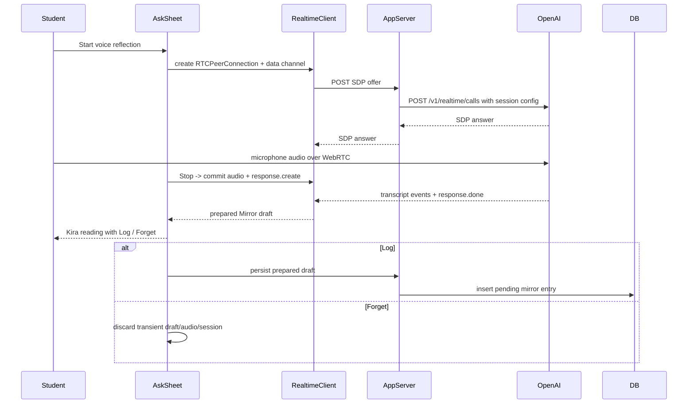
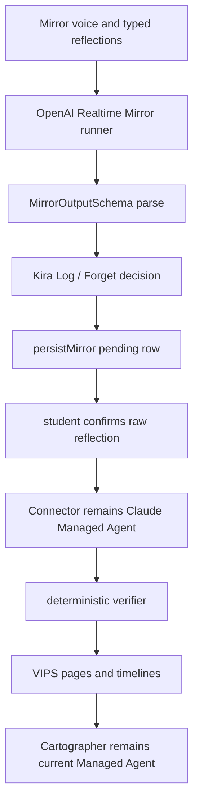

# feat: Move Mirror reflection to OpenAI Realtime

## Summary

Switch the Mirror path for Student Space reflections from `OpenAI transcription -> Anthropic Managed Agent Mirror` to OpenAI Realtime as the Mirror runtime. Voice recordings should connect to a Realtime session over WebRTC, let the Realtime model receive the student's audio, and produce the same `validation / inferred_meaning / story_reframe` Mirror draft the app already knows how to render and persist.

Connector must stay on Claude through the existing Anthropic Managed Agent path. The manual confirmed-entry Connector policy, deterministic verifier, VIPS taxonomy, and Cartographer flow remain unchanged.

---

## Problem Frame

The current shipped flow is a split-provider chain: Student Space voice captures use browser audio, the server transcribes with OpenAI speech-to-text, and `runMirrorForStudent` then dispatches Mirror through Anthropic Managed Agents. That matched the completed audio plans, but the new direction is to make the Mirror agent itself an OpenAI Realtime agent.

This is a provider-boundary change, not a product-loop rewrite. The Kira reading screen should still be the decision point over a real Mirror draft, `Log` should still be the first durable write, and `Forget` should still discard the draft without creating corpus evidence. Connector should continue to process confirmed reflections later through Claude.

---

## Assumptions

- "Mirror agents" means the product-facing Mirror reflection generator. It does not include Connector, Cartographer, or the self-critique reviewer unless a later request expands the scope.
- The quiet-mirror ritual remains non-interviewing. OpenAI Realtime is used for low-latency voice capture and Mirror draft generation, but the UI should not introduce an AI interviewer voice during recording in this pass.
  - **Superseded 2026-05-21**: a two-mode (gathering / reflecting) live Companion now ships in `buildRealtimeMirrorLiveInstructions`. See `src/agents/openai-realtime/mirror-payloads.ts` for the current live-audio prompt. JSON-mode generation (`buildRealtimeMirrorInstructions`) is unchanged and still non-interviewing.
- `gpt-realtime-2` is the planned default model because current OpenAI Realtime guidance names it as the state-of-the-art reasoning voice model. Keep the model behind `OPENAI_REALTIME_MIRROR_MODEL` so implementation can adjust if availability differs in the target account.
- The OpenAI developer-docs MCP was not available in this Codex session, so official OpenAI web docs were used as the planning source.

---

## Requirements

- R1. Student Space voice captures must use an OpenAI Realtime session for audio intake, transcription, and Mirror draft generation; the primary path should no longer upload a whole blob to the Whisper-style transcription helper before Mirror.
- R2. Typed reflections and legacy Mirror call sites must also route Mirror generation through the OpenAI Realtime Mirror runner so the Mirror provider is consistent.
- R3. Mirror output must keep the existing `MirrorOutputSchema`: `validation`, `inferred_meaning`, and `story_reframe`. No database schema change is required for the student-facing draft.
- R4. `Log` / `Forget` semantics remain unchanged: drafts are ephemeral until `Log`; raw audio is not persisted; logged entries start as pending raw reflections.
- R5. Connector remains Claude-backed through Anthropic Managed Agents and continues to run over confirmed, unconnected mirror entries only.
- R6. Cartographer and `self_critique` stay on their current Anthropic Managed Agent bindings unless separately changed.
- R7. The browser must never receive the standard OpenAI API key. Realtime session creation is brokered by authenticated server code and includes a stable privacy-preserving safety identifier.
- R8. If OpenAI Realtime setup or parsing fails, the UI should surface retry / typed fallback. It must not silently fall back to Claude Mirror generation.
- R9. Provisioning, smoke scripts, README, and `plans/CURRENT_STATE.md` must describe the new provider split after implementation: OpenAI Realtime for Mirror; Claude Managed Agents for Connector, Cartographer, and self-critique.

**Origin actors:** Student, Mirror agent, Connector agent, deterministic verifier, Cartographer agent, demo operator.

**Origin flows:** Student Space voice reflection, typed reflection, Mirror draft decision, pending reflection review, manual Connector sense-making.

---

## Scope Boundaries

- This plan changes the Mirror runtime and voice transport only. It does not redesign the Mirror prompt goal, output fields, review queue, Connector, Cartographer, verifier, VIPS taxonomy, tenancy, or persistence model.
- This plan does not make Connector run immediately after `Log`; Connector remains manual or scheduled over confirmed reflections.
- This plan does not add a durable Kira chat or "Talk more" flow.
- This plan does not persist raw audio, call video/camera APIs, or send camera frames to OpenAI.
- This plan does not require deleting the old OpenAI transcription helper immediately. It can remain for legacy tests or explicit fallback utilities, but it should not be the main Student Space Mirror voice path.
- This plan does not remove Anthropic entirely. Connector must stay Claude, and Cartographer/self-critique remain unchanged.

---

## Current Wiring Gaps

- `src/server/prepare-student-space-reflection.handler.server.ts` currently does `transcribeMirrorAudio(...)` when audio is present, then calls `runMirrorForStudent(...)`.
- `src/server/run-mirror.handler.server.ts` currently calls `getManagedAgentBinding('mirror')` and dispatches to `runManagedAgent(...)`.
- `src/agents/config.ts` treats `mirror` as one of the required Anthropic managed-agent bindings.
- `scripts/managed-agents/provision.ts` provisions `mirror` with `claude-sonnet-4-6` alongside Connector, Cartographer, and self-critique.
- `src/lib/student-space/backend-bridge.ts` exposes `prepareReflection(...)` as a server function call; it has no Realtime session lifecycle for browser voice.
- `src/engine/student-space/Game/View/AskSheet.js` already owns voice UI state and audio capture, but it posts base64 blobs to the bridge instead of managing a Realtime peer connection.
- `README.md` and `plans/CURRENT_STATE.md` currently say Mirror is Anthropic Managed Agents and OpenAI is transcription-only.

---

## Context & Research

### Relevant Code and Patterns

- `src/engine/student-space/Game/View/AskSheet.js` is the Student Space capture surface and decision screen.
- `src/lib/student-space/backend-bridge.ts` is the boundary between engine UI and durable app operations.
- `src/server/prepare-student-space-reflection.handler.server.ts` is the current prepare-before-persist server composition point.
- `src/server/run-mirror.handler.server.ts` is the correct compatibility seam for legacy typed or server-side Mirror runs.
- `src/agents/mirror.prompt.md` and `src/agents/schemas.ts` define the behavior and exact output schema to preserve.
- `src/server/persist-mirror.handler.server.ts` remains the only place a Mirror draft becomes a durable `mirror_entries` row.
- `src/server/run-connector.handler.server.ts`, `src/agents/connector.prompt.md`, and `src/agents/verifier.ts` are the Connector path that must stay Claude-backed and verifier-gated.
- `test/engine/student-space-ask-audio.test.ts`, `test/server/prepare-student-space-reflection.test.ts`, `test/server/run-connector.test.ts`, and `test/agents/managed-connector.test.ts` are the nearest coverage anchors.

### Institutional Learnings

- `plans/CURRENT_STATE.md` is the routing source for the current product shape; do not infer from older quiet-mirror docs alone.
- The Student Space engine `StorageAdapter` is local UI/cache persistence. Durable Mirror/VIPS/Cartographer operations must stay behind named bridge methods and server functions.
- Connector currently processes confirmed reflections only. Preserving that policy is part of this provider migration.

### External References

- OpenAI Realtime WebRTC docs say browser/client Realtime connections should use WebRTC for more consistent performance, and can be initialized through a server-side unified interface at `/v1/realtime/calls`.
- OpenAI Realtime conversations docs describe sessions, conversations, responses, WebRTC-assisted media handling, input audio transcription when enabled, and `response.create` / `response.done` event flow.
- OpenAI Realtime prompting docs name `gpt-realtime-2` as the state-of-the-art reasoning voice model and recommend prompt restructuring plus evals when migrating to Realtime models.

---

## Key Technical Decisions

- **Mirror moves to OpenAI Realtime; Connector stays Claude.** The provider split should be explicit in code and docs: Mirror no longer depends on `MANAGED_AGENT_MIRROR_*`, while Connector continues through `runManagedAgent` and `MANAGED_AGENT_CONNECTOR_*`.
- **Use WebRTC for browser voice Mirror sessions.** OpenAI recommends WebRTC for browser Realtime connections. Student Space is a browser voice surface, so the primary voice path should be `RTCPeerConnection` + data channel, not a base64 upload loop.
- **Use the unified server-side Realtime call setup.** A server route accepts the browser SDP offer, authenticates the user, adds the OpenAI session config and safety identifier, sends it to `/v1/realtime/calls` with the server API key, and returns the SDP answer. This avoids exposing a standard OpenAI key or minting client secrets unless implementation finds the unified path incompatible with the hosting environment.
- **Keep the ritual text-only at the decision point.** Configure the Mirror session so the final persisted draft is text JSON. The UI can show low-latency listening/reflecting states, but this pass should not play a model voice back to the student during capture.
- **Preserve `MirrorOutputSchema` with validation and repair.** Realtime output is parsed through the same Zod schema. If the final response is not parseable JSON, run one Realtime repair turn or surface a retryable prepare failure; do not write partial Mirror data.
- **Server-side typed/legacy calls use a Realtime runner too.** Voice uses browser WebRTC. Typed reflections and existing server-call seams should use a server-side Realtime WebSocket/text runner so all Mirror generation uses the same provider.
- **Do not use Claude as hidden Mirror fallback.** A hidden fallback would violate the user's requested provider switch and make provider debugging impossible. Fail visibly instead.
- **Keep existing persistence and safety gates.** `persistMirror` still owns diagnostic-language checks, review status, mood tags, raw output trace, and memory append.

---

## Open Questions

### Resolved During Planning

- Should Connector move to OpenAI too? No. The user explicitly asked to keep Connectors on Claude.
- Should the old OpenAI transcription helper remain? Yes, as legacy/supporting code for now. The main Student Space voice Mirror path should stop depending on it.
- Should Realtime introduce a live interviewing voice? No. The existing quiet-mirror identity is preserved; Realtime is the Mirror runtime, not a new interview UX.
  - **Superseded 2026-05-21**: the live-audio path now does ship an active two-mode Companion. See `buildRealtimeMirrorLiveInstructions` for the current live prompt. JSON-mode Mirror generation remains non-interviewing.
- Should Mirror silently fall back to Claude if Realtime fails? No. Surface retry or typed fallback.

### Deferred to Implementation

- Exact Realtime event names to treat as authoritative for final transcript and final JSON. Implementation should verify against the installed OpenAI docs/SDK shape and write contract tests around the chosen events.
- Whether direct WebRTC unified interface works cleanly in the deployed TanStack/Vercel route shape; if not, switch to server-minted ephemeral client secrets while preserving server auth and safety identifier.
- Whether Node 22's built-in `WebSocket` is sufficient for the server-side typed runner or a small dependency is needed.

---

## High-Level Technical Design

> *This illustrates the intended approach and is directional guidance for review, not implementation specification.*

---

## Implementation Units

### U1. Add the OpenAI Realtime Mirror provider boundary

**Goal:** Introduce a Mirror-specific OpenAI Realtime runner that returns the existing `MirrorOutputSchema` and replaces Anthropic Managed Agents for Mirror generation.

**Requirements:** R2, R3, R6, R8

**Dependencies:** None

**Files:**
- Create: `src/agents/openai-realtime/mirror-runner.ts`
- Create: `src/agents/openai-realtime/mirror-prompt.ts`
- Create: `src/agents/openai-realtime/config.ts`
- Modify: `src/server/run-mirror.handler.server.ts`
- Modify: `src/agents/config.ts`
- Test: `test/agents/openai-realtime-mirror.test.ts`
- Test: `test/server/run-mirror.test.ts`

**Approach:**
- Move the reusable Mirror instructions into a Realtime-friendly prompt builder that preserves `src/agents/mirror.prompt.md` behavior but is structured for Realtime's more literal prompt-following.
- Add `OPENAI_REALTIME_MIRROR_MODEL`, defaulting to `gpt-realtime-2`, and keep `OPENAI_API_KEY` as the auth source.
- Implement a server-side Realtime runner for typed/legacy calls using a text-only session over WebSocket. It should send the transcript as user input, request a final text JSON response, parse through `MirrorOutputSchema`, and return the same shape callers already expect.
- Update `runMirrorForStudent` so the default path calls the OpenAI Realtime Mirror runner. Keep the existing `deps.runMirror` test seam.
- Remove Mirror from the required Anthropic binding type or split the type so `getManagedAgentBinding('mirror')` is no longer reachable in production Mirror code.
- Include provider trace metadata (`provider: 'openai_realtime'`, model, response id/session id when available) in returned diagnostics so persistence can record it in `raw_output` or `trace`.

**Test scenarios:**
- Happy path: `runMirrorForStudent` calls the OpenAI Realtime runner and returns `validation`, `inferred_meaning`, and `story_reframe`.
- Happy path: typed transcript path does not read `MANAGED_AGENT_MIRROR_ID`.
- Edge case: Realtime returns fenced JSON or leading prose; parser extracts or repair-retries before failing.
- Error path: unparseable Realtime output throws a retryable Mirror prepare error and does not call persistence.
- Regression: `deps.runMirror` still overrides the provider for unit tests.

**Verification:**
- Existing Mirror consumers can run without `MANAGED_AGENT_MIRROR_*` env vars while Connector tests still require/use the Connector managed-agent binding seam.

---

### U2. Add a server-brokered Realtime WebRTC session for voice captures

**Goal:** Let the browser establish an authenticated OpenAI Realtime voice session without exposing the standard OpenAI API key.

**Requirements:** R1, R4, R7, R8

**Dependencies:** U1

**Files:**
- Create: `src/routes/api/openai/realtime-mirror.tsx`
- Create: `src/server/openai-realtime-mirror-session.handler.server.ts`
- Create: `src/lib/student-space/realtime-mirror-client.ts`
- Test: `test/server/openai-realtime-mirror-session.test.ts`
- Test: `test/lib/student-space/realtime-mirror-client.test.ts`

**Approach:**
- Add an API route that accepts raw SDP offers with `Content-Type: application/sdp`.
- Authenticate through the existing counselor/student context before creating any OpenAI session.
- Build a Realtime session config with the Mirror prompt, `model: OPENAI_REALTIME_MIRROR_MODEL`, input audio transcription enabled, text output for the final draft, and turn detection configured for the app's explicit Stop action.
- Forward the SDP offer and session config to `https://api.openai.com/v1/realtime/calls` using the server's `OPENAI_API_KEY`.
- Set `OpenAI-Safety-Identifier` to a stable privacy-preserving value derived server-side from the active student id.
- Return the SDP answer to the browser. Do not log SDP, audio, transcript text, or raw response bodies.
- Add a browser helper that creates the peer connection, adds the microphone track, opens the `oai-events` data channel, commits on Stop, listens for transcript/final-response events, parses the final Mirror JSON, and always tears down tracks/connections.

**Test scenarios:**
- Happy path: authenticated SDP request is proxied to OpenAI with multipart `sdp` and `session` fields and returns the SDP answer.
- Happy path: server request includes a safety identifier derived on the server, not supplied by the browser.
- Error path: unauthenticated request returns an auth error before calling OpenAI.
- Error path: OpenAI setup failure returns a display-safe error without leaking upstream response body.
- Client path: helper requests microphone audio only, creates a data channel, and closes tracks/peer connection on completion or failure.

**Verification:**
- A browser voice session can be established in dev without exposing `OPENAI_API_KEY` to client code or network responses.

---

### U3. Cut Student Space Ask from blob transcription to Realtime Mirror preparation

**Goal:** Make the visible voice recording flow prepare its Mirror draft through the Realtime session, then reuse the existing `Log` / `Forget` decision flow.

**Requirements:** R1, R3, R4, R8

**Dependencies:** U1, U2

**Files:**
- Modify: `src/engine/student-space/Game/View/AskSheet.js`
- Modify: `src/engine/student-space/style.css`
- Modify: `src/lib/student-space/backend-bridge.ts`
- Modify: `src/server/prepare-student-space-reflection.handler.server.ts`
- Modify: `src/server/mirror-function-schemas.ts`
- Test: `test/engine/student-space-ask-audio.test.ts`
- Test: `test/lib/student-space/backend-bridge.test.ts`
- Test: `test/server/prepare-student-space-reflection.test.ts`

**Approach:**
- For voice captures in bridged mode, replace the base64 blob prepare call with the Realtime client helper. The helper should return the transcript and parsed Mirror draft to the same AskSheet state that currently renders the Kira reading.
- Keep typed captures on `backend.prepareReflection({ transcript })`, but that server path now uses the OpenAI Realtime runner from U1.
- Preserve offline/no-bridge fallback behavior separately. If no backend bridge or no Realtime capability exists, typed capture remains available and local heuristics can stay offline-only.
- On `Log`, keep using `backend.logPreparedReflection(...)` and `persistMirror`; on `Forget`, discard the local draft and close without persistence.
- Remove or quarantine code that assumes a voice prepare failure can retry from a persisted base64 blob. Raw audio should remain only in the live Realtime session/microphone stream.
- Update working states from "transcribing" to a clearer "listening / reflecting / ready" flow, without adding visible instructional copy beyond what the existing UI pattern needs.

**Test scenarios:**
- Happy path: voice Stop commits a Realtime session and renders the returned `story_reframe` on the Kira reading screen.
- Happy path: no call to `transcribeMirrorAudio` is made for the bridged voice path.
- Happy path: typed reflection calls the server prepare path and receives a Realtime Mirror draft.
- Happy path: `Log` persists exactly one pending mirror entry with the Realtime transcript and Mirror fields.
- Edge case: `Forget` after a Realtime draft never calls persistence and never creates a local capture.
- Error path: Realtime setup failure returns to compose/retry with typed fallback available.
- Error path: final Mirror JSON parse failure shows a retryable prepare error and does not persist.

**Verification:**
- In bridged mode, a voice recording reaches the Kira reading screen through OpenAI Realtime, not through `audioBase64 -> transcribeMirrorAudio -> Claude Mirror`.

---

### U4. Keep Connector on Claude and clean up managed-agent provisioning

**Goal:** Make the provider split impossible to misread or accidentally undo: Mirror is OpenAI Realtime; Connector stays Claude Managed Agents.

**Requirements:** R5, R6, R9

**Dependencies:** U1

**Files:**
- Modify: `scripts/managed-agents/provision.ts`
- Modify: `src/agents/config.ts`
- Modify: `src/agents/runner.ts`
- Modify: `README.md`
- Modify: `plans/CURRENT_STATE.md`
- Test: `test/agents/managed-connector.test.ts`
- Test: `test/agents/managed-cartographer.test.ts`
- Test: `test/agents/self-critique-eval.test.ts`
- Test: `test/server/run-connector.test.ts`

**Approach:**
- Remove Mirror from `buildAgentSpecs()` or mark it as legacy/skipped so new provisioning no longer creates or updates a Claude Mirror agent.
- Preserve Connector, Cartographer, and self-critique provisioning with their current Claude defaults.
- Update env-var documentation: `MANAGED_AGENT_CONNECTOR_ID`, `MANAGED_AGENT_CARTOGRAPHER_ID`, and `MANAGED_AGENT_SELF_CRITIQUE_ID` remain required for those paths; `MANAGED_AGENT_MIRROR_ID` is no longer required for the app's Mirror runtime.
- Keep managed-agent runner tests focused on Connector/Cartographer/self-critique so a future cleanup does not delete shared Anthropic support by mistake.
- Update README's agent table and setup instructions after implementation.

**Test scenarios:**
- Happy path: provisioning with `--update-existing connector,cartographer,self_critique` leaves Connector Claude model settings intact.
- Regression: Connector still calls `getManagedAgentBinding('connector')` and `runManagedAgent`.
- Regression: running Connector with no Mirror managed-agent env vars still works.
- Regression: Cartographer and self-critique remain on their current managed-agent paths.

**Verification:**
- Smoke tests prove `smoke:managed-connector` still exercises Claude Connector, while Mirror smoke/eval commands use the OpenAI Realtime Mirror path.

---

### U5. Rebaseline Mirror evals, smoke checks, and docs

**Goal:** Make the provider migration testable and visible to future sessions.

**Requirements:** R3, R8, R9

**Dependencies:** U1-U4

**Files:**
- Modify: `scripts/managed-agents/smoke-mirror.ts`
- Modify: `scripts/ablate.ts`
- Create: `test/ablation/reports/2026-05-19-openai-realtime-mirror.md`
- Modify: `test/ablation/mirror-tools-off.test.ts`
- Modify: `README.md`
- Modify: `plans/CURRENT_STATE.md`
- Test: `test/ablation/mirror-tools-off.test.ts`
- Test: `test/routes/dev.pipeline.test.tsx`

**Approach:**
- Rename or update Mirror smoke scripts so they no longer imply Anthropic Managed Agents. Keep Connector/Cartographer smoke scripts as managed-agent scripts.
- Run a Mirror ablation/rebaseline against representative seed reflections with OpenAI Realtime and compare against the most recent managed-Mirror report.
- Include failures that matter for Realtime specifically: transcript quality, no-advice/no-interviewing, parse reliability, and JSON repair rate.
- Update `/dev/pipeline` or trace rendering only if provider trace metadata is user-visible to developers. Do not add a student-facing provider badge.
- Update `plans/CURRENT_STATE.md` only after implementation and verification, changing product shape to say Mirror is OpenAI Realtime and Connector remains Claude.

**Test scenarios:**
- Smoke: one typed Mirror run returns valid schema through OpenAI Realtime.
- Smoke: one voice Mirror browser session can complete in a mocked or browser-level test without camera/video access.
- Regression: `/dev/pipeline` renders Realtime-backed mirror rows with normal pending/confirmed/forgotten review states.
- Regression: standard `pnpm check`, `pnpm test`, and `pnpm build` pass after route generation.

**Verification:**
- A manual browser walkthrough proves the main loop: voice reflection -> OpenAI Realtime Mirror draft -> Log -> pending review -> Confirm -> Claude Connector -> verified VIPS evidence.

---

## System-Wide Impact

- **Provider topology:** Mirror becomes OpenAI Realtime. Connector, Cartographer, and self-critique remain Anthropic Managed Agents.
- **Latency shape:** Voice reflection should feel more immediate because audio reaches the Mirror runtime continuously instead of waiting for a whole-blob upload and separate transcription call.
- **Privacy boundary:** Raw audio stays transient in the browser/OpenAI Realtime session and is not persisted by the app. The app persists transcript and Mirror fields only after `Log`.
- **Failure modes:** Session setup, microphone, Realtime event parsing, and JSON schema validation become first-class prepare failures.
- **Operational config:** `OPENAI_API_KEY` becomes required for Mirror generation, not only transcription. `MANAGED_AGENT_MIRROR_*` becomes legacy; Connector managed-agent env vars remain required.
- **Testing posture:** Existing server handler tests cover schema/persistence; new tests need to cover Realtime session setup and data-channel event parsing without making live network calls.

---

## Risks & Dependencies

| Risk | Mitigation |
|------|------------|
| Realtime final output is not reliably strict JSON | Keep response text-only for the final draft, parse through `MirrorOutputSchema`, repair once, fail visibly if still invalid, and track parse repair rate in ablation. |
| Realtime voice UX drifts into interviewing | Configure explicit Stop-driven turn flow and text final output; prompt says no questions/no advice/no interviewing; test that the draft contains no question prompts. |
| Unified WebRTC setup is awkward on the deployment host | Keep an implementation escape hatch to server-minted ephemeral client secrets while preserving auth, safety identifier, and no standard API key in browser. |
| Connector provider boundary gets accidentally changed | Update provisioning and tests to assert Connector still uses `claude-sonnet-4-6` through managed agents. |
| Mirror loses prior student-voice memory access | Include recent prior mirror summaries in the Realtime prompt context server-side or explicitly defer memory parity if not needed for this pass. Do not silently assume Anthropic memory-store mounting still applies. |
| Browser support differs across Chrome/Safari | Feature-detect `RTCPeerConnection`, `getUserMedia`, and data channel support; keep typed fallback available. |
| Costs become harder to compare | Add provider/model/session metadata to trace and ablation reports; do not rely on old Anthropic token counters for Mirror. |

---

## Documentation / Operational Notes

- After implementation, README should say: Mirror uses OpenAI Realtime; Connector and Cartographer use Claude Managed Agents; self-critique remains Claude best-effort.
- `pnpm provision:managed-agents -- --update-existing connector,cartographer,self_critique` should be the documented provisioning command unless Mirror legacy provisioning is intentionally retained.
- Keep `OPENAI_REALTIME_MIRROR_MODEL` documented near `OPENAI_API_KEY`.
- Do not update `plans/CURRENT_STATE.md` product-shape bullets to claim the migration is live until the implementation and verification are complete.

---

## Sources & References

- Current state: [plans/CURRENT_STATE.md](../../plans/CURRENT_STATE.md)
- Completed audio plan: [docs/plans/2026-05-18-003-feat-student-space-demo-data-audio-plan.md](2026-05-18-003-feat-student-space-demo-data-audio-plan.md)
- Mirror result decision plan: [docs/plans/2026-05-18-004-feat-mirror-result-log-forget-plan.md](2026-05-18-004-feat-mirror-result-log-forget-plan.md)
- Mirror handler: [src/server/run-mirror.handler.server.ts](../../src/server/run-mirror.handler.server.ts)
- Student Space Ask sheet: [src/engine/student-space/Game/View/AskSheet.js](../../src/engine/student-space/Game/View/AskSheet.js)
- Backend bridge: [src/lib/student-space/backend-bridge.ts](../../src/lib/student-space/backend-bridge.ts)
- Connector handler: [src/server/run-connector.handler.server.ts](../../src/server/run-connector.handler.server.ts)
- OpenAI Realtime WebRTC docs: [Realtime API with WebRTC](https://platform.openai.com/docs/guides/realtime-webrtc)
- OpenAI Realtime conversations docs: [Realtime conversations](https://platform.openai.com/docs/guides/realtime-conversations)
- OpenAI Realtime prompting docs: [Using realtime models](https://platform.openai.com/docs/guides/realtime-models-prompting)
