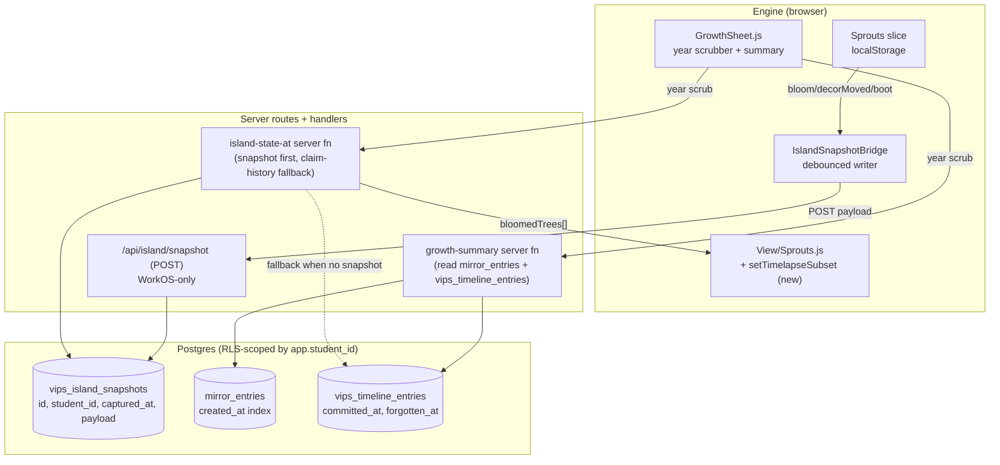

# feat: Year-over-year growth monitoring — island timelapse + activity summary

## Overview

A new engine surface — the **Growth Sheet** — that lets a student scrub through their island state year by year and read a short quantitative summary of what changed between adjacent years ("between 2026 and 2027 you recorded 14 voice reflections, 6 became VIPS claims, and your dominant dimension shifted from Interests to Skills").

The plan ships in one PR but splits into two clearly different feasibility tiers:

1. **Summary panel — feasible from current data.** `mirror_entries` and `vips_timeline_entries` already carry insert-only timestamps and are RLS-scoped per student. We can bucket them by Singapore calendar year today.

2. **Visual timelapse — forward-looking.** Today the island's visual state (`Sprouts.bloomedTrees`, `decorOffsets`) is **localStorage-only** — wiping local state resets the island. No server-authoritative history exists. This plan starts logging snapshots now and synthesises a coarse stand-in from `vips_timeline_entries` for any year before snapshotting began. The UI is honest about the difference: "snapshot from N" vs "reconstructed from claims".

A short narrative line is templated, not AI-generated in v1 (deferred until we see what students actually find readable).

---

## Problem Frame

Students using this product today see a present-tense island. There is no surface that lets them look back and see "how I've grown" across years — neither visually (the island as it was) nor quantitatively (what I actually did). The product's whole pitch is sensemaking over time, and yet time is the one dimension we currently hide.

Three classes of student stand to benefit:
- **The student themself** — looking at "where I was last year vs now" is the moment the app's value becomes legible. Without it, every session feels like the first one.
- **Parents and teachers viewing a shared profile** — the share-token page currently shows a present-tense snapshot. "Look how this changed in a year" is a stronger artefact than "here's where they are today".
- **Re-engagement** — a student returning after months away sees a static current state, not "here is what happened while you were gone".

The constraint that shapes the plan: **the engine substrate is the live home**, and nearly all visible island state is local. We cannot retroactively reconstruct a student's bloomed-trees array for 2025 — that data lives on whatever device they last used. We can reconstruct the *claim crystallisation* history (server-authoritative) and use that as a coarse proxy island. We can also start snapshotting now so future years are reconstructable with fidelity.

---

## Requirements Trace

- R1. A new engine sheet (`GrowthSheet.js`) opens via the TopNav and via `?sheet=growth` deep link. Year scrubber at the top, island view in the centre, summary panel alongside.
- R2. Year buckets are **calendar years in Singapore time** (Asia/Singapore, UTC+8). Year boundary is `00:00 SGT on January 1`. The scrubber surfaces the years for which the student has *any* activity (mirror entry, crystallised claim, or island snapshot) — empty years are skipped, not shown as zero-state slots.
- R3. The summary panel for a selected year displays: voice-reflection count, VIPS-claim crystallisation count, claim-forget count, dominant-dimension label, and a one-line templated narrative comparing this year to the prior year (or "your first year on SenseMake" when no prior year exists).
- R4. The visual island uses the engine's existing `View/Sprouts.js` rendering, fed a year-specific `bloomedTrees[]` payload via a new **timelapse mode** that never writes through to the slice (scrubbing backwards must not destroy real present-day state).
- R5. The historical island payload is **hybrid**: served from `vips_island_snapshots` when a snapshot ≤ year-end timestamp exists for the student, otherwise synthesised from `vips_timeline_entries` (one synthetic bloomed-tree per crystallised, non-forgotten claim as of year-end). The UI surfaces which mode is in use via a small label ("snapshot" vs "reconstructed from claims").
- R6. A new table `vips_island_snapshots` stores periodic `Sprouts` slice payloads server-side. RLS uses the existing `RLS_STUDENT_PREDICATE` (`student_id = current_setting('app.student_id', true)`) — no counselor bypass. Indexed on `(student_id, captured_at desc)`.
- R7. The engine writes a snapshot to `/api/island/snapshot` on three triggers: (a) game boot / sheet open (throttled to once per hour per student per session), (b) every `bloom` event in `Sprouts`, (c) every successful `decorMoved` event. Demo / dev-bypass accounts are 403'd — same gating as the share endpoints.
- R8. The summary panel sources its counts from server-authoritative tables only — `mirror_entries.created_at` for voice reflections, `vips_timeline_entries.committed_at` / `forgotten_at` for claims and forgets. Engine-local `Captures.entries[]` (photo / ask / trajectory) is **not** counted in v1 because it has no server-authoritative history; copy is "voice reflections", not the broader "captures".
- R9. All motion respects `prefers-reduced-motion: reduce`. The scrub transition between years is a crossfade in reduced-motion mode; species bob/pulse on the historical island view pauses.
- R10. A "tracking started on YYYY-MM-DD" stamp is shown when the displayed year uses claim-history reconstruction rather than a real snapshot. This sets honest expectations for new users: this year's island is real; older years are inferred.
- R11. The growth sheet is **not** exposed on the public `/share/$token` route in v1. Sharing the growth view requires a follow-up plan (cross-cuts the redaction model). Owners viewing their own share URL do not see a growth tab.
- R12. `getGrowthSummary` and `getIslandStateAt` are pure read functions. They never write to the DB. The only writer in this plan is the snapshot endpoint (`/api/island/snapshot`).

---

## Scope Boundaries

- Not building monthly or weekly granularity. The scrubber resolution is **year**. Finer granularity is a clear follow-up if students ask for it.
- Not building counselor-visible growth views. Counselor surfaces are not yet expanded; revisit after that work lands.
- Not adding the growth sheet to the share-token public route. Public growth-share is a separate plan (cross-cuts redaction + name-snapshot semantics).
- Not building an engine → server bridge for `Captures.entries[]`, `MoodPins`, or `Profile.quotes`. The v1 summary uses `mirror_entries` exclusively for activity counts. Bridging the other slices is a separate plan once the snapshotting pattern proves itself.
- Not implementing AI-generated narrative lines. The single one-line read is templated against a small set of patterns. AI narrative is a follow-up.
- Not adding `vips_pages` historical-rewrite reconstruction. The audit shows `vips_pages.updated_at` overwrites in place, so "compiled truth as of year N" is only approximately recoverable via `vips_proposed_diffs.payload_json`. v1 omits this; the summary speaks about claim *counts*, not compiled-truth text.
- Not snapshotting on every state mutation. The snapshot triggers are deliberately coarse (boot, bloom, decorMoved) — not every micro-mutation — to keep write volume low.

### Deferred to Follow-Up Work

- Per-month granularity within a year: defer until students request finer resolution.
- AI-generated narrative line: defer; ship templated first.
- Counselor growth view: defer to the counselor-surface expansion plan.
- Public sharing of growth view: defer; cross-cuts the share-token redaction model.
- Bridging engine `Captures.entries[]`, `MoodPins`, and engine `Profile.quotes` to Postgres: defer; v1 summary uses `mirror_entries` only.
- Historical compiled-truth reconstruction from `vips_proposed_diffs.payload_json`: defer; surface as a follow-up if students want to read "what your VIPS page said back then".
- Snapshotting `Profile.quotes` and `Captures.entries[]` alongside `Sprouts.bloomedTrees`: defer; first prove the snapshot pattern with the smaller slice.

---

## Context & Research

### Relevant Code and Patterns

- **Engine substrate convention** — `src/engine/student-space/Game/State/*` singleton slices with subscribe + persist pattern. Mirror to localStorage under `ss:v1:*`. See `docs/solutions/2026-05-18-island-progression-engine-substrate.md` for the canonical list of invariants. **Key invariant: `hydrate()` must NOT fan to subscribers** — bulk load is not an `add`/`spawned` event.
- **Snapshot stability for React bridges** — `Sprouts.js` invalidates `_snapshotCache` on every mutation so `useSyncExternalStore` returns referentially-stable arrays. Any new bridge slice (`IslandSnapshotBridge`) follows the same pattern.
- **`withStudent` + RLS pattern** — every student-scoped read/write goes through `src/db/client.ts withStudent(studentId, fn)`. New tables enable RLS with the shared `RLS_STUDENT_PREDICATE`. See `src/db/schema.ts:40` for the constant.
- **Auth gating for write endpoints** — `src/server/share-token.handler.server.ts assertWorkosOnly()` is the canonical pattern for "demo and dev-bypass get 403, real WorkOS sessions write". Reuse exactly.
- **Server function wrapping for route loaders** — `src/server/load-public-profile.functions.ts` shows the `createServerFn({ method: 'GET' }).inputValidator(...).handler(...)` shape for thin server-function wrappers that lazy-import handlers. New growth-summary and island-state functions follow it.
- **Engine SproutsView reconciliation** — `src/engine/student-space/Game/View/Sprouts.js` owns the capture → mesh dispatch via the `bloomedNodes: Map<id, {tree, group, parts, hitTarget}>`. It currently has no diff path against historical input; this plan adds one.
- **Plan-005 shared-tokens pattern** — TS source + engine JS mirror + drift test (`src/lib/profile-tokens.ts`, `src/engine/student-space/Game/profile-tokens.js`, `test/profile-tokens-drift.test.ts`). U1 of this plan applies the same shape for year-bucketing helpers.

### Institutional Learnings

- **`docs/solutions/2026-05-18-island-progression-engine-substrate.md`** — the only catalogued learning. Critical points: (i) engine is live, `src/components/world/*` is dormant; (ii) state-slice template (singleton + subscribers + `Persistence.KEY/SLICES/empty` triple); (iii) `hydrate` does not fan; (iv) React-bridge snapshot stability; (v) instanced-mesh paths (relevant for U6's timelapse-mode rendering choice).
- **Project memory `project-connector-cadence.md`** — auto-connector is **not** invoked from `persistMirror` today. Year-by-year reconstruction cannot assume connector output is fresh per mirror commit. Reflected in U4 — the "claims crystallised" count uses `vips_timeline_entries.committed_at`, which is set only when a Connector run lands, not when the student records the source mirror entry.

### External References

- No external research required. The plan is fully composable from existing repo patterns (RLS, withStudent, engine slice template, share-token handler shape).

---

## Key Technical Decisions

- **Hybrid historical reconstruction.** Real `vips_island_snapshots` rows when available, claim-history synthesis when not. The split is per-year, not all-or-nothing: a student who joined in 2026 sees a real snapshot for 2026 onwards and a claim-history synthesis for any earlier year their data implies.

  Rationale: Pure-snapshot would lock the feature behind a 12-month wait. Pure-derived loses fidelity for the years where we *do* have full state. Hybrid is honest, immediately useful, and self-improves over time.

- **Year buckets are calendar years in Asia/Singapore (UTC+8), boundary `00:00 SGT on Jan 1`.** All Postgres time comparisons use `created_at AT TIME ZONE 'Asia/Singapore'` to avoid edge cases at year boundaries for students recording late on Dec 31.

  Rationale: Confirmed with the user. Singapore Primary 1/2/3… cohorts align to calendar years; "Year 2 → Year 3" reads as "Primary 2 → Primary 3" when the student is in school.

- **Activity-count source is `mirror_entries.created_at`, not `Captures.entries[]`.** Engine-local captures (photo / ask / trajectory) are excluded from v1 counts, and copy is "voice reflections" — not "captures" or "entries".

  Rationale: Only the voice-reflection stream is server-authoritative. Counting engine captures would mean either (a) bridging them to Postgres in this plan (scope creep), or (b) producing a count that's wrong on a fresh device or after sign-out.

- **Snapshot writer triggers are deliberately coarse.** Boot/sheet-open (throttled to 1/hour per session), every `bloom`, every `decorMoved`. Not every `add`/`grow`/`markedReady`.

  Rationale: The point of a snapshot is "what does the island look like" at a point in time — pre-bloom sprouts are invisible to viewers and don't need point-in-time fidelity. Capturing only when the visible state changes keeps write volume bounded.

- **Snapshot payload is `Sprouts.serialize()` output verbatim**, stored as `jsonb`. No projection, no normalization, no per-row inserts for individual bloomed trees.

  Rationale: The slice already enforces schema via `mergeSproutsSnapshot`. A `jsonb` blob round-trips cleanly. Per-row tables would force schema-coupling that complicates engine evolution; the slice is the single source of shape truth.

- **Timelapse rendering reuses `View/Sprouts.js`, not a separate icon-based view.** A new `setTimelapseSubset(bloomedTrees)` method diffs against `this.bloomedNodes` and only creates/destroys the delta.

  Rationale: An icon-based timelapse is faster to ship but visually disconnects the growth surface from the rest of the app's identity. The diff-based path preserves the engine's visual language and is bounded — bloomed counts are typically <8 simultaneously, per the existing view's design note.

- **TopNav exposure: a new "Growth" chip, parallel to the Profile chip.** Not a section inside ProfileSheet.

  Rationale: Growth and Profile have different temporal posture — Profile is "who I am now", Growth is "how I changed". Mixing them inside a single sheet conflates them. Parallel chips keep the IA legible.

- **Demo/dev-bypass accounts can read but cannot write snapshots.** Same gating shape as `assertWorkosOnly()` in the share-token handler — 403 with `growth_demo_unsupported` on the snapshot POST. The growth sheet still opens for them and still shows whatever historical reconstruction is available from server-authoritative tables (which for demo data may be empty).

  Rationale: Demo-account writes pollute snapshot history with non-real student data. Read paths are safe because they're scoped by `withStudent`.

---

## Open Questions

### Resolved During Planning

- **Year boundary semantics?** → Calendar year, Jan 1 SGT. Confirmed with user.
- **Snapshot vs derived vs hybrid for historical reconstruction?** → Hybrid. Snapshot when present; claim-history synthesis fallback. UI labels which mode is in use.
- **What counts as an "activity" for the summary panel?** → For v1, only server-authoritative streams: voice reflections (`mirror_entries`) and claim crystallisations/forgets (`vips_timeline_entries`). Engine-local captures are excluded with explicit copy ("voice reflections").
- **Snapshot cadence?** → On boot (throttled 1/hour/session), every `bloom`, every `decorMoved`. Not every micro-mutation.
- **Visual rendering for timelapse?** → Reuse `View/Sprouts.js` with a new `setTimelapseSubset()` diff method. No icon-based view.
- **Where does the growth sheet live in the IA?** → New TopNav chip parallel to Profile. Not a sub-section of ProfileSheet.
- **Snapshot table schema — per-row or blob?** → Single `jsonb` payload per snapshot row. Slice owns the shape.

### Deferred to Implementation

- **Throttle persistence for the boot-trigger snapshot.** The "max 1 snapshot per hour per session" timer can live in memory only (resets on reload) or in localStorage. v1 default is in-memory; if dev observation shows excessive writes on fast reloads, persist to localStorage.
- **Exact `vips_island_snapshots` payload column name.** Likely `payload jsonb not null`. Bikeshed at implementation time if a cleaner name emerges.
- **Synthesised bloomed-tree placement when reconstructing from claims.** The audit notes `placementSeed` is currently derived from sprout id; for synthesised entries the implementer chooses between (a) deriving a stable seed from `vips_timeline_entries.id`, (b) deriving from `canonical_claim_id`. Both are stable; pick whichever produces nicer-looking distributions at hydration time.
- **Whether to bound `vips_island_snapshots` retention.** v1 keeps all snapshots indefinitely (small payloads, few writes). A retention cron is a follow-up if growth proves prohibitive.
- **Templated narrative-line variants.** The exact set of one-liners ("dominant dimension shifted", "first year", "quiet year", "many crystallisations") can be tuned during U4 implementation against real demo data.

---

## High-Level Technical Design

> *This illustrates the intended approach and is directional guidance for review, not implementation specification. The implementing agent should treat it as context, not code to reproduce.*

The hybrid fallback in `IslandAPI` is the load-bearing detail: a student who joined this year sees `Snap`-served frames for the current year and `Timeline`-synthesised frames for earlier years (if any claim crystallised then). The UI surfaces the mode via a small "snapshot" vs "reconstructed from claims" label, so the student knows older years are inferred.

---

## Implementation Units

- U1. **Shared year-bucketing helpers**

**Goal:** A single source-of-truth module that defines the Singapore calendar-year boundary math and exposes pure helpers usable from both the TS side (server functions, React) and the engine JS side (`GrowthSheet.js`, bridges).

**Requirements:** R2

**Dependencies:** None

**Files:**
- Create: `src/lib/year-buckets.ts`
- Create: `src/engine/student-space/Game/year-buckets.js`
- Create: `test/lib/year-buckets.test.ts`
- Create: `test/lib/year-buckets-drift.test.ts`

**Approach:**
- Define `getSgYearBoundary(year: number) → Date` returning `00:00 SGT on Jan 1`.
- Define `bucketYearForTimestamp(iso: string) → number` (calendar year in SGT).
- Define `yearsCoveringActivity(timestamps: string[]) → number[]` (sorted, deduped years where at least one timestamp falls).
- TS source lives in `src/lib/`. Engine JS mirror is a hand-maintained copy. Drift test imports both and compares constants + spot-check outputs across DST/year-boundary inputs.

**Patterns to follow:**
- `src/lib/profile-tokens.ts` + `src/engine/student-space/Game/profile-tokens.js` + `test/profile-tokens-drift.test.ts` from plan-005.

**Test scenarios:**
- Happy path: `bucketYearForTimestamp('2026-06-15T03:00:00Z')` → 2026 (Jun 15 SGT).
- Edge case: `bucketYearForTimestamp('2026-12-31T23:30:00+08:00')` → 2026; `'2027-01-01T00:30:00+08:00'` → 2027.
- Edge case: UTC timestamps that straddle the SGT boundary — `'2026-12-31T17:00:00Z'` (= `2027-01-01T01:00 SGT`) → 2027.
- Happy path: `yearsCoveringActivity(['2025-08-01T00:00:00Z', '2026-02-01T00:00:00Z', '2026-09-15T00:00:00Z'])` → `[2025, 2026]`.
- Drift: imported constants and outputs match between TS and JS mirrors.

**Verification:**
- Year-boundary math is single-sourced; drift test guards against forking.

---

- U2. **`vips_island_snapshots` table + RLS + indexes**

**Goal:** Server-authoritative storage for periodic snapshots of the engine's `Sprouts` slice payload, RLS-scoped per student, queryable by `(student_id, captured_at desc)`.

**Requirements:** R6

**Dependencies:** None

**Files:**
- Modify: `src/db/schema.ts` (new `vipsIslandSnapshots` table)
- Create: `src/db/migrations/0002_island_snapshots.sql`
- Modify: `src/db/migrations/meta/_journal.json` + `0002_snapshot.json` (drizzle-kit generated)
- Test: `test/db/island-snapshots-rls.test.ts`

**Approach:**
- Columns: `id text primary key default gen_random_uuid()`, `student_id text not null`, `captured_at timestamptz not null default now()`, `payload jsonb not null`.
- Enable RLS via `pgPolicy('vips_island_snapshots_rls', { using: RLS_STUDENT_PREDICATE, withCheck: RLS_STUDENT_PREDICATE })`.
- Index `(student_id, captured_at desc)` to serve "latest snapshot ≤ T" and "all snapshots for student" queries cheaply.
- No FK to `students` or any other table. Follows the existing `text`-based tenancy convention.

**Patterns to follow:**
- `vips_share_tokens` definition in `src/db/schema.ts` from plan-005.
- The shared `RLS_STUDENT_PREDICATE` constant on `src/db/schema.ts:40`.

**Test scenarios:**
- Happy path: `withStudent('alice', ...)` insert + select returns the row; `withStudent('bob', ...)` select returns 0 rows.
- Edge case: insert with `student_id = 'alice'` from a `withStudent('bob', ...)` context is rejected by RLS `withCheck`.
- Integration: the `(student_id, captured_at desc)` index is present and used by the latest-snapshot query (verify with `EXPLAIN` in the test).

**Verification:**
- Table exists, RLS is enforced, index is in place. No counselor bypass — counselor sessions get 0 rows for any student.

---

- U3. **Engine snapshot bridge + `/api/island/snapshot` POST**

**Goal:** Persist the `Sprouts` slice payload to the new table on three coarse triggers, with WorkOS-only write gating.

**Requirements:** R7, R12 (no other writers)

**Dependencies:** U1, U2

**Files:**
- Create: `src/engine/student-space/Game/State/IslandSnapshotBridge.js`
- Create: `src/engine/student-space/Game/State/IslandSnapshotBridge.d.ts`
- Modify: `src/engine/student-space/Game/State/State.js` (register the bridge)
- Modify: `src/engine/student-space/Game/Game.js` (wire boot trigger + bridge dispose in Game.dispose)
- Create: `src/server/island-snapshot.handler.server.ts`
- Create: `src/routes/api/island/snapshot.tsx`
- Modify: `src/server/function-schemas.ts` (add `islandSnapshotInputSchema`)
- Test: `test/engine/IslandSnapshotBridge.test.ts`
- Test: `test/server/island-snapshot.test.ts`

**Approach:**
- Bridge is a singleton in the engine state-slice template (per the engine-substrate solution doc). Subscribes to `state.sprouts` for `'bloomed'` and `'decorMoved'` events. Also exposes a `captureNow(reason)` method called from `Game.js` on boot (and on growth sheet open in U7).
- Throttle: in-memory timestamp + minimum 60-minute interval per session. Three event sources race-condition-safe by using a `pending` flag.
- POST shape: `{ payload: <Sprouts.serialize() output> }`. Server validates with zod, calls `withStudent(studentId, ctx => ctx.db.insert(vipsIslandSnapshots).values(...))`.
- Auth: server handler calls a fresh `assertWorkosOnly()` (lifted from `share-token.handler.server.ts`) — demo/dev-bypass get 403 `growth_demo_unsupported`. Engine swallows the 403 silently (snapshotting is fire-and-forget; no user-visible failure for demo).
- Same-origin check on the route layer (mirror `src/routes/api/share/create.tsx isSameOriginRequest`).

**Patterns to follow:**
- Plan-005 share endpoint family: `src/server/share-token.handler.server.ts` for `assertWorkosOnly`, `src/routes/api/share/create.tsx` for the route shell.
- Engine state-slice template (per `docs/solutions/2026-05-18-island-progression-engine-substrate.md`): singleton + `subscribers: Set` + `subscribe(cb)` returning unsubscribe + dispose pattern.

**Test scenarios:**
- Happy path: subscribing to a fake `Sprouts` slice, firing a `'bloomed'` event, asserts that `fetch` is called once with the serialised payload.
- Edge case: two `'bloomed'` events within 60 minutes — only the first POSTs; the second is a no-op.
- Edge case: `'spawned'` and `'grew'` events do NOT trigger a snapshot.
- Error path: server returns 403 `growth_demo_unsupported` — bridge logs once at debug level and stays subscribed without retry storms.
- Happy path (server): WorkOS-authed insert lands a row with `student_id` set by the `withStudent` GUC.
- Error path (server): demo bypass cookie present → 403 with `code: 'growth_demo_unsupported'`.
- Error path (server): cross-origin POST → 403 `cross_origin`.
- Integration: bridge's boot trigger does NOT fire under SSR (no `window`) — fail-safe guard.

**Verification:**
- A real WorkOS session that blooms a sprout produces exactly one row in `vips_island_snapshots`. A demo session that blooms produces zero rows and no console errors visible to the student.

---

- U4. **`getGrowthSummary` server function**

**Goal:** Return per-year summary stats for the calling student, sourced exclusively from server-authoritative tables.

**Requirements:** R3, R8

**Dependencies:** U1

**Files:**
- Create: `src/server/growth-summary.handler.server.ts`
- Create: `src/server/growth-summary.functions.ts`
- Modify: `src/server/function-schemas.ts` (add `growthSummaryInputSchema`)
- Test: `test/server/growth-summary.test.ts`

**Approach:**
- Input: `{ year: number }`.
- Output (discriminated by `kind`):
  - `{ kind: 'ok', year, voiceReflections: number, claimsCrystallised: number, claimsForgotten: number, dominantDimension: 'values'|'interests'|'personality'|'skills'|null, dimensionShift: { from, to } | null, narrative: string, isFirstYear: boolean }`
  - `{ kind: 'no_data', year }` when the student has zero activity in the year.
- `voiceReflections` = `count(mirror_entries) where created_at` falls in the SGT calendar year.
- `claimsCrystallised` = `count(vips_timeline_entries) where committed_at` falls in the year.
- `claimsForgotten` = `count(vips_timeline_entries) where forgotten_at` falls in the year.
- `dominantDimension` = `vips_timeline_entries.dimension` with the highest count for the year (tie → null, surfaced as "no dominant dimension this year" in narrative).
- `dimensionShift` = `{ from: previousYearDominant, to: thisYearDominant }` only when both are non-null and differ. Otherwise null.
- `narrative` is templated from a small set of one-liners — `firstYear`, `dimensionShift`, `quietYear` (low counts), `growth` (above-prior counts), `forgetting` (forgets exceed crystallisations). Specific copy variants tuned during implementation.
- All queries scoped by `withStudent(studentId, ...)` — RLS handles the rest.

**Patterns to follow:**
- `src/server/load-public-profile.functions.ts` for the `createServerFn → handler` shape.
- Drizzle aggregation pattern from `src/db/queries.ts` (existing `count()` + `groupBy()` queries).

**Test scenarios:**
- Happy path: a student with 5 mirror entries in 2026 and 2 crystallisations returns `voiceReflections: 5, claimsCrystallised: 2`.
- Happy path: student with 4 'interests' claims and 6 'skills' claims in 2026 → `dominantDimension: 'skills'`.
- Edge case: 3 'values' + 3 'interests' (tie) → `dominantDimension: null`.
- Edge case: no activity in 2025 → `{ kind: 'no_data', year: 2025 }`.
- Edge case: first year — `isFirstYear: true`, `dimensionShift: null`, narrative uses `firstYear` template.
- Edge case: a mirror entry created at `2026-12-31T23:30:00+08:00` belongs to 2026; one at `2027-01-01T00:30:00+08:00` belongs to 2027.
- Error path: zod parse fails for non-integer year → 400.
- Integration: query runs inside `withStudent` — counselor session for a different student returns no_data (RLS, not error).

**Verification:**
- Counts match a hand-computed expectation for a seeded student fixture. Year-boundary timestamps land in the right bucket.

---

- U5. **`getIslandStateAt` server function (hybrid: snapshot first, claim-history fallback)**

**Goal:** Return a `bloomedTrees[]`-shaped payload for a target year-end timestamp, marking whether it came from a real snapshot or was reconstructed from claim history.

**Requirements:** R5, R10

**Dependencies:** U1, U2

**Files:**
- Create: `src/server/island-state-at.handler.server.ts`
- Create: `src/server/island-state-at.functions.ts`
- Modify: `src/server/function-schemas.ts` (add `islandStateAtInputSchema`)
- Test: `test/server/island-state-at.test.ts`

**Approach:**
- Input: `{ at: string (ISO timestamp), year: number }`.
- Output: `{ source: 'snapshot' | 'reconstructed', capturedAt: string | null, bloomedTrees: BloomedTree[] }`.
- Snapshot path: `select * from vips_island_snapshots where captured_at <= $at order by captured_at desc limit 1`. If found, return its `payload.bloomedTrees` with `source: 'snapshot'` and the row's `captured_at`.
- Reconstructed fallback: `select * from vips_timeline_entries where committed_at <= $at and (forgotten_at is null or forgotten_at > $at)`. Map each row to a synthetic `BloomedTree`:
  - `species` ← dimension via the `DIMENSION_TO_SPECIES` map (values→tree, interests→flower, personality→butterfly, skills→fruit).
  - `treeSpecies` ← deterministic from `canonical_claim_id` hash for `species === 'tree'`.
  - `placementSeed` ← deterministic from `vips_timeline_entries.id`.
  - `bloomedAt` ← `committed_at`.
  - `position` ← `null` (no pick-and-plant data in reconstructed mode; placementSeed drives layout).
- All read-only; no writes.

**Patterns to follow:**
- `src/server/load-public-profile.handler.server.ts` for the read-only-handler shape.
- `src/engine/student-space/Game/State/Sprouts.js` for the `BloomedTree` shape and `DIMENSION_TO_SPECIES` constant.

**Test scenarios:**
- Happy path (snapshot): one snapshot exists at `2026-06-15`; `getIslandStateAt({ at: '2026-12-31T23:59:59+08:00', year: 2026 })` → `source: 'snapshot'`, `capturedAt: '2026-06-15...'`, payload matches.
- Happy path (snapshot precedence): two snapshots at June and November; querying Dec 31 → November snapshot wins (latest ≤ at).
- Happy path (reconstructed): no snapshots, three `vips_timeline_entries` committed in 2026 → `source: 'reconstructed'`, `bloomedTrees.length === 3`, species map matches dimensions.
- Edge case: a claim committed in 2026 but forgotten in 2027 — included when querying `at = 2026-12-31`, excluded when querying `at = 2027-12-31`.
- Edge case: no snapshots and no claims → `source: 'reconstructed'`, `bloomedTrees: []`.
- Integration: counselor session for a different student returns empty (RLS).
- Determinism: same input → same `placementSeed` for synthesised entries across two calls (no randomness leak).

**Verification:**
- A student with a real snapshot sees that snapshot's bloomed trees. A student without snapshots but with claims sees a synthesised island whose species matches their claim dimensions.

---

- U6. **`SproutsView.setTimelapseSubset(bloomedTrees)` — incremental diff against `bloomedNodes`**

**Goal:** Let the GrowthSheet feed a historical `bloomedTrees[]` payload to the engine view without writing through to the slice, without forcing a full reconcile, and without breaking real present-day rendering.

**Requirements:** R4

**Dependencies:** None (view-layer extension only)

**Files:**
- Modify: `src/engine/student-space/Game/View/Sprouts.js`
- Test: `test/engine/SproutsView.timelapse.test.tsx`

**Approach:**
- Add a new public method `setTimelapseSubset(bloomedTrees: BloomedTree[] | null)`.
- When called with `null`, the method restores the live slice state by re-reading `this.state.sprouts.listBloomedTrees()` and reconciling.
- When called with an array, the method diffs `bloomedTrees` against the existing `this.bloomedNodes` Map by id:
  - For ids present in the new array but not in the Map → `_spawnBloomedTree(tree)`.
  - For ids present in the Map but not in the new array → dispose the node's group + parts and remove from the Map.
  - For ids present in both → no-op (existing node already correct; species cannot change retroactively).
- Critical invariant: the method does NOT call `this.state.sprouts.bloom()`, `.hydrate()`, or any other mutating slice method. It only manipulates `this.bloomedNodes` and the THREE scene.
- Bob/pulse tweens continue running so the view doesn't look frozen; the GrowthSheet's reduced-motion gate (U7) is responsible for halting them when prefers-reduced-motion is set.

**Patterns to follow:**
- The existing `_spawnBloomedTree` / `bloomedNodes` machinery in `View/Sprouts.js`.
- The cleanup patterns in `View/Sprouts.js dispose()`.

**Test scenarios:**
- Happy path: `setTimelapseSubset([a, b, c])` on an empty view spawns three nodes; `bloomedNodes.size === 3`.
- Happy path: subsequent `setTimelapseSubset([a, b])` removes `c`; the remaining two nodes keep their THREE.Group references unchanged (no thrash).
- Happy path: `setTimelapseSubset(null)` restores the live slice state.
- Edge case: empty array → all nodes disposed, `bloomedNodes.size === 0`.
- Critical invariant: across multiple `setTimelapseSubset` calls, `this.state.sprouts.bloomedTrees` is never mutated.
- Integration: a node spawned by `setTimelapseSubset` and then removed via the same path leaves no DOM badge orphan and no THREE memory leak (assert `bloomedNodes.size` + `document.querySelectorAll('.sprout-badge').length`).

**Verification:**
- Calling `setTimelapseSubset` repeatedly with overlapping arrays produces O(delta) node creations/deletions, not O(N) full rebuilds. Slice state is never touched.

---

- U7. **`GrowthSheet.js` engine overlay + TopNav chip + deep link**

**Goal:** The user-facing surface — a sheet with year scrubber, summary panel, and the historical island view. Reuses U4 / U5 / U6 plumbing.

**Requirements:** R1, R3, R9, R10, R11

**Dependencies:** U1, U4, U5, U6

**Files:**
- Create: `src/engine/student-space/Game/View/GrowthSheet.js`
- Modify: `src/engine/student-space/Game/View/TopNav.js` (add Growth chip alongside Profile)
- Modify: `src/engine/student-space/Game/index.js` (accept `?sheet=growth` deep link in `initialOverlay`)
- Modify: `src/engine/student-space/style.css` (growth-sheet styles + reduced-motion blocks)
- Test: `test/engine/GrowthSheet.test.tsx`

**Approach:**
- Sheet is registered with the existing `OverlayController` (same registration pattern as `ProfileSheet`).
- Layout (mobile-first, desktop side-by-side):
  - **Top bar**: year scrubber. Years rendered as horizontal pills, only years with activity shown. Active year highlighted. Tap or arrow-key navigation.
  - **Centre**: historical island view. Subscribes to U5 (`getIslandStateAt`) for the active year, feeds the result into the engine's `SproutsView.setTimelapseSubset()` from U6. Source-mode label ("snapshot from June 2026" or "reconstructed from your claims") shown in the corner.
  - **Right (desktop) / below (mobile)**: summary panel. Calls U4 (`getGrowthSummary`) for the active year, renders the templated narrative line + numerical breakdown (voice reflections, claims crystallised, claims forgotten, dominant dimension).
- On sheet close (or year-scrub away from "live"), call `setTimelapseSubset(null)` to restore the live island state. Defensive against the user leaving the engine in timelapse mode.
- Reduced-motion: scrubber transition is a crossfade (no slide) when `(prefers-reduced-motion: reduce)` is set; bob/pulse animations on the historical island are paused via the existing `.sprout` reduced-motion CSS rule.
- Deep link: `?sheet=growth` routes to the sheet via the existing `createGame({ initialOverlay })` plumbing. Year defaults to the most recent year with activity.
- Demo/dev-bypass students see the sheet open normally, see the summary (may be `no_data` for all years), and see whatever U5 reconstruction is possible from the demo data. The snapshot write path stays gated server-side.

**Patterns to follow:**
- `src/engine/student-space/Game/View/ProfileSheet.js` for the sheet skeleton, listener teardown, and reduced-motion CSS hook-in.
- `src/engine/student-space/Game/View/ShareDialog.js` for the open/close + subscribe-during-open pattern.
- The CSS reduced-motion blocks for `.profile-sheet` and `.share-dialog` in `src/engine/student-space/style.css`.

**Test scenarios:**
- Happy path: opening the sheet via TopNav chip mounts the year scrubber populated with `yearsCoveringActivity` output.
- Happy path: clicking year 2026 calls `getGrowthSummary({ year: 2026 })` and `getIslandStateAt({ at: '2026-12-31T23:59:59+08:00', year: 2026 })` exactly once each.
- Happy path: scrubbing from 2026 to 2027 triggers `setTimelapseSubset(newPayload)` with the delta only (verify via the U6 test harness).
- Edge case: a student with zero activity gets a "tracking starts when you record your first reflection" empty state — no scrubber pills, no island view.
- Edge case: sheet close calls `setTimelapseSubset(null)`; the live island is restored.
- Edge case: deep link `?sheet=growth` opens the sheet on mount with the most recent year selected.
- Integration: prefers-reduced-motion true → scrubber crossfade, no slide; bob animations paused.
- Integration: demo session sees the sheet but POSTs no snapshots (no `growth_demo_unsupported` errors surfaced to the student).

**Verification:**
- The student can open the sheet, scrub between years, see counts that match a hand-computed expectation against seeded data, see source-mode labels honestly, and close the sheet returning to a live present-day island.

---

## System-Wide Impact

- **Interaction graph:** New write path (engine `Sprouts` → `IslandSnapshotBridge` → `/api/island/snapshot` → `vips_island_snapshots`). New read paths (GrowthSheet → `getGrowthSummary` and `getIslandStateAt`). New view-layer extension (`SproutsView.setTimelapseSubset`). No existing surface mutates differently because of this work.
- **Error propagation:** Snapshot writes are fire-and-forget — a 403 (demo) or network error stays in the engine's debug log and never reaches the student. Read paths surface errors as `{ kind: 'no_data' }` or empty arrays; the GrowthSheet UI must handle both without thrashing.
- **State lifecycle risks:** The biggest risk is `SproutsView.setTimelapseSubset` accidentally mutating the live slice — U6's test scenarios explicitly cover this invariant. Secondary risk: the snapshot writer firing during a sheet-open in timelapse mode and capturing a *historical* state. Mitigated by triggering only on `bloom` / `decorMoved` / boot, none of which fire during timelapse-mode rendering (which calls view methods directly, bypassing the slice).
- **API surface parity:** None — no parallel interfaces to keep in sync. The growth surface is engine-only in v1; no React-side dormant mirror.
- **Integration coverage:** End-to-end test in U7 covers scrub → call both server functions → feed view → restore live state. Snapshot-vs-reconstructed paths covered in U5.
- **Unchanged invariants:** `Sprouts` slice persistence cadence is unchanged. `mirror_entries` / `vips_timeline_entries` writers are unchanged. Share-token paths are untouched. The growth surface is read-only against existing tables (other than the new `vips_island_snapshots`).

---

## Risks & Dependencies

| Risk | Mitigation |
|------|------------|
| Snapshot table grows unbounded for active students. | v1 keeps all rows; coarse triggers (1/hour + bloom + decorMoved) cap typical write volume at single-digit rows per active day. Retention cron is a documented follow-up. |
| Students see "reconstructed from claims" labels for years they remember as fully tracked. | Honest labelling is the mitigation. The alternative (silently filling in synthesised data without disclosure) is worse. |
| `SproutsView.setTimelapseSubset` accidentally writes through to the slice. | Explicit test invariant in U6. Code review checks no slice-mutating method calls. |
| The synthesised-island fallback looks visually noisy because `placementSeed` distribution differs from real sprouts. | U5 placement seed derives from a deterministic hash of `vips_timeline_entries.id`; cluster behaviour observable in seeded test fixtures during implementation. Tuning is in scope at U5 implementation time. |
| Year scrubber feels empty for new students. | U7 empty-state copy: "Tracking starts when you record your first reflection." Sheet still opens cleanly with no years to scrub. |
| Demo / dev-bypass students see a 403 in DevTools network tab from the snapshot POST. | Bridge logs at debug level only; no toast, no visible error. Acceptable cost for not implementing demo-side snapshotting. |
| The "captures" word in product copy conflicts with what the summary actually counts (voice reflections only). | Plan-wide copy decision: surface name is "voice reflections", not "captures" / "entries". Tracked in R8 + K.T.D. |
| `vips_island_snapshots.payload` schema evolves out of sync with the engine `Sprouts.serialize()` shape. | Slice is the source of truth; payload round-trips through the same `mergeSproutsSnapshot` parser when displayed. Schema drift surfaces as render bugs caught by U5's reconstruction test. |

---

## Documentation / Operational Notes

- No new env vars required.
- No new external services or marketplace integrations.
- `npm run db:migrate` against a Neon dev branch is required before the snapshot endpoint can be exercised.
- The PR description should call out the data-feasibility split clearly so reviewers understand why some surfaces ship in this PR and others (counselor view, public sharing of growth, monthly granularity) explicitly do not.
- After shipping, capture a `docs/solutions/` note on the temporal-reconstruction pattern (snapshot + claim-history-fallback hybrid) if it proves useful — this is currently an uncatalogued pattern in the repo.

---

## Sources & References

- Project memory: `project-engine-substrate.md` — engine substrate is live; `src/components/world/*` is dormant.
- Project memory: `project-connector-cadence.md` — auto-connector is NOT invoked from `persistMirror` today.
- Project memory: `feedback-engine-slice-template.md` — singleton + subscribe + persist pattern; hydrate does not fan.
- Project memory: `project-irc-framework-on-hold.md` — VIPS remains canonical; no IRC-shaped models in this plan.
- Institutional learning: `docs/solutions/2026-05-18-island-progression-engine-substrate.md` — substrate, slice template, react-bridge snapshot stability, instanced-mesh constraints.
- Repo files cited in unit `Patterns to follow:` fields above (plan-005 file family, share-token handler, existing `View/Sprouts.js`, etc.).
