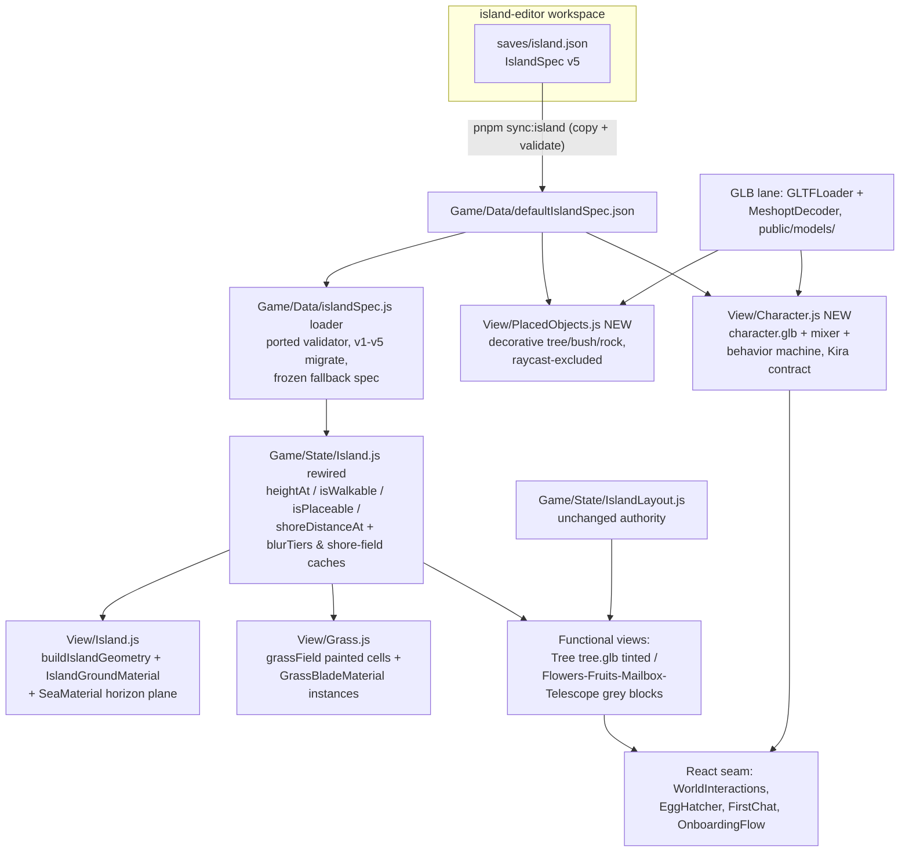
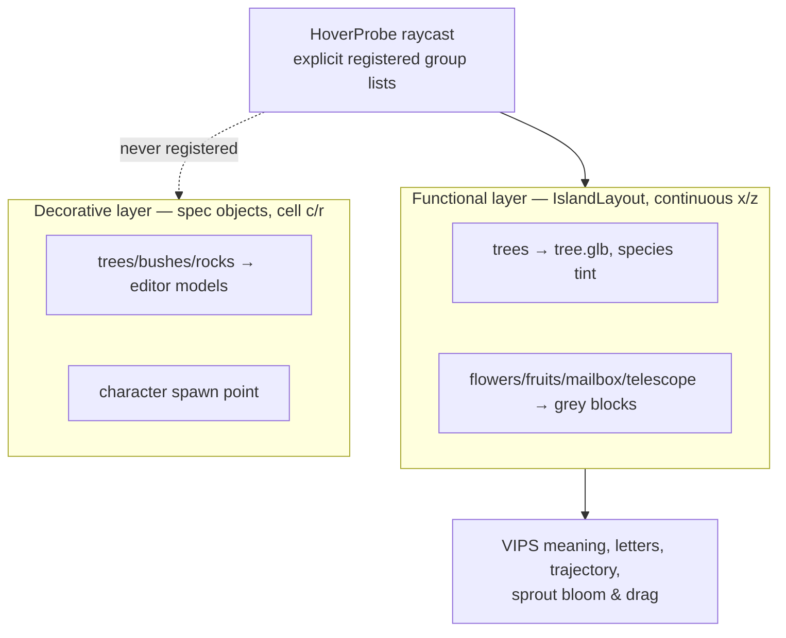

# Island Editor World Port - Plan

## Goal Capsule

- **Objective**: The product app's island — terrain, grass, sea, all object models, and the bird — renders from the island editor's saved `IslandSpec` v5, ported into the existing vanilla-three engine (`src/engine/student-space/`). Objects with no editor asset yet render as conspicuous grey block placeholders that keep their functional couplings.
- **Authority**: This plan > repo conventions (`CLAUDE.md`) > implementer judgment. The engine stays canonical; do not mount the editor's r3f renderer in the app, and never add `three` to pnpm `overrides`.
- **Execution profile**: Deep, four phases, squash-merged per phase and independently revertible: Phase 1 foundation = U1–U3; Phase 2 world visuals = U4–U7; Phase 3 inhabitants = U8–U9; Phase 4 continuity = U10–U12. Because U2 (Phase 1) deletes predicates whose remaining consumers migrate in U5 (Phase 2) and U10 (Phase 4), U2 ships temporary shims for them; U12 removes the shims at the end of Phase 4.
- **Stop conditions**: Stop and surface (don't improvise) if: visual output cannot be color-matched to the editor after U3+U4 (screenshot comparison); boot time regresses noticeably despite the precompute rules in KTD-10; or the Kira contract (`flyTo`, `getHeadWorldPosition`, `setSpecies`, `setOnboardingMode`) cannot be honored by the ported character without changing React-side consumers beyond the files listed in U7/U8.
- **Tail ownership**: Implementer runs the full Verification Contract, including the browser smoke and the legacy-storage fixture boot, before declaring done.

---

## Product Contract

### Summary

Port the island editor's authored world into the product engine: a committed copy of the editor's saved spec becomes the engine's island source, the editor's terrain/grass/sea/object/character rendering is ported to three@0.149 inside the engine, functional objects without editor assets become grey block placeholders, and the onboarding bird beats are rewritten to the new character's authored animation clips.

### Problem Frame

The standalone island editor (`island-editor/`, r3f + three@0.171) is the authoring tool for the island's shape, objects, and character — but nothing it saves reaches the product. The engine hard-codes a polar island (`Game/State/Island.js`), places objects from its own layout file, and renders a different bird (`public/birds/MaskedBower.glb`). A 2026-06-19 plan to bind editor terrain to the engine (`docs/plans/2026-06-19-003-feat-island-editor-engine-terrain-binding.md`) was rejected as stale after the editor's tile-grid rewrite; its constraints (boot-perf hazard, maintainer-gated engine changes) still stand. Until the engine consumes the editor's saved state, no editor work changes what a student sees.

### Requirements

**World source**

- R1. The engine renders the island from a committed copy of the editor's saved `IslandSpec` v5 (`island-editor/saves/island.json`), loaded at boot through a validating loader.
- R2. Spec loading is fail-safe: a missing or invalid committed spec falls back to a frozen known-good spec constant; boot never renders an empty world. The ported validator accepts v3–v5 payloads and migrates them to v5, matching the editor's `validateSpecObject` behavior for those versions; v1/v2 payloads take the frozen-fallback path unless U1 determines the legacy rasterizer ports cheaply.

**World visuals**

- R3. Terrain, sea, and grass adopt the editor's look: ported `buildIslandGeometry` + ground/sea/grass materials, color-calibrated so the engine's render visually matches the editor's (sRGB output + ACES tone mapping, exposure 1.1).
- R4. Grass renders exactly the painted grass cells authored in the spec — WYSIWYG with the editor, no auto-painting.
- R5. Editor-authored objects (kinds `tree`, `bush`, `rock`) and the character spawn point render from the spec using the editor's models; these decorative objects are excluded from the interaction raycast.

**Objects and meaning layer**

- R6. Functional objects keep every coupling: layout trees (values), flowers (interests), fruits (skills), mailbox (letters flag + `/letters`), telescope (`/trajectory`) stay interactive, draggable, and valid sprout-bloom targets, re-anchored on the new terrain.
- R7. Functional kinds with an editor asset use it (layout trees render with `tree.glb`, foliage tinted per species palette); kinds without one (flower, fruit, mailbox, telescope) render as deliberately conspicuous grey block placeholders at their anchors, preserving raycast registration, per-kind peek anchor lifts, and all `move*` APIs.

**Character**

- R8. The bird is the editor's `character.glb` (skinned, meshopt-quantized, 10 baked clips) driven by an `AnimationMixer` wrapper plus the editor's ported autonomous behavior machine, honoring Kira's full React-facing contract: `group`, `facing`, `getHeadWorldPosition`, `flyTo` returning a Promise, `setSpecies`/`cycleSpecies`/`onSpeciesChange`, `setOnboardingMode`, `perchX/Y/Z/Yaw`, `update`.
- R9. Onboarding beats are rewritten to authored clips: the fly-in becomes a ground/shore arrival (walk/swim/wake), the egg-hatch stops cloning the old bird model, and `public/birds/MaskedBower.glb` plus the procedural bird remnants are removed.
- R10. The egg-color species choice remains recorded and schema-valid; the character's look is uniform for now (`setSpecies` keeps its API and persistence, visual differentiation deferred until more assets exist).

**Continuity and quality**

- R11. Existing students' persisted placements survive: positions that land outside land or on terrace walls under the new terrain snap to the nearest flat land cell at hydrate time; historical growth-snapshot replays clamp the same way at render time. No storage schema version bump.
- R12. The terrain query facade survives: `state.island.heightAt(x, z)` keeps its signature; plateau-era predicates (`isOnPlateau`, `isPlaceable`, `radiusAtTheta`, `silhouetteAt`) are replaced with grid-native semantics, and every consumer (sprout drag validity, Kira waypoints, fireflies/particles scatter, grass) is migrated to the mapping that fits it.
- R13. Boot performance does not regress: blurred tiers and the shore distance field are computed once per spec, the 256² terrain `DataTexture` (~330K height evaluations) is deleted with the old grass system, and new views key density/cadence off the existing quality tiers.
- R14. All gates green: `pnpm check:all` passes, ported pure modules carry unit tests under `test/` (covered by `pnpm check`/`pnpm test`), and a guard test prevents r152+ color-space APIs (silent no-ops on runtime three@0.149) from entering engine code.

### Scope Boundaries

**In scope**: everything above, including camera/preset retuning to the 24-unit world and the sea/horizon composition change.

**Deferred to Follow-Up Work**

- Species → visual differentiation on the character (user-confirmed: more assets are coming; keep the persisted choice, wire visuals later).
- Authored replacement assets for mailbox, telescope, flowers, fruits (grey blocks are the explicit interim state, designed to be easy to spot).
- A bush GLB (the procedural bush builder ports now; the save currently contains zero bushes).
- Live sync between a running editor and the app; per-student authored islands (DB-persisted specs); in-product agent tools that edit the live island (the rejected plan's option (c) lineage).

**Outside this product's identity**

- Rebuilding the ambient sky/rain/aurora systems — they are retuned to the new extents, not redesigned.
- Changes to the island editor itself (its save pipeline already produces everything this plan consumes).

---

## Planning Contract

### Key Technical Decisions

- KTD-1. **Port into the engine; the engine stays canonical.** The editor's r3f renderer is not embedded. Editor modules are ported into `src/engine/student-space/` with provenance headers; duplication is accepted under the repo's canonical-fork rule (same precedent as `seedFromCurrentIsland`). The ported core lands as TypeScript inside the engine — a deliberate new idiom (the engine is JS + `.d.ts` today): root `tsc` already typechecks `src/engine/**/*.ts`, and keeping the core inside the engine preserves its dependency closure (the engine imports nothing from `~/`; React imports the engine, never the reverse). U1 carves `src/engine/student-space/**/*.ts` back into Biome's scope so the new TS isn't the only unlinted TS in the repo.
- KTD-2. **Committed spec copy, not cross-workspace import.** `island-editor/saves/island.json` is copied to `src/engine/student-space/Game/Data/defaultIslandSpec.json` (root tsconfig/biome/vitest never see `island-editor/`; `resolveJsonModule` and the `defaultIslandLayout.json` import precedent already exist). A root script `pnpm sync:island` (`scripts/sync-island-spec.ts`, run via tsx like every other root script) copies the JSON, validates it by importing the ported validator from the U1 core — the sync gate and the boot loader can never disagree — and **regenerates the golden parity fixture from the editor's terrain implementation** (running in the `island-editor` workspace, same lane as its own tests). Same-version editor math drift therefore fails the engine golden test at the next `pnpm test` instead of shipping silently; a failing golden test after sync means the ported math must be re-synced before the new spec lands. Ported code otherwise stays in sync manually, anchored by those shared vectors.
- KTD-3. **Preserve the `state.island` facade.** `heightAt(x, z)` keeps its exact signature so the ~38 terrain-query call sites mostly don't change. Rewiring `Island.js` in place (rather than adding a sibling slice) is safe because the class has no lifecycle surface — no singleton field, no subscribers, no dispose obligations; the facade is the only contract. New grid-native API: `isWalkable`, `isPlaceable` (land tier, wall-inset, above sea), `shoreDistanceAt`, `seaLevel`, `worldSize`, land-cell iteration. `normalAt` stays central-difference over the new `heightAt`. `silhouetteAt`/`radiusAtTheta`/`isOnPlateau` are deleted after their only real consumers (`Grass.js`, `Fireflies.js`, `Particles.js`, `Sprouts.js` seeding) migrate. The spec load in the `Island` constructor is synchronous — the U11 hydrate snap and every view constructor depend on it.
- KTD-4. **Renderer flips to sRGB + ACESFilmic (exposure 1.1) globally** to match the editor's r3f defaults (`island-editor/src/App.tsx:486`). Legacy surfaces get one re-grade pass — acceptable because most are being replaced. The color match has two more legs beyond encoding/tone-mapping: the **light rig** (the editor's terrain material merges three's lights uniforms, so its color is a direct function of the `Backdrop.tsx` rig — U4 ports it, rescaled for r149's legacy lighting model) and **shadows** (the editor renders with soft shadow maps; the engine's `shadowMap` is disabled today — U4 enables `PCFSoftShadowMap` with a shadow-casting directional light sized to the 24-unit world, cast/receive on terrain and objects). Shadows stay ON at every `Performance.js` tier — user decision — with the shadow map size scaling down by tier (e.g., 2048 high / 1024 medium / 512 low, low tier may drop to cheaper filtering). If U12's perf check shows low-tier frame times collapsing, the lever is map size/filter quality, never disabling shadows. All ported material code uses r149 APIs (`texture.encoding = sRGBEncoding`, shader chunk `encodings_fragment`); a guard test rejects r152+ names (`colorSpace`, `colorspace_fragment`, `outputColorSpace`), which typecheck against `@types/three@0.184` but no-op at runtime.
- KTD-5. **Two-layer object model.** `IslandLayout` (kinds tree/flower/fruit/mailbox/telescope, continuous x/z) remains the sole authority for functional, meaning-bearing objects. Spec objects (cell-keyed c/r) render in a separate decorative view. Raycast exclusion is by construction: both pick surfaces (`HoverProbe._pick` in `WorldInteractions.tsx` and the `Sprouts` drag) intersect explicit registered group lists, never the scene — the decorative view is excluded by never being registered. No widening of `schema.js` `PLACED_OBJECT_KINDS` — decorative objects never enter `IslandLayout`.
- KTD-6. **Character behind the Kira contract.** A new engine character view wraps `character.glb` + `AnimationMixer` (0.25s crossfades, frozen-frame idle + breathing bob, mirroring `CharacterActor.tsx`) around the editor's pure behavior machine (`characterBehavior.ts`, terrain access via injected env). `flyTo` is implemented as a scripted ground/shore arrival (walk/swim/wake clips) that still returns a Promise resolving on arrival. `setSpecies` keeps API + persistence + `onSpeciesChange` fan-out with a uniform look (R10). Home position comes from the spec's `character` object, replacing the hard-coded perch.
- KTD-7. **Migration is a hydrate-time snap, not a schema bump.** A pure snap helper in the U1 core (terrain predicate injected) runs inside each slice's `hydrate()` after the schema merge: positions off-land or on a terrace wall snap to the nearest flat land cell, occupied-cell-aware so clustered invalid objects don't stack — and the occupancy set is pre-seeded with the committed spec's decorative-object cells and character spawn cell, so a snapped functional object never lands inside an editor tree; valid positions untouched. `schema.js` stays terrain-blind, and the snap never routes through mutators — no subscriber fan, no `_persist`, no snapshot POST (the hydrate-no-fan rule; a `decorMoved` fan would trigger an unthrottled `IslandSnapshotBridge` POST every boot). Snapped positions are re-derived each boot until the first ordinary mutation serializes the slice — this lazy one-way write-back is accepted. Historical server snapshot rows are never rewritten; rows written after the port naturally carry snapped coordinates (they describe the new world). The replay clamp lives in the engine view's position resolution so live and replayed trees share one code path.
- KTD-8. **Sea and horizon.** The curved-earth ocean shader inside `Game/View/Island.js` is retired. The editor's `SeaMaterial` plane is extended beyond the 24-unit world toward the old ~40-unit horizon reach with a depth/alpha fade so the aurora ring (radius 22), rain sampling, and landing orbit still frame against water. The ported `SeaMaterial` and `GrassBladeMaterial` are unlit shaders with fixed authored colors, while the surfaces they replace track the day cycle — both gain a day-cycle tint uniform driven from the existing sun/day-cycle state in their view `update()` (the engine analog of the retired ocean's sky-reactive tint path), so evening scenes don't show a noon-bright sea. Camera defaults, presets (`world-default`, `first-chat`), and per-kind peek offsets are retuned to the ~18.6 × 16.1 off-center landmass.
- KTD-9. **One GLB lane for the new assets.** Editor GLBs copy to `public/models/` (self-hosted; gstatic is blocked on school networks — precedent `Tree.js:30-36`). A shared loader utility registers `MeshoptDecoder` from `three/examples/jsm/libs/meshopt_decoder.module.js` (awaits `MeshoptDecoder.ready`), keeps loads dispose-safe for StrictMode double-mounts (copy Kira's placeholder-then-swap guard), and sets `frustumCulled = false` on the skinned character.
- KTD-10. **Boot-perf rules.** Compute `blurTiers` and the shore distance field once per spec (engine analog of the editor's `specCache`); build terrain geometry once in the existing constructor slot (`View.js:59`); delete `_buildTerrainTexture` with the old grass. Grass blade counts and ambient cadence key off `Performance.js` tiers.

### High-Level Technical Design

Data flow and view topology after the port:

The object world is two layers with one interaction surface:

Both layers snap Y through the same rewired `heightAt`. Directional guidance, not implementation specification — the implementer may adjust module boundaries if the port reveals a better cut.

---

## Implementation Units

| U-ID | Phase | Title | Key files | Depends on |
|---|---|---|---|---|
| U1 | 1 | Pure core port + committed spec + sync script | `src/engine/student-space/Game/Data/{defaultIslandSpec.json,islandSpec.ts}`, `src/engine/student-space/Game/State/islandSpecCore/` | — |
| U2 | 1 | Rewire `State/Island.js` to the spec | `Game/State/Island.js` | U1 |
| U3 | 1 | Renderer color pipeline + API guard | `Game/View/Renderer.js`, `test/engine/colorspace-guard.test.ts` | — |
| U4 | 2 | Terrain + sea view swap (incl. light rig + shadows) | `Game/View/Island.js`, ported materials | U1, U2, U3 |
| U5 | 2 | Grass swap (painted cells) | `Game/View/Grass.js` | U2, U4 |
| U6 | 2 | GLB lane + decorative objects view | `Game/View/assetLoader.js`, `Game/View/PlacedObjects.js`, `public/models/` | U1, U2, U3 |
| U7 | 2 | Functional objects: tree.glb reskin + grey blocks | `Game/View/{Tree,Flowers,Fruits,Mailbox,Telescope}.js` | U2, U6 |
| U8 | 3 | Character port behind Kira contract | `Game/View/Character.js` (replaces `Kira.js`) | U2, U6 |
| U9 | 3 | Onboarding beat rewrite + old bird removal | `EggHatcher.tsx`, `FirstChat.tsx`, `OnboardingFlow.tsx` | U8, U10 |
| U10 | 4* | Consumer migration + camera/ambient retune | `Sprouts.js`, `Fireflies.js`, `Particles.js`, `Camera.js`, `WorldInteractions.tsx` | U2, U4 |
| U11 | 4 | Persisted-position migration | `Game/State/{IslandLayout,Sprouts,schema}.js`, `GrowthIslandPreview.tsx` | U2 |
| U12 | 4 | Cleanup, perf check, browser smoke | repo-wide | all |

*U10's camera-preset retune must land before or alongside U9 (Phase 3) — see U9's dependency; the remaining U10 consumer migrations may land in Phase 4.

### U1. Pure core port + committed spec + sync script

- **Goal**: The editor's terrain math and spec validation live in the engine as tested TypeScript, and the authored island is a committed, regenerable artifact.
- **Requirements**: R1, R2
- **Dependencies**: none
- **Files**: `src/engine/student-space/Game/State/islandSpecCore/terrainGrid.ts` (subset: types, `cellIndex`, `worldToCell`/`cellCenter`, `blurTiers`, `evaluateHeight`, `worldPositionOfObject`, validator + v1–v5 migrations incl. legacy tier-height rewrite), `.../gridCodec.ts`, `.../shoreField.ts`, `.../grassField.ts`; `src/engine/student-space/Game/Data/defaultIslandSpec.json` (copied from `island-editor/saves/island.json`); `src/engine/student-space/Game/Data/islandSpec.ts` (loader mirroring `islandLayout.js`: import JSON → validate → frozen fallback constant on failure); `scripts/sync-island-spec.ts` (tsx) + `sync:island` script in `package.json`; `biome.json` (carve `src/engine/student-space/**/*.ts` back into lint scope); tests `test/engine/islandSpecCore.test.ts`, `test/engine/islandSpec.loader.test.ts`.
- **Approach**: Port semantically from `island-editor/src/terrain/` and `island-editor/src/editor/specIO.ts` — the root compiler is stricter than the editor's (`noUncheckedIndexedAccess`, `verbatimModuleSyntax`), so a verbatim copy won't compile; adapt index accesses and `import type` forms while keeping behavior identical, with parity anchored by the golden test vectors rather than textual identity. Provenance headers promise behavior-sync (`// Ported from island-editor/src/... — behavior kept in sync via shared test vectors`). Engine JS imports the new TS with explicit `.ts` extensions (mirrors the engine's `./Kira.js` import style; `allowImportingTsExtensions` is on). Include the pure position-snap helper KTD-7/U11 depend on (nearest flat land cell, occupied-cell-aware spiral search). The legacy v1/v2 rasterization path (`legacy/specV2.ts`) ports only if `validateSpecObject` requires it for migration; otherwise accept v3+ and reject older with fallback. No three imports anywhere in this unit.
- **Patterns to follow**: `Game/Data/islandLayout.js` loader + fallback shape; editor test suite `island-editor/test/` for the same modules.
- **Test scenarios**:
  - Golden parity: `evaluateHeight` over a fixed sample grid of the committed spec matches values captured from the editor implementation (generate the fixture once from the editor's own test run).
  - Validator: accepts the committed v5 save; migrates a v4 payload (surface code 1 cleared) and a legacy-tier-heights payload; rejects garbage and returns the fallback path.
  - Loader: import of `defaultIslandSpec.json` validates at module load; corrupting the JSON in-test yields the frozen fallback spec, never `null`.
  - `worldPositionOfObject` places cell (20,33) at ≈ (−4.31, y, 0.56) for the committed spec (the character spawn — anchors the coordinate convention).
  - Sync script: running it re-copies and fails non-zero on an invalid save.
- **Verification**: `pnpm test` green including new tests; `pnpm sync:island` idempotent on a clean tree.
- **Execution note**: Port the editor's unit tests alongside the modules — parity through shared test vectors, not re-derivation.

### U2. Rewire `State/Island.js` to the spec

- **Goal**: `state.island` answers all terrain queries from the spec grid; plateau-era predicates are gone.
- **Requirements**: R12, R13
- **Dependencies**: U1
- **Files**: `Game/State/Island.js` (rewrite internals; it stays a plain state-slice class constructed in `State.js` — no singleton field, subscribers, or dispose obligations exist today), `Game/State/Island.d.ts` if present; test `test/engine/Island.spec-api.test.ts`.
- **Approach**: Load the spec via `Game/Data/islandSpec.ts`; compute `blurTiers` + `shoreDistanceField` once and cache on the instance (engine analog of `specCache`). Keep `heightAt(x, z)` signature (delegates to `evaluateHeight`), keep `normalAt` as central difference. Add `isWalkable(x, z)` (land tier at/above tier 1, not on a wall — reuse the grass-field wall test), `isPlaceable(x, z)` (walkable + cell-inset), `shoreDistanceAt(x, z)`, `seaLevel`, `worldSize`, and a land-cell iterator for scatter consumers. Delete `silhouetteAt`, `radiusAtTheta`, `radiusAt`, `isOnPlateau` (their consumers migrate in U5/U10 within the same PR/phase as this unit lands, or this unit temporarily shims them — implementer's call, but nothing ships still calling polar math).
- **Patterns to follow**: singleton/state-slice conventions in `docs/solutions/2026-05-18-island-progression-engine-substrate.md` (instance nulling in `Game.dispose()`, no fan on hydrate).
- **Test scenarios**:
  - `heightAt` continuity: values agree with U1's golden fixture at cell centers and midpoints.
  - `isPlaceable` rejects: a sea cell, a terrace-wall sample between two tiers, a point outside `worldSize/2` bounds; accepts a flat tier-2 interior point.
  - `isWalkable` vs `isPlaceable` differ where expected (beach walkable, wall neither).
  - Out-of-bounds `heightAt` returns the seafloor/edge behavior the editor defines (no NaN).
  - Re-boot hygiene: two sequential constructions (StrictMode simulation) produce independent, correct caches.
- **Verification**: all existing engine tests still pass (`pnpm test`); no remaining references to deleted predicates (`grep` clean) by phase end.

### U3. Renderer color pipeline + API guard

- **Goal**: The engine outputs sRGB + ACES like the editor, and r152-only color APIs can't silently creep in.
- **Requirements**: R3, R14
- **Dependencies**: none (land before U4 visuals)
- **Files**: `Game/View/Renderer.js`; `test/engine/colorspace-guard.test.ts`; touch-ups to existing no-op assignments (`Game/View/Island.js:275,300` — superseded by U4 anyway).
- **Approach**: Set `renderer.outputEncoding = THREE.sRGBEncoding`, `toneMapping = ACESFilmicToneMapping`, `toneMappingExposure = 1.1` (matching `island-editor/src/App.tsx`). Sweep engine materials/textures for needed `encoding` fixes on surviving legacy surfaces (sky, aurora, sprouts, UI-color-matched materials) and re-grade once. Guard test: scan `src/engine/student-space/` sources for `colorSpace`, `colorspace_fragment`, `outputColorSpace`, `SRGBColorSpace` and fail with a pointer to this KTD.
- **Patterns to follow**: KTD-4; three.js migration guide r151→r152 (inverse direction).
- **Test scenarios**:
  - Guard test fails on a fixture string containing `tex.colorSpace =` and passes on `tex.encoding =`.
  - Renderer settings assert: constructed renderer has sRGB output + ACES + 1.1 exposure (unit-testable via the renderer factory with a mocked context, or asserted in the browser smoke if not).
- **Verification**: browser smoke shows no washed-out/black frame; surviving legacy surfaces (sky, aurora, Kira-era colors before U8) reviewed by eye and re-tuned where clearly off.

### U4. Terrain + sea view swap

- **Goal**: The rendered island is the editor's tile-grid terrain and sea.
- **Requirements**: R3, R13
- **Dependencies**: U1, U2, U3
- **Files**: `Game/View/Island.js` (rewrite: ported `buildIslandGeometry` + `IslandGroundMaterial`; new sea plane with ported `SeaMaterial`; **light rig replacement** — the current ambient/directional/hemiFloor lights around `Island.js:549-552`; delete disc/sand/cliff/water builders, curved-earth `onBeforeCompile`, and `_buildTerrainTexture`); ported materials under `Game/View/Materials/` (`IslandGroundMaterial.js`, `SeaMaterial.js`) with `encodings_fragment` chunk names and `encoding` texture flags.
- **Approach**: Build geometry once in the existing constructor slot. Port the editor's light rig: translate `island-editor/src/scene/Backdrop.tsx`'s hemisphere (`#cfe5ff`/`#c8bb94`, 0.65) and warm directional (`#ffedcc`, ~1.55) values, rescaling intensities for r149's legacy (non-physical) lighting model — `IslandGroundMaterial` merges three's lights uniforms, so terrain color depends directly on this rig. Enable shadows per KTD-4: `PCFSoftShadowMap`, shadow-casting directional sized to the 24-unit world, cast/receive on terrain (and objects in U6/U7), map size and enablement keyed to `Performance.js` tiers. `SeaMaterial` gains the day-cycle tint uniform (KTD-8) driven from the view `update()`. Also diff r149's `lights_pars_begin`/shadow chunks against what the ported shaders expect — the guard test covers only encoding chunk names. Sea plane extends beyond the world toward the old ~40-unit horizon with a depth/alpha fade (KTD-8); shore `DataTexture` feeds `SeaMaterial` from U2's cached shore field. Reuse `public/student-space/textures/` only where the editor materials expect equivalents; otherwise carry the editor's procedural textures (`textures.ts` port). Keep the group/layer structure other views attach to (`view.island.group` consumers, if any, verified by grep at implementation time).
- **Patterns to follow**: `island-editor/src/scene/IslandTerrain.tsx` + `SeaSurface.tsx` wiring; KTD-4 color rules.
- **Test scenarios**:
  - Geometry build from the committed spec yields finite positions/normals and the expected custom attributes (`aTierFlat`, `aWallness`, `aSurface`) — unit test on the ported builder with the real spec.
  - No module in the new view imports r152+ APIs (guard test from U3 covers).
  - Test expectation for visual output: none — proven by the browser smoke + screenshot comparison in U12 (shader output isn't unit-testable here).
- **Verification**: app boots on `/` with the new terrain; old terrain code paths deleted, `pnpm check` green.

### U5. Grass swap (painted cells)

- **Goal**: Grass renders the spec's painted cells with the editor's blade look; the old plateau-wide grass and its 256² terrain texture are gone.
- **Requirements**: R4, R13
- **Dependencies**: U2, U4
- **Files**: `Game/View/Grass.js` (rewrite around ported `grassField.fillGrassBlades` + `GrassBladeMaterial` instanced attributes); delete `bindTerrain`/texture consumption.
- **Approach**: Fill SoA arrays from the spec (painted `SURFACE_GRASS` cells only, 64 blades/cell ceiling) into `InstancedBufferAttribute`s. Key blade count / wind update cadence off `Performance.js` tiers. Wind uniforms per `island-editor/src/scene/wind.ts` values. `GrassBladeMaterial` gains the day-cycle tint uniform (KTD-8) driven from the view `update()` so night/sunset scenes darken the blades with the rest of the world.
- **Patterns to follow**: `island-editor/src/scene/GrassLayer.tsx` attribute wiring; existing `Grass.js` quality-tier hooks.
- **Test scenarios**:
  - `fillGrassBlades` on the committed spec produces blades only on painted cells (count matches cell count × per-cell within ceiling), none below sea level.
  - Quality tier low reduces the instanced count (assert the count logic, not the GPU).
- **Verification**: browser smoke shows tufts exactly where the editor shows them; boot has no 256²-texture build (measure: the `_buildTerrainTexture` symbol no longer exists).

### U6. GLB lane + decorative objects view

- **Goal**: Editor models load in the engine, and spec objects render as a raycast-excluded decorative layer.
- **Requirements**: R5
- **Dependencies**: U1, U2, U3
- **Files**: `public/models/{tree.glb,rock.glb,character.glb}` (copied from `island-editor/public/models/`); `Game/View/assetLoader.js` (GLTFLoader + `setMeshoptDecoder`, `await MeshoptDecoder.ready`, module-cached loads, dispose-safe resolution); `Game/View/PlacedObjects.js` (new view); ported `Game/View/Materials/toonMaterial.js` + `buildObjectModel.js` + `textures.js` (bush + procedural fallbacks).
- **Approach**: One loader utility for all three GLBs (self-hosted; no CDN). `PlacedObjects` iterates `spec.objects`, positions via `worldPositionOfObject` with the U2 cached blur, applies yaw/scale, renders `tree`/`rock` from GLBs and `bush` from the ported procedural builder; `character` entries are skipped here (U8 owns the character). Raycast exclusion is by construction: `HoverProbe._pick` and the `Sprouts` drag intersect explicit registered group lists (`view.telescope.group`, `view.mailbox.group`, `view.kira.group`, per-entry fruit/flower/tree groups) — `PlacedObjects` is simply never registered. Load failures never reach views as rejections: on fetch/parse error the shared loader logs and resolves to the placeholder path (grey block), and `Tree.ready`/`Fruits.ready` still settle — mirroring Kira's existing catch-and-keep-placeholder precedent. Toon gradient textures get explicit `NearestFilter`/no-mipmap settings.
- **Patterns to follow**: `island-editor/src/scene/PlacedObjects.tsx`, `useObjectModel.ts` (drei's auto meshopt registration must be replicated manually); Kira's async placeholder-then-swap dispose guard (`Kira.js:238-352`).
- **Test scenarios**:
  - Loader registers the meshopt decoder before any `load()` (unit-test the factory ordering; a missing decoder throws in three, so a load-smoke in happy-dom with a stubbed loader asserts wiring).
  - Dispose-during-load: resolving after `Game.dispose()` does not add to the scene (simulate with a deferred promise).
  - Load-error path: a stubbed loader rejection resolves views to the placeholder, `ready` promises still settle, no unhandled rejection.
  - `PlacedObjects` renders 16 trees + 0 bushes + 0 rocks from the committed spec and skips the character entry.
  - Pick-list closure: the hover/drag target lists contain only functional view groups — `PlacedObjects.group` is absent (regression assertion against the registered lists).
- **Verification**: browser smoke shows editor trees at editor positions; hovering a decorative tree produces no peek.

### U7. Functional objects: tree.glb reskin + grey blocks

- **Goal**: Meaning-bearing objects adopt the new art direction — real asset where one exists, conspicuous grey block where none does — without losing a single coupling.
- **Requirements**: R6, R7
- **Dependencies**: U2, U6
- **Files**: `Game/View/Tree.js` (layout trees render `tree.glb` clones with species-palette tint on foliage material; oak/cherry GLBs + `public/trees/` retired), `Game/View/Flowers.js`, `Fruits.js`, `Mailbox.js`, `Telescope.js` (procedural builds replaced by a shared grey-block builder sized per kind), possibly a small `Game/View/placeholderBlock.js`.
- **Approach**: Grey blocks: flat mid-grey `MeshStandardMaterial`-family box per object, sized so per-kind `peekAnchorLift` values in `WorldInteractions.tsx:1604-1620` still point sensibly (retune the constants if needed). Every view keeps: `IslandLayout` subscription, `heightAt` snap, `move*` APIs (sprout bloom targets), mailbox letters-flag subscription (flag can be a smaller block or color shift on the placeholder), telescope/mailbox raycast priority, species-palette subscription in `Tree.js` (tint), `ensureFromLayout` reconcilers. `Fruits.ready`/`Tree.ready` sequencing preserved.
- **Patterns to follow**: existing view classes' subscribe/dispose shape; `Kira.js` palette recolor for the tree tint; dormant `ensureFromLayout` reconcilers as the layout-swap entry point.
- **Test scenarios**:
  - Each view still exposes its `move*`/`revealAt` API and updates position on `decorMoved` (extend existing `Sprouts` event tests).
  - Mailbox flag state toggles with the letters slice (adapt the existing subscription test if present, else add).
  - Tree species tint changes on `speciesPalette` update (assert material color mutation).
  - Raycast priority order telescope → mailbox → kira → fruit/flower/tree unchanged (unit-test the priority list constant or the sort).
- **Verification**: peek + CTA navigation works on every functional kind in the browser smoke; grey blocks are unmistakably placeholders on screen.

### U8. Character port behind Kira contract

- **Goal**: The editor's animated character replaces the bird, and every React consumer keeps working unmodified (onboarding files change in U9, not here).
- **Requirements**: R8, R10
- **Dependencies**: U2, U6
- **Files**: `Game/View/View.js` (registration slot swap + update-loop wiring), `Game/View/Character.js` (new; registered where `Kira.js` was in `View.js` — the View slot keeps the name `view.kira`: `WorldInteractions.tsx` alone has 12 non-optional `view.kira` accesses and ~27 `.kira` references exist across the React seam, so only the implementing file changes), `Kira.d.ts` rewritten in place as the contract's type surface (not deleted), ported `Game/State/characterBehavior.ts` + `characterAsset.ts` constants (pure), `Kira.js` deleted in U9 after consumers move.
- **Approach**: Mixer wrapper: 0.25s crossfades, idle = frozen `Wave_for_Help_2` frame + sine bob, clip selection from `behaviorClip(state)`. Behavior env wires `heightAt`/`shoreDistanceAt`/`seaLevel`/`worldSize` from U2 and a seeded RNG. Contract adapter: `group` (pickable, named for raycast), `facing`, `getHeadWorldPosition` (head bone or bbox-top fallback, safe during async load), `perchX/Y/Z/Yaw` derived from the spec's `character` object (fallback to a flat land cell near center), `flyTo({...}) → Promise` implemented as commandMoveTo ground/shore arrival (swim if crossing water, `Wake_Up` on settle), `setSpecies`/`cycleSpecies`/`onSpeciesChange` keep persistence + events with uniform look, `setOnboardingMode` snaps to perch, `update(dt)` from `View.js`. `frustumCulled = false` on the skinned mesh. Scale via `CHARACTER_HEIGHT / CHARACTER_SOURCE_HEIGHT` (never bake scale into the skinned asset). Verify animated poses visually — quantized+skinned exports have a documented joint-corruption failure class.
- **Patterns to follow**: `island-editor/src/scene/CharacterActor.tsx` (mixer/crossfade/idle), `characterBehavior.ts` (port unchanged), Kira's async-load and dispose guards.
- **Test scenarios**:
  - Behavior machine port passes the editor's own `characterBehavior` tests (ported alongside).
  - `flyTo` resolves its Promise on arrival and on interruption/timeout (no hung onboarding).
  - `setSpecies('flame')` etc. for all 7 schema ids (`flame`, `masked`, `regent`, `emerald`, `satin`, `twilight`, `lilac` per `schema.js` `COMPANION_SPECIES_IDS`): no throw, persisted, `onSpeciesChange` fires (boot calls this — a throw kills the app).
  - `getHeadWorldPosition` returns a finite Vector3 before the GLB resolves (placeholder path) and tracks the head bone after.
  - Walk waypoints never target non-walkable cells (behavior env test with the committed spec).
- **Verification**: character wanders the island, swims near shore, talks on narrator events in the browser smoke; `pnpm check` green.

### U9. Onboarding beat rewrite + old bird removal

- **Goal**: Onboarding works end-to-end with the new character; the old bird asset and code are gone.
- **Requirements**: R9, R10
- **Dependencies**: U8, U10 (camera-preset retune — the first-chat framing must be retuned before this beat ships)
- **Files**: `src/components/student-space/onboarding/EggHatcher.tsx` (stop importing `loadMaskedScene`/`SPECIES_BY_ID` from `Kira.js`; hatch reveal clones the character via the U6 loader or uses a simplified reveal), `FirstChat.tsx` (arrival beat: replace the aerial `FLY_START` with a shore-side start; await the same `flyTo` Promise), `OnboardingFlow.tsx` (verify `setOnboardingMode` path), delete `public/birds/MaskedBower.glb`, `Kira.js` + archived procedural bird code, DRACO usage audit (keep `public/draco/` only if `Tree.js`-era loads survive — they don't after U7; remove if unreferenced).
- **Approach**: The arrival beat: character wakes/walks (or swims in from the shore) to the perch, talk clip on first line. Keep the camera preset dance (`getPreset('first-chat')`) but retune to the new framing (U10 owns camera constants; coordinate here). Egg colors continue to map to species ids (schema untouched), and onboarding copy stays unchanged — the egg-color-vs-uniform-bird mismatch is explicitly accepted until species assets arrive (user decision; do not "fix" the copy). Move `SPECIES_BY_ID` (and any species constants `EggHatcher` needs) into the ported `characterAsset.ts` or `schema.js` before deleting `Kira.js` — `EggHatcher.tsx` is its only external importer.
- **Patterns to follow**: existing `FirstChat` promise-sequenced script; `EggHatcher`'s clone-and-pose approach (now against character.glb).
- **Test scenarios**:
  - Onboarding e2e-style test (extend `Progression.e2e.test.tsx` pattern): egg pick → hatch → first chat completes without touching removed exports.
  - No import of `Kira.js`/`MaskedBower` remains anywhere (`grep` assertion test or check).
  - Species choice persists across reload (existing persistence test pattern).
- **Verification**: full onboarding run in the browser smoke on a fresh profile; bundle no longer ships the 11 MB bird.

### U10. Consumer migration + camera/ambient retune

- **Goal**: Every polar-math consumer speaks the grid API, and the scene composition (camera, aurora, rain, scatter systems) frames the 24-unit world.
- **Requirements**: R12, R3
- **Dependencies**: U2, U4
- **Files**: `Game/View/Sprouts.js` (seeded placement → random flat land cell; drag validity → `isPlaceable`), `Fireflies.js` + `Particles.js` (polar scatter → land-cell scatter), `Butterflies.js` (audit), `Game/View/Camera.js` (defaults: target/distance/clamps for the ~18.6 × 16.1 off-center landmass; presets `world-default`, `first-chat`, landing orbit), `WorldInteractions.tsx` per-kind `cameraOffset`s, `Rain.js`/`Aurora.js`/`Rainbow.js` extents check against the new sea plane.
- **Approach**: For each consumer, apply the mapping that fits (KTD-3 / flow analysis): placement validity = `isPlaceable`; ambient scatter = land cells with `heightAt` hover; Kira-era wander already handled by U8's behavior machine. Camera: retune constants by eye against the editor's framing, keep the tuner workflow (`lil-gui`) available.
- **Patterns to follow**: existing per-view quality-tier hooks; `Sprouts.js` snap-at-pointerup flow (only the validity predicate changes).
- **Test scenarios**:
  - Sprout seeded placement lands on walkable land for 100 seeded RNG draws on the committed spec.
  - Drag validity rejects sea/wall points (reuses U2 predicates through the real `Sprouts` call path).
  - Fireflies/particles spawn positions all satisfy `isWalkable`-or-land (assert in a spawn unit test).
  - Test expectation for camera values: none — visual tuning, proven in the browser smoke.
- **Verification**: no runtime references to deleted polar APIs; aurora/rain/rainbow visually coherent over the new sea in the smoke.

### U11. Persisted-position migration

- **Goal**: Existing students' saved layouts and history replays never show objects in the sea or floating on walls.
- **Requirements**: R11
- **Dependencies**: U2
- **Files**: `Game/State/IslandLayout.js` + `Game/State/Sprouts.js` hydrate paths (terrain-aware snap; `schema.js` stays terrain-blind), `Game/Data/defaultIslandLayout.json` + `Game/Data/islandLayout.js` (re-author base placements for the new terrain — fresh boots never hydrate, so the committed base must be valid on its own), `Game/View/Sprouts.js` (render-time clamp in `_spawnBloomedTree`/seed resolution, covering live and replayed trees in one path), `src/components/student-space/sheets/GrowthIslandPreview.tsx` (timelapse wiring fix), test `test/engine/IslandLayout.migration.test.ts`.
- **Approach**: The snap helper from the U1 core (pure; terrain predicate injected) runs inside each slice's `hydrate()` after the schema merge — never via mutators (no fan, no `_persist`, no snapshot POST). It covers all three Sprouts position stores (`sprouts[].position`, `bloomedTrees[].position`, and the `decorOffsets` buckets — absolute coords) and mutates `position` in place so id-keyed `captureRefs`/bloom lookups never detach; `position: null` passes through unchanged (seed-derived placement stays seed-derived). Snapped values persist lazily — the first ordinary mutation serializes the slice (accepted, per KTD-7). Snapping a working copy may flip `isDiverged()`; accepted while that affordance has no consumers. Also verify/fix the timelapse wiring: `GrowthIslandPreview.tsx` calls `state.sprouts.setTimelapseSubset`, but the method lives on `view.sprouts` — the optional chain silently no-ops today, and the replay-clamp test is vacuous until this is fixed.
- **Patterns to follow**: lenient-hydrate convention (no subscriber fan on hydrate — solutions doc); `mergeIslandLayout` warn-and-continue style.
- **Test scenarios**:
  - Legacy fixture with old-rim positions (radius ~6 polar points) hydrates with all objects on land; valid positions byte-identical; a second hydrate of the snapped output is idempotent.
  - Hydrate-with-snap fires zero subscriber events, zero `Persistence.save` calls (spy the storage adapter), and zero snapshot-bridge fetches.
  - A position exactly on a terrace wall snaps to the adjacent flat cell; several clustered invalid objects land on distinct cells (occupied-cell-aware search); a snapped object never lands on a spec decorative-object cell or the character spawn cell (occupancy pre-seeded from `defaultIslandSpec.json`).
  - All three Sprouts stores snap; `position: null` entries stay null; `captureRefs` survive by identity.
  - Committed base layout: `isPlaceable(x, z)` holds for every object in `defaultIslandLayout.json` against BOTH the committed spec and the frozen fallback spec (the fallback is a snapshot of the same committed island, so one re-authoring keeps both valid — guards fresh boots on the fallback path too).
  - Snapshot replay clamp: a historical sprout at an out-of-land point renders clamped through the view path without mutating the fetched data.
- **Verification**: boot the app with a seeded legacy `ss:v1:*` fixture in the browser smoke — nothing floats or drowns.

### U12. Cleanup, perf check, browser smoke

- **Goal**: The diff ships nothing dead, boots fast, and the world demonstrably matches the editor.
- **Requirements**: R13, R14, R3
- **Dependencies**: all
- **Files**: repo-wide dead-code removal (old terrain builders, `Grass` texture path, `Kira.js`, unused DRACO/`public/trees`/`public/birds` assets), `CLAUDE.md` engine section note (island source is now the committed spec + sync script).
- **Approach**: Grep-audit for orphaned exports and assets; measure boot (frame-to-first-render before/after, coarse `performance.now()` logging is enough); run the full browser validation per the local setup (embedded-postgres `DATABASE_URL`, explicit dev port, isolated Chrome via agent-browser); capture side-by-side screenshots: editor (`pnpm dev:editor`) vs app (`pnpm dev`) of the same save. The committed save is a development placeholder until now — before this acceptance, the user re-authors the island in the editor (grass coverage, rocks, composition) and re-runs `pnpm sync:island`; acceptance runs against the polished save.
- **Patterns to follow**: repo memory `reference_local_browser_validation_setup`.
- **Test scenarios**: Test expectation: none — this unit is verification and removal; regressions are caught by the suites added in U1–U11.
- **Verification**: `pnpm check:all` green; `pnpm build` succeeds; smoke covers boot, hover/peek/CTA per kind, sprout plant+drag, onboarding fresh-profile run, legacy-fixture boot, StrictMode double-mount with throttled network (GLB in flight during dispose).

---

## Verification Contract

| Gate | Command | Applies to |
|---|---|---|
| Root check (biome + tsc) | `pnpm check` | every unit |
| Root tests | `pnpm test` | every unit with test scenarios |
| Editor workspace gate | `pnpm check:island-editor` | U1 (sync script touches the boundary); run via `pnpm check:all` before done |
| Both gates | `pnpm check:all` | phase ends and Definition of Done |
| Production build | `pnpm build` | U12 |
| Browser smoke | `pnpm dev` + agent-browser (embedded-postgres `DATABASE_URL`, explicit port — MOE app squats 3000) | U4, U5, U6, U7, U8, U9, U10, U11, U12 |
| Visual acceptance | side-by-side screenshots: `pnpm dev:editor` vs app rendering the same committed spec | U12 |

The color-space guard test (U3) and the no-`Kira.js`-import check (U9) run inside `pnpm test` and are permanent regression nets.

---

## Definition of Done

- All twelve units complete; `pnpm check:all` and `pnpm build` green.
- The app on `/` renders the committed editor save: tile terrain, painted grass, editor sea, decorative objects + character, screenshot-compared against the editor side-by-side and **accepted by the user (plan owner)** — not self-certified by the implementer.
- Every functional object (tree, flower, fruit, mailbox, telescope) is interactive with its original coupling; flower/fruit/mailbox/telescope appear as obvious grey blocks.
- Onboarding completes on a fresh profile with the new character (no fly clip needed, no old bird asset shipped).
- A legacy `ss:v1:*` fixture boots with all objects on land, and the committed default layout is itself valid on the new terrain.
- Boot shows no noticeable regression vs the pre-port build (the 256²-texture hotspot is gone; GLB loads are async and dispose-safe).
- No dead code from abandoned approaches remains in the diff (old terrain/grass/bird paths deleted, orphaned assets removed).
- `CLAUDE.md` engine note updated: island source = `Game/Data/defaultIslandSpec.json`, regenerated via `pnpm sync:island`.

---

## Risks & Dependencies

- **Color calibration is judgment work** (KTD-4): encoding + tone mapping gets close, but material-level differences (lighting model, `useLegacyLights`-era falloff on r149) may need per-material tuning. Budgeted inside U3/U4; the stop condition triggers if parity stays visibly off.
- **Quantized + skinned GLB corruption** is a known export-tool failure class: verify `character.glb` animated poses (not just bind pose) early in U8; if joints pop, re-export via the editor's `optimize-meshy-glb.mjs` skinned pipeline with different settings before writing engine workarounds.
- **`@types/three` 0.184 vs runtime 0.149**: the compiler will happily accept broken code. The U3 guard test is the mitigation; treat any "it typechecks" confidence about renderer/texture/color APIs as unverified.
- **Rejected-plan constraints still bind**: the 2026-06-19 plan's maintainer-gate concern is answered by this plan's existence (user-directed), but its perf rules are encoded in KTD-10 — regressing them is a stop condition.
- **Editor save churn**: the spec is a moving target while the editor evolves (v5 today). The validator + `pnpm sync:island` keep re-export cheap; version bumps beyond v5 require a validator update first (fail-safe fallback covers the gap), and same-version semantic drift in the editor's math is caught by the sync-regenerated golden fixture (KTD-2) rather than trusted.
- **Rollback blast radius is bounded**: reverting the port leaves un-mutated students untouched (the snap is in-memory until their first mutation persists it). Students who mutated carry new-terrain coordinates back to the old engine — cosmetic misplacement only (`coercePosition` accepts any finite point and the old views height-snap whatever they're given). Server snapshot rows written during the ported window replay oddly on the old build. No rollback machinery warranted.

---

## Sources & Research

- `docs/plans/2026-06-19-003-feat-island-editor-engine-terrain-binding.md` — rejected precursor; perf hazards and engine-gate context.
- `docs/solutions/2026-05-18-island-progression-engine-substrate.md` — state-slice template, hydrate/fan rules, InstancedMesh constraints, audio caveat.
- Editor source of truth: `island-editor/src/terrain/terrainGrid.ts` (spec + `evaluateHeight` + validator), `island-editor/src/editor/gridCodec.ts` (grid digit-string codec — note: lives under `src/editor/`, not `src/terrain/`), `shoreField.ts`, `grassField.ts`, `scene/materials/*`, `scene/CharacterActor.tsx`, `models/characterBehavior.ts`, `models/characterAsset.ts`, `scripts/optimize-meshy-glb.mjs` (GLB pipeline), `saves/island.json` (the authored island: 64×64 grid, 16 trees + 1 character at cell (20,33)).
- Engine seams verified during research: `Game/View/View.js:53-93` (construction order), `Game/State/IslandLayout.js` + `Game/Data/islandLayout.js` (loader/slice template), `Kira.js` contract consumers (`WorldInteractions.tsx`, `EggHatcher.tsx:13`, `FirstChat.tsx:155-194`, `OnboardingFlow.tsx`), `Renderer.js:75-82` (color management currently off), `Performance.js` tiers.
- three.js version research (verified against r149 sources and the migration guide): meshopt decoder ships in r149 (`three/examples/jsm/libs/meshopt_decoder.module.js`, GLTFLoader support since r122); `KHR_mesh_quantization` bounds fix landed r128; SkinnedMesh frustum culling unfixed across r149–r171 (`frustumCulled = false` required); r152 color-management rename means r149 must use `encoding`/`sRGBEncoding`/`encodings_fragment`; toon gradient maps need explicit `NearestFilter`. Key refs: three.js Migration Guide (GitHub wiki), mrdoob/three.js#21553, #11991, zeux/meshoptimizer#433.
