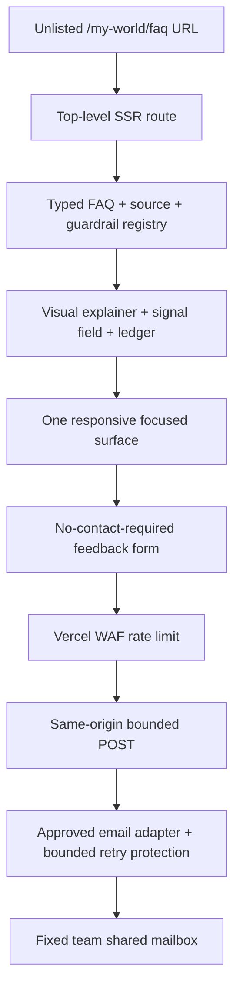
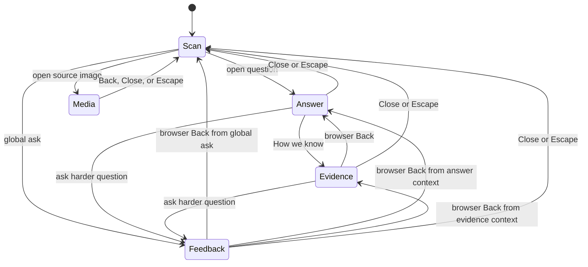
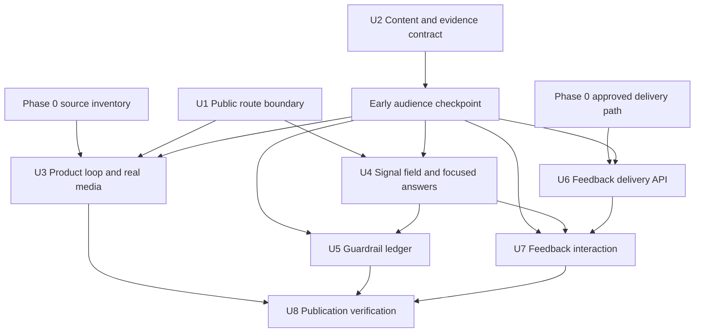
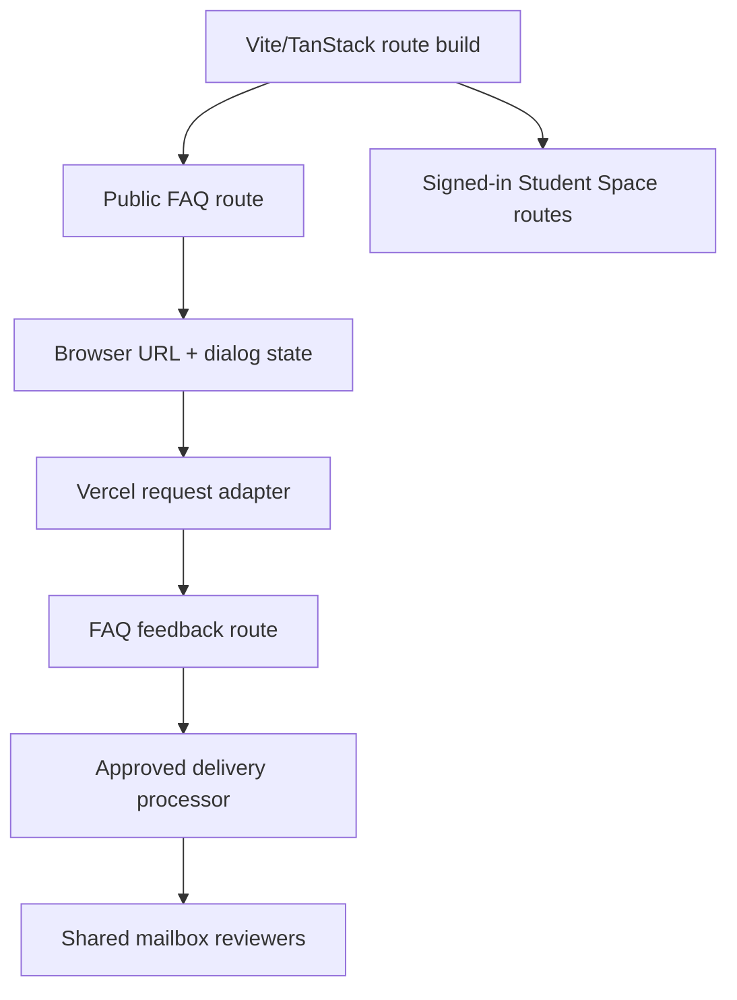

# feat: Add the My World Signals → Sensemaking FAQ

## Overview

Build an unlisted, unauthenticated FAQ at `/my-world/faq` that helps
MOE/DXD colleagues—including those reading as parents—understand what My World
does, inspect the concerns raised about it, and see how the team distinguishes
product facts, external research, early signals, unknowns, and pre-pilot
guardrails.

The page will be a visual, progressively disclosed “Signals → Sensemaking”
experience rather than a long accordion. It will introduce the
Capture → Reflect → Sensemake → Review loop with current product screenshots,
turn the supplied Pigeonhole comments into a contextual source strip, let readers
scan short concern cards, and use one focused answer surface for a concise
answer followed by “How we know.” It will also provide a real, no-contact-
required feedback path to a fixed team shared mailbox, with a plain disclosure
of the infrastructure and people that still process each submission.

This is a Deep plan because the work crosses public routing and bundle
boundaries, evidence governance, image provenance, URL/history and focus state,
an external delivery processor, anti-abuse controls, and a publication review
process. The requirements document remains the source of truth (see origin:
`docs/brainstorms/2026-07-28-my-world-signals-faq-requirements.md`).

---

## Problem Frame

My World is a working prototype testing whether multimodal capture plus
evidence-grounded sensemaking can help Singapore secondary students reflect
more independently. A short demonstration generated strong interest and serious
questions about family displacement, screen time, dependency, gamification,
AI safety, privacy, and whether the underlying student need has been validated.

The page must neither dismiss those concerns nor convert them into evidence
that the product is desirable. The team currently has no formal efficacy or
long-term safety evidence. Reported student engagement, teacher support, and
school field-research learning are promising early signals only and must remain
tagged “Early field signal · team verify” until sample, method, scope,
permission, and caveats are documented.

The intended outcome is understanding and earned confidence in the team’s
testing posture—not persuasion at any cost. The FAQ should make it easy to ask a
harder question and should remain useful whether leadership proceeds to a pilot,
changes the concept, or stops.

---

## Requirements Trace

- R1. Serve an exact-link, unlisted page that is absent from product navigation,
  launch promotion, and search discovery.
- R2. Lead with “Working prototype — testing a hypothesis” and state that a
  structured pilot is still under consideration, without implying MOE approval.
- R3. Make the constructive but bounded case that AI may lower reflection
  effort while human relationships, agency, and developmental safety govern.
- R4. Explain Capture → Reflect → Sensemake → Review visually in roughly
  20 seconds, including Kira’s bounded role and student review/forget agency.
- R5. Use current My World screenshots and all six supplied Pigeonhole
  screenshots without changing their meaning or implying representativeness.
- R6. Let Kira guide visually while the My World team owns every substantive
  evidence, safety, privacy, and policy statement.
- R7. Keep the question field glanceable, comprehensive, searchable/filterable,
  and directly linkable.
- R8. Use two primary interactions: concise answer, then the deeper
  evidence/limitations/pilot layer.
- R9. Foreground one answer at a time with previous/next, keyboard, Escape,
  URL/history, scroll, and focus restoration behavior.
- R10. Represent every committed concern directly or through an explicit
  canonical question/alias mapping.
- R11. Label every factual block as Product fact, Research-backed,
  Early field signal · team verify, Open question · pilot, or Team check.
- R12. Show source fit and limitations near the claim; never use community
  conversations as prevalence evidence.
- R13. Present a prominent three-state Guardrail Ledger.
- R14. Put only repository- or deployment-verified protections under
  “Built today.”
- R15. Keep missing pre-pilot safeguards and unresolved research questions in
  their correct ledger states.
- R16. Offer “Ask us a harder question” globally and in question context.
- R17. Deliver no-contact-required feedback to a team-owned destination with
  truthful acknowledgement, minimal metadata, an accurate processor/access/
  retention disclosure, and non-surveillant abuse controls.
- R18. Support phone and desktop, text scaling, reduced motion, keyboard/focus,
  non-colour status cues, screenshot equivalents, and a lightweight route that
  does not depend on the 3D engine.

**Origin actors:** A1 (MOE/DXD colleague), A2 (leadership reviewer), A3
(parent-minded reader), A4 (student), A5 (My World team), A6 (Kira).

**Origin flows:** F1 (understand My World), F2 (scan and inspect a concern), F3
(audit guardrails), F4 (offer no-contact-required feedback), F5 (maintain
claims).

**Origin acceptance examples:** AE1 (stage/access), AE2 (product explanation),
AE3 (two-step answer), AE4 (population-fit caveat), AE5 (early-signal label),
AE6 (ledger integrity), AE7 (no non-addiction promise), AE8 (privacy unknowns),
AE9 (truthful feedback delivery), AE10 (keyboard/narrow viewport).

---

## Scope Boundaries

- This page explains My World and the proposed testing posture; it does not
  implement missing product safeguards, pilot governance, or research studies.
- It does not claim that My World is therapeutic, proven effective, safe,
  non-addictive, formally endorsed, or appropriate for every student.
- It does not enter the signed-in `_app` layout, Student Space navigation, or
  main product sitemap/navigation.
- It does not expose student reflections, internal traces, field-participant
  identities, private links, or secrets.
- It does not turn event comments or online community discussions into
  sentiment counts, votes, prevalence estimates, or a debate scoreboard.
- It adds no engagement analytics, advertising, account requirement, or
  persistent reader profile.
- It does not make Kira the accountable voice for safety, evidence, policy, or
  privacy.
- It does not persist FAQ feedback in the student-tenanted Postgres schema or
  invent a fake student tenant.

### Deferred to Follow-Up Work

- A moderation dashboard, searchable feedback archive, analytics, triage
  workflow, and response-status tracking.
- Product-side crisis escalation, interaction boundaries, privacy controls,
  subgroup evaluation, and other “Required before any pilot” safeguards.
- Formal pilot instrumentation, outcome evaluation, and stop/change governance.
- A system-scoped feedback store if future durability or moderation needs
  justify its own authorization and retention design.

---

## Context & Research

### Relevant Code and Patterns

- `src/routes/share.$token.tsx` is the public top-level route precedent. It sits
  outside `_app`, supplies `noindex, nofollow` metadata, and does not require
  authentication.
- `src/routes/_app.tsx` is the boundary to avoid: it loads auth state and mounts
  `EngineHost`.
- `src/routeTree.gen.ts`, `src/routes/__root.tsx`,
  `src/components/student-space/EngineHost.tsx`, and
  `src/components/StudentSpaceHost.tsx` reveal an eager-import risk: a public
  route can avoid mounting the engine yet still download Three.js, engine CSS,
  preloaded world assets, or onboarding code through shared-root imports.
- The installed TanStack Start plugin already installs its route-component
  splitter; its current configuration surface does not accept the standalone
  Router `autoCodeSplitting` switch. Bundle work must begin from the actual
  production graph, not from adding that option to `vite.config.ts`.
- `src/components/share/PublicProfilePage.tsx` is the closest full-document,
  unauthenticated responsive page pattern.
- `src/components/ui/drawer.tsx` supplies Base UI focus trapping, scroll lock,
  Escape/backdrop dismissal, and a scrollable long-body surface.
- `src/routes/_app.history.tsx` and
  `src/components/student-space/sheets/HistorySheet.tsx` demonstrate validated
  URL search state for one focused detail over a preserved parent surface.
- Typed registries under `src/data/` are the local precedent for stable IDs,
  closed unions, derived lookups, and integrity tests.
- `src/auth/same-origin.ts` is the canonical positive-proof same-origin gate for
  state-changing routes.
- `src/routes/api/share/create.tsx` and
  `src/server/share-token.handler.server.ts` demonstrate route-level request
  parsing/error mapping separated from dependency-injected server logic.
- `src/server/function-schemas.ts` demonstrates strict, bounded Zod inputs.
- `src/lib/log-redaction.ts` and `test/server/log-redaction.test.ts` establish
  that user-authored text must not enter Vercel logs.
- `vercel.json` and `test/routes/response-headers.test.ts` are the source and
  guard for production security/discoverability headers.
- `src/styles.css` provides Inter, motion durations/easing, reduced-motion
  behavior, focus conventions, semantic primitives, and `image-outline`.

### Institutional Learnings

- `docs/solutions/2026-07-23-connector-at-capture-spike.md` shows that
  capture-time sensemaking is feature-controlled; the FAQ must not describe it
  as universally immediate.
- `src/agents/verifier.ts` provides a real deterministic evidence gate before
  proposed VIPS links become canonical.
- `src/agents/self-critique-eval.ts` and `README.md` establish that self-critique
  is best-effort, not a blocking safety guarantee.
- The review/log/forget paths are represented in current capture, profile, and
  forget handlers, but raw-audio/provider retention, access roles, crisis
  escalation, and contractual model use are not all proven by repository code.
- The live Kira prompts use “friend” comparisons. The FAQ therefore cannot
  claim that Kira is unequivocally not designed to feel companion-like; it must
  acknowledge warmth as both a design choice and a boundary to test.
- `plans/051-rate-limit-paid-endpoints.md` is useful design research but is not
  shipped infrastructure. It cannot be cited as an existing rate limiter.

### External References

- [TanStack Router automatic code splitting](https://tanstack.com/router/latest/docs/guide/automatic-code-splitting)
  supports route-component chunks through the Vite plugin; production bundle
  inspection must still verify the result for this repository.
- [OWASP CSRF Prevention](https://cheatsheetseries.owasp.org/cheatsheets/Cross-Site_Request_Forgery_Prevention_Cheat_Sheet.html)
  supports positive origin/fetch-metadata checks as defence in depth.
- [OWASP Input Validation](https://cheatsheetseries.owasp.org/cheatsheets/Input_Validation_Cheat_Sheet.html)
  supports server-side allowlists and strict length/type bounds.
- [OWASP Bot Management and Anti-Automation](https://cheatsheetseries.owasp.org/cheatsheets/Bot_Management_and_Anti-Automation_Cheat_Sheet.html)
  recommends layered edge, application, and review controls rather than one
  brittle CAPTCHA.
- [Vercel WAF rate limiting](https://vercel.com/docs/vercel-firewall/vercel-waf/rate-limiting)
  can protect the public POST at the deployment edge without persisting an
  IP-derived identifier in the application record.
- [Slack incoming webhook behavior](https://docs.slack.dev/messaging/sending-messages-using-incoming-webhooks/)
  informed the decision not to use Slack as the authoritative v1 destination:
  a webhook is channel-bound and posted messages cannot be deleted through the
  incoming-webhook mechanism.
- [Resend idempotency documentation](https://resend.com/docs/dashboard/emails/idempotency-keys)
  demonstrates that provider-level idempotent email delivery is technically
  available. It is an example of a provider capability, not a vendor selection.
- The complete education, child-safety, privacy, reflection, motivation,
  youth-AI, and Singapore-community research baseline is maintained in the
  origin document and governs content authoring.

---

## Key Technical Decisions

| Decision | Chosen approach | Why |
|---|---|---|
| Public boundary | Top-level `/my-world/faq`, outside `_app` | Keeps auth, signed-in navigation, and engine mounting out of the experience. |
| Discoverability | HTML robots meta, HTTP `X-Robots-Tag`, no-referrer path header, absent from nav/sitemap | “Unlisted” is a discoverability posture, not access control; the page must say so internally. |
| Route weight | Preserve Start’s existing route splitting, remove proven root-level engine/dev import edges, and verify the built request graph | Avoids an unsupported global config change and targets code that is genuinely shared by every route. |
| Content source | Typed, render-only registry with stable IDs and explicit review metadata | Makes question coverage, evidence labels, sources, guardrails, aliases, and dates mechanically auditable. |
| Reading state | URL owns focused content (`question`, `detail`, `media`, `feedback`); `history.state` owns the current cluster/filter/scroll origin; sensitive drafts stay in memory | Keeps exact answers/media directly linkable and Back/Forward deterministic without turning every search phrase into a shareable URL or leaking feedback text. |
| Focused surface | One responsive Base UI dialog root, styled as mobile drawer and desktop panel | Avoids breakpoint remounts and nested focus traps. |
| Evidence interaction | “How we know” changes mode inside the same focused surface | Preserves the two-interaction model without opening a second modal or essay stack. |
| Feedback destination | Fixed shared mailbox through one named and approved delivery processor selected in Phase 0 | Gives named reviewers a real destination without adding a feedback DB/admin product; implementation uses the selected processor’s exact contract rather than a speculative generic adapter. |
| Delivery acknowledgement | Terminal UI state is `accepted_for_delivery` only after the provider accepts the request; identical-retry suppression is bounded by its documented idempotency window, and provider identifiers stay server-side | Provider acceptance is not mailbox arrival or human review, so the page must not use those stronger claims. |
| Abuse protection | Same-origin gate + strict bounds + a honeypot signal that never yields false success + required Vercel route rate limit | Layers controls while keeping IP/device identifiers out of the application payload and database. Fast completion alone is never a rejection signal. |
| Feedback persistence | No application database and no `localStorage`; retry drafts live only in root page memory | Minimises sensitive retention and avoids violating the student-tenancy envelope. |
| Claim voice | Team-owned prose; Kira is visual guidance only | Keeps accountability with people and avoids the companion vouching for itself. |

### URL and history contract

Shareable state:

- `question=<stable-id>` opens the concise answer.
- `detail=evidence` opens “How we know” inside that answer.
- `feedback=1` opens feedback in the same semantic focused-surface system.
- `media=<stable-asset-id>` opens one approved screenshot with its caption and
  transcript in that same focused-surface system.
- `#guardrail-<stable-id>` targets an exact ledger item.

Non-shareable state:

- selected concern cluster, search text, result IDs, focus origin, dialog
  scroll, and scan scroll, stored only in the current history entry;
- feedback question text, source URL, optional contact, and submission key;
- pending/error state and any infrastructure metadata.

History behavior:

- Concern and search controls combine by intersection: “All concerns” is the
  default, the active cluster and search text remain visibly removable, result
  counts are announced, and “Reset all” restores the authored full set. Typing
  updates local/history state, not the shareable query string.
- Opening a question from scan pushes one answer entry.
- “How we know” pushes one evidence entry; Back returns to the short answer.
- Feedback pushes one entry and Back returns to its invoking scan/answer/evidence
  state.
- Previous/next replaces the current question within the current filtered,
  authored order, preserves answer/evidence depth, does not wrap, and announces
  “N of M.”
- Explicit Close/Escape exits the entire focused state and restores the current
  question after any previous/next traversal. Restore the original scan scroll
  when that card remains visible; otherwise reveal it with the minimum
  `block: nearest` scroll and focus it. A cold direct link strips focused
  parameters with replace and returns to the signals field.
- A cold direct question starts from the authored full set. If a direct URL
  contains stale/conflicting local history state, the question still opens; on
  close, clear only the conflicting filter and select its canonical cluster so
  the destination card is visible.
- Known aliases canonicalise; unknown IDs render a friendly moved state
  rather than an empty dialog or unrelated answer.

---

## Open Questions

### Resolved During Planning

- **Where does the page live?** At top-level `/my-world/faq`, not under `_app`.
- **How does a reader move through two answer depths?** URL-derived answer and
  evidence modes in one responsive semantic dialog.
- **Where do submissions land?** A fixed team shared mailbox/review destination;
  Phase 0 selects the approved delivery mechanism. There is no feedback table
  or admin UI.
- **What counts as delivery?** The selected provider’s documented acceptance
  produces an `accepted_for_delivery` state. Retry suppression is bounded by
  its documented window; acceptance does not claim mailbox arrival or human
  review, and the provider identifier remains server-side.
- **How is abuse limited without adding reader tracking?** The existing
  same-origin gate, bounded inputs, low-cost bot signals, and a required Vercel
  WAF rule; no application IP/user-agent/referrer persistence.
- **How are failed drafts preserved?** In memory for the current visit only;
  never in the URL, browser storage, logs, or analytics.
- **How are public-route engine costs avoided?** Preserve Start’s existing
  component splitting, decouple engine/onboarding dev tools from the
  always-shared root, and verify the production request graph. Move any
  remaining module-scope warmups/CSS behind matched mounts only when the graph
  proves they still leak.
- **How is claim quality maintained?** Typed integrity checks plus accountable
  human review fields; automated tests cannot promote a Team check.

### Phase 0 Blocking Decisions

- **Validate the real delivery path before production implementation.** First
  check whether an already-approved internal submission service can power the
  built-in form and fixed team review destination. Otherwise name and approve
  one transactional-email processor. Record disqualifying as well as supporting
  evidence against the DPA/data-residency, content/dashboard/log/bounce
  retention and deletion, credential scope/rotation, timeout/retry,
  idempotency scope/window and changed-payload, acceptance, sandbox, and
  bounce/failure criteria. Set a decision owner and deadline. U1/U2 content
  prototyping may proceed in parallel, but U3–U7 do not begin until a viable
  path is approved; if none qualifies, return to the team rather than build a
  fake or preview-only submission flow.
- **Materialise the six source screenshots.** Before U3, hand off the six
  conversation attachments one-to-one as
  `docs/design-references/my-world-faq/pigeonhole/originals/signal-01.png`
  through `signal-06.png`, with original filename, dimensions, checksum,
  provenance, and publication approval recorded. Originals remain outside
  `public/`; only reviewed, metadata-stripped derivatives are web-addressable.

### Deferred to Implementation

- **Exact image encoding and responsive variants:** Choose after comparing
  text legibility and transfer size for the actual captures.
- **Exact remaining import-edge fallback:** If the production graph still
  pulls engine/Three/CSS/preloads after root decoupling, use the manifest to
  identify the edge, then move only that eager side effect behind its matched
  mount. Adjust `router.codeSplittingOptions` only if the graph demonstrates a
  route-splitting problem rather than a shared-root import.
- **Final WAF threshold:** Size it above expected internal readership, validate
  with preview traffic, and document it as an abuse backstop rather than a
  product quota.
- **Final source pruning:** Select the smallest strong source set per answer
  during copy production; the origin bibliography is a baseline, not a mandate
  to cite everything.

---

## Dependencies / Prerequisites

U1/U2 may begin while Phase 0 decisions are being resolved. Production media,
interaction, and delivery work proceeds only after those gates pass, and the
feedback endpoint remains server-disabled until every deployment gate below
has a named owner:

- A team-owned shared mailbox, reviewer group, response workflow, access list,
  retention period, and deletion process.
- A named and approved delivery processor (an existing internal service if it
  qualifies, otherwise transactional email) with a documented DPA/residency
  decision; message, dashboard, log, bounce, and backup retention/deletion
  behavior; scoped and rotatable server-only credentials; timeout/retry
  behavior; idempotency scope, TTL, and changed-payload semantics; acceptance
  response; sandbox behavior; verified environment-bound destinations; and a
  named delivery/bounce-failure owner.
- A configured Vercel WAF rate-limit rule for `/api/faq-feedback`. If that is
  not available, the form remains disabled until the team explicitly approves
  a system-scoped, short-lived pseudonymous limiter; implementation must not
  silently fall back to raw-IP storage.
- Approval to use the six Pigeonhole screenshots on the unlisted page, including
  stable-source inventory/checksums and confirmation that sanitising, cropping,
  and transcription preserve meaning.
- Current product captures and an accountable product reviewer for every
  Product fact.
- Named education/child-safety, privacy/legal, and product reviewers for claims
  marked Team check.
- Documented scope/method/caveats before publishing student engagement, teacher
  support, or school field-research statements as anything stronger than
  “Early field signal · team verify.”

---

## Output Structure

    src/
      routes/
        my-world.faq.tsx
        api/faq-feedback.tsx
      components/my-world-faq/
        MyWorldFaqPage.tsx
        ProductLoop.tsx
        SignalSourceStrip.tsx
        QuestionField.tsx
        FaqFocusedSurface.tsx
        EvidenceBlocks.tsx
        GuardrailLedger.tsx
        FeedbackForm.tsx
      data/my-world-faq/
        types.ts
        questions.ts
        sources.ts
        guardrails.ts
        assets.ts
        index.ts
      server/
        faq-feedback.schema.ts
        faq-feedback.handler.server.ts
        faq-feedback-delivery.server.ts
    public/my-world-faq/
      product/
      signals/
    docs/design-references/my-world-faq/pigeonhole/
      originals/
      source-inventory.md
    docs/runbooks/
      my-world-faq-feedback.md
    test/
      routes/my-world-faq.test.ts
      routes/faq-feedback.test.ts
      data/my-world-faq-content.test.ts
      components/my-world-faq/
      server/faq-feedback.test.ts

This tree declares the intended shape, not implementation syntax. Generated
route-tree output is updated by the existing TanStack tooling and is never
edited manually.

---

## High-Level Technical Design

> *This illustrates the intended approach and is directional guidance for
> review, not implementation specification. The implementing agent should
> treat it as context, not code to reproduce.*

All shareable reading state is derived from the URL. All sensitive or ephemeral
state stays out of the URL, while scan controls remain in current-session
history state. Every exit restores a meaningful visual and keyboard origin.

### Composition contract

The source screenshots support provenance; they do not compete with the
product explanation or question field for primary attention.

| Order | Phone | Desktop |
|---|---|---|
| 1 | Stage badge, bounded thesis, “Jump to concerns” | Stage/thesis in an 8-column lead with a 4-column “what this is / is not” note |
| 2 | Four numbered product steps, one per row | Four-step storyboard spanning the page; steps remain visually sequential rather than four identical feature cards |
| 3 | Compact “questions we heard” provenance strip; open a screenshot only on demand | Shallow editorial source strip with partial overlaps/crops only where meaning is preserved; never a tall six-image gallery above the questions |
| 4 | Sticky-in-section concern selector + search, then varied-density question groups | Question field occupies the primary 8 columns; the three-state ledger begins in the supporting 4 columns and continues full width |
| 5 | Guardrail ledger, then listening invitation | Listening invitation follows the first complete question/ledger scan path |

Question groups use authored density rather than a uniform card grid: one
lead question per cluster, compact secondary rows, plain evidence-label chips,
and ledger states with their own icon/pattern grammar. Colour may connect related
material, but type, position, labels, and icons carry the relationship without
colour.

---

## Implementation Units

Prose dependencies below are authoritative if the diagram diverges.

- U1. **Create the engine-free unlisted public boundary**

**Goal:** Establish `/my-world/faq` as a lightweight, signed-out, SSR-capable
route with truthful stage metadata and defence-in-depth discoverability
headers, while isolating unmatched public routes from Student Space component
and engine payloads.

**Requirements:** R1, R2, R3, R18; F1; AE1

**Dependencies:** None

**Files:**
- Create: `src/routes/my-world.faq.tsx`
- Create: `src/components/my-world-faq/MyWorldFaqPage.tsx`
- Modify: `src/routes/__root.tsx`
- Modify: `src/routes/_app.tsx`
- Modify: `vercel.json`
- Modify: `src/styles.css`
- Test: `test/routes/my-world-faq.test.ts`
- Test: `test/routes/response-headers.test.ts`
- Test: `test/routes/public-route-engine-boundary.test.ts`

**Approach:**

- Keep the route at root level and out of `_app`; do not add it to
  `src/components/student-space/navigation/nav-items.ts`, the main product
  navigation, or a sitemap.
- Add dedicated title/description, generic social metadata, and HTML
  `noindex, nofollow`. Add path-specific `X-Robots-Tag: noindex, nofollow` and
  `Referrer-Policy: no-referrer` in Vercel headers. State in team-facing copy
  that an exact link is still accessible and forwardable.
- Baseline the production manifest/request graph before changing import
  boundaries. Do not add the unsupported standalone Router
  `autoCodeSplitting` option to the Start plugin.
- Record the current lightweight public-route transfer baseline and agree
  separate opening-route and total-lazy-media mobile budgets before U3
  optimization. Later measurements may pass, fail, or trigger an explicitly
  approved legibility tradeoff; they may not redefine the budget after seeing
  the result.
- Remove static root reachability from `DevPalette` and `HatchTuneHud` into
  onboarding/engine modules. Mount engine-specific tuning under `_app`; keep
  development tooling lazy and environment-gated so the public route’s shared
  root does not statically pull it.
- Preserve existing route loader/before-load behavior and Student Space warmup
  timing unless production evidence identifies a specific remaining edge.
- Use a normal document scroll root like `PublicProfilePage`, not fixed
  `PageSurface`/engine sheet chrome.
- Keep FAQ-specific visual tokens named and local/canonical rather than
  scattering status colours. Preserve text/icon/pattern cues for every state.
- Treat `src/routeTree.gen.ts` as generated output.

**Patterns to follow:**

- `src/routes/share.$token.tsx`
- `src/components/share/PublicProfilePage.tsx`
- `src/routes/__root.tsx`
- `src/routes/_app.tsx`
- `vite.config.ts`
- `vercel.json`
- `test/routes/response-headers.test.ts`

**Test scenarios:**

- Covers AE1. Happy path: a signed-out request to `/my-world/faq` renders the
  working-prototype/pilot-under-consideration language without calling
  `loadAuthMenu`, mounting `EngineHost`, or redirecting.
- Happy path: route head includes a dedicated generic title/description and
  `robots=noindex,nofollow`; the Vercel path rule adds `X-Robots-Tag` and
  `no-referrer`.
- Edge case: the route remains absent from Student Space navigation and does
  not alter `SHEET_HREFS`.
- Integration: a dedicated build-manifest and browser request-graph check proves
  a production cold load requests no Three.js/engine chunk, models, Student
  Space textures, onboarding tuner code, or engine CSS; no engine body classes
  appear.
- Integration: existing signed-in world routes still load and warm their
  engine assets after route splitting.
- Error path: a chunk-loading failure retains the existing root recovery
  behavior rather than replacing it with FAQ-specific handling.

**Verification:**

- The route is directly accessible when signed out but absent from product
  discovery surfaces.
- Production request inspection proves that its critical path is DOM/CSS/image
  only and does not boot or preload the 3D world.

---

- U2. **Author the typed question, evidence, and review contract**

**Goal:** Populate the complete FAQ with concise answers and auditable deeper
blocks while making evidence integrity and team-check status mechanically
testable.

**Requirements:** R3, R6, R7, R8, R10, R11, R12, R14, R15; F2, F5;
AE3, AE4, AE5, AE7, AE8

**Dependencies:** None

**Files:**
- Create: `src/data/my-world-faq/types.ts`
- Create: `src/data/my-world-faq/questions.ts`
- Create: `src/data/my-world-faq/sources.ts`
- Create: `src/data/my-world-faq/guardrails.ts`
- Create: `src/data/my-world-faq/assets.ts`
- Create: `src/data/my-world-faq/index.ts`
- Test: `test/data/my-world-faq-content.test.ts`

**Approach:**

- Use stable question IDs/slugs, concern clusters, display wording, explicit
  aliases, authored order, a 40–80 word short answer, and structured deeper
  blocks. Render structured data directly; do not add a Markdown/HTML renderer.
- Model the five evidence labels and three ledger states as closed unions.
- Give factual blocks explicit label, source/provenance IDs, population/context,
  limitation, review status, reviewer role, and literal last-reviewed date.
- Require Research-backed blocks to cite a source and show fit/limitations;
  Product facts to cite a repo/deployment provenance; early signals to retain
  the exact team-verification label; and Team checks to stay visibly unsettled.
- Cover every origin question directly or through an explicit canonical
  question/alias. Community and Pigeonhole language can shape wording but never
  establish prevalence.
- Audit current product claims before authoring “Built today.” In particular:
  describe verifier and forget/review controls accurately; call self-critique
  best-effort; keep raw-audio/provider use a Team check; keep crisis escalation
  and hard interaction limits out of Built today; and acknowledge Kira’s warm,
  friend-like prompt language.
- Make “What would we test?” concrete for reflection quality, agency, actual
  usage, dependency, family/peer displacement, safety, subgroup effects, and
  stop/change signals—not engagement alone.
- Keep final claims in the team’s “we” voice. Kira copy may orient but cannot
  own a claim.
- Before U3–U7, render the registry in a lightweight content/clickable
  prototype and run a required checkpoint with 3–5 unfamiliar MOE/DXD readers,
  including at least one parent-minded reader. Ask them to explain the stage
  and four-step loop after ~20 seconds, find a relevant concern in ~10 seconds,
  identify what is known versus still a Team check, and say whether the concern
  feels represented fairly rather than answered defensively.
- Revise and repeat that checkpoint if anyone reads the page as formal approval
  or proven safety/efficacy, if most readers cannot find or explain the core
  material, or if the parent-minded review surfaces dismissive framing. Record
  the observations and copy decisions without treating the tiny sample as
  prevalence evidence.

**Execution note:** Author content alongside failing integrity tests so the
registry cannot become partially populated or weakly labelled.

**Patterns to follow:**

- Typed taxonomies under `src/data/`
- `src/agents/verifier.ts`
- `src/agents/self-critique-eval.ts`
- `docs/solutions/2026-07-23-connector-at-capture-spike.md`
- Research and question inventory in the origin document

**Test scenarios:**

- Covers AE3. Happy path: “Are we replacing the dinner table?” has a concise
  answer plus product behavior, research fit/limits, uncertainty, a displacement
  pilot measure, sources, and review date.
- Covers AE4. Happy path: an adult chatbot study is explicitly an adult risk
  signal, not evidence about Singapore secondary students.
- Covers AE5. Happy path: student engagement, teacher support, and school
  field-research claims remain “Early field signal · team verify.”
- Covers AE7. Happy path: the addiction answer contains no promise of
  non-addiction; it distinguishes omitted mechanics from unmeasured outcomes.
- Covers AE8. Happy path: provider training, access, retention, residency, and
  deletion claims remain Team checks unless deployment evidence is attached.
- Edge case: every committed question or synonym resolves to exactly one
  canonical question; slugs and aliases are unique.
- Edge case: every factual block has one valid label; every source and guardrail
  reference resolves; every answer has a valid review date.
- Error path: a Research-backed block without a source/limitation, Product fact
  without provenance, early signal without team-verify status, or settled claim
  still marked Team check fails the registry integrity test.
- Error path: prohibited positioning—therapist, proven safe/effective,
  guaranteed non-addictive, or formal endorsement—is detected in accountable
  copy review and blocks publication.

**Verification:**

- The registry covers the full origin taxonomy and can be reviewed without
  reading component JSX.
- Automated checks prevent missing labels/references, while named human review
  remains the only way to clear a Team check.
- The required early audience checkpoint passes its comprehension/fairness
  stop conditions before production visual, interaction, or delivery work
  begins.

---

- U3. **Build the 20-second product loop and real-signal source strip**

**Goal:** Explain My World visually before the contested questions and use
current, contextualised imagery that remains meaningful when images are slow,
blocked, enlarged, or read by assistive technology.

**Requirements:** R2, R3, R4, R5, R6, R18; F1; AE1, AE2, AE10

**Dependencies:** U1, U2, passed early audience checkpoint, and the Phase 0
source inventory/approval

**Files:**
- Create: `src/components/my-world-faq/ProductLoop.tsx`
- Create: `src/components/my-world-faq/SignalSourceStrip.tsx`
- Create: `docs/design-references/my-world-faq/pigeonhole/source-inventory.md`
- Stage: `docs/design-references/my-world-faq/pigeonhole/originals/signal-01.png`
  through `signal-06.png`
- Populate: `public/my-world-faq/product/`
- Populate: `public/my-world-faq/signals/`
- Modify: `src/data/my-world-faq/assets.ts`
- Modify: `src/components/my-world-faq/MyWorldFaqPage.tsx`
- Test: `test/components/my-world-faq/MyWorldFaqPage.test.tsx`
- Test: `test/data/my-world-faq-assets.test.ts`

**Approach:**

- Open with the visible stage badge, bounded thesis, and a skip link to the
  concerns.
- Present Capture → Reflect → Sensemake → Review as a numbered static
  storyboard using fresh local product captures: multimodal capture, Kira’s
  brief prompt, timeline/VIPS evidence, and review/forget control.
- Capture current behavior during implementation; do not reuse stale audit
  screenshots as present-tense evidence.
- Verify the Phase 0 one-to-one source inventory before asset work. Decode and
  re-encode reviewed public derivatives so embedded metadata is stripped; keep
  the staged originals outside `public/`. Run a full-resolution pixel and OCR
  privacy review for names, student content, identifiers, notifications,
  tokens, and private URLs before any derivative passes the gate.
- Publish all six approved Pigeonhole derivatives at stable public paths and
  preserve a source-strip caption: anonymous event feedback is a source of
  questions, not a representative survey. Keep the strip supporting and
  shallow; it must not become the dominant gallery above the question field.
- Record asset URL, intrinsic dimensions, alt text, full transcription,
  provenance, source checksum, capture/review date, crop note, sanitisation
  method/date, privacy reviewer, and approval/team-check status in the typed
  manifest.
- Benchmark lossless PNG/WebP variants for the text-heavy screenshots. Use
  explicit dimensions and lazy loading below the opening loop. Each screenshot
  trigger is a real `media=<asset-id>` link. U4 progressively enhances it into
  the single focused surface—never a nested lightbox—with a fit-to-width image,
  caption, readable transcript, non-wrapping previous/next across the six
  approved items, and a separate “Open image for pinch zoom” link to the
  metadata-stripped derivative. Back/Close restores the source-strip trigger.
- Ensure numbered steps, captions, and full transcriptions preserve the entire
  explanation if images fail. Avoid a carousel that hides steps behind controls.

**Patterns to follow:**

- Stable public asset URLs such as `public/seed/`
- `image-outline` and media tokens in `src/styles.css`
- Normal responsive document layout in `PublicProfilePage`

**Test scenarios:**

- Covers AE2. Happy path: the rendered text and captions name all four product
  stages, Kira’s brief role, later evidence linking, and student review/forget
  agency.
- Covers AE1. Happy path: product visuals remain subordinate to the working-
  prototype and pilot-under-consideration framing.
- Covers AE10. Happy path: every meaningful image has concise alt text and a
  full adjacent or expandable transcription.
- Edge case: every manifest path exists, dimensions are positive, approval
  status is explicit, public derivatives carry no source metadata, and current
  product images carry a capture/review date and pixel/OCR privacy sign-off.
- Edge case: blocked images leave no blank explanation or layout collapse.
- Error path: a missing public asset, stale/current ambiguity, unapproved
  Pigeonhole image, missing source inventory/checksum, absent sanitisation/
  privacy review, or crop without a recorded note fails the asset gate.
- Integration: at 320px, 375px, 640px, and desktop, text inside screenshots can
  be opened legibly without horizontal page overflow; Escape/Back and the image
  error state restore the source-strip origin without a second focus trap.

**Verification:**

- An unfamiliar reviewer can explain the four-step loop after roughly
  20 seconds without interacting with the 3D product.
- The source strip is visually rich but explicitly non-representative and
  accessible without its pixels.

---

- U4. **Implement the scannable signal field and focused reading flow**

**Goal:** Let readers find a concern quickly and move through short answer,
evidence, previous/next, Back/Forward, and close behavior without creating a
text wall or losing place.

**Requirements:** R7, R8, R9, R10, R11, R12, R18; F2;
AE3, AE4, AE7, AE10

**Dependencies:** U1, U2 and the passed early audience checkpoint

**Files:**
- Create: `src/components/my-world-faq/QuestionField.tsx`
- Create: `src/components/my-world-faq/FaqFocusedSurface.tsx`
- Create: `src/components/my-world-faq/EvidenceBlocks.tsx`
- Modify: `src/routes/my-world.faq.tsx`
- Modify: `src/components/my-world-faq/MyWorldFaqPage.tsx`
- Test: `test/routes/my-world-faq.test.ts`
- Test: `test/components/my-world-faq/QuestionField.test.tsx`
- Test: `test/components/my-world-faq/FaqFocusedSurface.test.tsx`

**Approach:**

- Render six visually distinct concern clusters with compact canonical
  questions, aliases for search, and no votes/scores/resolution counts.
- Default to “All concerns.” Intersect the selected cluster and text query,
  show removable active-filter treatments and an announced result count, and
  provide clear-one and Reset-all actions. Keep that scan state in the current
  history entry rather than shareable URL parameters.
- Validate only focused search params (`question`, `detail`, `media`,
  `feedback`) into canonical URL state. Canonicalise known aliases and render a
  friendly moved state for unknown IDs.
- Make question and evidence transitions real links so SSR/direct-link reading
  remains available before hydration. Because the repository’s Base UI portal
  produces no server dialog markup, initially render the requested
  answer/evidence/media through the same content renderer as an inline semantic
  SSR fallback; after a matching first client render, hydration progressively
  upgrades it to the controlled portal without a mismatch or duplicate
  accessibility tree.
- Keep the scan page mounted behind one controlled Base UI dialog for answer,
  evidence, media, and feedback modes. Style the same semantic root as a bottom
  drawer on narrow screens and a broad panel on desktop; never swap component
  roots at a breakpoint or stack a lightbox over it.
- Show only the short answer on first open. “How we know” reveals structured
  product facts, research, limitations, uncertainty, pilot test, sources, and
  review date in the same surface.
- Follow the locked URL/history contract. Keep focus/scroll metadata in
  `history.state`, not persistent storage.
- Traverse only the active filtered result set in stable authored order;
  preserve answer/evidence depth, reset internal panel scroll, disable at ends,
  and announce position.
- Opening answer/evidence/media focuses the appropriate heading. After traversal,
  Close targets the current question, not the originally opened question;
  restore the saved scan scroll when it remains visible and otherwise scroll
  only enough to reveal and focus the current card.
- Size narrow drawers with dynamic viewport and safe-area units and keep one
  internally scrollable body so software keyboards, long disclosures, and
  status regions cannot obscure the active field or primary action.

**Execution note:** Start with route-state and focus/history tests; the state
machine is the fragile seam, not the card styling.

**Patterns to follow:**

- `src/components/ui/drawer.tsx`
- `src/routes/_app.history.tsx`
- `src/components/student-space/sheets/HistorySheet.tsx`
- Global motion/reduced-motion tokens in `src/styles.css`

**Test scenarios:**

- Covers AE3. Happy path: selecting the dinner-table question pushes its stable
  URL, focuses its heading, and shows only the concise answer; selecting
  “How we know” adds evidence state and shows all required deeper blocks.
- Happy path: Back moves evidence → answer → prior in-memory/history-state
  filtered scan; Forward restores both states.
- Covers AE10. Happy path: Escape/Close exits the whole focused answer, restores
  scroll, and returns focus to the current visible question.
- Covers AE10. Sequence: open question A → Next to B → Close/Escape focuses B;
  if B is outside the saved viewport, only a nearest-edge reveal occurs.
- Happy path: previous/next under a filter traverses only filtered results,
  announces N of M, preserves depth, and disables at boundaries.
- Edge case: a fresh direct evidence URL SSR-renders the content and Close
  returns to the signals field rather than leaving the site.
- Edge case: initial server HTML contains the direct answer/evidence text before
  hydration despite the Base UI portal; the hydrated upgrade does not duplicate
  the content for assistive technology.
- Edge case: a known alias canonicalises and an unknown ID shows a moved-state
  recovery.
- Edge case: resizing from 320px to desktop while open preserves one dialog,
  selected question, detail depth, internal scroll, and focus.
- Edge case: 200% zoom and long translated/system-scaled text produce no
  horizontal page clipping and leave every control reachable.
- Error path: an empty filtered result has a clear reset action and never opens
  a stale hidden question.
- Integration: with images blocked or hydration delayed, direct question and
  evidence links remain readable from SSR output.

**Verification:**

- A reader can find a relevant question in about 10 seconds and reach its full
  evidence layer in no more than two primary interactions.
- Browser navigation, explicit close, responsive changes, and keyboard focus
  each have deterministic outcomes.

---

- U5. **Render the auditable Guardrail Ledger**

**Goal:** Make “Built today,” “Required before any pilot,” and “Still
researching” impossible to confuse, and connect claims to exact ledger entries
without opening another modal.

**Requirements:** R11, R13, R14, R15, R18; F3, F5; AE5, AE6, AE7, AE8

**Dependencies:** U2, U4 and the passed early audience checkpoint

**Files:**
- Create: `src/components/my-world-faq/GuardrailLedger.tsx`
- Modify: `src/data/my-world-faq/guardrails.ts`
- Modify: `src/components/my-world-faq/EvidenceBlocks.tsx`
- Modify: `src/components/my-world-faq/MyWorldFaqPage.tsx`
- Test: `test/components/my-world-faq/GuardrailLedger.test.tsx`
- Test: `test/data/my-world-faq-content.test.ts`

**Approach:**

- Render three semantic states with headings, text labels, icons/patterns, what
  each item protects, evidence/status, and reverse links to relevant answers.
- Keep repo/deployment provenance on Built today items and review status on
  every entry. Prompt instructions are described as prompt-level controls.
- Link from an answer by closing the focused surface, scrolling and focusing
  the exact ledger item, and preserving a Back path to the prior answer.
- Do not use progress percentages, resolved counts, green/red judgment alone,
  or any mechanic that turns safety work into a scoreboard.
- Require a reviewer action and evidence change to move an item between states;
  a copy edit cannot silently promote it.

**Patterns to follow:**

- Typed guardrail registry from U2
- Non-colour state semantics in existing badge/card primitives
- URL/hash focus behavior from U4

**Test scenarios:**

- Covers AE6. Happy path: crisis escalation appears under Required before any
  pilot unless end-to-end implementation evidence is attached.
- Covers AE7. Happy path: omitted streaks/rankings and short prompting appear
  as design/product facts without becoming a guarantee against dependency.
- Covers AE8. Happy path: unresolved provider/access/retention items remain
  Team checks or pre-pilot requirements.
- Edge case: each ledger entry has exactly one state, provenance/review status,
  protection rationale, and at least one discoverable answer relationship.
- Edge case: all three states remain distinguishable when colour is removed.
- Integration: an answer guardrail link closes the dialog, focuses the exact
  ledger item, and Back restores the prior answer/depth.
- Error path: a Built today item without product/deployment provenance or a
  Team check promoted without reviewer evidence fails the content gate.

**Verification:**

- A reviewer can audit present, pre-pilot, and research work at a glance without
  inferring that design intention equals shipped protection.

---

- U6. **Add the truthful, minimal feedback delivery API after processor approval**

**Goal:** Accept no-contact-required questions through a bounded same-origin
POST, protect the public endpoint, and send a minimal message with a
provider-bounded idempotency guarantee to the fixed shared mailbox without
entering the student data model or logs.

**Requirements:** R16, R17; F4; AE9

**Dependencies:** U2, the passed early audience checkpoint, and the delivery
decision in “Phase 0 Blocking Decisions.” WAF, mailbox, and runbook approval
remain shared-deployment gates.

**Files:**
- Create: `src/routes/api/faq-feedback.tsx`
- Create: `src/server/faq-feedback.schema.ts`
- Create: `src/server/faq-feedback.handler.server.ts`
- Create: `src/server/faq-feedback-delivery.server.ts`
- Modify: `api/index.ts`
- Modify: `src/lib/log-redaction.ts`
- Modify: `test/auth/same-origin-routes.test.ts`
- Modify: `test/server/log-redaction.test.ts`
- Test: `test/routes/faq-feedback.test.ts`
- Test: `test/server/faq-feedback.test.ts`
- Test: `test/server/faq-feedback-import-boundary.test.ts`
- Test: `test/api/faq-feedback-body-limit.test.ts`

**Approach:**

- Add a server-only `FAQ_FEEDBACK_ENABLED` capability gate that defaults off in
  every environment. Both the page loader and direct POST consult it, but the
  API enforces it independently and returns a generic no-store `503` before
  origin checking, body parsing, or provider work. Enable it only when the
  processor, fixed destination, runbook, and environment-specific WAF evidence
  are approved; WAF drift or delivery-health failure turns it off again.
- Gate with `isSameOriginRequest` before body parsing or provider work.
- Require uncompressed JSON and a small, exact-path byte ceiling. In
  `api/index.ts`, branch only for `/api/faq-feedback`: reject unsupported
  `Content-Encoding`, validate a present or absent `Content-Length`, count
  streamed bytes before constructing the Web `Request`, stop consumption
  safely on overflow/abort, return `413` with `Cache-Control: no-store`, and
  never invoke the router or provider. Preserve the existing buffering and
  behavior of every other POST, including realtime and audio routes.
- Use a strict closed schema: required `questionText` and category; optional
  HTTP(S) `sourceUrl` and contact; allowlisted question context; client-generated
  cryptographically random submission key. Reject extra fields,
  credentials/fragments in URLs, excessive lengths, malformed submission keys,
  and unsupported protocols. Never fetch a submitted URL.
- Derive content version and server timestamp on the server. Fix sender,
  recipient, and subject construction from server configuration/closed enums;
  user text and optional contact belong only in the plain-text body.
- Establish four distinct identifiers after the processor is selected:
  `clientSubmissionKey` is a UUIDv4 generated once per unchanged in-memory
  draft and is never logged; `canonicalPayloadDigest` is a server-computed
  SHA-256 over the validated canonical payload and exists only for conflict
  binding/testing; `providerIdempotencyKey` is the provider-mapped stable key
  whose documented contract must reject the same key with changed payload
  rather than acknowledge old content; and `logCorrelationId` is a separate
  server-generated UUIDv4 safe for structural logs. Record producer, format,
  lifetime, and provider mapping in the Phase 0 decision.
- Send with a small dependency-injected server-only HTTP adapter mapped to the
  approved processor’s documented contract. Pass the stable provider key and
  bind/compare the canonical digest using that contract; a provider that can
  silently acknowledge old content for the same key and changed payload does
  not pass Phase 0. Promise duplicate suppression only inside the processor’s
  documented scope and TTL; with no application store, do not claim
  exactly-once delivery after expiry, key loss, reload, or an ambiguous response
  outside that window.
- Treat every submitted field as hostile mailbox content. Strip or visibly
  encode bidi/control characters, put fields under an explicit
  `UNTRUSTED USER SUBMISSION` banner, send plain text only, delimit every field,
  and defang the optional URL (for example `https[:]//example[.]org`) so a mail
  client cannot auto-link it. The runbook tells reviewers to use the
  organisation-approved safe-link check and never authenticate through a
  submitted link.
- Define `accepted_for_delivery` as provider acceptance with a stable ID, but
  keep the provider ID server-side. Map malformed, cross-origin, oversized,
  rate-limited, provider-unavailable, timeout, and internal failures to stable
  generic codes. Never return provider bodies or secrets.
- Add `Cache-Control: no-store` to every endpoint response.
- Do not call `requireCounselorContext`, create a student ID, write feedback to
  Postgres, or read/forward cookies, authorization, IP, user agent, referrer, or
  authenticated session context. The browser POST uses `credentials: "omit"`.
- Add a dedicated closed-shape FAQ logging helper in
  `src/lib/log-redaction.ts`. It may record only the strictly validated
  `logCorrelationId`, closed category/question key, normalized provider
  status/code, and latency. It must reject or discard raw provider request IDs
  if their format has not been allowlisted. Forbid question text, source,
  contact, client/provider idempotency values, payload digest, provider body,
  raw request payload, cookies, and raw error objects in console calls.
- Add a static import boundary proving the public delivery path cannot import
  DB schema/query/client modules, `requireCounselorContext`, WorkOS/session
  helpers, browser storage, or analytics.
- Require environment-bound credentials and destinations: local/test use a
  fake, preview uses a sandbox or fixed non-production sink, and production
  alone may use the real sender/recipient allowlist. Deployment-environment,
  credential scope, and destination mismatches fail closed; production secrets
  are unavailable to preview branches.
- Treat WAF protection as a deployment prerequisite. A filled honeypot may
  return a generic non-success response, but no bot signal may return or render
  `accepted_for_delivery` without provider acceptance. Minimum-fill timing is
  telemetry-free and never a sole rejection signal because paste, autofill, and
  assistive use may be fast.

**Execution note:** Start with failing route/handler privacy and delivery-
semantics tests before connecting the real provider adapter.

**Patterns to follow:**

- `src/auth/same-origin.ts`
- `src/routes/api/share/create.tsx`
- `src/server/share-token.handler.server.ts`
- `src/server/function-schemas.ts`
- `src/lib/log-redaction.ts`
- `api/index.ts`

**Test scenarios:**

- Covers AE9. Happy path: a valid request without account/name/email reaches
  the fixed provider payload; a provider acceptance ID yields the truthful
  `accepted_for_delivery` contract without returning the provider ID.
- Disabled path: missing/false `FAQ_FEEDBACK_ENABLED` returns generic no-store
  `503` before origin/body/provider work even when a script calls the endpoint
  directly; hiding the form is tested separately.
- Happy path: optional source/contact may be absent; allowed question context
  and server-owned content version are included without hidden reader state.
- Integration: the same key and canonical payload inside the documented
  provider idempotency window returns the original acceptance without another
  provider send.
- Boundary: same key with changed payload follows the approved provider’s
  documented conflict behavior and can never acknowledge the older content as
  if it represented the new content. Tests distinguish
  `clientSubmissionKey`, `canonicalPayloadDigest`, `providerIdempotencyKey`, and
  `logCorrelationId`; retries outside the provider TTL and a reload after an
  ambiguous timeout show honest duplicate-risk guidance rather than an
  exactly-once claim.
- Edge case: matching Origin and `Sec-Fetch-Site: same-origin` fallback pass;
  mismatched, cross-site, or missing-both proof returns 403 before delivery.
- Edge case: non-JSON returns 415; malformed, extra, disallowed URL, or excessive
  field data returns 400; declared or streamed body overflow returns 413 before
  the route materialises the full body.
- Adapter boundary: missing, deceptive, or invalid `Content-Length`; chunked
  overflow; unsupported compression; and aborted streams fail closed without
  invoking the route/provider, while existing realtime/audio and other POST
  behavior remains unchanged.
- Error path: the client maps any HTTP 429—including an edge-generated body—to
  a stable accessible rate-limited state. `Retry-After` is optional and is
  parsed/displayed only when valid; neither WAF JSON nor bucket details are
  assumed.
- Error path: provider timeout, 4xx, 5xx, malformed acceptance, or missing
  configuration returns no success and remains retryable/fail-closed as
  appropriate.
- Privacy: marker question/source/contact strings never appear in console calls,
  response bodies/headers, recipient/from/subject fields, or normalized error
  logs.
- Security: submitted source URLs are validated but never fetched; user input
  cannot alter headers, recipient, sender, or subject.
- Security: deceptive Unicode/control characters and a submitted phishing URL
  appear only in the delimited, plain-text, defanged untrusted block and cannot
  create an HTML or auto-linked message.
- Security: the form omits credentials; Cookie/Authorization values and auth
  context are neither read by the handler nor forwarded to the processor.
- Security: preview cannot load production credentials or address the real
  mailbox; any environment/credential/destination mismatch fails closed.
- Abuse: honeypot and fast-fill cases can never produce an accepted state
  without provider acceptance; timing alone never rejects a legitimate request.
- Regression: the endpoint is added to the repository’s single-source
  same-origin route guard and passes the public-delivery import boundary.

**Verification:**

- The provider accepts one minimal message for the named shared mailbox and
  suppresses identical retries only within its documented idempotency window;
  pre-release end-to-end verification separately confirms mailbox arrival.
- Failure, timeout, honeypot, and rate-limit paths never produce an
  accepted-for-delivery or delivered claim or leak submitted content.

---

- U7. **Connect the feedback form to real delivery states**

**Goal:** Give readers a low-friction way to ask a harder question while
requiring no identity by default, preserving context, and retaining drafts
across all non-success states.

**Requirements:** R9, R16, R17, R18; F4; AE9, AE10

**Dependencies:** U4, U6

**Files:**
- Create: `src/components/my-world-faq/FeedbackForm.tsx`
- Modify: `src/components/my-world-faq/FaqFocusedSurface.tsx`
- Modify: `src/components/my-world-faq/MyWorldFaqPage.tsx`
- Test: `test/components/my-world-faq/FeedbackForm.test.tsx`
- Test: `test/components/my-world-faq/FaqFocusedSurface.test.tsx`

**Approach:**

- Open feedback globally or from an answer through the same focused-surface
  system. Show removable “About this question” context; never stack a second
  dialog/focus trap.
- Read the default-off server capability from the route loader. When disabled,
  the page explains that the listening channel is not currently accepting
  submissions and never renders an apparently usable client-only form; direct
  POST remains independently disabled by U6.
- Collect `questionText`, category, optional evidence/source URL, and optional
  contact.
  Include “Do not include student names, identifiable details, or private
  document links.”
- Say “No contact details required” and avoid categorical anonymity claims. Place a
  concise disclosure beside the form naming the purpose, review group,
  processor category, access/retention/deletion posture, and the fact that
  hosting/WAF infrastructure processes network metadata. When optional contact
  is entered, state that reviewers will receive it for follow-up and the
  submission is identifiable to them by choice. State the visible review
  cadence/next review date and that a personal reply is impossible without
  contact details.
- Hold the draft, idempotency key, and submit state in root in-memory page state
  so close/reopen in the same visit and validation/network/rate failures retain
  it. Do not use query params, cookies, analytics, or local/session storage.
- Model editing, invalid, submitting, accepted-for-delivery, retryable failure,
  rate limit, and ambiguous timeout explicitly. Disable repeat submit while
  pending.
- Retry the same unchanged draft with the same key inside the documented
  idempotency window. On ambiguous timeout, say acceptance could not be
  confirmed, preserve the draft/key, and explain that retry protection is
  bounded by the displayed window. After key loss, reload, or expiry, do not
  promise exactly-once behavior.
- Clear sensitive fields only after confirmed provider acceptance. Terminal
  copy says “Accepted for delivery to our team inbox,” not delivered, received,
  read, or resolved.
- In the accepted state, primary “Done” returns to the invoking scan/answer/
  evidence state and restores focus. “Ask another question” explicitly creates
  a fresh empty draft with a new `clientSubmissionKey`; reopening after Done
  also starts fresh. Close/Escape still follows the global exit-to-scan rule.
- Announce errors/success, focus the first invalid field, and keep all controls
  reachable at narrow widths/zoom.

**Execution note:** Implement the UI against a fake delivery client first,
cover every state, then connect the real endpoint.

**Patterns to follow:**

- Controlled focused-surface behavior from U4
- Existing form primitives in `src/components/ui/`
- Accessible status and error patterns used by current capture forms

**Test scenarios:**

- Covers AE9. Happy path: a valid no-contact submission calls the endpoint once
  with `credentials: "omit"`, waits for real acceptance, then shows
  accepted-for-delivery state and clears sensitive fields.
- Happy path: contextual opening carries only the stable question key; the
  reader can remove it or change category.
- Edge case: optional contact toggles the disclosure from no contact supplied/
  no identity requested to identifiable-by-choice without making contact
  required.
- Error path: empty concern, invalid URL/contact, and oversized values announce
  errors, focus the first invalid field, and retain every entered value.
- Error path: offline, timeout, provider failure, or any 429 preserves the
  entire in-memory draft and key; valid `Retry-After` is communicated
  accessibly, while a missing/invalid value falls back to generic guidance.
- Edge case: double-click while submitting produces one request.
- Edge case: accepted → Done restores the invoking state; accepted → Ask
  another clears context/text and generates a different submission key;
  reopening after Done starts with a fresh form.
- Integration: retry after an ambiguous timeout reuses the same unchanged key/
  payload inside the provider window and resolves to the original acceptance;
  expiry/reload states never claim a stronger guarantee.
- Covers AE10. Integration: close/reopen and 320px → desktop resize preserve
  draft and focus without nested traps; browser Back returns to the invoking
  answer/evidence, while Close/Escape exits focused state to the preserved scan
  position.
- Covers AE10. Real-phone browser: first/last field, first validation error,
  disclosure, submit control, and status remain visible/reachable while the
  software keyboard is open, including safe-area and dynamic-viewport changes.
- Privacy: no draft/contact/source value appears in the URL or browser storage.

**Verification:**

- Every failure is honest and recoverable during the visit; only confirmed
  provider acceptance clears the draft and shows accepted-for-delivery state.

---

- U8. **Run the publication, accessibility, and release gate**

**Goal:** Verify the complete page as a truthful, lightweight, usable evidence
resource and document the operational ownership needed to keep it alive.

**Requirements:** R1–R18; F1–F5; AE1–AE10

**Dependencies:** U3, U5, U7

**Files:**
- Create: `docs/runbooks/my-world-faq-feedback.md`
- Test: all FAQ test files named in U1–U7

**Approach:**

- Record named mailbox owner/reviewers and the approved processor, sender/
  recipient configuration, credential scope/rotation, response workflow, and
  form-disable procedure without committing credentials. Govern content and
  metadata across inbox folders, processor dashboard/logs, bounce records,
  backups, forwarding/replies, optional contact, and deletion requests; record
  auto-retention enforcement and access-review cadence rather than treating the
  primary inbox as the only copy.
- Record Vercel WAF evidence separately for preview and production: exact
  project/environment, route, threshold/window, identity basis, owner, rule ID
  or export, monitoring, and rollback. Treat the edge-generated response as
  opaque; smoke-test that any 429 maps to the generic accessible client state.
- Run an end-to-end mailbox-arrival test and name the owner for bounce or later
  delivery failures. Provider acceptance alone remains the browser’s terminal
  success boundary.
- Define ongoing delivery health: a periodic canary arrival check, processor
  bounce/failure alerts, mailbox quota/access monitoring, owner and response
  SLA, and the exact overdue/failure threshold that turns
  `FAQ_FEEDBACK_ENABLED` off until health is re-established.
- Name a lifecycle owner and visible next-review/expiry date for the page.
  Specify archive and server-side form-disable triggers for a pilot/pause/stop
  decision, material product change, missed review date, or loss of mailbox,
  processor, WAF, or reviewer ownership.
- Run a claim-by-claim product, education/child-safety, and privacy/legal review.
  Preserve Team check labels where evidence is still absent.
- Conduct real-browser smoke passes at 320px, 375px, 600px, 640px, 641px, and
  desktop; keyboard-only; 200% zoom; reduced motion; slow/blocked images; direct
  links; Back/Forward; software-keyboard visual viewport/safe areas; and
  delivery failure/rate-limit simulations.
- Inspect a production preview because Vercel headers/WAF and route chunks are
  not represented by the Vite dev server.
- Measure initial and total image transfers using actual variants against the
  opening-route and total-lazy-media budgets fixed in U1. Keep opening media
  lean, lazy-load the source strip, and require no Three.js/engine/models in the
  FAQ request graph. Any exception records the legibility/content tradeoff and
  named approval instead of moving the threshold.
- Repeat the U2 comprehension/fairness checkpoint on the production preview
  with at least one unfamiliar reader who did not join the early pass: explain
  the product after ~20 seconds, find a concern within ~10 seconds,
  distinguish current versus pre-pilot safeguards, and identify how to submit
  a harder question.
- Keep the page unlinked until all publication prerequisites pass. Failure of
  the form prerequisite disables the form; it never substitutes preview-only
  fake success.

**Patterns to follow:**

- Repo-wide verification expectations in `CLAUDE.md`
- Header checks in `test/routes/response-headers.test.ts`
- Evidence and publication rules in the origin document

**Test scenarios:**

- Covers AE1–AE10. Integration: the full acceptance-example set passes in
  automated tests or the named real-browser/content review gate.
- Accessibility: keyboard order, focus trap/return, status announcements,
  alt/transcripts, 200% zoom, and reduced motion remain usable.
- Performance: production request graph has no engine/Three/model/texture
  assets; opening images load without layout shift and below-fold images are
  lazy.
- Operational failure: missing named/approved provider configuration,
  unavailable WAF, failed/overdue canary, or unowned retention process keeps
  both the form and direct endpoint disabled and produces no false
  accepted-for-delivery, mailbox-receipt, or delivered UI.
- Content failure: any unresolved product/privacy claim remains visibly Team
  check; any early signal remains team-verify.

**Verification:**

- Named reviewers sign off the claim/asset/feedback gates.
- The production-preview evidence demonstrates that the page is unlisted,
  lightweight, accessible, and truthful under success and failure.

---

## Phased Delivery

### Phase 0 — Viability and source handoff

- Name/approve one real delivery path and fixed review destination, including
  environment separation and disconfirming evidence, or stop before production
  implementation.
- Materialise and approve the one-to-one inventory of all six source
  screenshots outside `public/`.
- U1 and U2 may run in parallel with those external decisions because together
  they produce the lightweight content prototype, not the polished release.

### Phase 1 — Truth, boundary, and audience checkpoint

- U1 establishes the engine-free route and discoverability posture.
- U2 establishes the content/evidence contract and first complete answer set.
- The required early comprehension/fairness checkpoint decides whether the
  content proceeds, changes, or repeats before U3–U7.

### Phase 2 — Visual understanding

- U3 builds the product loop and source strip.
- U4 builds the scan/answer/evidence flow.
- U5 connects the guardrail ledger to the evidence system.
- U6 builds the exact approved delivery boundary in parallel after U2 and the
  Phase 0 delivery decision; it does not use a generic placeholder provider.

### Phase 3 — Listening and publication

- U7 connects the real feedback states.
- U8 performs preview, claim, accessibility, performance, and operational gates
  before the link is shared.

---

## System-Wide Impact

- **Interaction graph:** Shared-root import boundaries and the production build
  graph determine whether the public route stays engine-free; FAQ URL state
  drives the focused surface; feedback crosses the Vercel adapter, same-origin/
  API validation, provider, and mailbox.
- **Error propagation:** Invalid/cross-origin/oversized/rate-limited requests
  terminate before delivery. Provider errors become stable generic API codes,
  then accessible form states with the in-memory draft intact.
- **State lifecycle risks:** Focused reading state is URL-derived; cluster,
  filter, result-set, scroll, and focus are current-entry history state; form
  text/key is memory-only and cleared on confirmed success. There is no partial
  Postgres write or student-tenant cleanup path.
- **API surface parity:** The endpoint intentionally requires no identity and
  must not reuse authenticated server functions. It still joins the
  same-origin, response-hardening, request-size, and log-redaction guards.
- **Integration coverage:** Component mocks cannot prove focus trapping,
  browser history, CSS breakpoint continuity, Vercel headers/WAF, provider
  acceptance, mailbox arrival, or the built asset graph; U8 covers those seams.
- **Unchanged invariants:** Student DB operations continue to use `withStudent`;
  `_app` continues to own auth and `EngineHost`; Student Space navigation and
  product behavior do not change; no raw student text enters logs.

---

## Alternative Approaches Considered

- **Conventional long accordion:** Rejected because the full question inventory
  would become a wall of text and obscure the product explanation/evidence
  posture.
- **Pigeonhole-style comment feed or voting board:** Rejected because it would
  imply prevalence, reward contention, and recreate the competitive mechanics
  the FAQ is trying to examine.
- **FAQ under `_app`:** Rejected because it would require auth and mount the 3D
  shell for a public explanatory resource.
- **Separate mobile Drawer and desktop Dialog components:** Rejected because a
  breakpoint change can remount state, lose scroll/focus/draft, and create
  divergent accessibility behavior.
- **Feedback preview with no backend:** Rejected by the product requirement;
  success must correspond to real delivery.
- **Postgres feedback table plus admin inbox:** Deferred because the current DB
  is student-tenanted and a global anonymous inbox needs its own authorization,
  retention, and product surface.
- **Slack incoming webhook as authoritative destination:** Rejected for v1
  because message deletion/retention and durable review semantics are weaker
  than a named shared mailbox, and no Slack integration exists in the repo.
- **Turnstile or application fingerprinting by default:** Rejected for the
  initial unlisted audience because it introduces another processor and
  tracking posture. Existing deployment-edge controls plus minimal application
  signals are sufficient only if WAF is actually configured.
- **Adding standalone Router `autoCodeSplitting` to TanStack Start:** Rejected
  because the installed Start plugin already owns splitting and omits that
  option. The plan targets shared-root imports and treats the production
  request graph as the acceptance boundary.

---

## Success Metrics

- An unfamiliar MOE/DXD colleague can describe the four-stage product loop,
  working-prototype status, and intended relationship to human support after
  roughly 20 seconds.
- A reader can find a relevant concern within roughly 10 seconds and reach the
  full evidence layer in two primary interactions.
- Every committed concern resolves to one canonical answer or explicit alias;
  every factual block is labelled and reviewable.
- No early engagement/teacher/school signal appears as efficacy or causal
  evidence.
- The ledger’s three states remain semantically distinct without colour.
- A cold production load requests no Student Space engine, Three.js, model, or
  texture assets; FAQ-specific JavaScript and opening images remain within a
  pre-agreed opening-route budget, and total lazy media remains within its
  separately pre-agreed budget.
- All meaningful screenshots have provenance, dimensions, alt text,
  transcription, crop notes, and approval state.
- A valid no-contact submission is accepted once and identical retries are
  suppressed within the approved provider’s documented idempotency window; a
  release check separately confirms arrival in the named shared mailbox, while
  expiry, reload, failure, and rate-limit paths preserve honest uncertainty and
  never claim receipt.
- No FAQ question text, source URL, optional contact, IP, user agent, or referrer is
  written to application logs or the student database.

---

## Risk Analysis & Mitigation

| Risk | Likelihood | Impact | Mitigation |
|---|---:|---:|---|
| Copy overstates safety, efficacy, or product behavior | Medium | High | Typed labels/provenance, explicit Team checks, three accountable review roles, and publication gate. |
| Warm companion language conflicts with “not a friend” positioning | High | High | Quote current role accurately, acknowledge companion-like warmth, test dependency/displacement, avoid categorical denial. |
| Unlisted is mistaken for private | Medium | High | State exact-link access, noindex/no-referrer/nav controls, and never place sensitive information on the page. |
| Supplied or product screenshots are lost, stale, unapproved, metadata-bearing, or meaning-changing | Medium | High | Phase 0 stable source inventory/checksums, fresh capture, metadata-stripped derivatives, pixel/OCR privacy review, transcription, crop notes, approval status, and asset tests. |
| Public form is spammed | Medium | Medium | Required WAF limit, same-origin gate, strict byte/field bounds, a non-success honeypot path, and operational monitoring; fast completion alone never rejects. |
| Client hides the form but the public API remains callable | Medium | High | Default-off server capability enforced independently by loader and API before body work; environment/WAF/delivery-health drift disables both. |
| Abuse protection quietly becomes identity tracking | Low | High | No app IP/device persistence; disclose infrastructure posture; require explicit review before any HMAC-IP fallback. |
| Optional contact or question text leaks into logs/errors/headers | Medium | High | Minimal payload, fixed headers, structural logging only, marker-based privacy tests, normalized provider errors. |
| Submitted source URL phishes a mailbox reviewer | Medium | High | Plain-text delimited untrusted block, bidi/control normalization, reversible URL defanging, approved safe-link workflow, and no HTML/user-controlled headers. |
| Provider accepts but mailbox delivery later fails | Low/Medium | Medium | Use `accepted_for_delivery` semantics, periodic canary, bounce/quota/access alerts, named response SLA, and server-disable threshold; never claim mailbox receipt or human review. |
| Timeout or retry outside the provider window causes duplicate mail | Medium | Medium | Stable key plus canonical payload binding; retry the unchanged payload only inside the documented TTL; preserve ambiguous state and never promise exactly-once. |
| Delivery processor or mailbox governance is not approved | Medium | High | Resolve viability in Phase 0 before production work, consider an existing approved internal service first, and stop rather than fake delivery if no option qualifies. |
| Root-import decoupling or later split tuning regresses signed-in preload performance or HMR | Medium | Medium | Baseline first, verify world routes and production chunks, preserve loader criticality, and move only proven eager edges. |
| URL/dialog history becomes confusing | Medium | Medium | Locked state contract, one semantic surface, route-state tests, and real-browser Back/Forward/focus verification. |
| Comprehensive answers become another text wall | Medium | Medium | Short canonical questions, concise first layer, structured evidence blocks, one foregrounded answer, visual product/source/ledger sections. |
| Community sources are read as representative | Medium | High | Persistent contextual labels; use only for question language; no counts, ranking, or sentiment claims. |

---

## Documentation / Operational Notes

- `docs/runbooks/my-world-faq-feedback.md` is required before enabling the form
  and must name people/roles rather than say “the team” generically.
- Keep processor credentials, sender, and recipient server-only. Commit no
  mailbox address or token unless the team explicitly classifies it as public
  configuration.
- Review provider failures/bounces without logging the submitted content in
  Vercel. The mailbox is the primary content destination, but processor
  dashboards/logs, bounce records, backups, forwards, and replies are secondary
  copies governed by the same documented retention/deletion posture.
- Review the FAQ’s visible “last reviewed” date when a claim, source, product
  flow, screenshot, guardrail, or leadership stage changes.
- Publish a next-review/expiry date and name its owner in the runbook. A missed
  review, ownership loss, material product divergence, or leadership decision
  to pause/stop archives the page or disables submissions according to the
  recorded lifecycle rule; the exact-link page is never left as an unmanaged
  inbox.
- Show the form’s review cadence and response limit (“we cannot reply unless
  you add contact details”) so the listening invitation does not imply an
  individual response or hidden moderation workflow.
- The source strip and answer registry should be maintainable independently of
  the page layout so evidence updates do not require a redesign.
- Preview-deployment review is mandatory because Vercel headers, WAF, and
  production chunk behavior are absent from local Vite development.

---

## Sources & References

- **Origin document:**
  [docs/brainstorms/2026-07-28-my-world-signals-faq-requirements.md](../brainstorms/2026-07-28-my-world-signals-faq-requirements.md)
- Repo guidance: `CLAUDE.md`
- Public route pattern: `src/routes/share.$token.tsx`
- Public page pattern: `src/components/share/PublicProfilePage.tsx`
- App/engine boundary: `src/routes/_app.tsx`,
  `src/components/student-space/EngineHost.tsx`,
  `src/components/StudentSpaceHost.tsx`
- Focused-surface pattern: `src/components/ui/drawer.tsx`
- URL detail pattern: `src/routes/_app.history.tsx`,
  `src/components/student-space/sheets/HistorySheet.tsx`
- API/security patterns: `src/auth/same-origin.ts`,
  `src/routes/api/share/create.tsx`, `src/lib/log-redaction.ts`, `api/index.ts`
- Product evidence: `README.md`, `src/agents/verifier.ts`,
  `src/agents/self-critique-eval.ts`,
  `docs/solutions/2026-07-23-connector-at-capture-spike.md`
- External technical references are linked in Context & Research.
- External content/research references are catalogued in the origin document’s
  Research Baseline.
