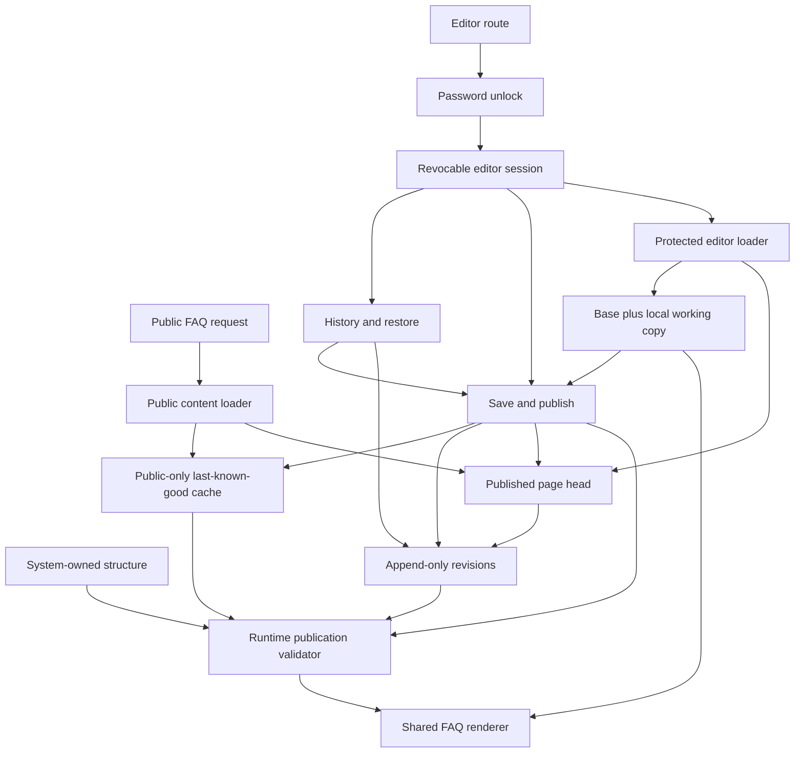
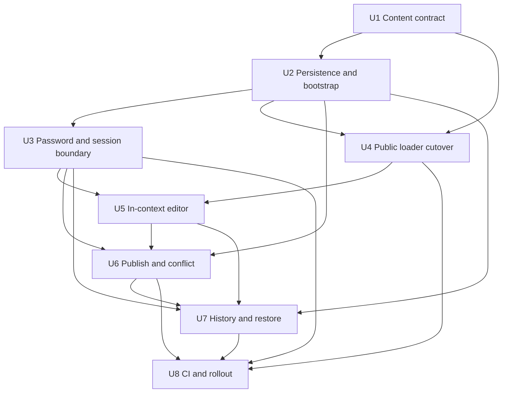
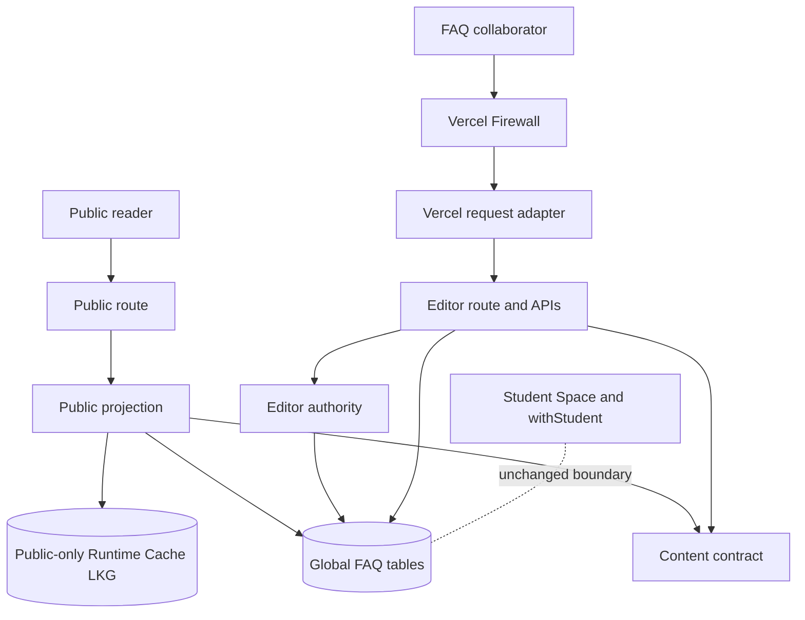

# My World FAQ Direct Team Authoring

## Overview

Add a protected authoring mode at `/my-world/faq/edit` so trusted My World
teammates can improve the existing page in context and publish immediately,
without editing source code or triggering a deployment. The public
`/my-world/faq` route remains unlisted and read-only.

The authoring model is deliberately small:

| Mode | What the person can do | What the system exposes |
|------|-------------------------|-------------------------|
| Public FAQ | Read the latest complete published page, or the validated last-known-good published page during a declared database outage | Published content only |
| Locked editor | Enter the shared password and a display name | The unlock form only |
| Active editor | Edit plain-text/link fields, append a bounded structured question and preview in context | Current content, base version, validation and local dirty state |
| Historical preview | Inspect one earlier complete revision | Protected read-only revision content and self-declared attribution |
| Conflict/recovery | Preserve and compare local work after a stale, invalid or failed save | Protected current/base/local comparison; never a silent merge |

Every successful **Save & publish** creates one immutable complete-page
revision and atomically replaces the published head. A stale editor cannot
overwrite a teammate's newer revision. Restoring an older revision publishes a
new revision rather than deleting history.

This is a Deep plan because the change crosses public rendering, structured
content, authentication, durable persistence, concurrency, deployment
operations, accessibility and security boundaries.

---

## Problem Frame

The current FAQ is visually complete but operationally static. Substantive copy
is split across TypeScript registries and hardcoded component strings. Updating
an answer therefore requires an engineer, a code review, a build and a
deployment. That is incompatible with the team's need to refine sensitive
claims collaboratively before sharing the page more widely.

Simply placing inputs over the current page would be unsafe:

- the public route imports static data directly;
- the present content types disappear at runtime and publication invariants
  live only in tests;
- the card front is itself an interactive button, so nesting editable controls
  inside it would create invalid and inaccessible markup;
- there is no global FAQ persistence, authoring identity, revision history,
  conflict control or restore path;
- the existing student database boundary is tenant-scoped and must not be
  repurposed with a fake student identity;
- a serverless in-memory password, session or rate limiter would not be shared
  reliably across Vercel instances.

The product requirement is intentionally not a general CMS. Trusted
collaborators edit an existing, system-defined document. The structure,
evidence vocabulary and relationships stay under code control while human
teammates own the wording.

---

## Requirements Trace

The authoring work primarily implements R19–R30. R1–R18 remain the public-page
contract that the refactor must preserve.

- R1. Preserve the unlisted, exact-link public route and its noindex posture.
- R2. Keep “Working prototype” and do not restore the removed pilot-stage hero.
- R3. Preserve the bounded thesis: reflection support must not be framed as a
  replacement for relationships, agency or developmental safety.
- R4. Preserve the real desktop Capture, My Identity, History and Path Finder
  recordings before the FAQ.
- R5. Keep Pigeonhole screenshots out of the public UI; only faithful,
  unattributed audience quotations remain.
- R6. Keep the My World team accountable for substantive claims and Kira in a
  visual/product-guide role.
- R7. Preserve the glanceable card field, all concern clusters, direct links
  and scan-first behavior.
- R8. Preserve the two-layer short answer and evidence-detail model.
- R9. Preserve focused traversal, close/escape behavior and focus return.
- R10. Preserve explicit coverage of every committed concern even when the
  displayed wording is edited.
- R11. Preserve evidence labels and cautious handling of early signals,
  hypotheses and team checks.
- R12. Preserve source fit, limitations and non-prevalence treatment of
  community discussion.
- R13. Preserve the three semantically distinct ledger states.
- R14. Keep “Built today” limited to repository/deployment-verified controls.
- R15. Preserve required-before-pilot and still-researching guardrail content.
- R16. Keep calls to contribute editable without pretending the currently
  disabled feedback delivery path is active.
- R17. Do not weaken the separate anonymous-feedback delivery requirements or
  display a false delivered state.
- R18. Preserve phone/desktop access, keyboard and focus behavior, text
  scaling, reduced motion, non-colour cues and text equivalents.
- R19. Keep `/my-world/faq` read-only and add the separately protected,
  memorable `/my-world/faq/edit` route.
- R20. Verify one rotatable shared password only on the server, rate-limit
  failed attempts and exchange success for a secure expiring session.
- R21. Make every substantive existing copy field durable and editable,
  including page metadata, hero/section text, product explanations and text
  equivalents, quotations, questions, answers, evidence context, source
  metadata/links, guardrail summaries, contribution copy and footer copy.
- R22. Keep IDs, slugs, taxonomy, order, fixed control labels,
  evidence/ledger vocabularies and all reference relationships system-owned.
  Permit only bounded append-only question creation through the structured
  form: generated identity/order, one derived working-answer block, at most 10
  additions per publish and 50 team-added questions in total. Do not remove or
  reorder records.
- R23. Edit in the real page context, distinguish editor mode, show dirty
  fields and keep the working copy through recoverable save failures.
- R24. Make Save & publish one complete, validated and atomic action with no
  intermediate public state.
- R25. Require a self-declared display name, record it on every authored
  revision and state clearly that shared-password access does not verify
  identity.
- R26. Reject stale saves, preserve local text and provide comparison/copy
  recovery without automatic merging.
- R27. Enforce the current content/evidence contract at publication time,
  including safe links, exact structure, references, calibrated claims and
  layout-dependent length limits.
- R28. While Postgres is available, return only the current published content
  to the public route. During a declared database outage, permit only the latest
  validated previously published public snapshot. In both cases keep sessions,
  names, history, conflicts, drafts and validation internals protected.
- R29. Provide protected paginated history, historical preview and
  restore-as-new-revision.
- R30. Make unlock, editing, status, errors, conflicts, history and restore
  keyboard-, zoom- and mobile-usable without colour-only cues.

**Derived reliability constraint DR1.** Direct authoring must not turn today's
static public FAQ into a database-outage blank page after activation. Once a
valid authored page has been observed, a transient Postgres failure serves
that complete validated authored snapshot; compiled seed copy is never used,
and a sanitized 503 is reserved for the case where neither source is valid.
This deterministic old-complete-or-new-complete behavior is the v1 release
threshold; it is not a general CMS uptime framework.

**Origin actors:** A1 (MOE/DXD colleague), A2 (leadership reviewer), A3
(parent-minded reader), A4 (student), A5 (My World team), A6 (Kira), A7 (FAQ
collaborator).

**Origin flows:** F1 (understand My World), F2 (scan and inspect a concern), F3
(audit the ledger), F4 (offer a concern/source), F5 (maintain claims), F6 (edit
and publish), F7 (inspect and restore).

**Origin acceptance examples:** AE1–AE10 remain public regression contracts;
AE11 covers route/session isolation; AE12 covers complete publication and
attribution; AE13 covers validation rollback; AE14 covers stale-save rejection;
AE15 covers restore-as-new-revision; AE16 covers public-data isolation and
accessible mobile editing.

---

## Scope Boundaries

- This plan adds direct authoring for the existing page and bounded,
  append-only question creation inside existing topics. It does not remove,
  duplicate or reorder page sections, questions, evidence blocks, sources,
  guardrails or media, and it does not create arbitrary relationships.
- It does not create invitations, individual accounts, SSO, verified
  identities, roles, approval stages, draft review, comments or assignments.
- It does not add real-time co-editing, presence, suggestions, automatic merge
  or a collaborative rich-text engine.
- It does not accept raw HTML, Markdown, arbitrary embeds or general page
  layout changes.
- It does not generate, rewrite or evaluate answers with AI. Human teammates
  remain accountable for every saved word and source.
- It does not make audience quotations representative evidence or publish the
  supplied Pigeonhole interface.
- It does not implement missing My World product safeguards, privacy controls
  or pilot governance merely because their FAQ wording becomes editable.
- It does not complete the separately planned anonymous-feedback backend.
  Contribution copy remains honest about the actual disabled/enabled state.
- It does not reuse WorkOS student/counsellor identity or `withStudent`; FAQ
  authoring is system-scoped content.
- It does not use compiled copy as an outage fallback after direct authoring is
  activated. A validated public-only last-known-good authored snapshot is the
  resilience path; a generic 503 appears only when neither the database nor a
  valid last-known-good snapshot is available.
- It does not allow a code rollback to a pre-editor public loader after
  authored revisions exist. That operational boundary is explicit in the
  rollout runbook.

---

## Context & Research

### Relevant Code and Patterns

- `src/routes/my-world.faq.tsx` is already the correct engine-free public route
  outside `_app`; it currently loads only `feedbackEnabled`.
- `src/components/my-world-faq/MyWorldFaqPage.tsx`,
  `ProductLoop.tsx`, `SignalSourceStrip.tsx`,
  `GuardrailLedgerPreview.tsx` and `QuestionField.tsx` contain substantive
  hardcoded copy that must move into the editorial document.
- `src/data/my-world-faq/` contains six clusters, 34 canonical cards, 92
  evidence blocks, 13 sources, 11 product-provenance records, 22 guardrails and
  10 assets. The current serialized content is roughly 145 KB, so complete
  revision snapshots are practical.
- `test/data/my-world-faq-content.test.ts` is the current publication gate:
  taxonomy, references, 20–45-word short answers, evidence/status coupling,
  source requirements, calibrated risk claims and prohibited positioning.
  These checks must become runtime validation rather than remain test-only.
- `src/routes/share.$token.tsx`,
  `src/server/load-public-profile.functions.ts` and
  `src/server/load-public-profile.handler.server.ts` establish a narrow public
  loader and dynamic server-only import boundary.
- `src/routes/api/share/create.tsx` and
  `src/server/share-token.handler.server.ts` establish explicit API parsing,
  same-origin gating, typed server errors and stable HTTP response mapping.
- `src/auth/same-origin.ts` is the single positive-proof Origin/Fetch Metadata
  gate; all authoring mutations should reuse it.
- `src/auth/demo-session.server.ts` supplies cookie construction precedent, but
  demo identity and its bypasses must not authorize the editor.
- `src/db/client.ts` uses `drizzle-orm/node-postgres` over `pg.Pool`; normal
  interactive transactions are supported. `getDbForMemoryModule()` shows a
  pool-level global query seam, but its historical name should not become the
  FAQ authorization boundary.
- `src/agents/memory/index.ts` provides transaction, advisory-lock and explicit
  concurrency-error precedents.
- `src/db/migrations/README.md` requires schema-first, generated, forward-only
  migrations plus metadata and bans `drizzle-kit push`.
- `test/setup.ts` protects live data by deleting ambient `DATABASE_URL` and
  enabling DB tests only through a disposable `TEST_DATABASE_URL`.
- `src/components/ui/` provides the ShadCN-style Button, Card, Dialog,
  AlertDialog, Tabs, Badge and Textarea primitives the editor should compose.
- `api/index.ts` currently buffers every non-GET body without a limit; the
  editor endpoints need route-specific streaming caps before buffering.
- `vercel.json` already sets global clickjacking, transport, MIME and referrer
  protections, but the FAQ-specific noindex/no-referrer rule matches only the
  exact public path and has no authoring cache policy.

### Institutional Learnings

- `docs/decisions/2026-07-28-my-world-faq-cards.md` is the latest visual
  authority: three-column flipping cards, a focused evidence dialog and
  separate Product/FAQ navigation supersede the older accordion concept.
- `docs/plans/2026-06-15-001-feat-island-layout-data-model-plan.md`,
  `2026-06-15-004-feat-island-layout-export-default-pipeline-plan.md` and
  `2026-07-21-001-feat-island-editor-world-port-plan.md` support a versioned
  working document, stable IDs, runtime validation and explicit migration
  seam.
- `docs/plans/2026-05-18-005-feat-profile-redesign-share-plan.md` and
  `docs/solutions/2026-07-25-counsellor-surface-decision.md` show why public
  projections must be narrower than authenticated/internal models.
- `docs/plans/2026-05-18-002-feat-student-space-backend-bridge-plan.md` and
  `2026-05-19-003-fix-backend-wire-hardening-plan.md` keep Postgres
  authoritative, preserve local work on failed writes and use only narrow,
  expected fallbacks.
- `plans/047-capture-retry-idempotency.md` shows that database constraints and
  idempotency, not client button disabling, arbitrate independent callers.
- `plans/059-revive-dark-db-tests.md` and `test/setup.ts` define the safe
  disposable Postgres lane. The normal CI workflow still does not exercise it.
- `plans/071-production-migration-deploy-runbook.md` documents the
  migration-before-deploy rule and why Vercel builds must not be assumed to
  migrate the production database.
- No shipped repository pattern exists for shared-password verification,
  revocable editor sessions, a global append-only CAS history or a production
  rate limiter. Those parts require external grounding and dedicated tests.

### External References

- [OWASP Password Storage Cheat
  Sheet](https://cheatsheetseries.owasp.org/cheatsheets/Password_Storage_Cheat_Sheet.html)
  recommends Argon2id and self-describing salted password hashes.
- [OWASP Authentication Cheat
  Sheet](https://cheatsheetseries.owasp.org/cheatsheets/Authentication_Cheat_Sheet.html)
  recommends login throttling and generic authentication failures.
- [OWASP Session Management Cheat
  Sheet](https://cheatsheetseries.owasp.org/cheatsheets/Session_Management_Cheat_Sheet.html)
  covers unpredictable tokens, expiry, revocation, cookie flags and no-store
  handling.
- [OWASP CSRF Prevention Cheat
  Sheet](https://cheatsheetseries.owasp.org/cheatsheets/Cross-Site_Request_Forgery_Prevention_Cheat_Sheet.html)
  treats SameSite cookies as defence in depth rather than the only mutation
  gate.
- [MDN Set-Cookie](https://developer.mozilla.org/en-US/docs/Web/HTTP/Reference/Headers/Set-Cookie)
  and [MDN secure cookie
  guidance](https://developer.mozilla.org/en-US/docs/Web/Security/Practical_implementation_guides/Cookies)
  define `__Host-`, Secure, HttpOnly, SameSite and Path constraints.
- [PostgreSQL row locking](https://www.postgresql.org/docs/current/explicit-locking.html)
  and [transaction
  isolation](https://www.postgresql.org/docs/current/transaction-iso.html)
  define the concurrency behavior used by the publication head.
- [Drizzle
  transactions](https://orm.drizzle.team/docs/transactions) and
  [node-postgres
  transactions](https://node-postgres.com/features/transactions) confirm that
  this repository's current driver supports one-client transactional work.
- [Vercel WAF custom
  rules](https://vercel.com/docs/vercel-firewall/vercel-waf/custom-rules) and
  [rate limiting](https://vercel.com/docs/vercel-firewall/vercel-waf/rate-limiting)
  support path-specific, pre-function throttling without storing IP addresses
  in the FAQ database.
- [Vercel Cache-Control
  headers](https://vercel.com/docs/caching/cache-control-headers) documents
  public revalidation, private response handling and `stale-if-error`.
- [Vercel Functions API
  reference](https://vercel.com/docs/functions/functions-api-reference/vercel-functions-package)
  documents framework-independent Runtime Cache, cache tags and global tag
  expiry. The public-only last-known-good cache must be preview-verified because
  it is a new repository dependency.
- [Chrome's back/forward cache and
  no-store](https://developer.chrome.com/docs/web-platform/bfcache-ccns)
  explains why no-store alone no longer proves that protected DOM cannot
  reappear after browser Back.
- [Vercel environment-variable
  rotation](https://vercel.com/docs/environment-variables/rotating-secrets)
  and [Deployment
  Protection](https://vercel.com/docs/deployment-protection) matter because
  old generated deployments retain their original environment.

---

## Key Technical Decisions

| Decision | Chosen direction | Why |
|----------|------------------|-----|
| Editorial model | One strict, versioned editorial document keyed by compiled stable IDs | Complete snapshots are small, restore is simple and structure cannot be reordered accidentally |
| Structural ownership | Code owns IDs, order, kinds, statuses, evidence/ledger assignments and relationships; the document owns human-facing copy | Satisfies direct editing without turning evidence integrity into arbitrary strings |
| Persistence scope | Dedicated global FAQ repository and tables, never `withStudent` | FAQ content has no student tenant and must not invent one |
| Publication | Short transaction locks/checks the singleton head, inserts one immutable complete revision and advances only the head pointer | Produces one authoritative document, complete old-or-new visibility and deterministic stale-save rejection |
| Retry safety | One client-generated publish attempt ID plus a canonical request fingerprint per save/restore | A lost success response can be retried without creating a duplicate, accepting changed input or reporting a false stale conflict |
| Password | Argon2id PHC hash in a server-only Vercel secret | No plaintext credential, client secret or fast comparison |
| Session | Random opaque token in a secure cookie; only its digest is stored in a revocable database session with 30-minute idle and eight-hour absolute expiry | Enables logout, bounded access and immediate invalidation on password rotation without accounts |
| Attribution | Display name stored in the session and copied to revisions as self-declared text | The save cannot substitute another name, while the UI remains honest about non-verification |
| Brute-force protection | Required Vercel Firewall rate limit of 10 total unlock requests per 10 minutes per IP | Runs before Argon2, works across serverless instances and avoids app-level IP storage |
| CSRF | SameSite=Lax host cookie plus the existing positive same-origin gate on every POST | Supports links opened from Slack/email while refusing cross-site mutations |
| Public freshness | Browser responses revalidate, TanStack loader state is immediately stale, and persisted/back-forward navigation triggers a content recheck | A reload/navigation observes the database head without treating browser memory or BFCache as authority |
| Outage behavior | Compiled copy is allowed only in explicit pre-activation mode; database mode falls back only to a validated public-only Runtime Cache snapshot and otherwise returns 503 | Keeps the prior authored page available without exposing editor data or silently reverting to the compiled seed |
| Editing UI | One content renderer with distinct public, edit and historical-preview adapters | Prevents public/editor drift while keeping controls out of the public bundle |
| Draft recovery | Frozen base plus in-memory working document and dirty paths; all API errors preserve it; refresh/navigation warns | Meets recoverable-error behavior without persisting unpublished copy to browser storage |
| Conflict handling | Three-way field comparison and copy affordances; no automatic merge | Protects both collaborators' wording and preserves the v1 boundary |
| Rich content | Structured Input/Textarea/URL fields rendered as escaped text only | Avoids HTML/XSS/page-builder scope |

### Editable Field Manifest

The runtime manifest is explicit rather than inferred from arbitrary object
keys.

**Editable in the authoring release**

- route title/description and all public hero, section, CTA and footer copy;
- product-step headings, explanations, boundaries, alt text and transcripts;
- audience quotation text and neutral context labels;
- concern-cluster labels/summaries and the displayed question wording;
- short answers and evidence headings, body, population context, fit and
  limitations;
- source titles, authors/publisher/date/identifier, HTTPS URL, method,
  population context, fit and limitations;
- product-provenance titles, claim scope, population context, fit and
  limitations, but not repository paths;
- guardrail title, what-it-protects, status summary, population context, fit
  and limitations;
- contribution and review copy, subject to the real feedback capability state.

**System-owned in the authoring release**

- schema/structure versions, IDs, slugs, array/key order and card/block
  composition. The application alone performs the controlled v1-to-v2 upgrade
  when the first structured question is appended;
- committed-question taxonomy and search aliases;
- evidence-block kinds, label assignments and review-status/reviewer-role
  assignments;
- source kinds, provenance paths, all source/provenance/guardrail/asset
  reference arrays and reverse links;
- guardrail state and label assignments;
- media paths, dimensions and approval state;
- fixed navigation, flip, evidence, editor, save, history, conflict and restore
  control labels;
- revision number, self-declared saver, timestamps, restore provenance,
  idempotency and session metadata.

### Editorial Field Limits

The manifest assigns every editable path one category; client guidance and the
server publication gate consume the same limits. Grapheme counts use
`Intl.Segmenter`, short-answer words use the existing whitespace-delimited
contract, and transport ceilings use UTF-8 bytes.

| Field category | Warning | Blocking limit |
|----------------|---------|----------------|
| Route title | over 60 graphemes | 120 graphemes |
| Route description | over 160 graphemes | 320 graphemes |
| Compact labels, headings and source names | over 96 graphemes | 320 graphemes |
| Displayed questions | over 220 graphemes | 360 graphemes |
| Short answers | live word count | 20–45 words and 600 graphemes |
| Quotes, summaries, CTA/footer and product explanations | over 600 graphemes | 2,000 graphemes |
| Evidence body, context, fit, limitation and methods | none beyond live count | 8,000 graphemes |
| Alt text | over 250 graphemes | 500 graphemes |
| Media transcripts | none beyond live count | 20,000 graphemes |
| External URLs | none | 2,048 UTF-8 bytes, absolute HTTPS, no credentials |
| Complete publication envelope | none | 1 MiB streamed and declared bytes |

U1 must prove the compiled initial document fits these limits and the U5 layout
tests must prove warning-threshold copy remains usable at 320 px and 400% zoom.
Changing a category limit later is a code-reviewed manifest change, not an
editorial save.

When accountable evidence or guardrail copy changes in an ordinary save, the
server stamps only the affected record's `lastReviewed`/`lastChecked` date. It
does not stamp unrelated records. A restore preserves the selected revision's
content and review dates exactly; the new revision metadata records when and by
whom it was restored. The self-declared saver never replaces the compiled
reviewer-role classification.

### Persistence Contract

| Table | Authoritative fields | Required constraints |
|-------|----------------------|----------------------|
| `my_world_faq_heads` | singleton page key, current revision ID/version/digest, updated time | one supported page key; current pointer references an immutable revision whose page/version/digest agree |
| `my_world_faq_revisions` | UUID, page/version, full JSON document, schema/structure versions, canonical digest, self-declared saver or system-import attribution, database timestamp, restore source, attempt ID/fingerprint | append-only; unique page/version and page/attempt; no repository update/delete method |
| `my_world_faq_editor_sessions` | token digest, non-secret audit UUID, display name, credential fingerprint, created/last-seen/absolute-expiry/revoked times, mutation-window start/count | token digest only; atomic expiry and mutation-window checks; indexed expiry/revocation pruning predicate; no dependency from immutable revisions |

Revision attribution is copied text, not a foreign key to an expiring session.
The head never contains a second document body.

### Editorial Governance Boundary

V1 intentionally optimizes for direct copy revision, not in-product approval.
Any teammate who has the shared password can publish immediately; discussion
and fact-checking happen in the team's existing channels before **Save &
publish**. The team accepts that self-declared attribution and restore are
after-the-fact safeguards, not identity verification or editorial approval, and
must name an operational owner for password distribution, rotation and urgent
restore before enablement.

The release removes engineering from ordinary wording changes and lets the
team append a bounded question card through one strict template. The generated
ID, slug, topic-relative order, review classification and empty relationship
arrays remain application-owned. Sources, guardrails, relationships, media or
layout remain code-reviewed structural changes owned by the
product/engineering team.

---

## Open Questions

### Resolved During Planning

- **Separate or existing auth?** Use a dedicated shared-password editor
  authority. WorkOS and demo/student identity do not grant access.
- **Password in the URL?** No. The memorable editor path is public knowledge;
  the password is sent only in a bounded same-origin POST body.
- **Stateless or revocable sessions?** Use database-backed opaque sessions so
  logout and credential rotation revoke access immediately.
- **Normalized content tables or snapshots?** Store one full versioned
  editorial document per revision over a compiled structural manifest.
- **How is a save atomic?** Validate first, then lock and compare the singleton
  head, append the revision and advance the head inside one Postgres
  transaction.
- **What is a broken source link?** Publication validates absolute HTTPS
  syntax, forbids credentials and unsafe schemes, and keeps anchors safe.
  It does not fetch arbitrary URLs during save; live checks would add SSRF,
  timeout and false-negative risk.
- **How do public and editor loaders differ?** The public loader returns the
  composed published content only. Authenticated editor loaders separately
  return base/head metadata, history and validation information.
- **How does the public route survive rollout and an outage?** Explicit
  compiled mode preserves today's page while additive migration/bootstrap
  occurs. Before activation, the operator primes a public-only Runtime Cache
  snapshot. Database mode reads Postgres first and uses that validated snapshot
  only when Postgres is unavailable; it never falls back to compiled copy.
  Database authority becomes irreversible operationally after the first
  authored revision.
- **How are conflicts resolved?** Humans compare/copy and intentionally reopen
  the latest version. There is no automatic merge.
- **What happens during a database outage after activation?** The public route
  serves the latest validated public-only authored snapshot it has seen and
  indicates degraded freshness. It returns a generic retryable 503 only if no
  valid authored snapshot exists.
- **How is card editing accessible?** Public cards retain flip buttons. Editor
  cards replace the whole-face trigger with separate side selectors and
  labelled fields so inputs are never nested in a button.
- **How are reviews dated?** Save-time diffing stamps only changed accountable
  records using the database time/date; revision attribution remains
  self-declared.

### Deferred to Implementation

- **Argon2 package version and benchmark tuning:** choose the audited Node
  22-compatible package version during implementation, but do not weaken the
  fixed Argon2id floor of 19 MiB memory, two iterations and parallelism one.
  Verify Vercel build/runtime compatibility and latency before merging.
- **WAF rule implementation mechanism:** dashboard, CLI or supported project
  configuration may be used, but production enablement is blocked until the
  exact unlock path returns a real 429 under repeated failure.
- **Future schema migrators:** v1 defines the versioned migration seam and
  supports the initial version. Later structure changes must add explicit
  migrators before old revisions can be restored.

---

## Output Structure

    api/
      request-body-limits.ts
    src/
      auth/
        my-world-faq-editor-session.server.ts
      components/my-world-faq/
        editor/
          MyWorldFaqEditorPage.tsx
          FaqEditorGate.tsx
          FaqEditorToolbar.tsx
          EditableFaqField.tsx
          FaqConflictDialog.tsx
          FaqRevisionHistoryDialog.tsx
      data/my-world-faq/
        content-manifest.ts
        content-schema.ts
        default-document.ts
        compose-document.ts
      routes/
        my-world.faq_.edit.tsx
        api/my-world/faq/editor/
          session.tsx
          logout.tsx
          publish.tsx
          restore.tsx
      server/
        my-world-faq-content.functions.ts
        my-world-faq-content.handler.server.ts
        my-world-faq-editor.functions.ts
        my-world-faq-editor.handler.server.ts
        my-world-faq-public-cache.server.ts
        my-world-faq-repository.server.ts
      db/
        schema.ts
        migrations/
    scripts/
      bootstrap-my-world-faq.ts
      hash-my-world-faq-password.ts
    test/
      api/
      auth/
      components/my-world-faq/
      data/
      db/
      routes/
      server/
    docs/runbooks/
      my-world-faq-editor.md

This tree is a scope guide. Implementation may combine narrowly related
modules, but public, editor, auth and database responsibilities must remain
separable and mechanically testable.

---

## High-Level Technical Design

> *This illustrates the intended approach and is directional guidance for
> review, not implementation specification.*

The public renderer receives no mode derived from a cookie. A public request
with an editor cookie still gets the same narrow public content DTO and the
same public bundle. Only the edit route imports authoring controls.

### Editor State Contract

| State | Entry | Allowed transition | Draft behavior |
|-------|-------|--------------------|----------------|
| Locked | No valid session | Submit unlock | No document loaded |
| Unlocking | Password/name submitted | Ready, invalid, rate-limited, unavailable | No document loaded |
| Clean | Valid session and current head loaded | Edit, history, logout | Base equals working copy |
| Dirty | At least one editable field differs | Validate/publish, history, discard/logout confirmation | Working copy retained |
| Publishing | Bounded authenticated request in flight | Published, validation error, expired auth, conflict, retryable failure | Inputs disabled; copy retained |
| Validation error | Client/server gate rejects fields | Focus/fix/retry | Copy and dirty paths retained |
| Expired auth | Protected action returns 401 | Re-unlock/retry | Copy and base retained in memory |
| Conflict | Current head differs from base | Compare/copy, explicitly load latest | Local/base/latest remain distinct |
| Retryable failure | Timeout/503/ambiguous response | Retry same attempt ID | Copy retained |
| Published | Transaction committed | Reset to clean on returned authoritative snapshot | Base becomes returned revision |
| Published, degraded resilience | Database committed; Runtime Cache refresh failed | Continue editing; operator/public read refreshes cache | Base/working copy become the committed revision; clean with a persistent non-blocking warning |
| Committed but superseded | Lost-response retry finds its committed revision and a newer live head | Compare committed revision with live; explicitly start from live | Do not mark the old draft clean against live; save remains disabled until a current base is chosen |
| Historical preview | Protected revision opened | Close; confirm restore only from a clean editor | Active draft remains untouched; dirty state blocks restore |

---

## Implementation Units

The units have non-linear dependencies. U3 and U4 can proceed in parallel after
the shared document/persistence foundations; U8 is the final verification and
operational fan-in.

- U1. **Centralize a strict editorial document and make the renderer
  content-driven**

**Goal:** Move every editable string/link into one versioned runtime contract
while keeping structure and visual behavior code-owned.

**Requirements:** R1–R18 regressions, R21, R22, R27, R28

**Origin flows / acceptance:** F1–F6; AE1–AE13

**Dependencies:** None

**Files:**
- Create: `src/data/my-world-faq/content-manifest.ts`
- Create: `src/data/my-world-faq/content-schema.ts`
- Create: `src/data/my-world-faq/default-document.ts`
- Create: `src/data/my-world-faq/compose-document.ts`
- Modify: `src/data/my-world-faq/types.ts`
- Modify: `src/data/my-world-faq/index.ts`
- Modify: `src/data/my-world-faq/questions.ts`
- Modify: `src/data/my-world-faq/sources.ts`
- Modify: `src/data/my-world-faq/guardrails.ts`
- Modify: `src/data/my-world-faq/assets.ts`
- Modify: `src/components/my-world-faq/MyWorldFaqPage.tsx`
- Modify: `src/components/my-world-faq/ProductLoop.tsx`
- Modify: `src/components/my-world-faq/SignalSourceStrip.tsx`
- Modify: `src/components/my-world-faq/GuardrailLedgerPreview.tsx`
- Modify: `src/components/my-world-faq/QuestionField.tsx`
- Modify: `src/routes/my-world.faq.tsx`
- Test: `test/data/my-world-faq-content.test.ts`
- Create test: `test/data/my-world-faq-publication.test.ts`
- Modify test: `test/components/my-world-faq/MyWorldFaqPage.test.tsx`
- Modify test: `test/routes/my-world-faq.test.ts`

**Approach:**
- Characterize the current rendered copy and interactions before refactoring.
- Define a strict schema-versioned editorial document made of records keyed by
  stable manifest IDs. Reject missing and extra keys; never infer order from
  request arrays.
- Give currently anonymous hero/section/quote/product text stable field paths
  so dirty state, validation and conflict comparison are deterministic.
- Seed the default document from exactly what is visible today, including
  route metadata, alt text and transcripts. Remove duplicate product copy from
  component constants and `assets.ts`.
- Make the public route's document title and description come from that same
  compiled default immediately, so metadata is not a temporary second source
  of editable copy before persistence lands.
- Keep displayed question wording editable while retaining committed concern
  taxonomy and search aliases as locked coverage data. Refactor resolution
  maps to derive from the composed document rather than module-global static
  registries.
- Extract every existing test-only publication invariant into pure runtime
  validation with field-path errors. Keep the existing tests as contract
  regression coverage.
- Normalize validated documents into manifest order and define one canonical
  UTF-8 JSON serialization used for SHA-256 document digests and request
  fingerprints across bootstrap, publish, cache and integrity checks.
- Preserve the accountable-copy boundary: prohibited-claim checks apply to
  team answers/evidence/guardrail copy, not audience quotes or source titles.
- Render all editable values as escaped React text. Links accept only validated
  absolute HTTPS URLs and retain safe outbound attributes.
- Change components to receive a composed content model. Public mode remains
  read-only and visually unchanged.

**Execution note:** Characterization-first and schema-first. Do not introduce
database or editor state until the compiled default passes the same production
validator a future save will use.

**Patterns to follow:**
- Current invariant coverage in `test/data/my-world-faq-content.test.ts`
- Versioned validator/migrator boundary in
  `docs/plans/2026-07-21-001-feat-island-editor-world-port-plan.md`
- Existing FAQ card/evidence behavior in `QuestionField.tsx`

**Test scenarios:**
- Happy path: the compiled initial document validates and renders the same 34
  cards, 40 concern mappings, product clips, quotes, evidence and ledger.
- Happy path: changing each manifest-declared editable path changes the
  corresponding rendered public value.
- Edge case: missing, extra, duplicated or reordered structural keys are
  rejected with stable field paths.
- Edge case: an edited displayed question remains discoverable by its locked
  committed wording, aliases, ID and slug.
- Error path: invalid label/state/status/reference/date/URL, empty required
  limitation, too-short/long answer and prohibited accountable claim fail the
  runtime gate.
- Boundary: each manifest field category accepts its exact maximum, rejects one
  grapheme/word/byte beyond it and reports warnings without turning them into
  server rejection.
- Security: HTML-looking text renders literally and unsafe URL schemes never
  become anchors.
- Regression: public card flips, evidence dialog focus, deep links, reduced
  motion, media transcripts and existing nav behavior do not change.

**Verification:**
- One validated default editorial document accounts for all substantive copy
  named by R21.
- No public component imports fragmented mutable registries or maintains a
  second copy of product/quote text.
- The current public page remains visually and semantically equivalent before
  persistence is introduced.

---

- U2. **Add global content persistence, append-only revisions and explicit
  bootstrap**

**Goal:** Persist one authoritative published document and complete immutable
history without entering the student tenancy boundary.

**Requirements:** R21, R24, R25, R26, R28, R29

**Origin flows / acceptance:** F6, F7; AE12–AE15

**Dependencies:** U1

**Files:**
- Modify: `CLAUDE.md`
- Modify: `src/db/schema.ts`
- Create: next generated migration under `src/db/migrations/`
- Create: matching generated metadata under `src/db/migrations/meta/`
- Create: `src/server/my-world-faq-repository.server.ts`
- Create: `scripts/bootstrap-my-world-faq.ts`
- Modify: `package.json`
- Create test: `test/server/my-world-faq-repository.test.ts`
- Create test: `test/db/my-world-faq-revisions.test.ts`

**Approach:**
- Add globally scoped tables for the singleton page head, append-only complete
  revisions and opaque editor sessions. Do not add `student_id`, student RLS
  or a `withStudent` call.
- Keep the global database entry point narrow and server-only. Do not spread
  use of the historically named `getDbForMemoryModule()` into route code.
- Store only the current revision pointer/version and integrity metadata on
  the singleton page head; join that pointer to the immutable revision for
  public and editor reads. Do not duplicate the authoritative document JSON
  on the head.
- Store each complete validated document plus a canonical document digest,
  structure/schema version, self-declared editor name, database timestamp,
  optional restored-from revision, unique publish-attempt ID and canonical
  request fingerprint in revisions.
- Enforce one page key, positive monotonic versions, unique page/version and
  unique attempt IDs. Expose no update/delete repository operation for
  revisions, and add a database trigger that rejects direct revision update or
  delete attempts by the application role.
- Implement publication as one short node-postgres transaction: check for an
  already-committed attempt; lock the head; recheck the attempt to close the
  concurrent first-use race; compare the expected base; append the new
  revision; advance the head pointer; commit. A matching retry returns the
  committed result, even if a later publication has since advanced the head,
  and marks it `committed-but-superseded`; a mismatched fingerprint is a
  protocol conflict. Any failure rolls back both writes.
- Use the same transaction path for restore; only the candidate content and
  restore provenance differ.
- Keep history queries metadata-only and paginated. Fetch one protected
  revision content body at a time.
- Add an operator-run bootstrap under a transaction-scoped advisory lock. It
  validates and canonically digests the compiled default, creates exactly
  version 1 only when both the head and revision set are empty, and treats any
  partial state—head without revision, revision without head, bad pointer or
  digest mismatch—as corruption requiring an operator stop. Attribute the
  revision as a system import, not a verified teammate identity.
- Keep bootstrap separate from `src/db/seed.ts` and demo reset commands so demo
  workflows can never overwrite authored FAQ content.
- Update `CLAUDE.md` with a narrow, named exception for this system-scoped FAQ
  repository. Keep the default `withStudent` rule intact for student data and
  prohibit route code from using the exception directly.
- Generate and review the forward-only migration and metadata. Never use
  `drizzle-kit push`.

**Execution note:** Transaction and migration tests must run against a
disposable Postgres database; mock tests alone cannot prove the core promise.

**Patterns to follow:**
- Migration discipline in `src/db/migrations/README.md`
- Transaction/concurrency handling in `src/agents/memory/index.ts`
- Safe test environment in `test/setup.ts` and
  `test/db/db-gate-canary.test.ts`

**Test scenarios:**
- Happy path: bootstrap creates one page head and one matching version-1
  system revision; a second bootstrap is a no-op.
- Integration: two independent connections bootstrap an empty database at
  once; one creates version 1 and the other verifies the same pointer,
  version and digest without creating another row.
- Error path: a head-only row, revision-only row, broken head pointer or digest
  mismatch makes bootstrap stop without writing or repairing history.
- Integration: two independent connections publish distinct attempt IDs from
  version N; exactly one creates N+1 and the other receives a typed conflict.
- Integration: a forced revision/head failure rolls back the complete
  transaction and leaves N public.
- Integration: retrying a committed attempt ID returns the original success
  without adding another revision.
- Integration: two concurrent first uses of the same attempt ID/fingerprint
  create one revision and return one authoritative result.
- Integration: retrying a committed attempt after another editor has advanced
  the head returns the original revision as committed-but-superseded and does
  not move the head backward.
- Edge case: reusing an attempt ID with different content is rejected.
- Database integrity: direct update/delete statements against an existing
  revision are rejected while head/session maintenance remains possible.
- Edge case: history pagination returns metadata only; one revision fetch
  returns only the requested protected content.
- Error path: missing/uninitialized page, invalid JSON structure and database
  unavailability produce typed repository errors with no raw SQL/env detail.
- Security: no repository result intended for public use contains editor
  session rows or revision attribution.

**Verification:**
- Current content and history survive process restart/deployment.
- All publication races are decided by Postgres, not browser timing.
- Initial source copy is imported once and cannot overwrite a human revision.

---

- U3. **Build the shared-password and revocable-session security boundary**

**Goal:** Make the simple editor URL safe to share internally without accounts
or secrets in the browser bundle.

**Requirements:** R19, R20, R25, R28, R30

**Origin flows / acceptance:** F6, F7; AE11, AE16

**Dependencies:** U2

**Files:**
- Create: `api/request-body-limits.ts`
- Create: `src/auth/my-world-faq-editor-session.server.ts`
- Create: `src/server/my-world-faq-editor.handler.server.ts`
- Create: `src/routes/api/my-world/faq/editor/session.tsx`
- Create: `src/routes/api/my-world/faq/editor/logout.tsx`
- Create: `scripts/hash-my-world-faq-password.ts`
- Modify: `api/index.ts`
- Modify: `package.json`
- Modify: `vercel.json`
- Create test: `test/auth/my-world-faq-editor-session.test.ts`
- Create test: `test/api/request-body-limits.test.ts`
- Create test: `test/routes/my-world-faq-editor-api.test.ts`
- Modify test: `test/auth/same-origin-routes.test.ts`
- Modify test: `test/routes/response-headers.test.ts`
- Modify test: `test/server/import-boundary.test.ts`

**Approach:**
- Parse `MY_WORLD_FAQ_EDITOR_ENABLED` strictly with a fail-closed default.
  Enforce it in the shared server handler before authentication, Argon2,
  protected content loading or mutation for unlock, editor loader, history,
  preview, publish and restore. Logout remains available only to revoke/clear
  an already-issued caller session. UI hiding is not the control.
- Read a self-describing Argon2id password hash from the server-only
  `MY_WORLD_FAQ_EDITOR_PASSWORD_HASH` environment variable. Require a
  password-manager-generated shared secret with at least 128 bits of entropy
  and enforce Argon2id at no less than 19 MiB memory, two iterations and
  parallelism one.
- The hashing helper accepts password input through a hidden prompt/stdin,
  never a command argument, and emits only the PHC string needed for Vercel
  configuration.
- Extract a pure route-cap adapter from `api/index.ts` that enforces both
  declared `Content-Length` and streamed byte counts before buffering. Require
  `application/json` for editor APIs; return private/no-store 413 or 415 before
  authentication or Argon2 work when the envelope is invalid.
- Cap the submitted password itself at 256 UTF-8 bytes before invoking Argon2.
  Do not trim or silently normalize it.
- Use a single generic invalid-credential response. Never log password/hash,
  cookie, document body, display name or validation excerpts.
- Emit redacted structured events for unlock success/failure, session
  creation/revocation, mutation rate limit, publish, restore and credential
  rotation. Correlate with request ID, a separate non-secret session audit UUID,
  revision/version, operation/outcome, environment and deployment—not token
  digests, names, IPs, hashes or content.
- Require a trimmed, normalized 1–80-character plain-text display name at
  unlock; reject control characters and render attribution only as escaped
  text. On success, mint 256 random bits, set only the raw token in a production
  `__Host-` HttpOnly, Secure, SameSite=Lax, Path=/ cookie and store only its
  digest in Postgres.
- Name the production cookie `__Host-my_world_faq_editor`; use
  `my_world_faq_editor_dev` only for explicit plain-HTTP local development.
- Store display name, credential fingerprint, created/last-seen/absolute expiry
  and revocation state in the session row. Use a 30-minute idle and eight-hour
  absolute ceiling; set cookie `Max-Age` no later than absolute expiry. Touch
  `lastSeenAt` atomically at most once every five minutes, with the expiry and
  revocation predicates in the same update so a dead session cannot be
  resurrected.
- Validate every protected loader/action independently. A route guard is UX,
  not authorization.
- Make logout a same-origin POST that revokes the session row and expires the
  cookie. Use a separate non-`__Host-`, non-Secure cookie name only for plain
  HTTP local development.
- Derive/record a credential fingerprint from the current password hash so
  password rotation invalidates all sessions minted under the old hash.
  Opportunistically prune at most 100 sessions per pass when they have been
  expired or revoked for more than 30 days, using an indexed predicate and
  never touching active sessions or revision history.
- Reuse `isSameOriginRequest` for unlock, logout, publish and restore. No GET
  performs a mutation.
- Require a Vercel Firewall rule on the exact unlock path before enabling the
  editor: count every request, not just known failures, and rate-limit ten
  requests per ten minutes per IP with a 429 action. Do not add an in-memory
  limiter or low global lockout. The unlock UI must handle a platform-generated
  non-JSON 429.
- Add a second abuse boundary for authenticated writes: WAF limits a combined
  30 publish/restore requests per ten minutes per IP, and an atomic
  database-backed session window permits at most ten publish/restore attempts
  per ten minutes per session after auth and before document parsing. Return
  private/no-store 429 with `Retry-After`; retain the draft and provide no
  bypass switch. An operator responds by revoking the session/rotating the
  password rather than disabling the control.
- Return `private, no-store` and `Vary: Cookie` on every auth/editor response.
  Extend noindex/no-referrer response rules to the edit subtree.
- Set exact route-specific body ceilings: 4 KiB unlock, 1 KiB logout, 8 KiB
  restore and 1 MiB publish. Leave unrelated voice/API routes' existing limits
  unchanged.

**Execution note:** Security-first. Prove direct unauthorized server calls,
rotation and response headers before connecting the editor form.

**Patterns to follow:**
- Positive same-origin gate in `src/auth/same-origin.ts`
- Cookie assembly in `src/auth/demo-session.server.ts`, without reusing demo
  identity or bypasses
- Server-only env validation in `src/auth/workos.ts`
- Log discipline in `src/lib/log-redaction.ts`

**Test scenarios:**
- Happy path: correct password/name creates one session and emits all
  production cookie flags; protected resolution returns the session's name.
- Error path: wrong, empty and oversized passwords create no session and use
  indistinguishable public errors; oversized input never invokes Argon2.
- Error path: wrong media type, declared oversize, chunked streaming overflow
  and exact-boundary bodies produce the documented 415/413/success behavior
  without changing unrelated API limits.
- Error path: missing hash, missing database, failed Argon2 and invalid cookie
  fail closed without configuration detail.
- Error path: editor-off mode returns one generic private/no-store unavailable
  result from unlock, loader, history, preview, publish and restore without
  hash, content or publication work; logout can only revoke/clear the caller's
  existing session.
- Security: sibling-subdomain origins, `Origin: null`, missing proof headers,
  permissive-CORS probes and cross-origin/headerless POSTs are rejected for
  unlock/logout and every later mutation.
- Security: an unauthenticated caller who knows the edit and API URLs receives
  no content, history or validation data.
- Security: idle expiry, absolute expiry, logout, revocation and password-hash
  rotation reject already-issued cookies.
- Security: the eleventh publish/restore attempt in a session window is
  rejected atomically, independent sessions cannot corrupt each other's
  counters, and deployed mutation bursts hit WAF before function work.
- Security: the public bundle/source contains no password hash, session token
  or server-only auth module.
- Integration: deployed repeated requests produce a real WAF 429 before
  function work; a limited request does not invoke the function, the UI handles
  a non-JSON response and office-NAT recovery behavior is documented.
- Cache: auth success/failure/logout and protected reads are never cached.
- Observability: event correlation follows one unlock/session through publish,
  restore and revocation while log assertions prove secrets, names and content
  are absent.

**Verification:**
- URL knowledge alone grants no editor information or mutation capability.
- Password rotation and logout invalidate server-side access, not merely the
  browser's visible state.
- The production editor cannot be enabled until its secret and WAF rule are
  present and smoke-tested.

---

- U4. **Cut the public page over to a narrow authoritative loader**

**Goal:** Serve the latest complete database-backed content without exposing
editor metadata or regressing the public visual experience.

**Requirements:** R1–R18 regressions, R19, R21, R24, R28, DR1

**Origin flows / acceptance:** F1–F6; AE1–AE12, AE16

**Dependencies:** U1, U2

**Files:**
- Create: `src/server/my-world-faq-content.functions.ts`
- Create: `src/server/my-world-faq-content.handler.server.ts`
- Create: `src/server/my-world-faq-public-cache.server.ts`
- Modify: `src/routes/my-world.faq.tsx`
- Modify: `src/components/my-world-faq/MyWorldFaqPage.tsx`
- Modify: `vercel.json`
- Modify test: `test/routes/my-world-faq.test.ts`
- Modify test: `test/routes/public-route-engine-boundary.test.ts`
- Modify test: `test/routes/response-headers.test.ts`
- Modify test: `test/server/import-boundary.test.ts`

**Approach:**
- Add an explicit server-only content mode. `compiled` is the safe default
  during additive migration/bootstrap and keeps today's page unchanged.
  `database` joins and validates the current head's immutable revision. Parse
  `MY_WORLD_FAQ_CONTENT_SOURCE=compiled|database` strictly and fail deployment
  configuration closed on unknown values.
- Do not write Postgres or bootstrap from a public GET. Operators migrate and
  bootstrap explicitly before changing content mode; refreshing the derived
  public-only Runtime Cache after a validated database read is allowed.
- In database mode, read Postgres first. On every valid read, write a
  schema-versioned, integrity-checked, public-only last-known-good envelope to
  Vercel Runtime Cache. On database failure, serve that validated envelope with
  a server response header and redacted operational event indicating degraded
  freshness; do not add alarming public-page copy for a transient outage.
  Return a sanitized 503 only when neither Postgres nor a valid authored cache
  entry is available. Never fall back to compiled content after activation.
- Project the database head into a public DTO containing only composed content.
  Omit current revision/version, editor name, timestamps, history, sessions,
  conflicts, dirty paths and validation internals.
- Feed the DTO's validated route title/description into TanStack Route `head`
  metadata as well as the body, so editing metadata does not leave Open Graph
  or description tags stale.
- Return the same DTO whether or not the request carries an editor cookie.
- Make browser responses revalidate and mark the TanStack loader immediately
  stale; do not let a client-side route cache become authoritative. Revalidate
  content on persisted `pageshow`/Back/Forward so a page restored from BFCache
  cannot indefinitely display an older publication. Do not promise live
  updates to an untouched open tab.
- Keep the Runtime Cache envelope server-only and limited to the public DTO
  plus schema/digest/current-revision integrity fields. Do not cache display
  names, revision lists, sessions, conflicts or validation output.
- Keep the route engine-free and outside `_app`. Preserve robots metadata,
  exact-link behavior, response hardening and feedback capability ownership.
- Sanitize loader errors before they reach the root error UI, which currently
  renders exception messages.
- Verify source/import boundaries mechanically so public code cannot
  accidentally pull editor modules into its chunk.

**Execution note:** Land the loader behind compiled mode first. Database mode
is an operational cutover, not an incidental default change.

**Patterns to follow:**
- Public DTO separation in `load-public-profile.*`
- Engine boundary in `test/routes/public-route-engine-boundary.test.ts`
- Narrow expected fallback handling in
  `docs/plans/2026-05-19-003-fix-backend-wire-hardening-plan.md`

**Test scenarios:**
- Happy path: compiled mode renders the current validated default without
  touching the database.
- Happy path: database mode renders the latest current content and a fresh
  request sees the next committed version.
- Security: public responses are byte/field-equivalent with and without an
  editor cookie and never contain editor/history/session fields.
- Resilience: a database outage after a successful authored read serves the
  latest valid public-only snapshot and identifies degraded freshness without
  leaking internals.
- Error path: missing/corrupt/incompatible database content plus a missing or
  invalid last-known-good entry produces generic retry UI/503, not raw errors
  or compiled rollback.
- Regression: public noindex/no-referrer, card grid, product clips, evidence
  dialogs, feedback-disabled truthfulness and engine-free bundle remain.
- Cache/navigation: a publish followed by reload, client navigation or browser
  Back/Forward observes the current head; corrupt Runtime Cache entries are
  rejected rather than rendered.

**Verification:**
- Public readers receive one complete prior or new document and no private
  authoring data.
- The current public experience remains available through the migration window
  and becomes database-authoritative only after readiness is proven.

---

- U5. **Build the accessible in-context editing experience**

**Goal:** Let a non-engineering collaborator edit all allowed existing fields
inside the real page while understanding dirty, invalid, historical and
session states.

**Requirements:** R19, R21, R22, R23, R25, R30

**Origin flows / acceptance:** F6; AE12, AE13, AE16

**Dependencies:** U3, U4

**Files:**
- Create: `src/server/my-world-faq-editor.functions.ts`
- Create: `src/routes/my-world.faq_.edit.tsx`
- Create: `src/components/my-world-faq/editor/MyWorldFaqEditorPage.tsx`
- Create: `src/components/my-world-faq/editor/FaqEditorGate.tsx`
- Create: `src/components/my-world-faq/editor/FaqEditorToolbar.tsx`
- Create: `src/components/my-world-faq/editor/EditableFaqField.tsx`
- Modify/create as needed: ShadCN-style Input/Label/field primitives under
  `src/components/ui/`
- Modify: `src/components/my-world-faq/MyWorldFaqPage.tsx`
- Modify: `src/components/my-world-faq/QuestionField.tsx`
- Modify: `src/components/my-world-faq/ProductLoop.tsx`
- Modify: `src/components/my-world-faq/SignalSourceStrip.tsx`
- Modify: `src/components/my-world-faq/GuardrailLedgerPreview.tsx`
- Create test: `test/routes/my-world-faq-edit.test.tsx`
- Create test: `test/routes/my-world-faq-edit-route-tree.test.ts`
- Create test:
  `test/components/my-world-faq/MyWorldFaqEditorPage.test.tsx`
- Modify test: `test/routes/public-route-engine-boundary.test.ts`

**Approach:**
- Use TanStack Router's trailing-underscore non-nested filename so
  `/my-world/faq/edit` is a root child, not a child of the public FAQ route.
  This prevents the public loader/page from running before the protected gate
  and avoids requiring an `Outlet` in the public page.
- The unauthenticated edit route renders only a compact password/display-name
  gate. It does not prefetch current content or history.
- Put the editor loader behind `my-world-faq-editor.functions.ts`, dynamically
  import the server handler and validate the session before returning any
  document, revision metadata or validation contract. The public content
  function must never grow an editor/history branch.
- On a valid session, load a frozen base snapshot and a separate working copy.
  Derive a stable dirty-field set from the editable manifest.
- Make editor mode unmistakable with a persistent responsive toolbar showing
  the self-declared name, base/current status, dirty count, Save & publish,
  history and exit/logout. Do not imply identity verification.
- State next to the primary action that **Save & publish** updates the live FAQ
  immediately and has no approval step; do not hide that consequence in a
  tooltip or first-use tour.
- Reuse the real page layout and values rather than duplicate a CMS tree.
  Public mode renders text; editor mode injects labelled ShadCN Input/Textarea
  controls only at manifest paths; history mode is read-only.
- Preserve the public card flip. In editor mode replace the whole-card button
  with explicit Question/Short answer side controls and editable panels so
  inputs are never nested inside another interactive control.
- Open evidence editing through the existing focused dialog pattern. Display
  linked source/guardrail context without allowing relationship changes.
- Show field labels, current guidance/counts, dirty badges and non-colour
  status. Use `aria-invalid`, associated descriptions and a summary that can
  programmatically open the correct cluster/card/dialog before focusing a
  hidden invalid field.
- Retain the in-memory base and draft across 401, 409, 422, timeout and 5xx
  responses. Re-authenticate in place after expiry. Do not persist auth or
  unpublished copy in localStorage/sessionStorage in v1.
- On every persisted `pageshow`, hide protected editor content until a fresh
  session check succeeds. This prevents browser BFCache from revealing a
  logged-out/expired editor DOM even though protected network responses are
  `no-store`.
- Warn before refresh/navigation/logout when dirty; require explicit discard
  confirmation. Opening/closing history must not replace the active draft.
- Provide one structured **Add question** dialog using the authoritative
  manifest limits. Append to an existing topic, derive system-owned review
  metadata from the working-answer text, and keep the dialog open if defensive
  validation rejects the addition.
- Disable question creation with an associated visible reason after 10
  unpublished additions or 50 total team-added questions. Do not provide
  delete/reorder/formatting/AI controls.
- Support narrow safe-area toolbars, 44 px controls, keyboard-only use,
  reduced motion, 200–400% text zoom and non-overlapping focus targets.

**Execution note:** Build from the state table and accessibility semantics
before visual polish. Use the existing FAQ visual language; do not import the
Teacher Workspace design skill or patterns.

**Patterns to follow:**
- Existing ShadCN-style primitives in `src/components/ui/`
- FAQ dialog/focus behavior in `QuestionField.tsx`
- Controlled form patterns in `RelationshipsPageView.tsx`

**Test scenarios:**
- Happy path: unlock, edit hero/question/answer/source/guardrail/footer fields
  and see the exact draft values in their public context.
- Edge case: every manifest path has exactly one accessible editing control;
  locked IDs/statuses/relationships have none.
- Edge case: editing a question/answer inside a card does not create nested
  controls and public flip semantics remain unchanged.
- Error recovery: session expiry during protected loading opens the gate in
  place without exposing the document.
- Navigation: dirty refresh/logout/navigation requires explicit confirmation;
  explicit discard returns to a clean base.
- Security/navigation: logout or expiry followed by browser Back never paints
  protected copy before the `pageshow` session recheck; unauthenticated editor
  loaders return no content or history.
- Routing: the generated editor route has the root as its parent and reaches
  the gate directly without running/rendering `/my-world/faq`.
- Accessibility: validation summary reaches a field inside an inactive
  cluster/card/dialog; focus and announcements are deterministic.
- Responsive: 320/360/768/1024/1280 widths and 200–400% zoom keep toolbar,
  fields and dialogs reachable without horizontal page scroll.

**Verification:**
- A PM/designer can find and edit every allowed copy category without source
  code.
- Public, editor and historical preview use the same content renderer without
  sharing editor controls/state into the public route.

---

- U6. **Implement atomic Save & publish, server validation and conflict
  recovery**

**Goal:** Turn a complete working copy into exactly one valid published
revision or leave the prior public head untouched.

**Requirements:** R23, R24, R25, R26, R27, R28, R30

**Origin flows / acceptance:** F6; AE12–AE14, AE16

**Dependencies:** U2, U3, U5

**Files:**
- Modify: `api/request-body-limits.ts`
- Create: `src/routes/api/my-world/faq/editor/publish.tsx`
- Modify: `src/server/my-world-faq-editor.handler.server.ts`
- Modify: `src/server/my-world-faq-repository.server.ts`
- Create: `src/components/my-world-faq/editor/FaqConflictDialog.tsx`
- Modify: `src/components/my-world-faq/editor/MyWorldFaqEditorPage.tsx`
- Create test: `test/routes/my-world-faq-publish.test.ts`
- Create test: `test/server/my-world-faq-publish.test.ts`
- Modify test: `test/db/my-world-faq-revisions.test.ts`
- Modify test:
  `test/components/my-world-faq/MyWorldFaqEditorPage.test.tsx`

**Approach:**
- Publish a bounded JSON body containing schema version, complete candidate
  document, expected base revision/version and one stable attempt ID. Derive
  the editor name from the authenticated session, never the request body.
- Enforce `application/json` plus the 1 MiB declared-and-streamed route cap
  before buffering the candidate.
- Apply the existing same-origin and session gates before parsing/validating
  the full document. Apply both client-side guidance and the same authoritative
  server runtime validator.
- Compare candidate against the loaded base to derive changed accountable
  records and stamp only those review/check dates using database time. Return
  the authoritative normalized content after commit.
- Derive the canonical request fingerprint server-side from the operation,
  page key, expected base, normalized candidate content, restore provenance and
  authenticated saver; never trust a client-supplied fingerprint.
- Validate exact keys/structure, required text, payload and field lengths,
  dates, safe HTTPS URLs, locked enum/reference invariants, source/limitation
  requirements, evidence/status coupling and prohibited accountable claims.
- Map failures to stable semantics: 400 malformed, 401 expired/unauthorized,
  403 origin, 409 stale/protocol conflict, 413 oversized, 422 field validation
  and 503 retryable persistence/configuration. Do not return raw stack/SQL/env
  details.
- Disable duplicate browser submission, but rely on the database lock/version
  and attempt ID for correctness.
- On 409, retain local/base data and fetch the protected latest head. Compute a
  field-level three-way comparison: changed locally, changed remotely and
  overlapping. Provide copy controls and an explicit confirmed “load latest”;
  do not auto-merge or discard.
- If the response is lost, retry the same attempt ID. The repository checks the
  attempt before and after acquiring the head lock. A matching retry returns
  the already-committed revision; if a newer head now exists, return an
  explicit `committed-but-superseded` outcome so the editor refreshes from the
  current head instead of resetting its base to the older result.
- For `committed-but-superseded`, announce that the collaborator's revision did
  publish but is no longer live, retain the committed/local/latest snapshots,
  disable Save and offer “Compare with live” plus explicit “Start from live.”
  Do not present the old candidate as unsaved or silently adopt the newer head.
- After commit, update the validated public-only Runtime Cache envelope. Cache
  write failure must not roll the database transaction back: return published
  with degraded-resilience status, keep Postgres authoritative and let the next
  successful public read refresh the cache.
- For degraded resilience, announce “Published” first, reset base/working copy
  to the committed revision and show a non-blocking operational warning; never
  invite a duplicate save merely to retry the cache.
- Reset the draft/base only after a confirmed success. Public readers see
  either the old head or the complete new head.

**Execution note:** Test the server transaction and lost-response behavior
before wiring the final Save button.

**Patterns to follow:**
- API error mapping in `src/routes/api/share/create.tsx`
- Client content retention on write failure in
  `docs/plans/2026-05-18-002-feat-student-space-backend-bridge-plan.md`
- Database idempotency in `plans/047-capture-retry-idempotency.md`

**Test scenarios:**
- Happy path: edits across three distant sections publish together, create one
  attributed revision and become public on the next load.
- Error path: every publication validator failure returns field-addressable
  422 output, retains the draft and writes nothing.
- Integration: two editors publish distinct attempt IDs from N; exactly one
  gets N+1 and the other gets 409 without overwrite.
- Integration: an injected revision or head failure rolls the transaction back
  and public remains N.
- Integration: response loss plus identical retry creates exactly one
  revision; different payload under the same attempt ID is rejected.
- Integration: two simultaneous first uses of one attempt ID create exactly
  one revision; a retry after a later publication reports
  committed-but-superseded and never moves the head backward.
- Resilience: Runtime Cache write failure still commits and returns the new
  database revision with a truthful degraded-resilience status.
- Conflict: local-only, remote-only and overlapping fields are distinguished;
  loading latest requires confirmation and never auto-merges.
- Auth: expiry during dirty publish returns 401, preserves the working copy and
  permits re-unlock/retry against the original base.
- Error recovery: validation, 401, 409, 413, 415, 429, timeout and 503 preserve
  the exact working copy and dirty paths; 429 communicates when retry is safe.
- Security: unsafe links, unknown/deep keys, oversized documents, HTML-looking
  text and prohibited positioning cannot cause script execution or partial
  writes.
- Accessibility: validation/conflict status is announced and all recovery
  actions are keyboard operable.

**Verification:**
- A successful Save & publish is one complete revision and one public-head
  transition.
- Every failure path demonstrably preserves both the prior public content and
  the collaborator's recoverable local wording.

---

- U7. **Add protected revision history, preview and restore-as-new**

**Goal:** Let authorised teammates understand and safely undo published changes
without rewriting history or losing an active draft.

**Requirements:** R25, R26, R28, R29, R30

**Origin flows / acceptance:** F7; AE15, AE16

**Dependencies:** U2, U3, U5, U6

**Files:**
- Modify: `api/request-body-limits.ts`
- Modify: `src/server/my-world-faq-editor.functions.ts`
- Modify: `src/server/my-world-faq-editor.handler.server.ts`
- Create: `src/routes/api/my-world/faq/editor/restore.tsx`
- Create:
  `src/components/my-world-faq/editor/FaqRevisionHistoryDialog.tsx`
- Modify: `src/components/my-world-faq/editor/MyWorldFaqEditorPage.tsx`
- Create test: `test/server/my-world-faq-history.test.ts`
- Create test: `test/routes/my-world-faq-restore.test.ts`
- Modify test: `test/db/my-world-faq-revisions.test.ts`
- Modify test:
  `test/components/my-world-faq/MyWorldFaqEditorPage.test.tsx`

**Approach:**
- Load protected history as paginated metadata: version, self-declared name,
  database timestamp, system-vs-human attribution and restore origin. Repeat
  the non-verified-name explanation in this surface.
- Fetch one selected complete revision only after session validation. Keep all
  history/preview responses private and no-store.
- Render the selected revision through the shared read-only renderer with an
  unmistakable historical-version banner. Preview never replaces the active
  working base/draft.
- Allow historical preview while dirty, but disable Restore until the editor is
  clean. The restore surface explains that publishing an old revision would
  make the active draft stale and offers only “Keep editing” or an explicit
  “Discard draft” confirmation; after discard, reload the current head before
  enabling Restore.
- Require an AlertDialog confirmation naming source and current versions.
  Restore sends target revision, expected current head and a fresh attempt ID;
  the server derives the current editor name from the session. Require JSON and
  enforce the 8 KiB declared-and-streamed body cap.
- Migrate/validate the target through the current document contract before
  publication. Unsupported future schema versions remain visible as history
  metadata and produce an actionable protected preview/restore error until a
  migrator exists.
- Recheck/lock the current head in the standard publication transaction. A
  head change since preview returns 409; restore never bypasses concurrency.
- Insert a new revision whose content equals the validated target and whose
  metadata points to the source revision. Never update/delete the source or
  any intermediate revision.
- Preserve the selected revision's accountable review/check dates exactly;
  restoration metadata records the new database time and self-declared saver
  instead of pretending every restored claim was newly reviewed.
- Reuse the U6 canonical idempotency and Runtime Cache post-commit path. A
  cache failure leaves the restore committed and truthfully reports degraded
  resilience.
- Block a no-op restore of the already-current identical revision rather than
  adding misleading history noise.
- Preserve focus and dirty draft when history opens/closes or restore fails.
  Because dirty restore is blocked, a successful restore always resets the
  clean base/working copy to the returned authoritative head.

**Execution note:** Reuse the U6 publication service rather than creating a
second write path with weaker validation/concurrency.

**Patterns to follow:**
- Complete snapshot history in
  `docs/plans/2026-05-19-001-feat-year-over-year-growth-monitoring-plan.md`
- Existing `Dialog`/`AlertDialog` focus patterns in `src/components/ui/`

**Test scenarios:**
- Happy path: paginated history reveals every revision's metadata; selecting
  one shows its complete page without modifying the draft.
- Happy path: restore of N while current is N+2 creates N+3 attributed to the
  current session and retains N, N+1 and N+2.
- Conflict: the head changes after preview; restore receives 409 and creates no
  revision.
- Dirty draft: preview remains available, Restore is unavailable, “Keep
  editing” preserves the draft and confirmed discard reloads the current head
  before Restore can proceed.
- Error path: expired auth, unavailable database, invalid/unsupported old
  schema and failed transaction keep history and public head unchanged.
- Error recovery: history/preview failures and expired auth preserve the
  editor's active base, working copy and dirty paths.
- Edge case: current/identical restore is blocked as a no-op.
- Retry: a lost restore response retried with the same attempt ID creates one
  revision.
- Accessibility: history pagination, preview banner, confirmation, errors and
  focus return work with keyboard and narrow/zoomed layouts.

**Verification:**
- Complete history is inspectable in bounded pages and no historical row is
  modified or deleted.
- Restore is the same validated, conflict-safe publication operation as an
  ordinary save.

---

- U8. **Make database guarantees, deployment controls and accessibility
  non-optional release gates**

**Goal:** Ensure the editor can be enabled and shared safely on Vercel, with
real concurrency tests and a reversible pre-activation rollout.

**Requirements:** R18, R20, R24, R26, R28, R29, R30, DR1

**Origin flows / acceptance:** F6, F7; AE11–AE16

**Dependencies:** U3, U4, U6, U7

**Files:**
- Modify: `.github/workflows/ci.yml`
- Modify: `package.json`
- Modify: `vercel.json`
- Create: `docs/runbooks/my-world-faq-editor.md`
- Modify: `README.md` only if needed to expose the new required test command
- Modify: `test/db/db-gate-canary.test.ts`
- Modify: `test/routes/response-headers.test.ts`
- Modify: `test/routes/public-route-engine-boundary.test.ts`
- Modify: all targeted editor/public tests from U1–U7

**Approach:**
- Add a focused required CI job with an ephemeral PostgreSQL service. Apply the
  generated migrations using a step-scoped `DATABASE_URL_UNPOOLED`. In the test
  step, expose only `TEST_DATABASE_URL` plus `REQUIRE_DB_TESTS=1`; make the lane
  fail if any FAQ DB test would otherwise skip.
- Prove a clean database applies every migration from zero before the FAQ
  transaction suites run.
- Run real two-connection tests for bootstrap, publish races, rollback,
  idempotency, append-only history, session revocation and restore races.
  Retain DB-free mocked handler tests in the normal job.
- Extend source/bundle boundary tests so public imports cannot include auth,
  editor controls, history types or revision/session metadata.
- Extend response-header tests for the editor subtree and APIs: noindex,
  no-referrer where appropriate, private/no-store for protected responses and
  existing global clickjacking/CSP protection.
- Configure and verify the two controls implemented in U3/U4: content source
  (`MY_WORLD_FAQ_CONTENT_SOURCE=compiled|database`) and editor enablement
  (`MY_WORLD_FAQ_EDITOR_ENABLED=false|true`). Before the first human-authored
  save, pin and audit a deployment that is already database-authoritative but
  has the editor disabled; that is the rollback target after activation.
- Document operator setup: generate password/hash, set production-only secret,
  provision separate preview data/secrets, configure WAF, migrate, bootstrap,
  compare bootstrap content/digest with the compiled page, deploy with database
  authority but editor disabled, prime/verify the public Runtime Cache
  last-known-good snapshot, pin that deployment, then enable and share the
  editor.
- Treat database mode as the point of no silent rollback. After the first
  authored revision, rollback must use DB-aware code with the editor disabled;
  do not alias a pre-editor build or flip back to compiled copy.
- Deploy and pin a dual-reader build that accepts structure v1 and v2 while
  question creation remains unavailable. Verify v1 database, cache, preview
  and restore paths before enabling v2 writes. Once a v2 revision can be
  published, a v1-only deployment is no longer a valid rollback target.
- Document password rotation: update hash, redeploy, verify old password and
  sessions fail, revoke remaining rows, verify the new password, and ensure
  old/generated deployments are protected. Require Deployment Protection to be
  proven before rotation because old deployments retain old secrets.
- Verify Vercel Standard Deployment Protection covers previews and historical
  generated URLs that retain old environment variables.
- Document editor-session retention/pruning, immutable revision retention,
  owners, operational logs and redaction. Revisions remain until a separately
  approved retention policy changes the requirement.
- Retain the redacted application security events for at least 30 days with
  access limited to named Vercel project operators. Alert on WAF/session
  mutation-limit hits and restore events; dashboard unlock success/failure
  volume for incident scoping without pretending a self-declared name proves
  who acted.
- Carry forward the production migration safeguards from plan 071: pin the
  audited commit/deployment and expected migration ledger/hash/schema; use the
  direct unpooled credential; set bounded lock and statement timeouts; keep the
  migration additive/compatible; verify the ledger/hash/schema before and
  after; stop on any mismatch.
- Smoke-test deployed unlock and mutation WAF 429s, per-session mutation
  throttling, cookies, public/editor DTO isolation, browser and TanStack
  freshness, BFCache session/public revalidation, Runtime Cache last-known-good
  behavior, database outage behavior and generic errors.
- Run manual browser acceptance at 320/360/768/1024/1280 widths, 200–400% text
  zoom, keyboard-only, reduced motion and session/conflict/restore paths.
- Traverse the built public chunk dependency graph, not only source imports, to
  prove auth/editor/history modules and protected metadata are absent.
- Keep the existing FAQ design/card behavior stable; use ShadCN-style
  primitives for editor controls and no Teacher Workspace-specific design
  system.

**Execution note:** The editor remains operationally disabled until migration,
bootstrap, secret, WAF, preview security and database-mode smoke checks all
pass.

**Patterns to follow:**
- Safe DB opt-in in `test/setup.ts`
- Migration-before-deploy sequencing in
  `plans/071-production-migration-deploy-runbook.md`
- Existing header assertions in `test/routes/response-headers.test.ts`

**Test scenarios:**
- CI: a fresh checkout creates a disposable database, migrates it and runs all
  FAQ transaction suites without a skip.
- Bootstrap: simultaneous bootstrap produces one version-1 revision; partial
  or corrupt initialization stops without repair.
- Rollout: compiled/editor-off, database/editor-off and
  database/editor-on stages each behave exactly as flagged. The pinned
  database/editor-off deployment serves authored content, shows no editor and
  rejects direct unlock/loader/history/publish/restore calls before auth or
  database work.
- Rollback: after the first authored save, rollback to the pinned
  database/editor-off deployment preserves that authored head; a pre-editor
  deployment is never used.
- Rotation: old password, old active cookie and old protected deployment all
  fail after the rotation runbook.
- Cache: publish followed by reload, navigation and Back/Forward shows the
  current head; protected `pageshow` revalidation prevents logged-out editor
  DOM from resurfacing.
- Outage: after an authored revision, database failure serves the validated
  public-only last-known-good snapshot. Missing/corrupt cache plus database
  failure yields a sanitized 503, never initial compiled copy.
- Sessions/idempotency: bounded session pruning never removes active sessions
  or revisions; concurrent same-attempt publication and retry-after-newer-head
  have the specified deterministic outcomes.
- End to end: unlock → edit distant fields → publish → public reload →
  concurrent conflict → history preview → restore completes with exact
  revision counts.
- Accessibility: AE16 and hidden-field validation recovery pass in all target
  viewport/zoom/motion modes.

**Verification:**
- The normal CI and required database job jointly prove content, security and
  concurrency behavior.
- The runbook gives an operator an unambiguous stop/go sequence and safe
  rotation/rollback posture.
- The editor is not shared until Vercel behavior, not just local tests, proves
  the production controls.

---

## System-Wide Impact

- **Interaction graph:** Public reads join the current head pointer to its
  immutable revision, validate it through the shared content contract and
  refresh/use the public-only last-known-good cache; editor reads/mutations
  additionally require the session authority.
  Student Space routing, WorkOS/demo identity and the 3D engine remain
  uninvolved.
- **Error propagation:** Repository/auth/validation failures become closed
  server error codes. Public readers receive generic availability UI; editors
  receive actionable protected field/state errors; raw SQL/env/secret content
  never reaches either.
- **State lifecycle risks:** The load-bearing states are compiled preactivation,
  database authority, base/working copy, in-flight attempt, current head,
  append-only history, public last-known-good snapshot and revocable session.
  Only transaction commit moves the public head.
- **API surface parity:** Unlock, logout, publish and restore are same-origin
  POSTs with bounded bodies and no-store responses. History/preview are
  protected reads. No GET mutates.
- **Integration coverage:** Component tests cannot prove Postgres races, Vercel
  WAF, cookie flags, BFCache behavior, Runtime Cache resilience, deployment
  protection or migration order; dedicated DB CI and preview smoke tests cover
  those seams.
- **Unchanged invariants:** The public route stays engine-free, unlisted,
  read-only and visually aligned to the approved card decision. Student RLS,
  WorkOS/demo auth, product data and anonymous-feedback ownership do not
  change.

---

## Alternative Approaches Considered

| Approach | Why it was not chosen for v1 |
|----------|------------------------------|
| Git-backed Markdown/TypeScript PRs | Strong review history, but still requires engineering, builds and deployments; fails the direct Save & publish outcome |
| WorkOS invitations/organisation roles | Better verified identity, but materially more setup and administration than the accepted shared-password internal workflow |
| External headless CMS | Adds vendor access, schema mapping, preview/auth integration and another operational dependency for one structured page |
| Secret editor URL without password | URL leakage grants write access and fails R19/R20 |
| Stateless signed-cookie session | Simpler storage, but logout cannot revoke a stolen token and password rotation needs additional generation bookkeeping; the database is already required |
| Fully normalized table per question/evidence/source | Fine-grained writes make atomic complete-page revision/restore and schema evolution more complex than the small document warrants |
| Rich text or page builder | Expands XSS, layout, migration and author training risks while violating the existing-structure requirement |
| Real-time co-editing/automatic merge | Substantially increases state and conflict complexity; explicit stale-save recovery is sufficient for a small trusted team |
| Long-lived public CDN cache with invalidation | Could improve outage availability, but introduces freshness/invalidation failure modes before a proven cache-tag contract exists |
| Database-only public reads with 503 on every outage | Simpler, but the editor would make the currently static FAQ disappear during a transient database failure; a narrow server-side public snapshot meets DR1 without becoming the primary read cache |
| Compiled fallback after activation | Appears available but can silently roll public readers back to stale, superseded wording after direct edits |

---

## Success Metrics

- A PM or designer can unlock, change any manifest-declared copy field and
  publish it without source access, build or deployment.
- The editable manifest has automated one-to-one coverage: no substantive
  public copy is stranded in a component constant and no locked field accepts
  arbitrary mutation.
- A reload, client navigation or Back/Forward revalidation observes the latest
  reachable database publication; no reader observes a partial or invalid
  document.
- During a database outage, a validated public-only last-known-good authored
  snapshot remains readable; if none is valid, the route fails closed with a
  sanitized 503 rather than compiled seed copy.
- Two simultaneous distinct attempts from the same base yield exactly one new
  head, one revision and one explicit conflict; identical
  attempt-ID/fingerprint submissions yield the same authoritative result.
- A lost save/restore response retried with the same attempt ID produces no
  duplicate revision.
- Every authored save remains attributable by self-declared name and every
  revision remains previewable/restorable under the supported schema.
- Public payload/source/bundle tests find zero editor session, name, history,
  conflict, dirty-draft or internal-validation fields.
- Wrong/oversized/cross-origin/rate-limited unlock attempts create no session;
  rotation invalidates the old password and existing sessions.
- The required disposable-Postgres CI job contains no skipped FAQ tests.
- AE11–AE16 pass at target phone/desktop widths, keyboard-only, reduced motion
  and 200–400% text zoom.

---

## Risk Analysis & Mitigation

| Risk | Likelihood | Impact | Mitigation |
|------|------------|--------|------------|
| Shared password is forwarded or exposed | Medium | High | Strong Argon2id password, WAF, revocable short session, easy rotation, deployment protection and no URL/browser storage |
| A stolen credential/session automates defacement or revision growth | Medium | High | Unlock and mutation WAF rules, atomic per-session mutation window, immutable/idempotent writes, redacted alerts, revocation and rotation runbook |
| Self-declared name is mistaken for verified identity | Medium | Medium | Explicit UI/history disclaimer; session derives save name; offer SSO only as a later product decision |
| A well-intentioned teammate publishes sensitive but insufficiently reviewed wording | Medium | High | Explicit immediate-publish warning, careful password distribution, existing-channel fact-checking, immutable history, urgent restore runbook and named operational owner |
| Two teammates overwrite each other | Medium | High | Base version, short locked transaction, 409, retained draft and three-way comparison |
| Network timeout hides a successful save | Medium | Medium | Stable attempt ID and idempotent authoritative response |
| Invalid copy weakens evidence integrity | Medium | High | Locked evidence structure/status, runtime validator, calibrated-claim gate, field errors and complete rollback |
| User-controlled link or markup causes XSS/phishing | Low | High | Plain React text only, strict object keys, absolute HTTPS URLs, no credentials/HTML and existing CSP/clickjacking headers |
| Compiled and database content drift | Medium | High | One validated initial document, equality/readiness check and irreversible database authority after first authored save |
| Database outage or Runtime Cache eviction removes freshness/availability | Low–Medium | Medium | Postgres-first reads, validated public-only last-known-good Runtime Cache, degraded-freshness signal, 503 only if both are unavailable, and preview/prod smoke tests |
| Migration is absent when DB-aware code deploys | Medium | High | Additive schema, compiled preactivation mode, explicit migration/bootstrap/readiness sequence and required DB CI |
| Old generated Vercel deployment accepts an old password | Medium | High | Deployment Protection, rotation runbook, canonical-domain verification and no sharing of unprotected preview URLs |
| Argon2 blocks or exhausts the function | Low | High | Async audited implementation, OWASP baseline benchmark, input cap and WAF before hashing |
| Editor request exhausts memory in `api/index.ts` | Medium | High | Route-specific streaming byte ceilings before Buffer concatenation |
| Browser BFCache resurfaces logged-out editor DOM or stale public copy | Medium | High | Hide protected DOM until persisted-pageshow session validation and revalidate public content on Back/Forward |
| Hundreds of fields make editing inaccessible | Medium | High | Progressive section/card/dialog mounting, stable field paths, error navigation, sticky safe-area toolbar and broad zoom/mobile tests |
| Old revisions become incompatible after a future code change | Medium over time | High | Stored schema/structure version and required migrator before restore; block rather than bypass validation |
| Revision/session rows grow indefinitely | Low | Medium | Immutable revisions retained by policy; metadata pagination; expired sessions pruned separately |

---

## Phased Delivery

### Phase 1 — Compatible foundations

- Complete U1 and keep the public route on the validated compiled document.
- Add U2 additive schema/migration and repository without changing public
  authority.
- Run full DB-free and disposable-Postgres tests.

### Phase 2 — Protected authoring behind preactivation

- Complete U3–U7 with editor/database mode disabled by default.
- Configure preview-only secrets, database and WAF.
- Migrate/bootstrap a disposable preview, then execute auth, publish, conflict,
  history, restore and leak-boundary tests.

### Phase 3 — Production readiness and cutover

- Complete U8 gates and the operator runbook.
- Migrate production, bootstrap version 1 and verify exact equality with the
  compiled page.
- Deploy with database authority and the editor still disabled; verify the
  secret, WAF, cookies, noindex, public freshness, BFCache handling and generic
  errors.
- Prime and verify the public-only last-known-good snapshot, then pin this
  database-authoritative/editor-disabled deployment as the rollback target.
- Enable the editor and perform one controlled authored publication before
  sharing `/my-world/faq/edit`.

### Phase 4 — Operate

- Share the password out-of-band with the trusted team.
- Monitor failed unlocks, publication errors/conflicts, head freshness and
  database availability using redacted metadata only.
- Rotate on suspected exposure or team access change; do not use a pre-editor
  deployment rollback after authored content exists.

---

## Documentation / Operational Notes

- Create `docs/runbooks/my-world-faq-editor.md` as the source of truth for
  secret generation, WAF, preview/production data separation, migration,
  bootstrap, readiness, enablement, smoke tests, rotation, revocation,
  troubleshooting and DB-aware rollback.
- Record that WAF/device/IP logs live in Vercel, not the FAQ application
  database, and are governed by the Vercel project posture.
- Record the 30-day redacted application-event retention, named operator access
  and alert owners separately from Vercel WAF/device/IP logs.
- Document session expiry/pruning separately from immutable revision retention.
- Explain self-declared attribution to every collaborator before sharing the
  password.
- Document that public database failure uses the validated public-only
  last-known-good authored snapshot and returns a retryable unavailable state
  only when that snapshot is also unavailable or invalid; compiled copy is not
  a disaster-recovery snapshot after activation.
- Keep fixed editorial rules and editable-field ownership close to
  `content-manifest.ts` so future fields cannot silently bypass the editor or
  validator.
- When structure changes later, add and test a document migrator before
  deploying the new structure or restoring older revisions.

---

## Sources & References

- **Origin document:**
  `docs/brainstorms/2026-07-28-my-world-signals-faq-requirements.md`
- **Existing FAQ implementation plan:**
  `docs/plans/2026-07-28-001-feat-my-world-signals-faq-plan.md`
- **Current visual decision:**
  `docs/decisions/2026-07-28-my-world-faq-cards.md`
- **Migration contract:** `src/db/migrations/README.md`
- **Production migration precedent:**
  `plans/071-production-migration-deploy-runbook.md`
- **Public/private data precedent:**
  `docs/plans/2026-05-18-005-feat-profile-redesign-share-plan.md`
- **Runtime document precedent:**
  `docs/plans/2026-07-21-001-feat-island-editor-world-port-plan.md`
- **Relevant external sources:** OWASP password/authentication/session/CSRF
  guidance, PostgreSQL locking/isolation, Drizzle/node-postgres transactions,
  MDN cookies, and Vercel WAF/cache/environment/deployment-protection
  documentation linked in Context & Research.
