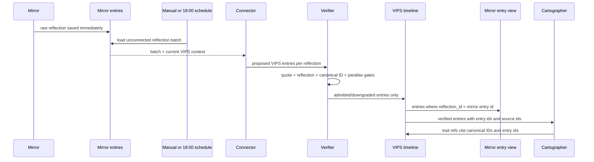
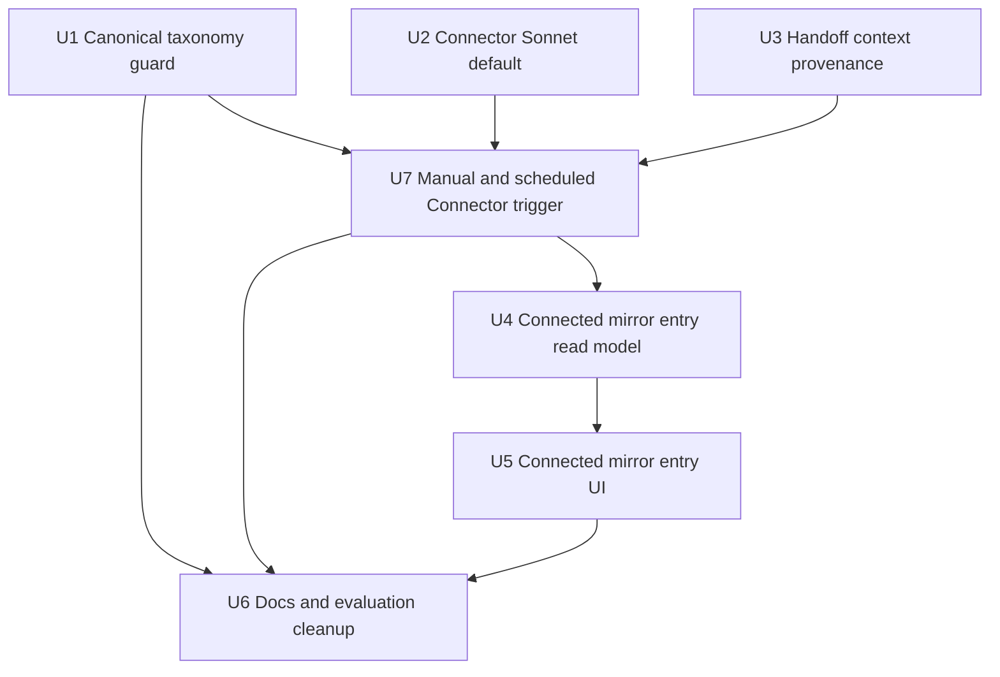
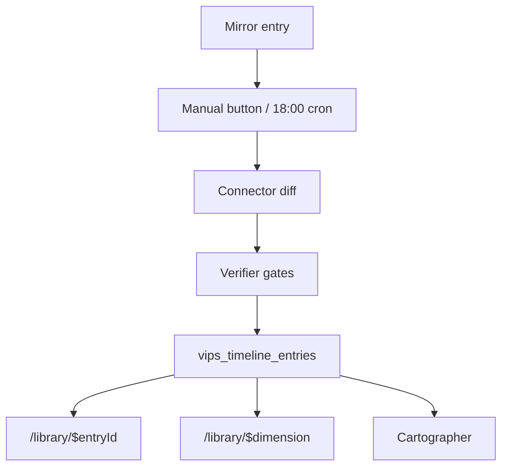

# feat: Strengthen agent boundary handoff

## Summary

Strengthen the Mirror -> Connector -> Verifier -> Cartographer handoff so Connector owns VIPS pattern recognition without sitting in the Mirror save critical path. Mirror saves raw thoughts immediately; Connector runs as a deliberate enrichment pass from a manual Library button and, by design, a daily evening schedule; the verifier enforces canonical taxonomy IDs in code; Cartographer receives enough timeline provenance to cite real connected entries; and Library mirror-entry pages show the VIPS links produced from each reflection.

This is a follow-on quality plan for the shipped auto-apply model described in `plans/CURRENT_STATE.md`; it does not restore the historical per-claim Connector review flow from the original VIPS pivot requirements.

---

## Problem Frame

The current product has the right agent roles in broad strokes: Mirror creates the raw reflection, Connector links it to VIPS pages, the verifier gates evidence, and Cartographer synthesizes pathways from verified state. The handoff is still leaky in four places: Connector runs immediately after every Mirror save even though sensemaking is better as a slower/batched pass, prompt-only taxonomy enforcement can admit invented claim IDs, Cartographer's context hides timeline entry IDs even though its schema can cite them, and the Mirror entry detail route still shows legacy Connector/Pathfinder cards rather than the verified VIPS links connected to that reflection.

---

## Assumptions

*This plan was authored from the user's latest prompt plus current repo state without a separate scope-confirmation round. These are the planning bets to review before implementation starts.*

- Connector should move from Haiku to Sonnet for now because its job is now evidence-bound pattern mapping, not cheap summarization.
- Connector should not run automatically after every Mirror session. The default product posture is "save now, connect deliberately later": manual button first, daily evening schedule as the intended background cadence.
- "After sunset" is implemented as a fixed 18:00 app-local default. Until the product stores per-student timezones, the Vercel Cron schedule should use 18:00 Singapore time, which is 10:00 UTC.
- Mirror entries should remain raw recorded thoughts; "connected entries" means the entry detail surface shows verified VIPS timeline links derived from that reflection, not that the Mirror row itself becomes an editable graph object.
- No new relation table is needed for this pass; `vips_timeline_entries.reflection_id` and `reinforces_id` are enough to expose connected notes.
- SkillsFuture and values-source crosswalks stay documentation/taxonomy metadata in this plan, not a runtime expansion of the canonical ID set.

---

## Requirements

- R1. Preserve the agent boundary: Mirror records the dot, Connector detects VIPS patterns and links dots when deliberately invoked, Verifier gates structural truth, Cartographer synthesizes pathways only from verified state.
- R2. Connector outputs must be rejected when `canonical_claim_id` is not a valid member of `VIPS_TAXONOMY` for the emitted dimension, even if the quote matches.
- R3. Connector should run on the repo's Sonnet managed-agent model until ablation proves Haiku is good enough again.
- R4. Cartographer prompt context must expose timeline entry IDs, source reflection IDs, and reinforcement pointers so `trait_combination[].timeline_entry_id` is practically usable.
- R5. Mirror entry detail pages must show the verified VIPS timeline entries connected to that reflection, grouped by dimension and linked back to the relevant VIPS page.
- R6. The plan must not expose Big Five labels as student identity outcomes; personality remains behavioral prose with Extraversion/Neuroticism as backend reference dimensions.
- R7. The plan must not replace the compact VIPS skills taxonomy with the full SkillsFuture CCS list; SkillsFuture remains a source-family/crosswalk reference.
- R8. Mirror persistence must not invoke Connector automatically; saving a reflection succeeds even when no Connector run happens.
- R9. Library must expose a manual `Run Connector` action that processes unconnected Mirror entries for the active student and reports run status.
- R10. The deployment design must support a daily Connector schedule around 18:00 local evening time; for the current Singapore default on Vercel Cron, schedule at 10:00 UTC.

**Origin actors:** A1 Student, A2 Mirror agent, A3 Connector agent, A4 Cartographer agent, A5 Deterministic verifier.
**Origin flows:** F1 Reflection + VIPS enrichment, F2 Manual sense-making run, F3 Soft-delete via forget.
**Origin acceptance examples:** AE2 and AE7 inform verifier gates; AE4 informs Cartographer references; AE3 informs forgotten-entry exclusions.
**Origin divergence:** This plan intentionally supersedes the origin document's "Connector runs automatically after every Mirror session" assumption based on the user's 2026-05-13 revision. The new behavior is manual now + scheduled evening background run by design.

---

## Scope Boundaries

- Do not reintroduce per-Connector-claim student confirmation. Students continue reviewing raw Mirror thoughts; Connector links are auto-applied only after verifier gates.
- Do not add new relation types such as `supports`, `contradicts`, or `tension_with` in this pass. Keep `reinforces_id` as the only structural link beyond source reflection.
- Do not migrate DB schema unless implementation discovers the existing `reflection_id` and `reinforces_id` columns cannot support the read model.
- Do not promote all University of Toronto values or all SkillsFuture Critical Core Skills labels into canonical runtime IDs.
- Do not change Cartographer's manual trigger or make Cartographer run automatically after every Mirror entry.
- Do not make Connector a blocking dependency of the Mirror save flow.
- Do not remove legacy `connector_outputs`, `pathfinder_outputs`, or old confirm/forget-diff handlers in this plan.
- Do not rewrite historical PR descriptions, historical plans, or past ablation reports; update current docs and create fresh artifacts when evaluation needs a new record.

### Deferred to Follow-Up Work

- Adaptive Connector routing: run Haiku first and promote only ambiguous/high-drop cases to Sonnet.
- Source-aware per-entry taxonomy crosswalk metadata for UofT/SkillsFuture/O*NET synonyms.
- A richer VIPS graph with contradiction/tension/supersession relation types.
- Per-student timezone preferences and personalized "after sunset" scheduling beyond the initial 18:00 Singapore default.
- `pg@9` pre-fetch serialization from `docs/followups.md`.
- Managed-agent token accounting repair from `docs/followups.md`.

---

## Context & Research

### Relevant Code and Patterns

- `plans/CURRENT_STATE.md` and `README.md` define the current shipped shape: Connector auto-applies verifier-passing links; users review raw Mirror thoughts only.
- `src/agents/connector.prompt.md` already says Connector uses the inlined VIPS taxonomy as a closed vocabulary and does not emit verifier-owned fields.
- `src/agents/verifier.ts` is pure code and already owns quote match, reflection identity, parallax cap, and `reinforces_id` assignment.
- `src/agents/tools/schemas.ts` currently allows `canonical_claim_id: z.string().min(1)` and has only `no_quote_match | unknown_reflection` drop reasons.
- `src/data/vips-taxonomy.ts` is the single source of truth for canonical IDs and now documents SkillsFuture as a skills source-family reference.
- `src/agents/context/index.ts` formats VIPS timeline entries for Connector and Cartographer, but currently omits entry IDs, source reflection IDs, and `reinforces_id`.
- `src/server/load-wiki.handler.server.ts` returns raw Mirror entries plus legacy Connector/Pathfinder outputs, with no connected VIPS timeline links per entry.
- `src/server/persist-mirror.handler.server.ts` currently calls `runAutoConnectorAfterMirror` after inserting the Mirror row; this is the trigger edge this plan removes.
- `src/routes/library.$entryId.tsx` still renders `ConnectorPatternCard`, `PathfinderTrajectoryCard`, and `PathfinderPathwaysCard` on the Mirror entry page.
- `src/routes/library.index.tsx` already has the Cartographer `Run sense-making` button pattern that the manual `Run Connector` action can mirror.
- `src/components/VipsPageView.tsx` already renders individual timeline entries, source-reflection links, strength, parallax tags, and forget affordances.
- `scripts/managed-agents/provision.ts` provisions Mirror and Cartographer on `claude-sonnet-4-6`, but Connector on `claude-haiku-4-5`.
- `vercel.json` currently has function config and rewrites, but no `crons` entry.

### Institutional Learnings

- No `docs/solutions/` directory exists yet. The closest durable notes are `docs/ideation/2026-05-11-connector-pathfinder-vips-ideation.md`, `docs/vips-taxonomy.md`, and `docs/followups.md`.
- The 2026-05-13 ideation resume pass recommends a canonical-ID verifier gate as the next quality move and explicitly calls out that tests still contain invented IDs such as `values.self_direction`.

### External References

- Vercel Cron Jobs are configured through a `crons` array in `vercel.json` with a target path and cron expression; schedules are written in UTC. The relevant docs also show securing cron endpoints with a `CRON_SECRET` bearer-token check.
- The user-provided taxonomy source references are already captured in `docs/vips-taxonomy.md`: University of Toronto values list as broad values word-bank, SkillsFuture Critical Core Skills as skills source-family/crosswalk reference, and Big Five Extraversion/Neuroticism as backend personality reference dimensions only.

---

## Key Technical Decisions

| Decision | Rationale |
| --- | --- |
| Connector owns VIPS pattern recognition; Cartographer consumes verified links. | This preserves the mental model the user named: Connector detects and maps patterns from Mirror entries, while Cartographer turns the verified mesh into pathways. |
| Connector runs by manual/scheduled trigger, not after every Mirror save. | Mirror reflection should stay fast and raw; Connector is meaning-making work that benefits from batching and user agency. |
| Canonical-ID validation lives in the verifier, not only in Zod or prompt text. | A bad ID with a real quote is a real failure mode. Dropping it in the verifier gives audit visibility and prevents timeline insertion. |
| Connected Mirror entries use the existing timeline read model. | `vips_timeline_entries.reflection_id` already gives the source edge. A new table would be premature until relation types expand. |
| Connector model moves to `claude-sonnet-4-6` by provisioning default. | The current Connector task is subtle cross-entry mapping plus closed-label selection. The prior Haiku decision was explicitly a cost bet with a Sonnet escape hatch. |
| Cartographer context exposes provenance IDs. | The Cartographer schema already supports `timeline_entry_id`; the prompt context must make that field available or the schema affordance is mostly decorative. |
| UI shows connected VIPS links on Mirror entries, not legacy agent summaries. | The current durable artifact is the verified VIPS timeline, not the old `connector_outputs` / `pathfinder_outputs` rows. |

---

## Open Questions

### Resolved During Planning

- Connector or Cartographer for VIPS pattern recognition: Connector owns pattern recognition and graph-link creation; Cartographer reads verified graph state and synthesizes trajectory.
- Connector trigger model: remove Connector from Mirror persistence; add a manual `Run Connector` action and design the background cadence as daily 18:00 local evening time.
- Connector model: move Connector to Sonnet for this quality pass; defer adaptive routing to follow-up.
- Personality labels: keep Extraversion and Neuroticism as backend reference dimensions only; student-facing output remains behavioral and non-diagnostic.
- Mirror connected entries: expose verified VIPS timeline links connected to the source Mirror entry; do not mutate Mirror's raw thought shape.

### Deferred to Implementation

- Whether `loadWikiHandler` should include connected-entry previews for the library list or only counts: decide after reviewing the route payload size and UI density during implementation.
- Whether existing DATABASE_URL-gated tests should be rewritten in this PR or supplemented by pure mocked handler tests: decide based on the smallest reliable coverage path.
- Exact copy and layout for connected-entry chips/cards: decide while editing `src/routes/library.$entryId.tsx` and component tests.
- Batch size for a manual/scheduled Connector run: implementation should pick a conservative cap that fits the current Vercel function budget, then surface remaining unconnected entries if the batch stops early.

---

## High-Level Technical Design

> *This illustrates the intended approach and is directional guidance for review, not implementation specification. The implementing agent should treat it as context, not code to reproduce.*

---

## Implementation Units

### U1. Canonical Taxonomy Guard

**Goal:** Make closed VIPS IDs a runtime invariant by rejecting Connector entries whose `canonical_claim_id` is not valid for the emitted dimension.

**Requirements:** R1, R2, R6, R7

**Dependencies:** None

**Files:**
- Modify: `src/data/vips-taxonomy.ts`
- Modify: `src/agents/tools/schemas.ts`
- Modify: `src/agents/verifier.ts`
- Modify: `src/server/auto-connector.handler.server.ts`
- Test: `test/agents/verifier.test.ts`
- Test: `test/server/auto-connector.test.ts`
- Test: `test/ablation/score.ts`

**Approach:**
- Add a small taxonomy lookup helper near `VIPS_TAXONOMY`, scoped by dimension and ID.
- Add `unknown_canonical_claim_id` to `VerifierDropReasonSchema`.
- Validate taxonomy membership before quote matching so invented IDs never reach parallax or `reinforces_id` logic.
- Keep the verifier pure: pass enough taxonomy information through imports/helpers, not DB reads.
- Update tests that use invented canonical IDs in verifier and Connector paths to use real IDs except where testing invalid-ID behavior explicitly.

**Execution note:** Implement the invalid-ID verifier test first: a draft with a matching quote but invented ID must drop with `unknown_canonical_claim_id`.

**Patterns to follow:**
- `src/agents/verifier.ts` existing phase comments and partitioned `{ admitted, downgraded, dropped }` result.
- `src/data/ecg-taxonomy.ts` / `src/data/vips-taxonomy.ts` fixture-as-source-of-truth style.

**Test scenarios:**
- Happy path: `values.contribution` with matching quote and dimension `values` remains admissible.
- Error path: `values.nope` with matching quote and dimension `values` drops as `unknown_canonical_claim_id`.
- Error path: `skills.analytical` emitted under dimension `values` drops as `unknown_canonical_claim_id`.
- Edge case: invalid ID should not produce `reinforces_id` even when an existing timeline entry has the same invented string.
- Integration: Connector handler stub returns one valid and one invalid entry; only the valid one is inserted into `vips_timeline_entries`, and the confirmed audit row preserves the drop reason.
- Regression: ablation reporting still counts admitted IDs by dimension after the new drop reason is introduced.

**Verification:**
- Verifier tests prove prompt-only closed-vocabulary behavior is now enforced structurally.
- No invalid canonical ID can be inserted through the Connector apply path.

### U2. Connector Sonnet Default

**Goal:** Promote Connector provisioning from Haiku to Sonnet and document the decision as a quality-first default for pattern mapping.

**Requirements:** R1, R3

**Dependencies:** None

**Files:**
- Modify: `scripts/managed-agents/provision.ts`
- Modify: `README.md`

**Approach:**
- Change Connector's provisioning model to `claude-sonnet-4-6`, aligning it with Mirror and Cartographer.
- Update current docs that describe the old Haiku cost bet so future agents do not treat Haiku as the desired steady state.
- Keep self-critique on Haiku, but treat it as the eval/safety reviewer for agent output quality rather than a product-facing sensemaker.
- Do not add a runtime model override in `src/agents/config.ts`; the current Managed Agents design pins model via provisioned agent version.
- Leave old PR descriptions, historical plans, and past ablation reports as archaeology.

**Patterns to follow:**
- `scripts/managed-agents/provision.ts` existing per-agent model table.
- README's "Default managed-agent model" notes under each agent section.

**Test scenarios:**
- Test expectation: none for the static script edit itself; smoke verification is operational because model creation happens through Anthropic Managed Agents provisioning.
- Integration: next `pnpm provision:managed-agents` creates or updates Connector with Sonnet and writes a new Connector version to `.env`.
- Integration: `pnpm smoke:managed-connector` still parses `ConnectorDiffSchema` with the provisioned Connector binding.

**Verification:**
- README and provisioning script agree on Connector's default model.
- The managed Connector smoke script can run against the new version once credentials are available.

### U3. Handoff Context Provenance

**Goal:** Make the prompt-as-context handoff explicit enough that Connector and Cartographer can reason over real connected entries instead of flattened claims.

**Requirements:** R1, R4, R6, R7

**Dependencies:** U1

**Files:**
- Modify: `src/agents/context/index.ts`
- Modify: `src/agents/connector.prompt.md`
- Modify: `src/agents/cartographer.prompt.md`
- Test: `test/agents/managed-connector.test.ts`
- Test: `test/agents/managed-cartographer.test.ts`

**Approach:**
- Expand formatted timeline bullets to include timeline entry id, source reflection id, canonical claim id, strength, parallax tags, and `reinforces_id` when present.
- Keep the format compact and stable so Anthropic prompt caching still benefits from the taxonomy prefix.
- Update Connector's prompt to describe its boundary as "propose evidence-bound VIPS links from the new reflection"; the verifier still owns structural pointers.
- Update Cartographer's prompt to cite `timeline_entry_id` whenever the context gives a specific entry id.
- Avoid including forgotten entries; existing `listVipsTimelineEntries(... includeForgotten: false)` behavior remains the handoff invariant.

**Patterns to follow:**
- `formatRecentReflectionsBlock` compact bullet formatting.
- Existing task footers in `src/agents/context/index.ts` for schema-pinning constraints.

**Test scenarios:**
- Happy path: formatted context includes a timeline row's id and reflection id in both Connector and Cartographer contexts.
- Happy path: a row with `reinforces_id` renders the pointer without changing the output schema.
- Edge case: timeline rows with `reflection_id: null` render an explicit source marker rather than omitting the field silently.
- Regression: taxonomy blocks still appear first in the formatted prompt.
- Regression: Cartographer footer still states cluster-only ECG IDs and 2-5 pathways.

**Verification:**
- Cartographer has enough context to populate `trait_combination[].timeline_entry_id`.
- Connector and Cartographer handoff language matches the shipped agent boundary.

### U7. Manual and Scheduled Connector Trigger

**Goal:** Remove Connector from the Mirror save round trip and introduce two deliberate trigger paths: a manual `Run Connector` Library action and a daily evening Vercel Cron pass.

**Requirements:** R1, R3, R8, R9, R10

**Dependencies:** U1, U2, U3

**Files:**
- Modify: `src/server/persist-mirror.handler.server.ts`
- Modify: `src/server/persist-mirror.functions.ts`
- Modify: `src/components/MirrorSession.tsx`
- Modify: `src/server/auto-connector.handler.server.ts`
- Create: `src/server/run-connector.handler.server.ts`
- Create: `src/server/run-connector.functions.ts`
- Create: `src/routes/api/cron/run-connector.tsx`
- Modify: `src/routes/library.index.tsx`
- Modify: `src/db/queries.ts`
- Modify: `vercel.json`
- Test: `test/server/persist-mirror.test.ts`
- Test: `test/server/run-connector.test.ts`
- Test: `test/routes/library-run-connector.test.tsx`

**Approach:**
- Remove the `runAutoConnectorAfterMirror` call from `persistMirrorHandler`; Mirror persistence should return after saving the raw thought and student-voice memory best effort.
- Update `MirrorSession` copy/status so the save state no longer says it is "checking Connector" after every reflection.
- Refactor the existing Connector apply logic into a reusable core that can run for a specified mirror entry id, then wrap it with a batch-oriented `runConnectorHandler`.
- Add a query helper for unconnected Mirror entries: entries for the active student that do not yet have a confirmed/attempted `vips_proposed_diffs` audit row.
- Add a manual `Run Connector` action in Library that processes a conservative batch of unconnected entries for the active student and invalidates VIPS/Library queries on success.
- Add a cron route protected by `CRON_SECRET` that invokes the same batch handler across eligible students.
- Ensure the cron route does not depend on `requireCounselorContext`; after `CRON_SECRET` auth, it should enumerate eligible student IDs server-side and invoke the Connector batch through explicit student scoping.
- Add `vercel.json` `crons` entry for the cron route at `0 10 * * *` (18:00 Asia/Singapore). Treat this as the initial fixed "after sunset" default until per-student timezones exist.
- Record run results with enough status to distinguish `ok`, `nothing_to_run`, `partial`, `timeout`, `schema_reject`, `transport_error`, and `auth_error`.

**Execution note:** Start by making the persist-Mirror no-auto-run test fail; this guards the central product change before adding the new button and schedule.

**Patterns to follow:**
- `src/routes/library.index.tsx` `Run sense-making` mutation pattern.
- `src/routes/api/auth/*.tsx` TanStack server route handler pattern.
- Vercel Cron `vercel.json` `crons` shape plus `CRON_SECRET` bearer-token guard.
- `src/server/auto-connector.handler.server.ts` existing status mapping and timeout handling.

**Test scenarios:**
- Happy path: `persistMirrorHandler` inserts a Mirror row and does not call the Connector dependency.
- Happy path: manual `runConnectorHandler` finds one unconnected Mirror entry, runs Connector, verifies entries, inserts timeline rows, and returns `ok`.
- Happy path: daily cron route with valid `Authorization: Bearer <CRON_SECRET>` invokes the batch handler without requiring an active counselor session.
- Empty state: manual `Run Connector` with no unconnected entries returns `nothing_to_run` and the UI shows a calm no-op state.
- Edge case: batch limit reached with more unconnected entries remaining returns `partial` plus remaining count.
- Error path: cron route with missing or wrong `CRON_SECRET` returns unauthorized and does not invoke Connector.
- Error path: Connector timeout on one entry does not undo prior successful entries in the batch and reports partial failure.
- Regression: Library's existing `Run sense-making` Cartographer action still works independently.

**Verification:**
- Saving a Mirror reflection never waits on Connector.
- A user can press `Run Connector` from Library to connect recent reflections.
- Vercel can invoke the same Connector pass daily at the planned evening cadence.

### U4. Connected Mirror Entry Read Model

**Goal:** Return verified VIPS timeline entries connected to a Mirror entry so routes can render the outcome of the Connector pass on the source reflection itself.

**Requirements:** R1, R5, R8, R9

**Dependencies:** U1, U7

**Files:**
- Modify: `src/db/queries.ts`
- Modify: `src/server/load-wiki.handler.server.ts`
- Test: `test/server/load-wiki-connected-links.test.ts`
- Test: `test/db.test.ts`

**Approach:**
- Add a query helper that lists non-forgotten `vips_timeline_entries` by `reflection_id`, ordered by committed time and grouped at the handler layer by dimension.
- Extend `WikiEntryDetail` with a connected timeline list or dimension-keyed map.
- Consider a lightweight "unconnected entries" count on `WikiSnapshot` only if the manual `Run Connector` button needs it; avoid per-entry previews on the list until the detail page proves useful.
- Preserve RLS and `withStudent` conventions: read inside the existing `withStudent` envelope and avoid nested transactions.
- Keep forgotten VIPS timeline entries out of this read model, matching the rest of the Library and agent context.

**Execution note:** Prefer a focused server handler test with mocked query dependencies if the existing DB integration tests remain gated by `DATABASE_URL`.

**Patterns to follow:**
- `listVipsTimelineEntries` filtering of forgotten rows.
- `loadVipsPagesHandler` grouping by VIPS dimension.
- `loadWikiEntryHandler` single `withStudent` read envelope.

**Test scenarios:**
- Happy path: a Mirror entry with two verified VIPS timeline entries returns both under the entry detail payload.
- Empty state: a Mirror entry saved before the next manual/scheduled Connector run returns an empty connected-links payload.
- Edge case: a timeline entry with the same student but different `reflection_id` is not returned.
- Edge case: a forgotten timeline entry connected to the reflection is excluded.
- Error path: unknown Mirror entry still returns `null`, not an empty connected-links payload.
- Integration: cross-student isolation prevents another student's timeline link from appearing on the entry detail.

**Verification:**
- `loadWikiEntry({ entryId })` gives the UI a stable connected-entry payload without reading legacy `connector_outputs`.

### U5. Connected Mirror Entry UI

**Goal:** Replace legacy Connector/Pathfinder cards on `/library/$entryId` with a concise view of verified VIPS links connected to that reflection.

**Requirements:** R1, R5, R6, R7, R8, R9

**Dependencies:** U4

**Files:**
- Modify: `src/routes/library.$entryId.tsx`
- Modify: `src/components/WikiEntryCard.tsx`
- Create: `src/components/ConnectedVipsLinks.tsx`
- Test: `test/components/ConnectedVipsLinks.test.tsx`
- Test: `test/routes/library-entry.test.tsx`

**Approach:**
- Render connected VIPS entries after the raw Mirror fields, grouped by dimension.
- Each connected item should show canonical claim ID, quote, strength, parallax tags, and a link to the VIPS dimension page.
- Keep the Mirror entry itself visibly raw and reviewable; connected links are the outcome of Connector + Verifier, not editable Mirror content.
- When no connected entries exist yet, point back to the Library-level `Run Connector` action rather than implying the reflection failed.
- Remove or hide `ConnectorPatternCard`, `PathfinderTrajectoryCard`, and `PathfinderPathwaysCard` from this route because they represent the old v0.1 durable artifacts.
- Use compact chips/list rows, not nested cards inside cards.

**Patterns to follow:**
- `src/components/VipsPageView.tsx` for timeline row facts and source-link restraint.
- `src/routes/library.index.tsx` for Library density and tone.

**Test scenarios:**
- Happy path: entry detail shows grouped connected VIPS entries with claim IDs and source quotes.
- Happy path: clicking a connected dimension link routes to `/library/$dimension`.
- Empty state: an entry with no verified links shows understated "no connected VIPS entries yet" copy and does not look like an error.
- Edge case: multiple entries in the same dimension render without layout shift or duplicate React keys.
- Regression: Confirm/save editing of Mirror fields still works and invalidates the same query keys.
- Regression: transcript details remain available.

**Verification:**
- A user can open a raw Mirror reflection and see the connected VIPS entries generated from it.
- The route no longer depends on legacy Connector/Pathfinder output cards for current sensemaking.

### U6. Docs and Evaluation Cleanup

**Goal:** Update documentation, taxonomy notes, and quality fixtures so future work keeps the new handoff boundary straight.

**Requirements:** R1, R2, R3, R6, R7, R8, R9, R10

**Dependencies:** U1, U2, U3, U5, U7

**Files:**
- Modify: `README.md`
- Modify: `docs/vips-taxonomy.md`
- Modify: `docs/ideation/2026-05-11-connector-pathfinder-vips-ideation.md`
- Modify: `plans/CURRENT_STATE.md`
- Create: `test/ablation/fixtures/vips-label-boundary.json`
- Create: `test/ablation/reports/2026-05-13-vips-label-boundary.md`
- Test: `test/ablation/score.ts`

**Approach:**
- Document the boundary in one crisp phrase: Mirror records, Connector connects, Verifier gates, Cartographer maps.
- Update model notes to say Connector now defaults to Sonnet and adaptive routing is deferred.
- Update current product docs to say Connector runs on manual button and scheduled evening pass, not after every Mirror save.
- Update `docs/vips-taxonomy.md` after U1 so it no longer says canonical IDs are only prompt-enforced.
- Add a small values/skills evaluation slice or fixture note that checks the user-raised ambiguity: values vs skills, skill vs interest, and valid quote with invalid label.
- Create a fresh dated report if the evaluation is run; do not edit the 2026-05-12 managed-sensemake report.
- Keep personality docs explicit: no "extrovert", "introvert", or "neurotic" as student-facing outcome labels.

**Patterns to follow:**
- `plans/CURRENT_STATE.md` short factual status style.
- `docs/followups.md` triage style for deferred reliability items.

**Test scenarios:**
- Happy path: ablation score output still reports admitted canonical IDs by dimension.
- Error path: invalid canonical IDs appear as verifier drops and do not inflate admitted-label counts.
- Documentation check: README and `plans/CURRENT_STATE.md` agree on Connector model and connected-entry behavior.
- Documentation check: `docs/vips-taxonomy.md` names SkillsFuture as source-family/crosswalk reference without expanding runtime IDs.

**Verification:**
- Future agents reading README, CURRENT_STATE, and taxonomy docs see the same boundary and do not revive stale staged-review assumptions.

---

## System-Wide Impact

- **Interaction graph:** `persistMirror` saves Mirror only. Manual `Run Connector` and the daily cron route trigger Connector; Connector still writes through verifier-gated auto-apply; Cartographer remains manual. The new UI reads verified timeline links back through `loadWikiEntry`.
- **Error propagation:** Invalid taxonomy IDs become verifier drops, not schema rejections and not inserted rows. Existing Connector run statuses stay stable unless implementation chooses to expose a new aggregate counter.
- **State lifecycle risks:** Connected-entry UI must respect `forgotten_at` filters so forgotten VIPS entries do not reappear through Mirror entry detail pages.
- **API surface parity:** `loadWikiEntry` changes shape; route/component tests should pin the new field so server/client serialization remains TanStack-safe.
- **Integration coverage:** The critical cross-layer path is manual/scheduled trigger -> Connector draft -> verifier canonical gate -> timeline insertion -> entry-detail connected links -> Cartographer context with entry IDs.
- **Unchanged invariants:** Per-student RLS, raw Mirror thought review, Connector auto-apply after verifier, Cartographer manual trigger, and non-diagnostic personality language all remain intact.

---

## Risks & Dependencies

| Risk | Mitigation |
| --- | --- |
| Sonnet increases Connector cost and latency. | Ship as explicit quality-first default, keep the deferred adaptive-routing item, and use managed Connector smoke/ablation reports to decide whether to downgrade later. |
| Verifier canonical gate could break existing tests that use invented IDs. | Update fixtures to real IDs except tests intentionally proving invalid-ID drops. This is useful churn because it aligns tests with product truth. |
| Manual/scheduled Connector can leave fresh Mirror entries unconnected until the next run. | Make the pending/unconnected state visible in Library and provide the manual `Run Connector` button for immediate sensemaking. |
| Batch Connector runs can exceed the current Vercel function budget. | Use a conservative batch limit, return partial status with remaining count, and keep deeper queue/durable workflow work deferred. |
| Entry-detail payload grows if the list view also includes connected previews. | Start with entry detail only; add list counts/previews only if the UI needs them and payload stays small. |
| Cartographer still may omit `timeline_entry_id`. | Prompt/context make it possible; handler should still accept claim-only refs because schema currently treats entry ID as optional. |
| Stale historical docs contradict current product behavior. | Update README, CURRENT_STATE, and taxonomy docs; leave historical plans intact but clearly superseded. |

---

## Documentation / Operational Notes

- Re-run `pnpm provision:managed-agents` after U2 to create a Connector Sonnet version; update deployment env vars with the new `MANAGED_AGENT_CONNECTOR_VERSION`.
- `pnpm smoke:managed-connector` should be run only where Anthropic credentials and managed-agent IDs are available.
- Add `CRON_SECRET` before enabling the scheduled Connector route in production.
- Vercel Cron schedules are UTC. For the initial Singapore evening default, `18:00 Asia/Singapore` is `10:00 UTC`, so `vercel.json` should use `0 10 * * *`.
- If tests are run without `DATABASE_URL`, expect DB-gated tests to skip; pure verifier/component tests should still cover the core behavior.
- No migration is expected, so rollback is mostly code/doc revert plus resetting Connector managed-agent version to the prior Haiku version if needed.

---

## Sources & References

- **Origin document:** [docs/brainstorms/2026-05-11-vips-wiki-pivot-requirements.md](docs/brainstorms/2026-05-11-vips-wiki-pivot-requirements.md)
- Current state: [plans/CURRENT_STATE.md](plans/CURRENT_STATE.md)
- Ideation resume pass: [docs/ideation/2026-05-11-connector-pathfinder-vips-ideation.md](docs/ideation/2026-05-11-connector-pathfinder-vips-ideation.md)
- Taxonomy notes: [docs/vips-taxonomy.md](docs/vips-taxonomy.md)
- Connector prompt: [src/agents/connector.prompt.md](src/agents/connector.prompt.md)
- Cartographer prompt: [src/agents/cartographer.prompt.md](src/agents/cartographer.prompt.md)
- Context builder: [src/agents/context/index.ts](src/agents/context/index.ts)
- Verifier: [src/agents/verifier.ts](src/agents/verifier.ts)
- VIPS taxonomy fixture: [src/data/vips-taxonomy.ts](src/data/vips-taxonomy.ts)
- Library entry route: [src/routes/library.$entryId.tsx](src/routes/library.$entryId.tsx)
- Vercel Cron Jobs quickstart: [https://vercel.com/docs/cron-jobs/quickstart](https://vercel.com/docs/cron-jobs/quickstart)
- Vercel Cron Jobs management/security: [https://vercel.com/docs/cron-jobs/manage-cron-jobs](https://vercel.com/docs/cron-jobs/manage-cron-jobs)
