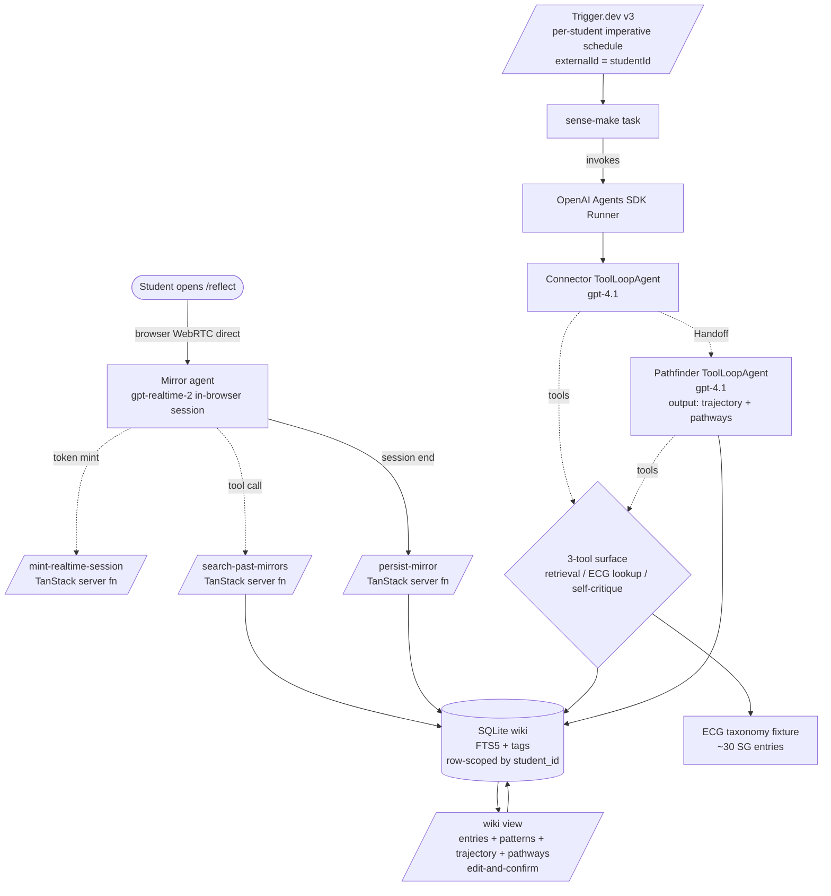

# feat: Sensemaking Agents v0.1 — wiki + cron, Mirror live + Connector→Pathfinder Handoff

> **Target repo:** standalone at `~/Developer/sensemaking-agents/`. App code lives in `app/`.
>
> **Plan relationship:** the scope contract is the brainstorm at `docs/brainstorms/2026-05-08-sensemaking-agents-loop-premise-check.md`. The earlier `plans/sensemaking-agents.md` is a structural scaffold that carries the brainstorm's scope but explicitly defers eight decisions to ce-plan; this plan resolves those eight decisions and defines the implementation units that ship v0.1.

## Summary

v0.1 ships a TanStack Start app with three OpenAI agents over a per-student SQLite wiki: **Mirror** (`gpt-realtime-2` voice, browser→OpenAI WebRTC direct, one tool — corpus search), and a Trigger.dev-scheduled **Connector → Pathfinder** SDK `Handoff` chain (`gpt-4.1` for both, three-tool surface — corpus retrieval, ECG taxonomy lookup, self-critique). Persistence is `better-sqlite3` + FTS5 with `student_id` row scoping enforced by a `withStudent()` helper. Edit-and-confirm UX uses TanStack Query + shadcn primitives. The tools-off ablation ships as a Vitest harness against a fixed 8-reflection seed corpus, run independently per tool surface.

---

## Problem Frame

The brainstorm pivoted to wiki + cron because reflection (live, latency-sensitive) and sense-making (depth, tool-rich) have different runtime needs. The scope is locked; what remained was eight planning-time decisions blocking implementation: live compute layer, cron infrastructure, per-agent model, tool schemas, prompt-design constraints, ablation rubric, RLS design, and the fate of the prior `experiments` table. This plan resolves all eight and lays out the unit-by-unit build for a 48-hour hackathon. See origin: `docs/brainstorms/2026-05-08-sensemaking-agents-loop-premise-check.md`.

---

## Requirements

R-IDs in this plan inherit verbatim from the origin brainstorm so traceability is exact. The plan does not introduce new requirements.

- R1–R4. Architecture shape (3 agents, wiki-style, per-student, OpenAI Agents SDK) — see origin.
- R5–R8. Mirror live path (`gpt-realtime-2`, one tool, per-student stateful, transcripts only) — see origin.
- R9–R13. Cron sense-makers (Connector backward, Pathfinder outward + longitudinal, identical 3-tool surface, `Handoff` chain, cron external to SDK) — see origin.
- R14–R17. Amendments (voice in v0.1, tool use in v0.1, OpenAI Agents SDK, Coach removed) — see origin.
- R18–R20. Falsifiable ablations (load-bearing premise check, two independent surfaces, two-tier eval bar) — see origin.

**Origin actors:** Student, Mirror, Connector, Pathfinder, Operator.
**Origin flows:** F1 live reflection capture, F2 async sense-making, F3 falsifiable ablation.
**Origin acceptance examples:** AE1 (R6, R11), AE2 (R8), AE3 (R12), AE4 (R18, R19).

---

## Scope Boundaries

- All scope rejections from the origin's Scope Boundaries section apply unchanged: no cross-student inference, no Portrait agent, no Coach, no full three-tool Mirror, no raw audio retention, no Anthropic models in v0.1, no Vercel AI SDK, no RLS in v0.1, no LMS/calendar integrations.
- Hosting target is a single Vercel project deploying TanStack Start; SG region pinning is a v1 concern.
- No auth in v0.1; `student_id` defaults to `'demo'`.

### Deferred to Follow-Up Work

- v1 Postgres + RLS migration: separate plan after the v0.1 ablation outcome decides which tool surfaces survive.
- Sycophancy/calibration fixture suite (the six tests from `plans/_archive/voice-wiki.md`): port into v1 once Connector/Pathfinder prompts stabilize.
- Real ECG taxonomy curation beyond the ~30-entry hand fixture: v1 content workstream.
- Demo-fixture branding (illustrations, screenshots, judge-readable one-pager polish): final-day polish unit, not blocked by v0.1 architecture.

---

## Context & Research

### Relevant Code and Patterns

- `plans/sensemaking-agents.md` — structural scaffold with the same 3-agent architecture, file layout sketch, and `[ce-plan]` deferral markers this plan resolves. Treat as related-prior-work; this plan supersedes it for implementation guidance.
- `plans/_archive/voice-wiki.md` — archived prior voice-wiki plan; the Zod-as-source-of-truth pattern for agent schemas and the six anti-sycophancy fixtures are directly forward-portable to v1.
- `plans/sensemaking-agents-ecg-reflection-architecture-plan.md` — product framing doc (target user, ECG context, positioning, Core Promise). Not load-bearing for implementation; useful for editorial calibration.
- No existing application code in this repo — fresh `app/` build.

### Institutional Learnings

- Anti-sycophancy literature (SycEval 2025, SYCON-Bench EMNLP 2025, AISI Ask Don't Tell 2026) maps directly onto Connector and Pathfinder prompts: question-reframing for prior patterns ("Is the pattern *X* still consistent with this reflection?") and depersonalization for pathway suggestions ("paths the *pattern* points toward, not careers the student should choose").
- Audio-token pricing dominates Mirror cost; transcripts-only retention also keeps PDPA scope minimal. Both decisions are inherited from origin and remain locked.

### External References

- **OpenAI Agents SDK (TypeScript)** — [overview](https://openai.github.io/openai-agents-js/), [tools guide](https://openai.github.io/openai-agents-js/guides/tools/). `Agent`, `Tool`, `Handoff`, `Runner` primitives. Tracing built-in.
- **OpenAI Realtime API + `gpt-realtime-2`** — [model docs](https://developers.openai.com/api/docs/models/gpt-realtime-2). Browser-direct WebRTC supported via ephemeral session token mint pattern.
- **TanStack Start** — [overview](https://tanstack.com/start/latest/docs/framework/react/overview), [server functions](https://tanstack.com/start/latest/docs/framework/react/guide/server-functions). `createServerFn().inputValidator(...).handler(...)` chain. File conventions: `.functions.ts` for server fns, `.server.ts` for server-only helpers, plain `.ts` for client-safe.
- **TanStack Router + Query** — file-based routing in `src/routes/`, query client in client component tree.
- **Trigger.dev v3** — [scheduled tasks](https://trigger.dev/docs/tasks/scheduled), per-tenant imperative schedules via `schedules.create({ task, cron, externalId })`. [OpenAI Agents SDK + Trigger.dev playground](https://trigger.dev/docs/guides/example-projects/openai-agents-sdk-typescript-playground) is the reference integration shape.
- **better-sqlite3 + FTS5** — [API](https://github.com/WiseLibs/better-sqlite3/blob/master/docs/api.md), [FTS5 docs](https://www.sqlite.org/fts5.html).

---

## Key Technical Decisions

These are the eight decisions the origin brainstorm deferred to planning. Each is locked here with rationale.

1. **Live compute layer: direct browser → OpenAI Realtime (WebRTC).** Mirror's `gpt-realtime-2` session is held in the browser via WebRTC. A short-lived TanStack Start server function mints an ephemeral session token (`POST /api/mirror/session`) so the API key never leaves the server. Tool calls (`search_past_mirrors`) execute via a TanStack Start server function the realtime session calls back into. Rationale: zero new vendor or persistent process for v0.1; matches Realtime API's first-class browser pattern; trade is less control over the session edge — a v1 promote to Cloudflare Durable Objects is the obvious upgrade if multi-tenant edge state matters. Affects R5, R7.
2. **Cron infrastructure: Trigger.dev v3 with per-student imperative schedules.** A single `senseMakeForStudent` task takes `{ studentId }` payload and runs the Connector→Pathfinder Handoff chain via the Agents SDK Runner. Per-student schedules are created with `schedules.create({ task: 'sense-make', cron: '0 3 * * *', externalId: studentId })` so cadence and tenancy match R3. Rationale: durable retries, generous timeouts (handoff chains can run 5–10 min comfortably), vendor-agnostic (won't pin us to Vercel platform constraints), official OpenAI Agents SDK + Trigger.dev integration playground exists. v0.1 cadence: nightly (`'0 3 * * *'`). Affects R12, R13.
3. **Per-agent model: `gpt-realtime-2` (Mirror), `gpt-4.1` (Connector), `gpt-4.1` (Pathfinder).** Mirror at default reasoning effort with native tool calling. Connector and Pathfinder symmetric on `gpt-4.1` for v0.1 — cheapest credible model for tool-loop work, $2/$8 pricing, large context for whole-corpus reads. If post-ablation Pathfinder output is weak on `gpt-4.1`, escalate Pathfinder only to `gpt-5` in a single targeted change. Rationale: keeps the v0.1 cost projection (~$1.72/demo) inside the brainstorm's bounds and isolates model choice as a single tunable. Affects R4, R9, R10.
4. **Tool schemas (Zod) locked at the boundary; wording editable.** All four tools below are defined with Zod input/output schemas at plan time so the agent boundary is type-stable; prompt wording inside is implementation-time. The four tools:
   - `search_past_mirrors` (Mirror + sense-makers): `{ query: string, limit?: number }` → `{ results: Array<{ id: number, summary: string, tags: string[], created_at: string, score: number }> }`. Backed by FTS5 over `mirror_entries.summary` plus tag overlap. Always scoped to current `student_id`.
   - `lookup_ecg_taxonomy` (sense-makers only): `{ query: string, category?: 'subject' | 'cca' | 'pathway' | 'cluster' }` → `{ entries: Array<{ id: string, label: string, category: string, description: string, links?: string[] }> }`. Returns hand-curated SG taxonomy entries (~30) — never general-knowledge.
   - `self_critique` (sense-makers only): `{ draft: unknown, dimension: 'evidence' | 'sycophancy' | 'specificity' }` → `{ critique: string, suggestions: string[], confidence: 'low' | 'medium' | 'high' }`. Iterative refinement loop; the agent re-reads its draft against the named dimension.
   - `gpt-realtime-2` exposes `search_past_mirrors` as a function tool via the Realtime tool-config payload at session start.
   Rationale: locking the schema prevents tool drift across agents (R11 says identical surface) and lets the ablation harness mock tools cleanly. Affects R3, R6, R8, R11.
5. **Prompt design constraints (not wording) locked at plan time.** Mirror prompt enforces: signal categories (`observed`/`inferred`/`uncertain`), required `caution` field, no diagnostic language. Connector prompt enforces: question-reframing for prior patterns per AISI 2026, evidence-IDs required on every claim, `still_unclear` field surfaced. Pathfinder prompt enforces: depersonalized "paths the pattern points toward" framing, 2–5 pathways max, required disclaimer, `trajectory` and `pathways` as separate output keys. All three: never label personality/ability/identity (Core Principle 6). Wording is implementation-time — these constraints are the testable invariants. Affects R6, R7, R15, R16.
6. **Ablation evaluation rubric: 4-dimension manual scoring on a fixed 8-reflection seed corpus per surface.** Two ablations (R19), each independently:
   - **Mirror surface ablation:** corpus search ON vs OFF over the same prompt sequence, scored on (a) provenance (does Mirror reference prior reflections by content?), (b) specificity (does Mirror produce concrete signals vs generic listening?), (c) novelty (does ON surface patterns OFF doesn't?), (d) anti-sycophancy (does Mirror avoid uncritical agreement?).
   - **Cron surface ablation:** full three-tool surface ON vs three-tool surface OFF (model only, same prompt and corpus) on Connector + Pathfinder outputs, scored on the same four dimensions.
   - v0.1 bar: 1–2 humans score on a 0–3 Likert per dimension; ON variant must beat OFF by ≥2 points across ≥3 dimensions to "pass." v1 bar (real SG students) is a v1 concern. Affects R18, R19, R20.
7. **No Postgres + RLS in v0.1.** SQLite + FTS5 + `student_id` row scoping via a `withStudent(studentId, query)` helper that injects the predicate at every query call site. Promotion to Postgres + RLS is the v1 "Deferred to Follow-Up Work" plan. Affects R12, R13.
8. **Drop the `experiments` table for v0.1.** Coach is removed (R17 / brainstorm); the prior plan's `experiments` table has no v0.1 consumer. Database schema does not include it. v1 reintroduction is a v1 concern only if Coach returns. Affects R5, R17.

---

## Open Questions

### Resolved During Planning

- The eight items in Key Technical Decisions, all carried from the origin's "Deferred to Planning" list.

### Deferred to Implementation

- Final prompt wording for Mirror, Connector, Pathfinder (constraints locked above; phrasing iterates against the seed corpus during U6 / U7 / U8).
- Exact `gpt-realtime-2` reasoning-effort setting and turn-detection parameters — tune during U4 with the seed-corpus voice tests.
- ECG taxonomy fixture content (the ~30 entries) — content workstream during U2 with editorial input; schema is locked.
- Trigger.dev cron cadence default (`0 3 * * *` is the proposed default but may move to immediately-after-Mirror trigger if demo flow benefits) — decide during U8.
- Whether `gpt-4.1` is sufficient for Pathfinder's longitudinal trajectory — answered by U9's ablation results.

---

## Output Structure

```
app/
├── package.json                              # tanstack-start, @tanstack/react-router, @tanstack/react-query, @openai/agents, openai, zod, better-sqlite3, @trigger.dev/sdk
├── vite.config.ts                            # TanStack Start plugin
├── tsconfig.json
├── biome.json
├── tailwind.config.ts
├── .env.example                              # OPENAI_API_KEY, TRIGGER_SECRET_KEY, DATABASE_PATH=./app.db
├── .gitignore
├── README.md                                 # judge-readable one-pager + setup
├── app.db                                    # gitignored, generated at runtime
├── src/
│   ├── routes/
│   │   ├── __root.tsx                        # TanStack Router root layout
│   │   ├── index.tsx                         # landing + start-reflection CTA
│   │   ├── reflect.tsx                       # voice + text Mirror live UI
│   │   ├── wiki.index.tsx                    # per-student wiki: entries + Connector + Pathfinder
│   │   └── wiki.$entryId.tsx                 # Mirror entry detail with linked sense-maker outputs
│   ├── server/
│   │   ├── mirror-session.functions.ts       # createServerFn: mint ephemeral realtime session token
│   │   ├── search-past-mirrors.functions.ts  # createServerFn: Mirror's tool callback (FTS5 + tags)
│   │   ├── persist-mirror.functions.ts       # createServerFn: persist transcript + signals at session end
│   │   ├── trigger-cron.functions.ts         # createServerFn: dev-only manual trigger of sense-make task
│   │   └── tenancy.server.ts                 # withStudent(studentId, ...) helper
│   ├── agents/
│   │   ├── mirror.ts                         # OpenAI Agents SDK voice agent + tool config
│   │   ├── mirror.prompt.md                  # constraints from K.T.D. #5
│   │   ├── connector.ts                      # ToolLoopAgent + 3-tool registration
│   │   ├── connector.prompt.md               # question-reframing per AISI 2026
│   │   ├── pathfinder.ts                     # ToolLoopAgent + 3-tool registration; output {trajectory, pathways}
│   │   ├── pathfinder.prompt.md              # depersonalized "explore not prescribe"
│   │   ├── handoff-chain.ts                  # SDK Runner: Connector → Pathfinder Handoff
│   │   ├── tools/
│   │   │   ├── search-corpus.ts              # shared (Mirror + sense-makers)
│   │   │   ├── lookup-ecg-taxonomy.ts        # sense-makers only
│   │   │   ├── self-critique.ts              # sense-makers only
│   │   │   └── schemas.ts                    # Zod for tool inputs/outputs
│   │   └── schemas.ts                        # Zod for MirrorEntry, ConnectorOutput, PathfinderOutput
│   ├── components/
│   │   ├── MirrorSession.tsx                 # WebRTC client for gpt-realtime-2
│   │   ├── ReflectionInput.tsx               # voice button + text fallback
│   │   ├── WikiEntryCard.tsx
│   │   ├── ConnectorPatternCard.tsx
│   │   ├── PathfinderTrajectoryCard.tsx
│   │   ├── PathfinderPathwaysCard.tsx
│   │   ├── EditableField.tsx
│   │   └── ConfirmAndSave.tsx
│   ├── db/
│   │   ├── client.ts                         # better-sqlite3 + WAL + 0600
│   │   ├── schema.sql                        # mirror_entries, connector_outputs, pathfinder_outputs, tags, FTS
│   │   ├── queries.ts                        # typed read/write helpers (always scope by student_id)
│   │   └── seed.ts                           # 8 seeded reflections + ~30 ECG entries
│   ├── data/
│   │   └── ecg-taxonomy.ts                   # hand-curated SG-relevant entries
│   ├── lib/
│   │   ├── safety.ts                         # output-language guardrails
│   │   └── tracing.ts                        # SDK trace export → agent_traces table
│   └── styles.css
├── trigger/
│   └── sense-make.ts                         # Trigger.dev v3 task definition
├── trigger.config.ts                         # Trigger.dev project config
└── test/
    ├── tenancy.test.ts                       # student_id row scoping enforcement
    ├── tools/
    │   ├── search-corpus.test.ts
    │   ├── lookup-ecg-taxonomy.test.ts
    │   └── self-critique.test.ts
    ├── handoff-chain.test.ts                 # mocked LLM: Connector → Pathfinder via Handoff
    ├── safety.test.ts                        # "no diagnostic language" assertions
    └── ablation/
        ├── mirror-tools-off.test.ts          # corpus-search ON vs OFF (R22 / origin R19 surface 1)
        ├── cron-tools-off.test.ts            # full surface ON vs OFF (R22 / origin R19 surface 2)
        ├── score.ts                          # 4-dimension Likert scorer per K.T.D. #6
        └── fixtures/
            └── seed-corpus.json              # 8-reflection canonical corpus
```

The tree is a scope declaration, not a constraint — adjust during implementation if a better layout emerges. Per-unit `**Files:**` sections remain authoritative for what each unit creates or modifies.

---

## High-Level Technical Design

> *This illustrates the intended approach and is directional guidance for review, not implementation specification.*



Lifecycle:

```
Mirror live session:
  drafting (browser ⇄ realtime) → session_end → persist (transcript + signals + tool trace) → reviewable in /wiki

Cron sense-making:
  Trigger.dev fires → Runner.run(connectorAgent) → patterns → SDK Handoff → Runner.run(pathfinderAgent) → {trajectory, pathways} → persist
  Audio is discarded at session_end. Tool traces persist to agent_traces table for replay and ablation.
```

---

## Implementation Units

### U1. TanStack Start scaffold + tooling

**Goal:** Empty `app/` builds, lints, runs dev server with TanStack Router/Query wired and a TanStack server function reachable.

**Requirements:** Structural prerequisite for all subsequent units.

**Dependencies:** None.

**Files:**
- Create: `app/package.json` (`@tanstack/react-start`, `@tanstack/react-router`, `@tanstack/react-query`, `tailwindcss@^4`, `@openai/agents`, `openai`, `zod@^4`, `better-sqlite3@^12`, `@trigger.dev/sdk`, `dotenv`; dev: `typescript@^5.9`, `vite`, `vitest@^3`, `@biomejs/biome@^2.3`)
- Create: `app/vite.config.ts` (TanStack Start plugin)
- Create: `app/tsconfig.json`, `tailwind.config.ts`, `postcss.config.mjs`, `biome.json`, `vitest.config.ts`, `.env.example`, `.gitignore`
- Create: `app/src/routes/__root.tsx`, `index.tsx` (landing with one-sentence hero)
- Create: `app/src/server/mirror-session.functions.ts` (placeholder server fn returning `{ ok: true }` — proves wiring)
- Create: `app/src/styles.css` (Tailwind base + theme)
- Create: `app/README.md` (setup + demo run)

**Approach:**
- Initialize via TanStack Start CLI; install shadcn primitives (button, card, textarea, dialog) without adopting the full registry — only the components U10 actually uses.
- Single `QueryClientProvider` at `__root.tsx`; route loaders use `queryClient.ensureQueryData` for SSR.
- Biome formats/lints; `tsc --noEmit` is the type gate.

**Patterns to follow:**
- TanStack Start's `.functions.ts` / `.server.ts` / `.ts` file naming convention.
- shadcn primitives copied into `src/components/ui/` rather than imported as a package.

**Test scenarios:**
- *Test expectation: none — pure scaffolding, no behavioral surface yet. U2 onward carries real tests.*

**Verification:**
- `pnpm dev` serves `/`, `pnpm build` succeeds, `pnpm check` (Biome + `tsc --noEmit`) exits 0, the placeholder server fn returns `{ ok: true }` from a route.

---

### U2. Persistence layer + tenancy helper + seed fixtures

**Goal:** `better-sqlite3` schema, FTS5 index, `withStudent()` tenancy enforcement, and 8 seeded reflections + ~30 ECG taxonomy entries available for downstream agents and the ablation harness.

**Requirements:** R3 (per-student scope), R12 (persistent corpus), R14 (ECG taxonomy fixture surfaces in the cron tool — schema lives here).

**Dependencies:** U1.

**Files:**
- Create: `app/src/db/client.ts` (open `app.db` with WAL, set `PRAGMA foreign_keys=ON`, restrict file mode 0600)
- Create: `app/src/db/schema.sql` (`mirror_entries`, `connector_outputs`, `pathfinder_outputs`, `tags`, `mirror_entry_tags`, `agent_traces`, FTS5 virtual table over `mirror_entries.summary`)
- Create: `app/src/db/queries.ts` (typed `searchMirrors`, `insertMirrorEntry`, `insertConnectorOutput`, `insertPathfinderOutput`, all taking `studentId` as first arg)
- Create: `app/src/db/seed.ts` (8 fixture reflections + `student_id='demo'`)
- Create: `app/src/data/ecg-taxonomy.ts` (~30 hand-curated SG entries: subject combinations, CCAs, JC/poly/ITE/uni tracks, MOE career clusters)
- Create: `app/src/server/tenancy.server.ts` (`withStudent<T>(studentId: string, fn: (s: string) => T): T` — narrow guard that asserts `studentId` is non-empty and returns `fn(studentId)`)
- Create: `app/test/tenancy.test.ts`, `app/test/db.test.ts`
- Create: `app/test/ablation/fixtures/seed-corpus.json` (canonical 8-reflection fixture used by both U2 seed and U9 ablation)

**Approach:**
- Schema columns include `student_id TEXT NOT NULL DEFAULT 'demo'` on every persisted row. v1 RLS is additive over the same column.
- `queries.ts` does not export raw `db.prepare(...)` — only typed helpers, all of which call `withStudent`. Lints fail if a call site uses `db` directly outside `db/queries.ts`.
- FTS5 contentless table mirrors `mirror_entries(summary)`; INSERT/UPDATE/DELETE triggers keep it in sync.

**Execution note:** Write the tenancy test (`tenancy.test.ts`) first — the `withStudent` helper exists to make a single invariant assertable, and the test is the definition of done.

**Patterns to follow:**
- Sentinel `'demo'` student ID for v0.1 demo; v1 promotes to a Clerk-issued ID.

**Test scenarios:**
- Happy path: `withStudent('demo', sid => searchMirrors(sid, 'physics'))` returns rows where `student_id = 'demo'`.
- Edge case: `withStudent('', ...)` throws — empty `student_id` is rejected at the helper boundary.
- Edge case: a query helper called without `withStudent` (direct import path) is forbidden by lint rule (custom Biome rule or eslint-plugin-import).
- Integration: insert a `mirror_entries` row then full-text-search "physics" — the FTS5 trigger keeps the index live and the row is returned.
- Integration: seed loader produces 8 rows with deterministic IDs 1..8 against an empty DB — used by U9 ablation.

**Verification:**
- `vitest run` passes the tenancy + db tests; `sqlite3 app.db '.schema'` shows all tables; `seed.ts` is idempotent (re-running over a populated DB is a no-op).

---

### U3. Wiki UI shells with mocked data + edit-and-confirm primitives

**Goal:** A judge can navigate landing → `/reflect` → `/wiki` → `/wiki/$entryId` with mock Mirror/Connector/Pathfinder cards and edit-and-confirm buttons that round-trip a TanStack Query mutation against an in-memory mock.

**Requirements:** R1 (visible 3-agent surface), R17 (edit-and-confirm), R5 (Mirror entry shape exists).

**Dependencies:** U1.

**Files:**
- Create: `app/src/routes/reflect.tsx` (voice button + text fallback — non-functional; just routes)
- Create: `app/src/routes/wiki.index.tsx` (list of mock cards: 1 Mirror entry, 1 Connector pattern set, 1 Pathfinder trajectory + pathways)
- Create: `app/src/routes/wiki.$entryId.tsx` (entry detail with linked sense-maker outputs)
- Create: `app/src/components/EditableField.tsx`, `ConfirmAndSave.tsx`
- Create: `app/src/components/WikiEntryCard.tsx`, `ConnectorPatternCard.tsx`, `PathfinderTrajectoryCard.tsx`, `PathfinderPathwaysCard.tsx`
- Create: `app/test/components/EditableField.test.tsx`

**Approach:**
- TanStack Query `useMutation` against a mock function returning resolved values — replaced in U5/U10 with real server fns.
- Cards surface evidence/uncertainty fields visibly per the brainstorm's editorial commitments — mock data exercises the field set.
- `EditableField` toggles between `<p>` and `<textarea>`; `ConfirmAndSave` calls the mutation and rolls back on error.

**Patterns to follow:**
- shadcn `Card`, `Button`, `Textarea`, `Dialog` primitives.
- Query keys: `['wiki', studentId]`, `['wiki', studentId, entryId]`.

**Test scenarios:**
- Happy path: clicking "Edit" on a mock Mirror signal toggles textarea, typing then "Confirm" calls the mock mutation and the displayed value updates.
- Edge case: rejecting an edit (cancel) reverts the textarea to the original value, no mutation fires.
- Error path: mocked mutation rejection rolls back the optimistic UI value and surfaces an error toast.

**Verification:**
- `pnpm dev` shows the three routes; the mocked Mirror entry card has edit/confirm buttons that visibly mutate state; `vitest run` passes the EditableField test.

---

### U4. Mirror live session: token mint + browser WebRTC client

**Goal:** Browser opens a `gpt-realtime-2` session via direct WebRTC; ephemeral session token is minted server-side; the bare session can hear input audio and reply with audio (no tools yet, no persistence yet).

**Requirements:** R5 (live `gpt-realtime-2` session), R8 (no audio retention — proven by absence of an audio-storage path).

**Dependencies:** U1.

**Files:**
- Modify: `app/src/server/mirror-session.functions.ts` (replace placeholder with `createServerFn({ method: 'POST' }).inputValidator(z.object({ studentId: z.string().min(1) })).handler(async ({ data }) => { /* call OpenAI sessions endpoint, return { ephemeralKey, sessionId, expiresAt } */ })`)
- Create: `app/src/components/MirrorSession.tsx` (WebRTC client: `RTCPeerConnection`, `getUserMedia({ audio: true })`, attach session via fetched ephemeral key, connect to `https://api.openai.com/v1/realtime` per OpenAI Realtime client spec)
- Modify: `app/src/routes/reflect.tsx` (mount `<MirrorSession>` behind a "Start reflection" button)
- Create: `app/src/agents/mirror.ts` (early skeleton — just the session config object that's sent in the realtime `session.update` event: model, voice, modalities, turn detection)

**Approach:**
- Server fn calls `POST https://api.openai.com/v1/realtime/sessions` with the model + voice + tools config and returns the response's `client_secret.value` to the browser. Token is short-lived (~1 minute per OpenAI's pattern); browser uses it within a few seconds to establish the WebRTC connection.
- Browser code never reads `OPENAI_API_KEY`. Server fn never streams audio.
- `MirrorSession.tsx` wires up the session lifecycle (`connecting`/`active`/`ended`) using local React state; no persistence yet.

**Patterns to follow:**
- OpenAI Realtime browser-direct pattern: server mints ephemeral key, browser establishes peer connection.

**Test scenarios:**
- Happy path: `mirror-session` server fn called with `{ studentId: 'demo' }` returns `{ ephemeralKey, sessionId, expiresAt }`; integration test stubs `fetch` to OpenAI and asserts the request payload includes the configured model/voice.
- Edge case: empty `studentId` → server fn rejects with Zod validation error before hitting OpenAI.
- Error path: OpenAI returns 401/500 → server fn surfaces a typed error, no token is leaked, `<MirrorSession>` shows an error UI.
- Integration: in dev, opening `/reflect` and clicking "Start" establishes a peer connection (manual smoke test — automated is impractical for live audio).

**Verification:**
- Manual: speaking into the mic produces audio response in browser. Network tab shows no `OPENAI_API_KEY` ever leaving the server. `vitest run` passes the server-fn unit test.

---

### U5. Mirror corpus-search tool + Mirror agent prompt + persistence

**Goal:** Mirror's single tool (`search_past_mirrors`) is wired so the live session can call it during conversation; Mirror's prompt enforces the constraints from K.T.D. #5; session-end persistence writes transcript + structured signals + tool trace to the wiki.

**Requirements:** R5, R6 (one tool only), R7 (per-student stateful), R8 (transcripts only — proven by what `persist-mirror` writes), R15 (provenance + uncertainty labels), AE1 (Mirror's tool-call trace contains only `search_past_mirrors`), AE2 (no audio retained).

**Dependencies:** U2, U4.

**Files:**
- Create: `app/src/agents/tools/search-corpus.ts` (definition reused by Mirror tool config and by Connector/Pathfinder via the SDK's `Tool` primitive; backed by `searchMirrors` query in U2)
- Create: `app/src/agents/tools/schemas.ts` (Zod for tool I/O — schemas locked in K.T.D. #4)
- Create: `app/src/server/search-past-mirrors.functions.ts` (the server fn the realtime session calls back into when Mirror invokes `search_past_mirrors`)
- Create: `app/src/server/persist-mirror.functions.ts` (writes `mirror_entries` row + tags + tool trace; raw audio path explicitly absent)
- Create: `app/src/agents/mirror.prompt.md` (constraints from K.T.D. #5: signal categories, required `caution`, no diagnostic language)
- Create: `app/src/agents/schemas.ts` (`MirrorEntrySchema` Zod with `signals: Array<{ kind: 'observed' | 'inferred' | 'uncertain', text, evidence_excerpts? }>`, `caution: string`, `tags: string[]`, `transcript: string`)
- Modify: `app/src/agents/mirror.ts` (full session config: model, voice, modalities, turn detection, tools array referencing `search_past_mirrors` schema, instructions loaded from `mirror.prompt.md`)
- Modify: `app/src/components/MirrorSession.tsx` (handle `response.function_call_arguments.done` events, route to server fn, send result via `conversation.item.create`; on `session.end` POST `persist-mirror` with transcript + final structured output)
- Modify: `app/src/routes/reflect.tsx` (after persist, navigate to `/wiki/$entryId`)
- Create: `app/test/agents/mirror.test.ts` (mocked WebSocket: assert tool-call routing + persisted shape)
- Create: `app/test/safety.test.ts` (assert prompt + post-validation rejects diagnostic language)

**Approach:**
- The realtime session's `tools` array declares `search_past_mirrors` with the Zod-derived JSON schema; when the session emits a function-call event, `MirrorSession.tsx` calls the server fn and pipes the result back into the session as a `function_call_output` item.
- Session-end handler collects the running transcript (server-emitted `response.audio_transcript.done` events) plus a final `response.create` that asks the model for the structured signals payload, validates against `MirrorEntrySchema`, and POSTs to `persist-mirror`.
- `persist-mirror` writes `mirror_entries` + `mirror_entry_tags` + `agent_traces` rows in a single transaction.

**Execution note:** Write `mirror.test.ts` test cases for the tool-call routing first (RED) — the realtime event-handling code path is the easiest to get wrong, and the mocked WebSocket test is what makes it tractable.

**Patterns to follow:**
- Reuse `search-corpus.ts` definition as the source of truth for both the realtime tool config (Mirror) and the SDK `Tool` registration (Connector/Pathfinder in U7).
- Tool-call results carry `tool_call_id` so the realtime model can match the response.

**Test scenarios:**
- Covers AE1. Mocked realtime session emits a `search_past_mirrors` function-call event with `{ query: 'physics' }`; Mirror's tool-handler invokes the server fn; server fn returns 2 mock results; the test asserts the model received exactly one `function_call_output` and no other tool was registered or called.
- Covers AE2. After `session.end`, the persisted `mirror_entries` row contains `transcript` and `signals` JSON; no row exists in any audio table; no file was written under `app/audio/` (path doesn't exist).
- Happy path: structured signals payload from the model parses against `MirrorEntrySchema`; persistence writes one row + N tag rows + 1 trace row in one transaction.
- Error path: structured payload that fails Zod validation triggers a single retry with a stricter "your last output was malformed" instruction; second failure surfaces a UX error and persists nothing.
- Edge case: `caution` field empty after retry → reject and surface error (the brainstorm's "confusion is valuable" — empty caution is a regression).
- Safety: prompt asserts produce at least one signal labeled `uncertain` for an ambiguous reflection ("I had a normal day"); the safety test asserts no `signals[].text` matches the diagnostic-language regex (`/you are (a|an) /i`, `/your personality/i`, etc.).

**Verification:**
- Manual: complete a 60-second voice reflection with a seeded corpus; observe a `search_past_mirrors` tool call in the session trace; `/wiki/$id` shows the new entry with signals + caution + tool trace; `app.db` contains the row and trace, no audio. `vitest run` passes mirror + safety suites.

---

### U6. Sense-maker three-tool surface (Zod schemas + implementations)

**Goal:** Connector and Pathfinder have a single shared three-tool surface (`search_past_mirrors`, `lookup_ecg_taxonomy`, `self_critique`) registered as OpenAI Agents SDK `Tool` instances with Zod input/output validation.

**Requirements:** R8 (identical 3-tool surface), R11 (role specialization in prompt + schema, not tool access), R14 (ECG taxonomy fixture).

**Dependencies:** U2.

**Files:**
- Create: `app/src/agents/tools/lookup-ecg-taxonomy.ts` (reads from `data/ecg-taxonomy.ts`; supports optional `category` filter)
- Create: `app/src/agents/tools/self-critique.ts` (calls `gpt-4.1` via Agents SDK with a critique-only system prompt; returns `{ critique, suggestions, confidence }`)
- Modify: `app/src/agents/tools/schemas.ts` (extend with `LookupEcgTaxonomyInput/Output`, `SelfCritiqueInput/Output` per K.T.D. #4)
- Modify: `app/src/agents/tools/search-corpus.ts` (export an SDK `Tool` instance in addition to the realtime tool config used by Mirror — both share the `searchMirrors` query backend)
- Create: `app/test/tools/lookup-ecg-taxonomy.test.ts`, `app/test/tools/self-critique.test.ts`, `app/test/tools/search-corpus.test.ts`

**Approach:**
- Each tool exports `{ name, schema, handler }`. Handlers are pure functions over the Zod-typed input; they're wrapped into SDK `Tool` instances in U7.
- `self_critique` uses a separate `gpt-4.1` invocation; the cost stays bounded because critique is a single short call per loop iteration.
- `lookup_ecg_taxonomy` is a pure in-process filter over the `ecg-taxonomy.ts` array; no database hit.

**Patterns to follow:**
- Zod schemas in `tools/schemas.ts` are the single source of truth — re-export them as JSON schema for the SDK and as TS types for handlers.

**Test scenarios:**
- Happy path (corpus search): given seeded corpus, `search_past_mirrors({ query: 'robotics' })` returns ranked rows scoped to the calling student.
- Happy path (ECG): `lookup_ecg_taxonomy({ query: 'engineering', category: 'cluster' })` returns ≥1 entry with `category === 'cluster'`.
- Happy path (self-critique): given a sycophantic draft, `self_critique({ draft, dimension: 'sycophancy' })` returns a non-empty `critique` and at least one suggestion; `confidence` is one of the enum values.
- Edge case (corpus search): empty corpus returns `{ results: [] }`, not an error.
- Edge case (ECG): unknown `category` rejected at Zod boundary.
- Integration: registering all three tools with a stub `Agent` and running one tool-loop iteration with a mocked LLM that calls each in turn produces three trace entries with correct `tool_call_id`s.

**Verification:**
- `vitest run test/tools` passes; manual `bun run scripts/tool-smoke.ts` (optional helper) invokes each tool with a fixture input.

---

### U7. Connector + Pathfinder agents + Handoff chain

**Goal:** Connector (backward, corpus-grounded) and Pathfinder (outward + longitudinal) are SDK `Agent`s with the three-tool surface; a Runner runs them as a `Handoff` chain, validates outputs against `ConnectorOutputSchema` / `PathfinderOutputSchema`, and persists to the wiki.

**Requirements:** R5 (3 specialist agents), R6, R7 (Connector/Pathfinder roles), R8, R9 (Handoff chain), AE3 (Pathfinder receives Connector's patterns via Handoff, not via separate cron tick), R15 (provenance), R16 (anti-sycophancy).

**Dependencies:** U6, U2.

**Files:**
- Create: `app/src/agents/connector.ts` (SDK `Agent` with `gpt-4.1`, three tools, instructions from `connector.prompt.md`, structured-output schema = `ConnectorOutputSchema`)
- Create: `app/src/agents/pathfinder.ts` (same shape; instructions from `pathfinder.prompt.md`; output = `PathfinderOutputSchema` with `{ trajectory, pathways }`)
- Create: `app/src/agents/connector.prompt.md` (question-reframing for prior patterns per AISI 2026; required evidence IDs)
- Create: `app/src/agents/pathfinder.prompt.md` (depersonalized framing; 2–5 pathways max; required disclaimer; trajectory and pathways are separate output keys)
- Create: `app/src/agents/handoff-chain.ts` (one exported `runSenseMakingForStudent(studentId)` that invokes the SDK `Runner`, runs Connector → Handoff → Pathfinder, validates, persists, returns the Handoff trace)
- Modify: `app/src/agents/schemas.ts` (add `ConnectorOutputSchema` with `patterns: Array<{ text, strength, evidence_reflection_ids: number[]+min(1) }>` + `still_unclear`; `PathfinderOutputSchema` with `trajectory`, `pathways: Array<{ label, reasoning, ecg_taxonomy_ids: string[] }>`, `disclaimer`)
- Create: `app/test/agents/handoff-chain.test.ts` (mocked LLM: assert Connector's patterns flow into Pathfinder via Handoff, persistence writes both rows in one cron pass)

**Approach:**
- Agents share an identical `tools: [searchCorpus, lookupEcgTaxonomy, selfCritique]` array; what differs is `instructions` and the `outputSchema`. R11 is implemented at the import level — both agents import the same tools array.
- `runSenseMakingForStudent` wraps the SDK Runner: it first runs Connector to completion, asserts `ConnectorOutputSchema`, then explicitly hands off via the SDK's Handoff primitive (Pathfinder declared as a handoff target on Connector). Pathfinder receives Connector's patterns as input context; Pathfinder runs to completion, asserts `PathfinderOutputSchema`, and persists both rows + the joined trace.
- Schema-level provenance enforcement: `ConnectorOutputSchema.patterns[].evidence_reflection_ids: z.array(z.number()).min(1)` — uncited patterns fail Zod and the SDK retries.

**Execution note:** Mock-LLM the chain test before the real chain runs end-to-end (RED → GREEN). The chain has the most cross-component failure modes.

**Patterns to follow:**
- SDK Handoff is the primitive; Pathfinder is registered as a handoff target on Connector via the SDK's standard pattern (`handoffs: [pathfinderAgent]`).
- Trace export uses the SDK's built-in tracing — wired into `agent_traces` via U2's persistence.

**Test scenarios:**
- Covers AE3. Mocked LLM: Connector emits 2 patterns, then completes. The test asserts Pathfinder is invoked next via the same Runner pass (single cron pass), receives the patterns as input context (visible in the trace), and emits trajectory + pathways. Two database rows are written: one `connector_outputs`, one `pathfinder_outputs`. No second cron tick was required.
- Happy path: full chain on the 8-reflection seed corpus produces a valid `ConnectorOutput` with ≥2 patterns, each citing ≥1 evidence ID; Pathfinder produces 2–5 pathways and a non-empty trajectory.
- Edge case: Connector emits an uncited pattern (Zod rejects) → SDK retries the structured-output once → if second attempt is still uncited, the chain aborts and persists nothing.
- Error path: `gpt-4.1` API failure during Pathfinder → Connector's output is already persisted; Pathfinder error is logged in `agent_traces`; the chain reports partial success.
- Integration (anti-sycophancy): for a reflection that strongly affirms a prior pattern, Connector's prompt produces a `still_unclear` entry probing whether the pattern survives the new reflection (the test seeds a contradicting reflection and asserts `still_unclear` is non-empty).
- Integration (provenance): every `pathways[].reasoning` text references at least one `evidence_reflection_ids` value present in the seeded corpus (regex assertion on numeric refs in the reasoning string + cross-check against the schema field).

**Verification:**
- `vitest run test/agents` passes including `handoff-chain.test.ts`. End-to-end smoke: invoking `runSenseMakingForStudent('demo')` against the seed corpus persists one Connector row and one Pathfinder row, with `agent_traces` showing the Handoff edge.

---

### U8. Trigger.dev v3 cron task + per-student imperative schedule

**Goal:** A Trigger.dev v3 task `sense-make` invokes the Handoff chain for one student per fire; per-student imperative schedules are created at student-onboard time keyed by `externalId`. v0.1 also exposes a "trigger now" button on `/wiki` for the demo flow.

**Requirements:** R10 (Connector + Pathfinder are multi-step), R12 (Handoff chain in one cron pass — implemented by U7; this unit only schedules it), R13 (cron infrastructure external to SDK).

**Dependencies:** U7.

**Files:**
- Create: `app/trigger.config.ts` (Trigger.dev project config — project ID, runtime: node 22, dirs: `./trigger`)
- Create: `app/trigger/sense-make.ts` (`task({ id: 'sense-make', maxDuration: 600, run: async ({ studentId }) => runSenseMakingForStudent(studentId) })`)
- Create: `app/src/server/schedule-onboard.functions.ts` (`createServerFn` that calls `schedules.create({ task: 'sense-make', cron: '0 3 * * *', externalId: studentId })` once per student)
- Create: `app/src/server/trigger-cron.functions.ts` (dev-only: invoke the task ad-hoc for the current `studentId='demo'`)
- Modify: `app/src/routes/wiki.index.tsx` (add a "Run sense-making now" button wired to `trigger-cron`; visible only with `NODE_ENV !== 'production'`)
- Modify: `app/.env.example` (add `TRIGGER_SECRET_KEY`, `TRIGGER_PROJECT_REF`)
- Create: `app/test/trigger/sense-make.test.ts` (mocked Trigger SDK: assert task signature, payload Zod, and that running the task calls `runSenseMakingForStudent` with the right `studentId`)

**Approach:**
- Single task; v0.1 cadence default `0 3 * * *` (nightly 03:00 in the deploy region). Per-student schedules created on first reflection persist (call `schedule-onboard` from `persist-mirror`).
- The "trigger now" button exists for demo determinism — judges shouldn't have to wait for cron.
- `maxDuration: 600` gives the Handoff chain 10 minutes; expected runtime is 30–90 seconds.

**Patterns to follow:**
- Trigger.dev v3 + OpenAI Agents SDK reference playground: keep the task body thin — it imports `runSenseMakingForStudent` and that's it.

**Test scenarios:**
- Happy path: invoking the task with `{ studentId: 'demo' }` calls `runSenseMakingForStudent('demo')` exactly once; the task's payload Zod rejects empty `studentId`.
- Integration: in dev, clicking "Run sense-making now" enqueues a task run; polling the run ID returns `COMPLETED` within 90 s on the seed corpus.
- Edge case: scheduling the same `externalId` twice is idempotent (Trigger.dev's `schedules.create` upserts on `externalId`); test asserts no duplicate schedule.
- Error path: missing `TRIGGER_SECRET_KEY` in env causes `schedule-onboard` to fail with a clear error; persistence of the Mirror entry still succeeds (cron schedule is a side effect).

**Verification:**
- `pnpm trigger.dev dev` shows the `sense-make` task registered. Clicking the demo button surfaces a run ID; the run completes and the wiki view updates with new Connector + Pathfinder cards. `vitest run test/trigger` passes.

---

### U9. Wiki populated UI + ablation harness + demo polish

**Goal:** The `/wiki` view renders real data from `mirror_entries`, `connector_outputs`, `pathfinder_outputs` with edit-and-confirm wired to real persistence. The ablation harness is runnable via `pnpm ablate:mirror` and `pnpm ablate:cron` and produces the 4-dimension Likert scaffolding for manual scoring per K.T.D. #6.

**Requirements:** R12, R15 (provenance + uncertainty visible in UI), R17 (edit-and-confirm), R18, R19 (two independent ablations), AE4 (per-surface keep/drop/narrow decisions).

**Dependencies:** U3, U5, U7.

**Files:**
- Modify: `app/src/routes/wiki.index.tsx` (replace mock data with `useQuery({ queryKey: ['wiki', studentId], queryFn: ... })` against a new `app/src/server/load-wiki.functions.ts`)
- Modify: `app/src/routes/wiki.$entryId.tsx` (replace mock with real load + linked sense-maker outputs)
- Create: `app/src/server/load-wiki.functions.ts`, `app/src/server/edit-wiki.functions.ts` (edit-and-confirm POST per agent surface)
- Create: `app/test/ablation/score.ts` (`scoreAblation(onOutputs, offOutputs, dimensions)` — returns a per-dimension Likert scaffolding; humans fill in scores)
- Create: `app/test/ablation/mirror-tools-off.test.ts` (runs Mirror's structured-output completion against the 8-reflection corpus with `tools: []` then with `tools: [searchPastMirrors]`; emits a JSON report under `test/ablation/reports/`)
- Create: `app/test/ablation/cron-tools-off.test.ts` (same, for Connector + Pathfinder; tools-off = empty tools array on both agents)
- Create: `app/scripts/ablate.ts` (wrapper: `--surface=mirror` or `--surface=cron`; writes `reports/2026-MM-DD-<surface>-ablation.md` with sections for the human scorer)
- Modify: `app/package.json` (add `"ablate:mirror": "tsx scripts/ablate.ts --surface=mirror"`, `"ablate:cron": "tsx scripts/ablate.ts --surface=cron"`)
- Modify: `app/README.md` (demo run + ablation run + judge-readable one-pager)

**Approach:**
- Wiki view: each agent surface is a card with provenance/uncertainty fields visible (Mirror's `caution`, Connector's `still_unclear`, Pathfinder's `disclaimer`). Edit-and-confirm uses optimistic TanStack Query mutations; failure reverts.
- Ablation harness: each ablation runs the same prompt sequence against the same fixed corpus twice (ON/OFF), persists outputs to `reports/`, and the scoring scaffold lays out a 4-dimension Likert table for a human to fill in. The harness does *not* attempt to auto-score quality — that's the v0.1 bar's whole point.
- Reports include the raw outputs ON/OFF + the diff. The Markdown template has a "Verdict per dimension" section the operator completes after reading.

**Patterns to follow:**
- TanStack Query `useMutation` with optimistic update + rollback for edit-and-confirm.
- Ablation runs against the canonical `seed-corpus.json` to keep results comparable across iterations.

**Test scenarios:**
- Covers AE4. Running `pnpm ablate:mirror` produces a report file with sections for both ON and OFF outputs and the 4-dimension scoring scaffold; the same for `pnpm ablate:cron`. The two reports are independent — running one does not affect the other's outputs.
- Happy path: `/wiki` renders Mirror entry + Connector + Pathfinder cards on the seed corpus + one persisted live reflection.
- Happy path (edit): clicking edit on a Mirror signal, modifying, then confirming, persists the change and the next page reload still shows it.
- Edge case: Pathfinder pathway with 0 `ecg_taxonomy_ids` is rejected at edit time (schema enforces ≥1) — UI shows validation error.
- Error path: server-fn failure during edit triggers TanStack Query rollback; the displayed value reverts.
- Integration: full demo flow — open `/reflect`, complete a 60-second reflection, see the new Mirror entry on `/wiki`, click "Run sense-making now," see Connector + Pathfinder cards appear within 90 s.
- Safety: `safety.test.ts` (extended) asserts no rendered text matches the diagnostic-language regex on any seeded or live output.

**Verification:**
- `pnpm dev` end-to-end demo flow works on `student_id='demo'`. `vitest run` passes including ablation scaffolding tests. Two ablation reports exist under `app/test/ablation/reports/` after one run of each script. README shows judges what to look for.

---

## System-Wide Impact

- **Interaction graph:** Mirror's session ↔ realtime tool callbacks ↔ TanStack server functions ↔ SQLite. Cron path: Trigger.dev → Runner → SDK Handoff → Connector → Pathfinder → SQLite. Edit-and-confirm: TanStack Query mutation → server fn → SQLite. The SDK's tracing system spans all agent paths and emits to `agent_traces`.
- **Error propagation:** Live path — Mirror tool errors surface in the realtime session as `function_call_output` errors; persistence errors at session-end are non-recoverable for that session and surface to the user as "Reflection not saved." Cron path — Zod validation failure on agent output triggers SDK retry once; if it fails twice, the chain aborts and writes a partial trace; the next cron tick re-runs from scratch.
- **State lifecycle risks:** Live session and cron task can race on the same `student_id` — the cron task reads from `mirror_entries` while a Mirror session is concurrently writing. Mitigation: SQLite WAL mode allows readers to proceed without blocking writers; Connector reads at task-start are snapshot-consistent for the rest of the run.
- **API surface parity:** `search_past_mirrors` is shared between Mirror's realtime tool config and the Agents SDK `Tool` registration for Connector/Pathfinder. Schema drift would break R11 (identical surface) — the shared `search-corpus.ts` definition is the single source of truth.
- **Integration coverage:** Mocked-LLM unit tests don't prove that Mirror's tool-call routing actually round-trips against `gpt-realtime-2`'s real tool-call event format; same for the Handoff chain against `gpt-4.1`. U5 and U7 carry one manual end-to-end smoke each as integration coverage. The full demo flow in U9 is the integration backstop.
- **Unchanged invariants:** No cross-student data flow at any tier (R3 is enforced at the `withStudent` boundary). No raw audio storage at any tier (R8 is enforced by absence — there is no audio persistence path). No Coach output, no fifth agent, no diagnostic language (Core Principle 6).

---

## Risks & Dependencies

| Risk | Mitigation |
|------|------------|
| `gpt-realtime-2` tool-call reliability differs from text models in ways that break Mirror's single-tool flow | U5's `mirror.test.ts` mocks the realtime event format from OpenAI's docs; one manual end-to-end smoke before demo. Fallback: text-only Mirror (degrades R5, but voice is "in scope" not "demo-blocking"). |
| Trigger.dev API rate limits or onboarding friction in 48h | Manual "trigger now" button (U8) keeps the demo flow deterministic without depending on a real schedule firing. Schedule creation is a side effect of Mirror persistence; failure logs but doesn't block the live path. |
| `gpt-4.1` Pathfinder output is too generic on a thin 8-reflection corpus | K.T.D. #3 reserves a single targeted change (escalate Pathfinder to `gpt-5`); ablation harness in U9 provides the comparison data. |
| Zod retry loop on uncited Connector patterns burns cost in production | The retry budget is exactly 1 (the SDK default for structured-output retry); the chain aborts on second failure. Cost-per-pass stays inside the brainstorm's projection. |
| Ablation rubric isn't tight enough to produce a defensible v1 commit decision | K.T.D. #6 explicitly distinguishes v0.1 bar (1–2 humans, 0–3 Likert) from v1 bar (real SG students); v1 commitment requires the v1 bar, not the v0.1 bar. The ablation reports are a sufficient artifact for the v0.1 demo. |
| Browser-direct Realtime exposes the demo to cross-origin or session-token-leak issues | Server fn is the only minter of `client_secret`s; tokens are short-lived (~1 min); origin restriction enforced via OpenAI session config. |
| TanStack Start is newer than Next.js — niche bugs may surface in 48h | Stay on the documented happy path (file-based routes, `createServerFn`); avoid experimental features (env functions, static server fns) unless needed. |
| SQLite + FTS5 retrieval quality is thin on a small corpus | Tags supplement FTS5; if retrieval is visibly weak in U5 manual smoke, add tag-overlap boosting before considering embeddings. Embeddings are explicitly v1+. |

---

## Documentation / Operational Notes

- **README:** judge-readable one-pager — what the product is, what to look for in the demo, exact commands (`pnpm install`, `pnpm dev`, click flow, `pnpm ablate:mirror`, `pnpm ablate:cron`).
- **`.env.example`:** list every required key (`OPENAI_API_KEY`, `TRIGGER_SECRET_KEY`, `TRIGGER_PROJECT_REF`, `DATABASE_PATH`).
- **Demo data:** the 8-reflection seed corpus is checked in; `pnpm seed` rebuilds `app.db` from scratch idempotently.
- **Ablation reports:** under `app/test/ablation/reports/`; the v1-commit decision per surface is a Markdown verdict in each report. Report files are not gitignored — they are the artifact.
- **Cost monitoring:** OpenAI usage dashboard during the demo; budget alarm at $50/day during judging window.

---

## Sources & References

- **Origin document:** [docs/brainstorms/2026-05-08-sensemaking-agents-loop-premise-check.md](docs/brainstorms/2026-05-08-sensemaking-agents-loop-premise-check.md)
- **Related prior plan:** [plans/sensemaking-agents.md](plans/sensemaking-agents.md) — structural scaffold; this plan supersedes its `[ce-plan]` deferrals.
- **Product framing doc:** [plans/sensemaking-agents-ecg-reflection-architecture-plan.md](plans/sensemaking-agents-ecg-reflection-architecture-plan.md) — editorial calibration.
- **Archived prior approach:** [plans/_archive/voice-wiki.md](plans/_archive/voice-wiki.md) — v1 sycophancy fixture port.
- **OpenAI Agents SDK (TypeScript):** https://openai.github.io/openai-agents-js/
- **OpenAI Realtime API + `gpt-realtime-2`:** https://developers.openai.com/api/docs/models/gpt-realtime-2
- **TanStack Start:** https://tanstack.com/start/latest/docs/framework/react/overview
- **TanStack Start server functions:** https://tanstack.com/start/latest/docs/framework/react/guide/server-functions
- **Trigger.dev v3 scheduled tasks:** https://trigger.dev/docs/tasks/scheduled
- **Trigger.dev + OpenAI Agents SDK reference playground:** https://trigger.dev/docs/guides/example-projects/openai-agents-sdk-typescript-playground
- **better-sqlite3 + FTS5:** https://github.com/WiseLibs/better-sqlite3, https://www.sqlite.org/fts5.html
