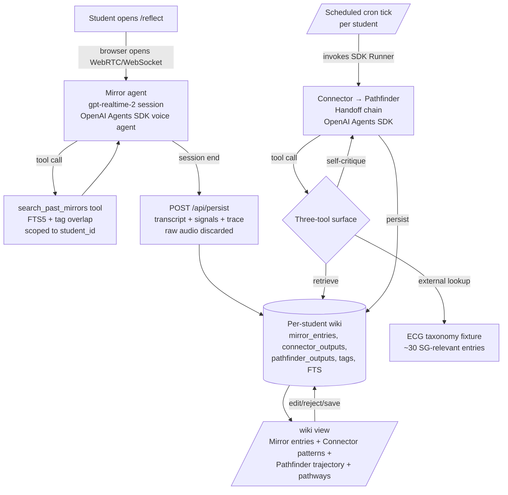

# feat: Sensemaking Agents — student reflection multi-agent app

> **Target repo:** standalone at `~/Developer/sensemaking-agents/app/`. Pivot 2026-05-08 from the prior voice-wiki plan (now archived at `plans/_archive/voice-wiki.md`); much of the multi-agent and structured-output thinking survives, but audience, frontend, time horizon, and architecture have all moved.
>
> **Scope contract:** the durable v0.1 scope and architecture decisions live in `docs/brainstorms/2026-05-08-sensemaking-agents-loop-premise-check.md`. This plan inherits from that doc and elaborates HOW v0.1 ships. Where the two disagree, the brainstorm wins; this plan is updated to match.

## Summary

A web app that helps secondary / pre-tertiary Singapore students turn lived school experiences (CCA, subject classes, projects, competitions, internships) into self-understanding for ECG (Education and Career Guidance) decisions. Architecture is **wiki-style**: the student speaks (or types) a short reflection in a live voice session with **Mirror** (`gpt-realtime-2`, with one tool: corpus search of past Mirrors). The reflection is recorded to the student's per-student wiki. On a schedule, two cron sense-makers run as an OpenAI Agents SDK `Handoff` chain over the wiki — **Connector** (backward-looking, corpus-grounded pattern-finding) hands off to **Pathfinder** (outward-looking SG-ECG mapping plus longitudinal trajectory). Both have a full three-tool surface: corpus retrieval, external lookup (MOE / ECG taxonomy / web), iterative self-critique. Single-vendor OpenAI throughout. Built for a hackathon as v0.1, then hardened toward a production student-facing web app.

The product's editorial commitment carries forward unchanged: **patterns to consider, not labels**. The app does not tell a student who they are or what career to pursue; it helps them notice patterns in their own experiences before making choices. Every output is editable; every memory is reviewable; every interpretation can be rejected. The multi-agent architecture is **legible by design** — the UI shows what each agent did and what evidence it cited.

The hackathon-winning demo: a student records one voice reflection with Mirror, sees the structured signals streamed back; triggers (or waits for) the cron pass; sees Connector patterns and Pathfinder's `{trajectory, pathways}` populate the per-student wiki view. *"This is not a chatbot. It is a guided reflection system with a wiki underneath."*

---

## Problem Frame

Singaporean secondary / pre-tertiary students must make ECG choices (subject combinations, CCA roles, JC vs. poly vs. ITE, university paths, careers) at moments when they have done a lot but synthesized little. Existing tools start with careers — questionnaires, personality tests, recommender engines — and ask the student to project forward from abstract preferences. The actual material a student has is *experience*: a robotics CCA they liked, a physics class that connected, a project they led, a frustration that meant something. Today, that material rarely gets connected; reflection is private, ad-hoc, and forgotten. The decision-making moment then asks for clarity that the student has never built.

Sensemaking Agents inverts the order: start with the student's lived experience, surface patterns the student hadn't yet articulated, and only then connect to ECG options. The product's emotional moment is the line in the source doc:

> *"I did this thing today. I'm not sure what it says about me, but I think it matters."*

The architectural pivot from the synchronous Guide pipeline to wiki + cron, captured in the scope-contract brainstorm, exists because reflection and sense-making are not the same task and don't share latency budgets. Reflection (Mirror) is a live conversation that wants to feel responsive in seconds. Sense-making (Connector + Pathfinder) is depth work that benefits from minutes-to-hours of model reasoning over the corpus. The original plan forced both onto the same critical path; the wiki+cron split lets each optimize for its own constraints.

---

## Core Principles

These are the load-bearing product commitments. Every agent prompt, tool, schema field, and UI affordance below should trace back to one of these.

1. **Preserve student agency.** Sensemaking Agents helps the student notice patterns; it does not assert who they are. Outputs are framed as "patterns to consider," "worth exploring," "test this by…" — never "you should become…" or "your personality is X."
2. **Multi-agent visibility is a feature.** Mirror's live conversation, Connector's pattern card, and Pathfinder's trajectory + pathways are surfaced distinctly in the UI, with each agent's evidence trail visible. Legibility is a UX feature, not internal-only logging.
3. **Editable, rejectable, deletable.** Every interpretation is editable before save. Every saved reflection is deletable. The student is always the source of truth about themselves.
4. **Confusion is valuable.** Each specialist agent surfaces what is *unclear* alongside what it observed. Mirror has a "caution / uncertainty" output. Connector has a "still unclear" output. Polished output that hides uncertainty is a regression.
5. **Provenance over assertion.** Every claim cites the reflection(s) it came from. Pattern claims must reference specific past reflections by ID. Uncited claims are reframed as "Insufficient evidence yet for X."
6. **No diagnosis.** Never label personality, mental health, ability, or fixed identity. The product never asserts categorical claims about who the student *is*.
7. **Singapore-aware ECG language.** ECG taxonomy uses Singapore-relevant pathways (subject combinations, CCA categories, JC / poly / ITE / university tracks, MOE-relevant career clusters). The product is bilingual-tone-aware (English-first; respectful of multicultural context); no Singlish in agent voice but no jarring American-English idioms either.
8. **Pattern-first, recommendation-second.** Pathfinder runs only after Connector. Recommendations grounded in the student's own pattern data are the only kind the product makes.

---

## Tech Stack Summary

Single source of truth for v0.1 hackathon tech choices and v1 production extensions. Where the brainstorm explicitly defers a decision to ce-plan, the cell is marked **[ce-plan]**.

| Layer | v0.1 (hackathon) | v1 (production) | Why |
|---|---|---|---|
| Runtime | Node.js `>=22` | Same | Modern LTS; matches OpenAI Agents SDK and persistence libraries |
| Language | TypeScript `^5.9` | Same | Strict + NodeNext modules |
| Frontend framework | Next.js `^15` (App Router) | Same | RSC + API routes + Vercel-native deploy; well-trodden path |
| Styling | Tailwind `^4` | Same | Utility-first; demo polish in hours, not days |
| Component library | shadcn/ui | Same | Sensible primitives; no design-system reinvention |
| Agent SDK | **OpenAI Agents SDK** (`@openai/agents`) | Same | `Agent` / `Tool` / `Handoff` / `Runner` primitives; voice-agents are SDK-first; built-in tracing. Supersedes the prior Vercel-AI-SDK choice. |
| LLM provider | OpenAI (single-vendor) | Same | Mirror = `gpt-realtime-2`; Connector + Pathfinder = OpenAI text models per-agent; selection is **[ce-plan]** |
| Mirror model | `gpt-realtime-2` | Same | Speech-to-speech; native tool calling; 128K context; WebRTC + WebSocket |
| Cron model | **[ce-plan]** between `gpt-4.1`, `gpt-5`, `o3` per agent | Same | Per-agent latency / cost / quality trade — planner picks |
| Schema validation | Zod `^4` | Same | Source of truth for tool input/output shapes and persisted records |
| Storage (v0.1) | better-sqlite3 `^12` (single file) | **Postgres + Drizzle ORM** with `student_id` row scoping; SG region | Hackathon: zero ops, FTS5 for retrieval. v1: real multi-tenant persistence in SG region. |
| Retrieval | SQLite FTS5 over `mirror_entries.summary` + tag overlap | `tsvector` + `pg_trgm`; embeddings only if FTS proves thin | Tags + FTS keep the demo simple; embeddings deferred until corpus growth justifies them |
| Voice (v0.1 in scope) | `gpt-realtime-2` direct connection (WebRTC or WebSocket); native input + TTS | Same | Single API for STT + LLM + TTS; lower latency than separate Whisper + TTS pipeline |
| Live compute layer | **[ce-plan]** between Cloudflare Durable Objects, Vercel WebSocket, Render, Fly.io, OpenAI direct browser → realtime | Same | Per-student WebSocket actor; planner picks |
| Cron infrastructure | **[ce-plan]** between Trigger.dev, Inngest, Vercel Cron, OpenAI Agents SDK background mode | Same | Wraps per-student `Runner` invocations; planner picks |
| Auth | None (single-session demo) | **Clerk** | Hackathon doesn't need it; v1 needs auth + magic link / OAuth |
| Hosting | Vercel for the Next.js shell + the chosen live compute layer + the chosen cron infrastructure | Same; managed Postgres on Neon SG / Supabase SG | Demo URL judges can hit; v1 stays on Vercel + adds SG-region DB |
| State / streaming | gpt-realtime session WebSocket (Mirror); SDK Handoff trace stream (cron) | Same | Agent visibility lives in the SDK's tracing primitives plus our own persisted corpus |

**Stack decisions intentionally rejected for v0.1:**

- **Vercel AI SDK as runtime** — superseded by OpenAI Agents SDK. The earlier "Vercel AI SDK over Claude Agent SDK" decision (line 201 of the prior plan revision) does not apply.
- **Anthropic models** — explicitly rejected for v0.1; full single-vendor OpenAI consolidation. Reconsidering vendor mix is a separate brainstorm.
- **Synchronous Guide pipeline** — replaced by wiki + cron. The prior deterministic Mirror → Connector → Pathfinder → Coach sequencer no longer exists.
- **Coach agent / next-experiment output** — explicitly removed. The product's emotional close is "patterns to consider and pathways worth exploring," with Mirror's live voice conversation absorbing the tactical "what to try this week" feeling implicitly.
- **5th Portrait agent** — rejected; Pathfinder absorbs longitudinal trajectory into its output schema.
- **Mirror with full three-tool surface** — rejected; Mirror's live tool surface is one tool only (corpus search). External lookup and self-critique live in the cron path.
- **Raw audio retention** — rejected for v0.1; transcripts only. No blob layer in v0.1.
- **Splitting tools by sense-maker agent** — rejected. Connector and Pathfinder share an identical full tool surface; role specialization lives in prompt and output schema, not in tool access.
- **Local whisper.cpp** — superseded by `gpt-realtime-2`; no separate STT vendor.
- **Embeddings + vector store in v0.1** — tags + FTS over seeded reflections is enough for the demo. Embeddings only if retrieval proves thin under judging.
- **Custom auth in hackathon** — Clerk in v1; demo runs without auth.
- **LMS / calendar integrations** — explicitly out of scope per source doc.
- **Personality tests / psychometric anything** — explicitly forbidden per Core Principle 6.
- **Teacher / counsellor / parent dashboards in v0.1** — deferred; consent-gated in v2.

**Stack decisions deferred to v1+:**

- **Postgres + Row Level Security in SG region** — v1 production trajectory; v0.1 ships with SQLite + `student_id` row scoping in queries.
- **Embeddings (`pgvector` or equivalent)** — once a per-student corpus exceeds ~20 reflections.
- **Self-portrait extension** — partially absorbed into Pathfinder's `trajectory` output as of v0.1; deeper longitudinal calibration testing (sycophancy fixtures from the archived voice-wiki plan) lands in v1.
- **Cohort / class-wide sense-making** — per-student forever, at least through v1. Cohort-level inference would require explicit consent gates and a different architecture.

---

## Requirements

R-IDs are sequential across groups. Each requirement has either an observable behavior or a stated structural reason. Backreferences to the scope contract use the format `[BR-ID]` where BR is the brainstorm doc's R-ID.

**Reflection capture and live agent**

- R1. **Reflection capture (voice + text).** A student can speak or type a short reflection (≥1 sentence) about a school experience. Voice path is the primary demo affordance; text input is a fallback. Voice + text both supported in v0.1. *(Amends prior R1 line 92 — "v0.1 = text only" no longer applies; matches `[BR-R5]`, `[BR-R14]`.)*
- R2. **Mirror is a live `gpt-realtime-2` voice session.** Mirror is implemented as an OpenAI Agents SDK voice agent backed by `gpt-realtime-2`, reachable from the browser over WebRTC or WebSocket. Mirror conducts a guided voice conversation, surfaces signals + a transcript, and persists the structured output to the student's wiki at session end. *(`[BR-R5]`.)*
- R3. **Mirror has exactly one tool: corpus search.** Mirror's only mid-conversation tool is `search_past_mirrors` (returns the current student's prior Mirror entries by relevance). No external lookup, no self-critique, no other tools in v0.1. *(`[BR-R6]`.)*
- R4. **Audio retention: transcripts only.** Raw audio is discarded after the `gpt-realtime-2` session ends. The persisted Mirror entry contains the transcript, structured signals, and tool-call trace; no audio waveform is retained. *(`[BR-R8]`.)*

**Sense-makers and the cron Handoff chain**

- R5. **Three specialist agents in v0.1.** v0.1 ships exactly three agents: Mirror (live), Connector (cron), Pathfinder (cron). Coach is removed; no fifth Portrait agent. *(Amends prior R2 line 93 from "at least four specialist agents" to three; matches `[BR-R1]`.)*
- R6. **Connector role: backward-looking corpus pattern-finding.** Connector reads the student's Mirror corpus and produces patterns with provenance (`evidence_reflection_ids`). Confusion (`still_unclear`) surfaces alongside patterns. *(`[BR-R9]`.)*
- R7. **Pathfinder role: outward SG-ECG mapping plus longitudinal trajectory.** Pathfinder produces a `{trajectory, pathways}` output. Trajectory captures longitudinal patterns across the corpus (absorbing the v1-planned self-portrait into Pathfinder; no separate Portrait agent). Pathways suggest 2–5 SG-relevant ECG paths grounded in the student's own pattern data, with non-prescriptive language. *(`[BR-R10]`.)*
- R8. **Connector and Pathfinder are multi-step `ToolLoopAgent`s with an identical tool surface.** Both have access to: corpus retrieval, external lookup (MOE / ECG taxonomy / web), iterative self-critique. Role specialization lives in prompt and output schema, not in tool access. *(`[BR-R11]`.)*
- R9. **Cron `Handoff` chain.** Connector and Pathfinder run as a single SDK `Handoff` chain in one scheduled cron pass per student (Connector → Pathfinder), not as independent scheduled jobs. Pathfinder receives Connector's patterns as input via `Handoff`. *(`[BR-R12]`.)*
- R10. **Cron infrastructure is external to the SDK.** The cron mechanism that invokes the per-student `Runner` lives outside the OpenAI Agents SDK. Specific choice (Trigger.dev / Inngest / Vercel Cron / SDK background mode) is **[ce-plan]**. *(`[BR-R13]`.)*

**Wiki, persistence, and tenancy**

- R11. **Per-student wiki scope.** Every read and write is scoped to a single `student_id`. No cross-student inference at any tier in v0.1 or v1. The wiki is per-student forever, at least through v1. *(`[BR-R3]`.)*
- R12. **Persistent corpus.** Each Mirror session persists transcript + structured signals + tool-call trace to a per-student `mirror_entries` corpus. Each cron pass persists Connector and Pathfinder outputs (with `Handoff` trace) to the same wiki. v0.1 = SQLite + FTS5 + tags; v1 = Postgres + tsvector + RLS in SG region.
- R13. **Multi-tenant data isolation (v1 hardening).** v0.1 ships `student_id` row scoping in queries (defaults to `'demo'`). v1 promotes to Postgres + Row Level Security policies + SG region pinning. *(Postgres + RLS choice is **[ce-plan]** per scope contract.)*
- R14. **Pathway taxonomy fixture.** Pathfinder's external-lookup tool retrieves from a hand-curated Singapore-relevant ECG taxonomy (subject combinations, JC / poly / ITE / university tracks, MOE-relevant career clusters). v0.1 = ~30 hand-curated entries; v1 = expanded + maintained.

**Editorial and safety**

- R15. **Provenance and uncertainty labels.** Mirror signals carry confidence labels (`observed` / `inferred` / `uncertain`). Connector patterns carry strength labels (`emerging` / `repeated` / `still_unclear`). Pathfinder outputs include a required disclaimer using the canonical "patterns to consider, not labels" framing. UI surfaces all three.
- R16. **Anti-sycophancy in prompts.** Connector and Pathfinder prompts apply question-reframing and depersonalization patterns from AISI 2026 / SYCON-Bench / SycEval research. Prior patterns are passed in as "Is the pattern *X* still consistent with this reflection?" not "X is true." Pathfinder's framing is "paths the *pattern* points toward, not careers the student should choose."
- R17. **Edit-and-confirm step.** The student can edit or reject any agent's interpretation in the UI. Mirror's structured output is editable post-session; Connector and Pathfinder outputs are editable when surfaced after a cron pass. Persistence happens after confirmation.
- R18. **Student-controlled deletion.** Any saved reflection is deletable from the UI. v0.1 = no confirmation needed (demo only); v1 = confirmation required, plus cascade-delete of derived Connector/Pathfinder outputs grounded in the deleted reflection.

**v0.1 amendments to the prior plan revision**

- R19. **Tool use ships in v0.1.** Amends the prior plan's "no tool-use in v0.1" decision. *(`[BR-R15]`.)*
- R20. **OpenAI Agents SDK is the runtime.** Supersedes the prior plan's "Vercel AI SDK over Claude Agent SDK" decision. *(`[BR-R16]`.)*

**Falsifiable validation gate**

- R21. **Tools-off ablation as the v1 commitment gate.** The premise that the agent loop is load-bearing is validated only via an explicit tools-off ablation, run after v0.1 ships and before v1 commitment. *(`[BR-R18]`.)*
- R22. **Two independent ablations.** The ablation runs **independently per tool surface**: one for Mirror's live single-tool surface (corpus search ON vs. OFF), one for the cron sense-makers' three-tool surface (full surface ON vs. OFF). v1 commitment is per surface. *(`[BR-R19]`.)*
- R23. **Two-tier evaluation bar.** v0.1 evaluation bar is hackathon-credible (judge plus friendly tester); v1 evaluation bar is real Singapore secondary students making ECG decisions. v1 commits only if the ablation passes the v1 bar. Eval rubric specifics are **[ce-plan]**. *(`[BR-R20]`.)*

---

## Scope Boundaries

### In-scope for v0.1 hackathon MVP

- Voice + text reflection capture (Mirror live, `gpt-realtime-2`)
- Three-agent architecture: Mirror (live) + Connector (cron) + Pathfinder (cron) with `Handoff` chain
- Mirror with one tool (corpus search of past Mirrors)
- Connector and Pathfinder with full three-tool surface (retrieval + external lookup + self-critique)
- Pathfinder's `{trajectory, pathways}` schema (longitudinal absorbed)
- Per-student wiki persistence with `student_id` row scoping
- ECG taxonomy fixture (~30 SG-relevant entries) accessed by Pathfinder via external-lookup tool
- Edit-and-confirm step before persistence
- Demo flow: open app → Mirror voice session → see persisted entry → trigger cron pass → see Connector + Pathfinder output appear in the student's wiki view

### In-scope for v1 production trajectory

- Auth (Clerk) + multi-tenant Postgres in SG region
- Postgres + Row Level Security policies + SG region pinning (replaces v0.1's SQLite + row scoping)
- Real PDPA-compliant data handling (deletion endpoint, audit log, no cross-border transfer without consent)
- Real ECG taxonomy (curated + maintained beyond the hand-fixture)
- Sycophancy / calibration fixture suite ported from `plans/_archive/voice-wiki.md` (the 6 anti-sycophancy tests)

### Out-of-scope for v0.1 (explicit per the scope contract)

- Cross-student or cohort-wide sense-making — per-student forever, at least through v1.
- Coach agent / `next_experiment` output — explicitly removed; Mirror's live voice conversation absorbs the tactical "what to try this week" implicitly.
- 5th Portrait agent — rejected; longitudinal lives inside Pathfinder.
- Mirror with full three-tool surface — rejected; Mirror's live surface is one tool only.
- Raw audio retention — transcripts only; no v0.1 dependency on raw waveforms or voice biometrics.
- Anthropic models — rejected; full single-vendor OpenAI.
- Vercel AI SDK as runtime — superseded.
- Multi-tenant infrastructure beyond `student_id` row scoping — RLS, hard isolation, consent flows are v1.
- Personality tests, psychometric anything (forbidden per Core Principles).
- School admin dashboards, teacher / counsellor / parent surveillance.
- LMS or calendar integrations.
- Career recommendation engine in the deterministic sense.
- Multi-user collaboration (a student inviting another student).

### Deferred to v2+

- **Teacher / counsellor sharing (v2 candidate)** — strictly consent-gated; the student decides what to share with whom and can revoke. Designed not built.
- **Embeddings + `pgvector` for retrieval** — once a student's reflection count exceeds ~20 and FTS proves thin.
- **Mobile app** — v0.1 is responsive web; native mobile is a v3 question.
- **Bilingual / multilingual reflection capture** — v0.1 defaults to English. Post-v1 question whether to support Mandarin / Malay / Tamil reflection input.

### Deferred to ce-plan (called out in the scope contract)

- Live compute layer for Mirror's WebSocket actor (Cloudflare Durable Objects vs. Vercel WebSocket vs. Render vs. Fly.io vs. OpenAI direct browser → realtime).
- Cron infrastructure choice (Trigger.dev vs. Inngest vs. Vercel Cron vs. SDK background mode).
- Per-agent model selection (`gpt-4.1` vs. `gpt-5` vs. `o3` for Connector / Pathfinder; reasoning-effort tuning for `gpt-realtime-2`).
- Tool schemas (input/output shapes, error semantics, idempotency keys for the three-tool surface).
- Prompt wording and output-schema design for Mirror, Connector, Pathfinder.
- Evaluation rubric for the two ablations at v0.1 and v1 bars.
- Postgres + RLS policy design and SG region provider choice (Supabase SG vs. Neon SG).
- The fate of the prior plan's `experiments` table given Coach is removed (drop, retain for v1 reintroduction, or repurpose).

---

## Cost Projection

OpenAI pricing as of 2026-05-08 (subject to change). Hackathon-scale (one student × one demo session × one cron pass):

| Path | Model | Tokens (in/out) | Calls/demo | Cost |
|---|---|---|---|---|
| Mirror (audio I/O) | `gpt-realtime-2` audio | ~30K / ~10K audio tokens | 1 session | ~$1.60 |
| Mirror (text reasoning during session) | `gpt-realtime-2` text | ~5K / ~2K | n/a (bundled) | bundled |
| Connector (tool loop) | **[ce-plan]** — assume `gpt-4.1` ($2/$8) | 8K in / 2K out + ~3 tool round-trips | 1 cron pass | ~$0.05 |
| Pathfinder (tool loop) | **[ce-plan]** — assume `gpt-4.1` | 12K in / 3K out + ~5 tool round-trips | 1 cron pass | ~$0.07 |
| **Per-demo total** | | | | **~$1.72** |

*(Audio tokens dominate at $32/M input, $64/M output. A 5-minute Mirror voice session at typical token rates is the bulk of the cost.)*

A typical hackathon judging session with 20 demo reflections costs **~$35**. Real but acceptable.

Production-scale (one active student with one weekly reflection, ~52 reflections / year):

- Per reflection: ~$1.70 (same shape).
- Per student-year: ~$88.
- 1,000 active students: **~$88K/year inference cost** at this model mix. Pricing TBD; this is meaningfully higher than the prior plan's projection because audio tokens replaced text tokens.

**Threshold to revisit model selection:** if audio cost dominates and Mirror's quality is preserved at lower reasoning-effort, drop reasoning effort. If Connector / Pathfinder produce weak output on `gpt-4.1`, flip to `gpt-5` for that agent only. If text-only Mirror (no voice) proves comparable in user studies, voice could be downgraded to v1 — but the brainstorm explicitly committed to voice in v0.1.

---

## Context & Research

### Relevant code and patterns

- **Archived voice-wiki plan** (`plans/_archive/voice-wiki.md`) — the multi-agent / structured-output / Zod-as-source-of-truth pattern transfers directly. The 6 anti-sycophancy calibration fixtures are forward-portable to a v1 Connector / Pathfinder calibration suite. Do not import file paths or CLI specifics.
- **Prior plan revision** — same file, prior to the 2026-05-08 wiki-pivot rewrite (see git history). Useful for understanding what was tried and why specific directions were rejected.
- Sensemaking Agents is a fresh standalone codebase; no existing project files to reference.

### Institutional learnings

- Voice-wiki research surfaced anti-sycophancy literature (SycEval 2025, SYCON-Bench EMNLP 2025, AISI Ask Don't Tell 2026) directly relevant to the Connector and Pathfinder agents — they must not silently reinforce a student's prior framings. Question-reframing and depersonalization techniques apply: "Is it still true that the student values X?" rather than "X is true."
- OpenAI usage policies — relevant when the app stores student transcripts that hit the API. Review `[OpenAI policies]` and document explicitly in v1 PRIVACY.md.

### External references

- **OpenAI Agents SDK** — [overview](https://developers.openai.com/api/docs/guides/agents) (the scope-contract reference); `Agent` / `Tool` / `Handoff` / `Runner` primitives; voice-agents are SDK-first; tracing is built in.
- **OpenAI Realtime API and `gpt-realtime-2`** — [model docs](https://developers.openai.com/api/docs/models/gpt-realtime-2); WebRTC + WebSocket connections; tool calling within sessions; 128K context; server-side session state.
- **OpenAI text models** — `gpt-4.1`, `gpt-5`, `o3` for Connector / Pathfinder; per-agent choice is **[ce-plan]**.
- **Sycophancy / calibration research** — Ask Don't Tell, AISI 2026 (arXiv 2602.23971); SYCON-Bench EMNLP 2025 (arXiv 2505.23840); SycEval 2025 (arXiv 2502.08177). Apply to Connector + Pathfinder prompt design.
- **Next.js 15** — [App Router](https://nextjs.org/docs/app), [Server Actions](https://nextjs.org/docs/app/building-your-application/data-fetching/server-actions-and-mutations), [streaming](https://nextjs.org/docs/app/building-your-application/routing/loading-ui-and-streaming).
- **shadcn/ui** — [components](https://ui.shadcn.com/docs/components/card); card / accordion / button primitives map directly onto agent-output-card UI.
- **better-sqlite3** — [API docs](https://github.com/WiseLibs/better-sqlite3/blob/master/docs/api.md), [FTS5 docs](https://www.sqlite.org/fts5.html). For v0.1 server-side persistence.
- **Singapore ECG context** — [MOE ECG framework](https://www.moe.gov.sg/programmes/education-and-career-guidance) (high-level reference; v0.1 hand-curates a small taxonomy, not a comprehensive crawl).
- **Singapore PDPA** — [PDPC website](https://www.pdpc.gov.sg/); data minimization and deletion-on-request are the v1 binding requirements.
- **Clerk** — [Next.js integration](https://clerk.com/docs/quickstarts/nextjs); v1 only.
- **Cron / durable execution candidates** — [Trigger.dev](https://trigger.dev), [Inngest](https://www.inngest.com/), [Vercel Cron](https://vercel.com/docs/cron-jobs); choice is **[ce-plan]**.
- **Live compute candidates** — [Cloudflare Durable Objects](https://developers.cloudflare.com/durable-objects/), Vercel WebSocket, Render, Fly.io, OpenAI direct browser → realtime; choice is **[ce-plan]**.

---

## Key Technical Decisions

These are the load-bearing decisions inherited from the scope contract. Implementation specifics that the contract defers to ce-plan are noted but not pre-decided.

- **Wiki + cron architecture replaces the synchronous Guide pipeline.** Separating the live path (Mirror) from the async sense-making path (Connector + Pathfinder) lets each path optimize for its own constraints. The original synchronous pipeline forced both onto the same critical path.
- **Single-vendor OpenAI; OpenAI Agents SDK as runtime.** Mirror = `gpt-realtime-2`; Connector + Pathfinder = OpenAI text models. One tracing system, one billing meter, one set of vendor failure modes. Trade: the SDK is the runtime, and the app's compounding leverage now lives in the cron infrastructure, persistence layer, WebSocket actor, and corpus tools that wrap the SDK.
- **Mirror has one live tool (corpus search), not the full three-tool surface.** External lookup and self-critique mid-conversation introduce latency and unpredictability into the live voice path. Corpus search alone enables real-time reference to prior reflections without those costs.
- **Cron sense-makers run as an SDK `Handoff` chain in one scheduled pass.** Pathfinder's quality depends on Connector's patterns. Independent cron jobs would re-fragment corpus reads. SDK `Handoff` is the first-class primitive for this shape.
- **Connector and Pathfinder share an identical tool surface; role specialization lives in prompt and output schema.** Both have full retrieval + external + self-critique access; what differs is their reasoning style and output type. Splitting tools by agent was explicitly rejected.
- **Pathfinder absorbs longitudinal trajectory.** Output schema becomes `{trajectory, pathways}`. No 5th Portrait agent. Trajectory captures forward-looking longitudinal patterns from the corpus, which is Pathfinder's role.
- **Coach removed from v0.1.** Mirror's live voice conversation absorbs the "what to try this week" feeling implicitly; no formal next-experiment output. The product's emotional close is "patterns to consider and pathways worth exploring."
- **Per-student wiki scope.** Cross-student inference would multiply the PDPA surface, require consent flows, and force cohort-level architecture decisions unrelated to the v0.1 product hypothesis.
- **Audio retention: transcripts only.** Cleanest PDPA story; no v2 dependency on raw waveforms.
- **Falsifiable test runs as two independent ablations.** Mirror's live tool surface and the cron three-tool surface are architecturally separate; per-surface ablation lets v1 commit live and cron paths independently.
- **No auth in v0.1; Clerk in v1.** v0.1 schema includes a `student_id` column defaulting to `'demo'`, so v1 migration is additive.
- **Edit-and-confirm UX matters more than the LLM output.** v0.1 spends polish time on the inline-edit affordance for each agent's surface in the wiki view.
- **Anti-sycophancy in prompts.** Connector uses question-reframing per AISI 2026; Pathfinder is depersonalized and explicitly "explore, don't prescribe."
- **Provenance enforcement at schema level.** `ConnectorSchema.patterns[].evidence_reflection_ids: z.array(z.number()).min(1)` — every pattern must cite at least one Mirror entry. Uncited patterns fail Zod validation and trigger an SDK re-sample.
- **Singapore ECG taxonomy as a Pathfinder tool result, not model knowledge.** Pathfinder gets the ~30-entry SG-relevant fixture as its external-lookup tool result, not from the model's general knowledge. Avoids hallucinated SG-specific paths.

---

## Open Questions

### Resolved by the scope contract

- *Architecture shape?* — wiki + cron, three agents (Mirror, Connector, Pathfinder).
- *Vendor / SDK?* — single-vendor OpenAI; OpenAI Agents SDK as the runtime.
- *Voice in v0.1?* — yes; `gpt-realtime-2`.
- *Tool use in v0.1?* — yes; Mirror has 1 tool, sense-makers have 3.
- *Coach?* — removed.
- *Longitudinal?* — absorbed into Pathfinder's `{trajectory, pathways}` schema.
- *Cross-student?* — no, per-student forever (through v1).

### Resolve before v0.1 implementation

- **What student age group is the demo target?** The product is broadly secondary / pre-tertiary (12–18), but the demo should pick *one* (e.g., Sec 3 / Sec 4 making JC-vs-poly decisions, or JC1 / JC2 making university choices). Affects the ECG taxonomy fixture and seeded reflections' tone.
- **What's the canonical demo reflection?** Source doc gives one example (robotics CCA + physics + "engineering, teaching, or just helping people understand things"). v0.1 needs *one* anchor reflection plus 5–8 seeded past entries that produce a memorable Connector pattern surface.

### Deferred to ce-plan

- **Live compute layer for Mirror's WebSocket actor** — Cloudflare Durable Objects, Vercel WebSocket, Render, Fly.io, OpenAI direct browser → realtime. Affects R2.
- **Cron infrastructure** — Trigger.dev, Inngest, Vercel Cron, SDK background mode. Affects R9, R10. Cadence (real-time after each Mirror; nightly; weekly) is also a planning concern.
- **Per-agent model selection** — `gpt-4.1` vs. `gpt-5` vs. `o3` for Connector / Pathfinder; reasoning-effort tuning for `gpt-realtime-2`. Affects R6, R7, R8.
- **Tool schemas** — input/output shapes, error semantics, idempotency keys for the three-tool surface (and Mirror's single tool). Affects R3, R8.
- **Prompt wording and output-schema design** — for Mirror, Connector, Pathfinder, including editorial constraints from the Core Principles. Affects R6, R7, R15, R16.
- **Evaluation rubric** — for both ablations, at v0.1 hackathon bar and v1 SG-student bar. Affects R23.
- **Postgres + Row Level Security design** — table shapes for `mirror_entries`, `connector_outputs`, `pathfinder_outputs`; RLS policies; SG region provider choice. Affects R12, R13.
- **Fate of the prior plan's `experiments` table** — drop, retain for v1 reintroduction, or repurpose. Affects R5.

### Deferred to v1

- Real PDPA compliance audit (deletion endpoint, audit log, lawful-basis documentation).
- Real Singapore ECG taxonomy curation and maintenance ownership.
- Migration from SQLite + row scoping to Postgres + RLS in SG region.
- Sycophancy / calibration fixture suite (port from `plans/_archive/voice-wiki.md`).
- Self-portrait deeper longitudinal extension (Pathfinder's `trajectory` field is the v0.1 entry point).

---

## Output Structure

Implementation file layout for v0.1. Items marked **[ce-plan]** are placeholders pending planning decisions.

```
app/
├── package.json
├── tsconfig.json
├── biome.json
├── tailwind.config.ts
├── postcss.config.mjs
├── next.config.ts
├── .env.example                          # OPENAI_API_KEY, plus [ce-plan] cron + live-compute keys
├── .gitignore
├── README.md
├── app.db                                # v0.1 only; gitignored, generated at runtime
├── src/
│   ├── app/
│   │   ├── layout.tsx
│   │   ├── page.tsx                      # landing + start-reflection CTA
│   │   ├── reflect/
│   │   │   └── page.tsx                  # voice + text reflection capture (Mirror live UI)
│   │   ├── wiki/
│   │   │   ├── page.tsx                  # per-student wiki view: Mirror entries + Connector + Pathfinder
│   │   │   └── [entryId]/
│   │   │       └── page.tsx              # detail view of one Mirror entry + linked sense-maker outputs
│   │   ├── api/
│   │   │   ├── mirror/
│   │   │   │   └── session/
│   │   │   │       └── route.ts          # mints a gpt-realtime session token for the browser; [ce-plan] live-compute integration
│   │   │   ├── tools/
│   │   │   │   └── search-past-mirrors/
│   │   │   │       └── route.ts          # Mirror's corpus-search tool; FTS5 + tag-overlap query
│   │   │   ├── cron/
│   │   │   │   └── sense-make/
│   │   │   │       └── route.ts          # cron entrypoint per student; runs Connector → Pathfinder Handoff
│   │   │   └── persist/
│   │   │       └── route.ts              # POST: persist Mirror session output (transcript + signals)
│   │   └── globals.css
│   ├── components/
│   │   ├── ReflectionInput.tsx           # voice (gpt-realtime client) + text textarea + submit
│   │   ├── MirrorSession.tsx             # WebRTC/WebSocket client for gpt-realtime-2
│   │   ├── WikiEntryCard.tsx             # one Mirror entry with signals + caution
│   │   ├── ConnectorPatternCard.tsx      # patterns + evidence trail + still_unclear
│   │   ├── PathfinderTrajectoryCard.tsx  # trajectory across reflections
│   │   ├── PathfinderPathwaysCard.tsx    # 2–5 ECG paths with disclaimer
│   │   ├── EditableField.tsx             # inline edit affordance (used across cards)
│   │   └── ConfirmAndSave.tsx
│   ├── agents/
│   │   ├── mirror.ts                     # OpenAI Agents SDK voice agent + corpus-search tool registration
│   │   ├── mirror-prompt.md              # editorial instructions; signal categories; caution requirement
│   │   ├── connector.ts                  # OpenAI Agents SDK Agent + 3-tool registration
│   │   ├── connector-prompt.md           # question-reframing per AISI 2026
│   │   ├── pathfinder.ts                 # OpenAI Agents SDK Agent + 3-tool registration; absorbs longitudinal
│   │   ├── pathfinder-prompt.md          # depersonalized, explore-not-prescribe
│   │   ├── tools/
│   │   │   ├── search-corpus.ts          # corpus retrieval (Mirror + sense-makers share this tool definition)
│   │   │   ├── lookup-ecg-taxonomy.ts    # SG-relevant ECG external-lookup tool (sense-makers only)
│   │   │   ├── self-critique.ts          # iterative refinement tool (sense-makers only)
│   │   │   └── schemas.ts                # Zod schemas for tool inputs/outputs
│   │   └── handoff-chain.ts              # SDK Runner: Connector → Pathfinder Handoff per cron pass
│   ├── db/
│   │   ├── client.ts                     # better-sqlite3 setup + WAL + 0600 (v0.1)
│   │   ├── schema.ts                     # mirror_entries, connector_outputs, pathfinder_outputs, tags, FTS
│   │   ├── queries.ts                    # typed read/write helpers (all scope by student_id)
│   │   └── seed.ts                       # 5–8 seeded past Mirror entries for the demo
│   ├── data/
│   │   └── ecg-taxonomy.ts               # ~30 hand-curated SG-relevant entries (Pathfinder external-lookup target)
│   ├── llm/
│   │   ├── models.ts                     # MIRROR_MODEL = 'gpt-realtime-2'; CONNECTOR_MODEL, PATHFINDER_MODEL = [ce-plan]
│   │   └── client.ts                     # OpenAI Agents SDK client + Runner factory
│   ├── lib/
│   │   ├── safety.ts                     # output-language guardrails (no "you are X")
│   │   ├── tenancy.ts                    # withStudent(studentId, query) helper enforcing scope
│   │   └── tracing.ts                    # SDK trace export + persistence to local agent_traces table
│   └── types.ts                          # Zod schemas for MirrorEntry, ConnectorOutput, PathfinderOutput
├── test/
│   ├── db.test.ts
│   ├── tenancy.test.ts                   # student_id row scoping enforcement
│   ├── tools/
│   │   ├── search-corpus.test.ts
│   │   ├── lookup-ecg-taxonomy.test.ts
│   │   └── self-critique.test.ts
│   ├── handoff-chain.test.ts             # Connector → Pathfinder Handoff with mocked LLM
│   ├── ablation/
│   │   ├── mirror-tools-off.test.ts      # corpus-search ON vs OFF for Mirror (R22)
│   │   └── cron-tools-off.test.ts        # full surface ON vs OFF for sense-makers (R22)
│   ├── safety.test.ts                    # "no diagnostic language" assertions
│   ├── e2e.test.ts                       # full live-Mirror + cron pass against seeded fixtures
│   └── fixtures/
│       ├── mirror-entries/
│       │   ├── seed_01_robotics_cca.md
│       │   ├── seed_02_physics_class.md
│       │   ├── seed_03_volunteering.md
│       │   ├── seed_04_competition.md
│       │   ├── seed_05_project_lead.md
│       │   ├── demo_anchor.md            # the canonical reflection used in the live demo
│       │   └── README.md
│       └── ecg-taxonomy-snapshot.json
└── public/
    └── (icons, demo screenshots if any)
```

---

## High-Level Technical Design

> *This illustrates the intended approach and is directional guidance for review, not implementation specification. The implementing agent should treat it as context, not code to reproduce.*



State across the pipeline:

```
Mirror live session lifecycle:
  drafting (browser ⇄ gpt-realtime) → session_end → persisted (wiki write) → reviewable (UI editing)

Cron sense-making lifecycle:
  trigger (cron tick) → connector_running → connector_done →
    handoff → pathfinder_running → pathfinder_done → persisted

  Audio is discarded at session_end. Tool-call traces persist alongside agent outputs for replay
  and ablation testing. Discarded reflections never persist.
```

---

## Implementation Units

### Phase 1 — Hackathon: Scaffold

- U1. **Next.js scaffold + Tailwind + shadcn/ui + Biome + Vitest + OpenAI Agents SDK install**

  **Goal:** Land an empty `app/` Next.js 15 app that builds, lints, and runs, with the OpenAI Agents SDK ready to import.

  **Requirements:** Structural prerequisite for all units.

  **Dependencies:** None.

  **Files:**
  - Create: `app/package.json` (deps include `next@^15`, `react@^19`, `tailwindcss@^4`, `@openai/agents@latest`, `openai@latest`, `zod@^4`, `better-sqlite3@^12`, `dotenv@^16`; devDeps: `typescript@^5.9`, `vitest@^3.2`, `@biomejs/biome@^2.3.5`, `@types/node`, `@types/react`)
  - Create: `app/next.config.ts`, `tsconfig.json`, `tailwind.config.ts`, `postcss.config.mjs`, `biome.json`, `vitest.config.ts`, `.gitignore`, `.env.example` (`OPENAI_API_KEY`, `DATABASE_PATH=./app.db`; **[ce-plan]** cron-vendor + live-compute keys)
  - Create: `app/src/app/layout.tsx`, `globals.css`, `page.tsx` (landing page with one-sentence hero)
  - Create: `app/README.md` (setup + demo run + judge-readable one-pager)
  - Initialize: `npx create-next-app app --ts --tailwind --app`; then add the dependencies above; then `npx shadcn init` for the component primitives.

  **Verification:**
  - `npm run dev` serves the landing page; `npm run build` succeeds; `npm run check` (Biome + `tsc --noEmit`) exits 0.

- U2. **Reflection capture UI shell + wiki view shell with mock data**

  **Goal:** A judge can navigate the v0.1 flow without any LLM wired up: landing → /reflect (voice + text input) → /wiki (mock Mirror entry + mock Connector + mock Pathfinder output cards). Source-doc Phase 1 validation: *"A judge should understand the product in 20 seconds without explanation."*

  **Requirements:** R1, R5 (visible three-agent surface; not yet animated or live).

  **Dependencies:** U1.

  **Files:**
  - Create: `app/src/app/reflect/page.tsx` (voice button + textarea fallback)
  - Create: `app/src/components/ReflectionInput.tsx`
  - Create: `app/src/app/wiki/page.tsx` (renders mock Mirror + Connector + Pathfinder cards)
  - Create: `app/src/components/WikiEntryCard.tsx`, `ConnectorPatternCard.tsx`, `PathfinderTrajectoryCard.tsx`, `PathfinderPathwaysCard.tsx`
  - Create: `app/test/fixtures/mirror-entries/demo_anchor.md` (canonical demo reflection)
  - Create: `app/test/fixtures/mock-agent-outputs.ts` (plausible outputs for each agent matching `demo_anchor.md`)

  **Verification:**
  - The 20-second comprehension test: a stranger seeing /wiki understands "this is a personal reflection wiki with patterns + paths surfaced by sense-makers" without explanation.

### Phase 2 — Hackathon: Persistence and tools

- U3. **SQLite persistence + tenancy helpers + seed corpus**

  **Goal:** Reflections persist across sessions; 5–8 seeded past Mirror entries exist for the corpus-search tool to retrieve from. All queries enforce `student_id` row scoping via a typed wrapper.

  **Requirements:** R11, R12, R13 (v0.1 row-scoping form).

  **Dependencies:** U1.

  **Files:**
  - Create: `app/src/db/client.ts` (better-sqlite3 setup, WAL pragmas, 0600 chmod, schema apply on first run)
  - Create: `app/src/db/schema.ts` (table definitions)
  - Create: `app/src/db/queries.ts` (typed read/write helpers, all scope by `student_id`)
  - Create: `app/src/lib/tenancy.ts` (`withStudent(studentId, query)` typed wrapper)
  - Create: `app/src/db/seed.ts` (inserts 5–8 fixtures into `mirror_entries`)
  - Create: 5–8 markdown seed files under `app/test/fixtures/mirror-entries/`
  - Test: `app/test/db.test.ts`, `app/test/tenancy.test.ts`

  **Approach:**
  - **Schema (v0.1):**
    - `mirror_entries(id INTEGER PK, student_id TEXT NOT NULL DEFAULT 'demo', created_at INTEGER NOT NULL, experience_type TEXT, raw_transcript TEXT NOT NULL, summary TEXT NOT NULL, signals_json TEXT NOT NULL, caution TEXT, agent_trace_json TEXT)`
    - `mirror_entry_tags(entry_id FK, tag TEXT)` (denormalized for tag-overlap retrieval)
    - `connector_outputs(id INTEGER PK, student_id TEXT NOT NULL, created_at INTEGER NOT NULL, patterns_json TEXT NOT NULL, still_unclear_json TEXT, agent_trace_json TEXT)`
    - `pathfinder_outputs(id INTEGER PK, student_id TEXT NOT NULL, created_at INTEGER NOT NULL, connector_output_id INTEGER FK, trajectory_json TEXT NOT NULL, pathways_json TEXT NOT NULL, disclaimer TEXT, agent_trace_json TEXT)`
    - `mirror_entries_fts USING fts5(summary, raw_transcript, content='mirror_entries', content_rowid='id', tokenize='porter unicode61')` + 3-trigger set.
    - Indexes on `mirror_entries(student_id, created_at)`, `connector_outputs(student_id, created_at)`, `pathfinder_outputs(student_id, created_at)`.
  - **Pragmas:** `journal_mode=WAL`, `synchronous=NORMAL`, `foreign_keys=ON`, `busy_timeout=5000`.
  - **Tenancy enforcement:** `withStudent(studentId, q)` wraps every read/write so a forgotten WHERE clause is impossible. Integration test scans `queries.ts` for unprotected SQL.
  - **`student_id` defaults to `'demo'`** in v0.1 (no auth); v1 promotion to Postgres + RLS is additive.
  - Seed entries chosen to produce a memorable Connector pattern when combined with `demo_anchor.md` (mentor / explainer / "making technical ideas understandable").

  **Test scenarios:**
  - Inserting a `mirror_entries` row populates `mirror_entries_fts`; FTS query returns it scoped to `student_id`.
  - `withStudent('other', ...)` against demo data returns 0 results.
  - Re-running `seed.ts` is idempotent.

  **Verification:**
  - All scenarios pass.

- U4. **Tool: `search_past_mirrors` (corpus search)**

  **Goal:** A reusable tool definition that queries the per-student Mirror corpus by FTS + tag overlap. Used by Mirror live (its only tool) and by Connector / Pathfinder (one of their three tools).

  **Requirements:** R3, R8, R12.

  **Dependencies:** U3.

  **Files:**
  - Create: `app/src/agents/tools/search-corpus.ts` (Tool definition with Zod input/output schema)
  - Create: `app/src/agents/tools/schemas.ts`
  - Create: `app/src/app/api/tools/search-past-mirrors/route.ts` (HTTP-callable form for live Mirror's tool invocation)
  - Test: `app/test/tools/search-corpus.test.ts`

  **Approach:**
  - **Tool schema:**
    ```ts
    type SearchPastMirrorsInput = { query: string; tags?: string[]; limit?: number };
    type SearchPastMirrorsOutput = { results: { id: number; summary: string; created_at: string; relevance: number }[] };
    ```
  - Internally runs the FTS5 query + tag-overlap query, unions, dedupes, ranks. Tool output is shaped for downstream agent consumption.
  - **Always scoped** by `student_id` from the calling agent's run context.

  **Test scenarios:**
  - Query with terms matching seed corpus returns ranked results.
  - Empty corpus returns `{ results: [] }`.
  - `student_id` mismatch returns 0 results.

  **Verification:**
  - All scenarios pass.

- U5. **Tools: `lookup_ecg_taxonomy` and `self_critique` (sense-makers only)**

  **Goal:** Two more reusable tool definitions for the sense-maker tool surface.

  **Requirements:** R8, R14.

  **Dependencies:** U1.

  **Files:**
  - Create: `app/src/data/ecg-taxonomy.ts` (~30 hand-curated SG-relevant entries: subject combos, JC subjects, poly courses, university faculties, MOE career clusters)
  - Create: `app/src/agents/tools/lookup-ecg-taxonomy.ts`
  - Create: `app/src/agents/tools/self-critique.ts`
  - Create: `app/test/fixtures/ecg-taxonomy-snapshot.json`
  - Test: `app/test/tools/lookup-ecg-taxonomy.test.ts`, `app/test/tools/self-critique.test.ts`

  **Approach:**
  - **`lookup_ecg_taxonomy`** — input filters by `category` (`subject_combination` / `jc_subject` / `poly_course` / `university_faculty` / `career_cluster` / `cca_role`) and / or by `relevant_signal_categories` (overlapping with Mirror signal categories). Returns up to N entries, sorted by relevance.
  - **`self_critique`** — input is the agent's draft output; tool runs a single LLM call with a critique-rubric prompt and returns suggested revisions. Used by sense-makers when their first pass needs strengthening.

  **Test scenarios:**
  - `lookup_ecg_taxonomy` filtered by `signals: ['curiosity', 'social_role']` returns entries with overlapping `relevant_signal_categories`.
  - `self_critique` returns structured `{ keep, weaken, revise }` arrays.
  - Snapshot test: taxonomy fixture round-trips.

  **Verification:**
  - All scenarios pass.

### Phase 3 — Hackathon: Mirror live (`gpt-realtime-2`)

- U6. **Mirror agent + `gpt-realtime-2` session token endpoint**

  **Goal:** A browser can open a `gpt-realtime-2` session with Mirror configured as a voice agent that has one tool (`search_past_mirrors`).

  **Requirements:** R1, R2, R3.

  **Dependencies:** U2, U4.

  **Files:**
  - Create: `app/src/agents/mirror.ts` (OpenAI Agents SDK voice-agent definition; tool registration; system prompt loaded from markdown)
  - Create: `app/src/agents/mirror-prompt.md` (editorial instructions; signal categories; caution requirement; question-asking style)
  - Create: `app/src/llm/client.ts` (OpenAI Agents SDK client factory)
  - Create: `app/src/llm/models.ts` (`MIRROR_MODEL = 'gpt-realtime-2'`)
  - Create: `app/src/app/api/mirror/session/route.ts` (mints a realtime session token for the browser; **[ce-plan]** integration with chosen live compute layer)
  - Create: `app/src/components/MirrorSession.tsx` (browser WebRTC / WebSocket client)
  - Modify: `app/src/components/ReflectionInput.tsx` to launch Mirror sessions
  - Test: `app/test/agents/mirror.test.ts` (mocked LLM)

  **Approach:**
  - Mirror agent's system prompt instructs: produce structured `signals[]` + `caution`, ask follow-up questions when reflection is sparse, use the corpus-search tool when the student references something familiar ("you've mentioned this before — should I bring it up?").
  - **[ce-plan]** decision: where the WebSocket actor lives (Cloudflare DO, Vercel WS, Render, Fly.io, OpenAI direct browser → realtime). The session-token endpoint stub assumes whichever choice; the endpoint contract stays stable.
  - **Word-count guard:** if the session ends with <20 words of student speech, force `caution` to include the short-reflection limit.

  **Test scenarios:**
  - Mocked Mirror session yields structured signals matching `MirrorSchema`.
  - Tool-call to `search_past_mirrors` is recorded in `agent_trace_json`.
  - Short transcript triggers caution warning.

  **Verification:**
  - All scenarios pass.

- U7. **Mirror persistence + post-session UI**

  **Goal:** When a Mirror session ends, the transcript + structured signals + agent trace are persisted to the per-student wiki. The student sees the persisted entry in the /wiki view.

  **Requirements:** R4, R12, R17.

  **Dependencies:** U6, U3.

  **Files:**
  - Create: `app/src/app/api/persist/route.ts` (POST: write Mirror session output to `mirror_entries`)
  - Modify: `app/src/components/MirrorSession.tsx` to POST on session end
  - Modify: `app/src/app/wiki/page.tsx` to render real `mirror_entries` for the current student
  - Modify: `app/src/components/WikiEntryCard.tsx` to support inline edit per R17

  **Approach:**
  - Audio is discarded at session end; only the transcript and structured output persist.
  - Tags extracted from signals + experience type populate `mirror_entry_tags` for retrieval.
  - Inline edit affordance writes back to the same row (preserves edit history is a v1 concern).

  **Test scenarios:**
  - Session ends → `/api/persist` POST → row appears in `mirror_entries` and `mirror_entries_fts`.
  - Edit on UI updates `summary` and triggers FTS re-index.
  - Cross-student read returns 0 results.

  **Verification:**
  - All scenarios pass.

### Phase 4 — Hackathon: Cron sense-makers

- U8. **Connector agent + Pathfinder agent (text agents with full tool surface)**

  **Goal:** Two OpenAI Agents SDK `Agent` definitions configured as multi-step ToolLoopAgents with the three-tool surface (corpus search, ECG taxonomy lookup, self-critique).

  **Requirements:** R5, R6, R7, R8.

  **Dependencies:** U4, U5.

  **Files:**
  - Create: `app/src/agents/connector.ts` (Agent + system prompt + tool registration)
  - Create: `app/src/agents/connector-prompt.md` (question-reframing per AISI 2026)
  - Create: `app/src/agents/pathfinder.ts` (Agent + system prompt + tool registration; absorbs longitudinal trajectory)
  - Create: `app/src/agents/pathfinder-prompt.md` (depersonalized; explore-not-prescribe)
  - Create: `app/src/types.ts` (Zod schemas for `ConnectorOutput`, `PathfinderOutput`)
  - Test: `app/test/agents/connector.test.ts`, `app/test/agents/pathfinder.test.ts`

  **Approach:**
  - **`ConnectorOutput`:** `patterns: { title, strength: 'emerging' | 'repeated' | 'still_unclear', body, evidence_reflection_ids: number[] (min 1) }[] (max 5)`, `still_unclear: string[] (max 3)`.
  - **`PathfinderOutput`:** `trajectory: { theme: string, evolution: string, evidence_reflection_ids: number[] }[]`, `pathways: { title: string, category: string, reason_grounded_in_pattern: string, what_to_test: string }[] (min 2, max 5)`, `disclaimer: string`.
  - Both agents share the three-tool registration: `search_past_mirrors`, `lookup_ecg_taxonomy`, `self_critique`. The SDK ToolLoop handles tool-call-to-LLM-step orchestration.
  - **Per-agent model: [ce-plan]** — `MIRROR_MODEL = 'gpt-realtime-2'` is fixed; Connector and Pathfinder model choice is deferred.
  - **Anti-sycophancy:** Connector prompt frames retrieved patterns as questions ("Is the pattern X still consistent?"); Pathfinder prompt requires the disclaimer field.

  **Test scenarios:**
  - Mocked Connector run with seed corpus produces ≥1 pattern citing ≥2 entries.
  - Mocked Pathfinder run on Connector output produces `{trajectory, pathways}` with disclaimer.
  - Tool-call traces persist to `agent_trace_json`.

  **Verification:**
  - All scenarios pass.

- U9. **`Handoff` chain + cron entrypoint**

  **Goal:** A single API endpoint, invoked by cron infrastructure, runs Connector → Pathfinder as an SDK `Handoff` chain for one student.

  **Requirements:** R9, R10.

  **Dependencies:** U8.

  **Files:**
  - Create: `app/src/agents/handoff-chain.ts` (SDK `Runner` with Connector → Pathfinder Handoff)
  - Create: `app/src/app/api/cron/sense-make/route.ts` (POST `?student_id=X` triggers a chain run)
  - Modify: `app/src/db/queries.ts` to persist Connector and Pathfinder outputs
  - Test: `app/test/handoff-chain.test.ts`

  **Approach:**
  - **Cron infrastructure: [ce-plan]** — Trigger.dev / Inngest / Vercel Cron / SDK background mode. The endpoint contract stays stable across choices.
  - **Cadence: [ce-plan]** — real-time after each new Mirror entry, daily, weekly, or on-demand.
  - The endpoint reads the student's wiki, invokes the SDK `Runner` with Connector as the starting agent, and writes both outputs to the wiki on completion.

  **Test scenarios:**
  - End-to-end Handoff chain with mocked LLM produces both outputs in one run.
  - Pathfinder receives Connector's patterns via `Handoff` (verified in trace).
  - Failure in Connector surfaces as a typed error; Pathfinder is not invoked.

  **Verification:**
  - All scenarios pass.

- U10. **Wiki view: surface Connector + Pathfinder outputs**

  **Goal:** The `/wiki` page renders the latest Connector + Pathfinder outputs for the student alongside the Mirror entries. Outputs are editable per R17.

  **Requirements:** R5, R15, R17.

  **Dependencies:** U7, U9.

  **Files:**
  - Modify: `app/src/app/wiki/page.tsx` (composite view)
  - Modify: `app/src/components/ConnectorPatternCard.tsx`, `PathfinderTrajectoryCard.tsx`, `PathfinderPathwaysCard.tsx` (real data + inline edit)
  - Create: `app/src/components/EditableField.tsx`

  **Verification:**
  - Live: trigger cron pass on demo seed → /wiki shows Connector patterns + Pathfinder trajectory + pathways with citations to specific Mirror entries.

### Phase 5 — Hackathon: Demo polish

- U11. **Demo polish: animation, copy, judge-readability**

  **Goal:** The demo feels like a guided reflection wiki, not a chatbot. *"This is not a chatbot. It is a guided reflection system."*

  **Requirements:** R5, R15, R16.

  **Dependencies:** U10.

  **Files:**
  - Modify: `app/src/components/MirrorSession.tsx` (visual indicator that Mirror is listening; tool-call animation)
  - Modify: `app/src/components/WikiEntryCard.tsx`, `ConnectorPatternCard.tsx`, `PathfinderTrajectoryCard.tsx`, `PathfinderPathwaysCard.tsx` (skeleton loading; smooth swap to populated state)
  - Modify: `app/src/app/page.tsx` (landing copy: hero + 3-step explainer)
  - Modify: `app/README.md` (judge-readable one-pager: problem, solution, demo URL, architecture diagram, why-multi-agent)

  **Verification:**
  - The demo on a phone or laptop loads in <3s; Mirror voice session is responsive (perceived <500ms tool-call latency).
  - A judge unfamiliar with the product comprehends "what this is" in <20 seconds.

- U12. **Safety guardrails + e2e test**

  **Goal:** A safety pass that enforces Core Principles 1, 6, 8 in code; an e2e test exercises the full Mirror live → cron pass flow against seeded fixtures.

  **Requirements:** R15, R16, all Core Principles.

  **Dependencies:** U10.

  **Files:**
  - Create: `app/src/lib/safety.ts` (output guardrails: regex for diagnostic / categorical claims, prescriptive language)
  - Create: `app/test/safety.test.ts`
  - Create: `app/test/e2e.test.ts`

  **Approach:**
  - Each agent's text output passes through `checkOutputSafety` before client display. Violations: log + soft-warn in v0.1; v1 promotes to hard-block + retry.
  - **E2E test** mocks `gpt-realtime-2` session and the OpenAI Agents SDK runs to canned outputs; asserts: Mirror entry persists, Handoff chain runs, Connector patterns cite ≥1 Mirror entry, Pathfinder pathways have disclaimer, /wiki renders all surfaces.

  **Test scenarios:**
  - Diagnostic phrasing ("you are clearly an engineer") triggers violation.
  - Hedged exploratory phrasing ("you may want to explore engineering — these are patterns to consider") returns OK.
  - End-to-end flow against mocked LLM completes with expected DB state.

  **Verification:**
  - All scenarios pass.

### Phase 6 — Validation: Tools-off ablation

- U13. **Mirror tools-off ablation harness**

  **Goal:** A harness that runs Mirror with corpus-search tool ON and OFF over the same anchor reflection + corpus, and produces side-by-side outputs for human evaluation. *(R21, R22.)*

  **Requirements:** R21, R22, R23.

  **Dependencies:** U12.

  **Files:**
  - Create: `app/test/ablation/mirror-tools-off.test.ts` (Vitest harness)
  - Create: `app/test/ablation/README.md` (how to run; how to interpret)

  **Approach:**
  - The harness runs the Mirror agent definition twice — once with the tool registered, once with it unregistered — over a fixed transcript playback.
  - Outputs are persisted to JSON files in `app/test/ablation/results/mirror-{ON,OFF}.json` for diff and human review.
  - **Eval rubric: [ce-plan]** — what counts as "materially better" output is a planning concern. The harness produces the artifacts; the rubric interprets them.

  **Verification:**
  - Running `npm run ablate:mirror` produces both result files; diffs are human-readable.

- U14. **Cron sense-makers tools-off ablation harness**

  **Goal:** Same shape, different surface: run the Connector → Pathfinder Handoff chain with all three tools registered and with all three unregistered, against a fixed seed corpus. *(R21, R22.)*

  **Requirements:** R21, R22, R23.

  **Dependencies:** U12.

  **Files:**
  - Create: `app/test/ablation/cron-tools-off.test.ts`
  - Modify: `app/test/ablation/README.md`

  **Approach:**
  - Same structure as U13. The OFF run forces the agents to produce output from prompt + corpus context only, no tool calls.
  - Outputs persisted to `app/test/ablation/results/cron-{ON,OFF}.json`.

  **Verification:**
  - Running `npm run ablate:cron` produces both result files.

### Phase 7 — Production trajectory (post-hackathon)

- U15. **Auth (Clerk) + `student_id` mapping**

  **Goal:** Every wiki write is scoped to an authenticated student; cross-tenant reads remain impossible by construction.

  **Requirements:** R13.

  **Dependencies:** U7, U9.

  **Files:**
  - Create: `app/src/middleware.ts` (Clerk middleware)
  - Modify: `app/src/app/layout.tsx` (Clerk provider)
  - Modify: `app/src/lib/tenancy.ts` (`student_id` becomes the Clerk user ID)
  - Modify: `app/.env.example` (Clerk keys)
  - Test: `app/test/auth.test.ts`

  **Verification:**
  - Two-user fixture: A's wiki never appears in B's view; integration test scans `queries.ts` for unprotected SQL.

- U16. **Postgres migration with RLS in SG region**

  **Goal:** Move from SQLite + row scoping to managed Postgres + Row Level Security in a Singapore region. *(Postgres provider: **[ce-plan]** between Supabase SG and Neon SG.)*

  **Requirements:** R12, R13.

  **Dependencies:** U15.

  **Files:**
  - Create: `app/drizzle.config.ts`
  - Create: `app/src/db/postgres-client.ts`
  - Create: `app/src/db/drizzle-schema.ts`
  - Create: `app/src/db/migrations/`
  - Create: `app/src/db/policies/` (RLS policy SQL)
  - Modify: `app/src/db/queries.ts` to use Drizzle
  - Test: `app/test/db-postgres.test.ts`

  **Approach:**
  - SQLite FTS5 → Postgres `tsvector` + `pg_trgm`.
  - RLS policies enforce `student_id` matches the authenticated user's claim. Backstops the application-level `withStudent` helper.
  - SG region pinning: the chosen provider's region selector + a documented PRIVACY.md note.

  **Verification:**
  - All scenarios pass; RLS policies tested by impersonating a different `student_id` and confirming 0 results.

- U17. **PDPA hardening**

  **Goal:** Student data handling meets Singapore PDPA requirements; safety guardrails promoted to hard-block + retry; calibration / sycophancy fixtures ported from voice-wiki.

  **Requirements:** R18, plus PDPA compliance.

  **Dependencies:** U16.

  **Files:**
  - Create: `app/src/app/api/account/delete/route.ts` (cascade-deletes student's wiki + agent traces)
  - Create: `app/src/app/account/page.tsx` (export + deletion UI)
  - Create: `app/src/db/audit-log.ts`
  - Modify: `app/src/lib/safety.ts` (hard-block + retry)
  - Create: `app/PRIVACY.md`, `app/TERMS.md`
  - Create: `app/test/calibration/` (port the 6 sycophancy fixtures from `plans/_archive/voice-wiki.md`)
  - Test: `app/test/account-deletion.test.ts`, `app/test/calibration/*.test.ts`

  **Approach:**
  - Deletion endpoint cascades: `mirror_entries` + `connector_outputs` + `pathfinder_outputs` + `agent_traces` for the student.
  - Audit log on every read/write/delete.
  - Calibration fixtures from voice-wiki ported to student-context — sycophancy resistance × 2, calibration retention, insufficient-evidence honesty, no-change fairness, depersonalization probe.

  **Verification:**
  - PRIVACY.md reviewed against PDPC guidelines; calibration fixtures pass.

---

## System-Wide Impact

- **Interaction graph:** Standalone Next.js app + WebSocket actor (live compute layer **[ce-plan]**) + cron infrastructure **[ce-plan]**. Outbound: OpenAI API (single vendor). v1 adds Clerk and managed Postgres in SG region.
- **Error propagation:** Mirror session failures surface as inline UI errors; the per-student wiki view degrades gracefully if a Mirror entry persists but the cron pass hasn't run yet. Cron failures retry per the chosen cron infrastructure's policy. Connector failure short-circuits the `Handoff` chain; Pathfinder is not invoked. The student's earlier wiki state is unaffected.
- **State lifecycle:** Mirror session: drafting (browser) → in-session (gpt-realtime) → session_end (audio discarded) → persisted (wiki write) → reviewable (UI editing). Cron pass: triggered → connector_running → handoff → pathfinder_running → persisted. Tool-call traces persist alongside outputs for replay and ablation.
- **API surface:** New routes — `POST /api/mirror/session` (mints realtime token), `POST /api/tools/search-past-mirrors` (HTTP-callable form for Mirror's tool), `POST /api/persist` (Mirror session writes), `POST /api/cron/sense-make?student_id=X` (cron entrypoint). v1 adds `DELETE /api/account/delete`, `GET /api/account/export`.
- **Integration coverage:** The most interesting integrations are Mirror live + corpus-search tool + WebSocket actor (U6, U7), the `Handoff` chain (U9), and the e2e flow (U12). Ablation harness coverage at U13–U14.
- **Unchanged invariants:** Standalone repo — no other packages to disturb.

---

## Risks & Dependencies

| Risk | Likelihood | Impact | Mitigation |
|---|---|---|---|
| **Demo feels like a generic chatbot** | Med | High (judging) | Wiki-style UX makes the persistence and the multi-agent split visible: Mirror-in-conversation, then `/wiki` showing distinct Connector + Pathfinder cards with evidence trails. The ablation framing also reads as "deliberate engineering," not "chatbot." |
| **Pathfinder produces deterministic / prescriptive output** | Med | High (Core Principle violation) | Safety lib regex (U12); schema-required `disclaimer` field; depersonalized prompt framing. |
| **Connector silently reinforces sycophantic patterns** | Med | High | Question-reframing in Connector prompt (AISI 2026); evidence-cite enforcement at schema level (R15). v1 adds the 6 calibration fixtures (U17). |
| **Audio + transcripts + reflections sent to OpenAI; students may expect "private to my school"** | Certain | M | (a) Document in PRIVACY.md (v1) that inference is via the OpenAI API. (b) v1 ships SG-region DB; no cross-border transfer of *persisted* data without consent (note: realtime API call routing is a separate question — review OpenAI's routing options). (c) v0.1 demo: explicit "this is a demo, do not enter real personal data" notice on the landing page. (d) Audio retention: transcripts only — minimizes the surface. |
| **`gpt-realtime-2` tool-call reliability is materially worse than text-only** | Med | High (R3 falls down) | The ablation harness (U13) directly measures this. If tool-call quality is poor, fall back to a tool-less Mirror in v0.1 and reassess for v1. |
| **OpenAI rate limits constrain hackathon demo** | Med | High | Bounded retries on Mirror session establishment + cron Handoff invocations. Tier-up if budget allows; pre-warm sessions before judging. |
| **Audio-token cost overruns** | Med | Med | Cost model assumes 5-min sessions; longer sessions scale linearly. Hard cap on Mirror session length (e.g. 8 min) in v0.1. |
| **Hallucinated SG ECG entries** | High (without taxonomy) | Med | Pathfinder calls `lookup_ecg_taxonomy` against a curated fixture (U5); model output that names a non-fixture entry triggers a re-sample. |
| **WebSocket actor instability** | Med (depending on **[ce-plan]** choice) | High (live demo failure mode) | Smoke test the chosen live compute layer end-to-end before judging. Fallback: text-only path bypasses the WebSocket actor. |
| **Cron infrastructure choice introduces ops surface** | Med | Med | **[ce-plan]** decision; pick the lowest-surface option that meets cadence requirements. SDK background mode is the simplest if it suffices. |
| **Multi-tenant query bypass (forgotten WHERE clause)** | Med (v1) | High (data leak) | `withStudent(studentId, query)` typed wrapper; integration test scans for unprotected SQL; v1 RLS policies backstop the application layer. |
| **OpenAI Agents SDK breaking change** | Med | Med | Pin the SDK version; v0.1 stays on a specific minor; v1 migrates deliberately. |
| **Singapore ECG taxonomy goes stale** | High (over time) | Low | v0.1 is a fixture; v1 establishes a maintenance cadence + ownership. Curate from MOE primary sources. |
| **Vendor lock-in to OpenAI** | Certain | Low-Med | Deliberate single-vendor decision; reconsidering vendor mix is a separate brainstorm. The `[ce-plan]` per-agent model choice preserves some optionality within OpenAI. |
| **Falsifiable test never gets run** | Med | High (the entire premise check is dead) | U13 + U14 are mandatory phase 6 work; v1 commitment is gated on running them. The ablation harness produces durable artifacts that survive past the hackathon. |
| **First-run setup friction** | Med | Low | `npm run setup` script chains `npm install && npm run seed && npm run dev`; README quickstart is 3 commands. |
| **Privacy bind: judges hand-typing real student data** | Low | Med | Demo landing banner: *"This is a demonstration. Please do not enter real personal data."* |

---

## Documentation / Operational Notes

- **README** (judge-readable, 1 page): problem, solution, demo URL, mermaid wiki+cron architecture diagram, why-multi-agent, run-locally instructions.
- **Quickstart**: `git clone && cd app && npm install && cp .env.example .env && npm run seed && npm run dev`. <30 seconds from clone to running demo (assuming env vars set).
- **Deploy**: depends on **[ce-plan]** live-compute and cron-infra choices. Worst case: Vercel for the Next.js shell + a separate live compute service + a separate cron service. Best case: SDK background mode for cron + OpenAI direct browser → realtime, collapsing both extra services into one Vercel deploy.
- **No telemetry** in v0.1. v1 introduces opt-in analytics with EU/SG-region hosting.
- **Privacy posture statement** (in landing + v1 PRIVACY.md): "Sensemaking Agents uses the OpenAI API for reflection processing. Audio is discarded after each session; transcripts persist. v1 production hosts data in a Singapore region; v0.1 is a demonstration only — please do not enter real personal data."
- **Hackathon judging artifact**: a 2-minute Loom or Tella walkthrough of the demo, embedded in the README, in case live demo encounters network issues.
- **Voice consent (v1)**: explicit per-session consent prompt; transcripts treated identically to typed reflections in storage and deletion.
- **Recovery runbook (v1)**: if Postgres is unreachable, the app degrades to read-only wiki view; new Mirror sessions are gated until the DB is back. Soft requirement, not v0.1.
- **Ablation discipline**: the harness from U13 + U14 must be run before any v1 architecture commitment. Its results, the eval rubric (**[ce-plan]**), and the per-surface decision become a separate artifact under `docs/ablations/`.

---

## Sources & References

- **Origin requirements doc**: `~/Downloads/plan (4).md` (the original Sensemaking Agents specification provided by the user 2026-05-08)
- **Scope contract**: `docs/brainstorms/2026-05-08-sensemaking-agents-loop-premise-check.md`
- **Tech stack ideation**: `plans/ideation/2026-05-08-sensemaking-agents-tech-stack-ideation.md`
- **Archived prior plan**: `plans/_archive/voice-wiki.md` (multi-agent / structured-output / sycophancy-validation patterns transferable; CLI / privacy / SDK specifics archived)
- **OpenAI Agents SDK** — [overview](https://developers.openai.com/api/docs/guides/agents)
- **OpenAI Realtime + `gpt-realtime-2`** — [model docs](https://developers.openai.com/api/docs/models/gpt-realtime-2)
- **OpenAI text models** — `gpt-4.1`, `gpt-5`, `o3` model documentation; per-agent choice **[ce-plan]**.
- **Sycophancy / calibration research** — [Ask Don't Tell, AISI 2026 (arXiv 2602.23971)](https://arxiv.org/abs/2602.23971), [SYCON-Bench EMNLP 2025 (arXiv 2505.23840)](https://arxiv.org/abs/2505.23840), [SycEval 2025 (arXiv 2502.08177)](https://arxiv.org/abs/2502.08177), [MASK 2025 (arXiv 2503.03750)](https://arxiv.org/abs/2503.03750)
- **Next.js 15** — [App Router docs](https://nextjs.org/docs/app), [Route Handlers](https://nextjs.org/docs/app/api-reference/file-conventions/route), [Server Actions](https://nextjs.org/docs/app/building-your-application/data-fetching/server-actions-and-mutations)
- **shadcn/ui** — [components](https://ui.shadcn.com/docs/components/card)
- **Tailwind CSS** — [v4 docs](https://tailwindcss.com/docs)
- **Drizzle ORM** — [docs](https://orm.drizzle.team/) (v1)
- **Clerk** — [Next.js integration](https://clerk.com/docs/quickstarts/nextjs) (v1)
- **better-sqlite3** — [API docs](https://github.com/WiseLibs/better-sqlite3/blob/master/docs/api.md), [FTS5 docs](https://www.sqlite.org/fts5.html)
- **Postgres `tsvector` + `pg_trgm`** — [tsvector docs](https://www.postgresql.org/docs/current/datatype-textsearch.html), [pg_trgm](https://www.postgresql.org/docs/current/pgtrgm.html) (v1)
- **Singapore ECG** — [MOE ECG framework](https://www.moe.gov.sg/programmes/education-and-career-guidance)
- **Singapore PDPA** — [PDPC](https://www.pdpc.gov.sg/), [PDPA Act](https://sso.agc.gov.sg/Act/PDPA2012)
- **Cron infrastructure candidates** — [Trigger.dev](https://trigger.dev), [Inngest](https://www.inngest.com/), [Vercel Cron](https://vercel.com/docs/cron-jobs); choice is **[ce-plan]**.
- **Live compute candidates** — [Cloudflare Durable Objects](https://developers.cloudflare.com/durable-objects/), Vercel WebSocket, [Render](https://render.com/), [Fly.io](https://fly.io/); choice is **[ce-plan]**.
